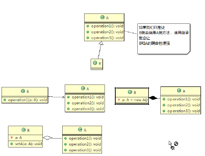

# DesignPattern

## 1. 七种设计原则

设计模式原则, 其实就是程序员在编程时, 应当遵守的原则, 也是各种设计模式的基础(即设计模式为什么是这样的设计依据)

**设计模式常用的七大原则**

1. 单一职责原则
2. 接口隔离原则
3. 依赖倒转(置)原则
4. 里氏替换原则
5. 开闭原则
6. 迪米特法则
7. 合成复用原则

### 1.1 单一职责原则

对类来说的, 即一个类应该只负责一项职责. 如果类A负责两个不同的职责: 职责1, 职责2; 当职责1需求变更而修改类A时, 可能造成职责2执行错误, 所以将类A的粒度分解为A1, A2

代码分析1
```java
public class SingleResponsibility01 {
    public static void main(String[] args) {
        Vehicle vehicle = new Vehicle();
        vehicle.run("汽车");
        vehicle.run("摩托车");
        vehicle.run("飞机");
    }
}
/*
交通工具类
1. 在方式1中的run方法中, 违反了单一职责原则
2. 解决方案非常简单, 根据交通工具运行的方法不同, 分解成不同的类即可
 */
class Vehicle{
    public void run(String vehicle){
        System.out.println(vehicle + "在公路上跑...");
    }
}

```
代码分析2
```java
public class SingleResponsibility02 {

    public static void main(String[] args) {
        RoadVehicle roadVehicle = new RoadVehicle();
        roadVehicle.run("摩托车");
    }
}
/*
方案2分析:
1. 遵守单一职责原则
2. 但是改动很大, 即将类分解, 同时修改客户端
3. 直接修改Vehicle类, 改动的代码较少
 */
class RoadVehicle{
    public void run(String vehicle){
        System.out.println(vehicle + "在公路上运行...");
    }
}
class AirVehicle{
    public void run(String vehicle){
        System.out.println(vehicle + "在天空上运行...");
    }
}
class WaterVehicle{
    public void run(String vehicle){
        System.out.println(vehicle + "在水上运行...");
    }
}
```
代码分析3
```java
public class SingleResponsibility03 {

    public static void main(String[] args) {
        Vehicle2 vehicle = new Vehicle2();

        vehicle.runRoad("摩托车");
        vehicle.runRoad("汽车");
        vehicle.runAir("飞机");
    }
}

/*
方式3分析:
1. 这种修改方法没有对原来的类做大的修改, 只是增加方法
2. 这里虽然没有在类级别上没有违反单一职责原则, 但是在方法级别上违反了单一职责原则
 */
class Vehicle2 {
    public void runRoad(String vehicle){
        System.out.println(vehicle + "在公路上跑...");
    }

    public void runAir(String vehicle){
        System.out.println(vehicle + "在天空上跑...");
    }

    public void runWater(String vehicle){
        System.out.println(vehicle + "在水上跑...");
    }
}
```
> 单一职责原则的注意事项和细节

1) 降低类的复杂度, 一个类只负责一项职责
2) 提高类的可读性, 可维护性
3) 降低变更引起的风险
4) 通常情况下, 我们应当遵守单一职责原则, 只有逻辑足够简单, 才可以在代码级违反单一职责原则; 只有类中的方法数量足够少, 才可以在方法级别保持单一职责原则.

### 1.2 接口隔离原则

什么是接口隔离原则: 即客户端不应该依赖它不需要的接口, **即一个类对另一个类的依赖应该建立在最小的接口上.**

代码分析1
```java
interface Interface1{
    void operation1();
    void operation2();
    void operation3();
    void operation4();
    void operation5();
}

class B implements Interface1{
    @Override
    public void operation1() {
        System.out.println("B中实现了" + " operation1");
    }
    @Override
    public void operation2() {
        System.out.println("B中实现了" + " operation2");
    }
    @Override
    public void operation3() {
        System.out.println("B中实现了" + " operation3");
    }
    @Override
    public void operation4() {
        System.out.println("B中实现了" + " operation4");
    }
    @Override
    public void operation5() {
        System.out.println("B中实现了" + " operation5");
    }
}

class D implements Interface1{
    @Override
    public void operation1() {
        System.out.println("D中实现了" + " operation1");
    }
    @Override
    public void operation2() {
        System.out.println("D中实现了" + " operation2");
    }
    @Override
    public void operation3() {
        System.out.println("D中实现了" + " operation3");
    }
    @Override
    public void operation4() {
        System.out.println("D中实现了" + " operation4");
    }
    @Override
    public void operation5() {
        System.out.println("D中实现了" + " operation5");
    }
}

/*
A 类通过Interface1接口依赖(使用)B类, 但是只会使用1, 2, 3方法
 */
class A{
    public void depend1(Interface1 interface1){
        interface1.operation1();
    }
    public void depend2(Interface1 interface1){
        interface1.operation2();
    }
    public void depend3(Interface1 interface1){
        interface1.operation3();
    }
}

/*
C 类通过Interface1接口依赖(使用)D类, 但是只会使用1, 4, 5方法
 */
class C{
    public void depend1(Interface1 interface1){
        interface1.operation1();
    }
    public void depend4(Interface1 interface1){
        interface1.operation4();
    }
    public void depend5(Interface1 interface1){
        interface1.operation5();
    }
}
```
代码分析2
```java
public class Segregation02 {

    public static void main(String[] args) {
        A a = new A();
        a.depend1(new B()); // A类通过接口依赖B类
        a.depend2(new B());
        a.depend3(new B());

        C c = new C();
        c.depend1(new D());
        c.depend4(new D());
        c.depend5(new D());
    }
}
/*
拆分接口: 将原来的Interface拆分为三个接口
*/
interface Interface1{
    void operation1();
}

interface Interface2{
    void operation2();
    void operation3();
}

interface Interface3{
    void operation4();
    void operation5();
}

class B implements Interface1, Interface2 {
    @Override
    public void operation1() {
        System.out.println("B中实现了" + " operation1");
    }
    @Override
    public void operation2() {
        System.out.println("B中实现了" + " operation2");
    }
    @Override
    public void operation3() {
        System.out.println("B中实现了" + " operation3");
    }
}

class D implements Interface1, Interface3 {
    @Override
    public void operation1() {
        System.out.println("D中实现了" + " operation1");
    }
    @Override
    public void operation4() {
        System.out.println("D中实现了" + " operation4");
    }
    @Override
    public void operation5() {
        System.out.println("D中实现了" + " operation5");
    }
}

/*
A 类通过Interface1, Interface2接口依赖(使用)B类, 但是只会使用1, 2, 3方法
 */
class A{
    public void depend1(Interface1 interface1){
        interface1.operation1();
    }
    public void depend2(Interface2 interface2){
        interface2.operation2();
    }
    public void depend3(Interface2 interface2){
        interface2.operation3();
    }
}
/*
C 类通过Interface1, Interface3接口依赖(使用)D类, 但是只会使用1, 4, 5方法
 */
class C{
    public void depend1(Interface1 interface1){
        interface1.operation1();
    }
    public void depend4(Interface3 interface1){
        interface1.operation4();
    }
    public void depend5(Interface3 interface1){
        interface1.operation5();
    }
}
```

### 1.3 依赖倒转原则

依赖倒转原则是什么?
1. 高层模块不应该依赖于底层模块, 二者应该依赖抽象对象
2. 抽象对象不应该依赖细节, 细节应该依赖对象
3. 依赖倒转的中心思想是面向接口编程
4. 依赖倒转原则是基于这样的设计思想: 相对于细节的多变性, 抽象的东西要稳定的多. 以抽象为基础搭建出来的架构比以细节为基础的架构要稳定的多, 在java中, 抽象是指接口或者抽象类, 细节指的是具体的实现类. 
5. 使用接口或者抽象类的目的是制定好规范, 而不涉及具体的操作, 把细节全部交给具体的实现类去完成. 

代码分析1
```java
public class DependencyInversion {

    public static void main(String[] args) {
        Person person = new Person();
        person.receive(new Email());
    }
}

class Email{
    public String getInfo(){
        return "Hello, this is email";
    }
}

/* 完成Person类接收消息功能
1. 简单, 比较容易想到
2. 如果我们获取的消息是wechat或者短信等, 则需要新增类, 同时Person也需要新增相应的接收方法
3. 解决思路: 引入一个IReceiver, 表示接受者, 这样Person和IReceiver发生依赖
    因为Email、WeChat等等都属于接收的范畴, 他们各自实现IReceiver接口就行, 这就符合我们的
    依赖倒转原则
*/
class Person{
    public void receive(Email email){
        System.out.println(email.getInfo());
    }
}
```
代码分析2
```java
public class DependencyInversion {
    public static void main(String[] args) {
        // 此时客户端无需改变
        Person person = new Person();
        person.receive(new Email());

        person.receive(new WeChat());
    }
}

// 定义一个接口
interface IReceiver{
    public String getInfo();
}
class Email implements IReceiver{
    public String getInfo(){
        return "Hello, this is email IReceiver";
    }
}
class WeChat implements IReceiver{
    public String getInfo() {
        return "Hello, this is wechat IReceiver";
    }
}
/* 完成Person类接收消息功能
*/
class Person{
    public void receive(IReceiver receiver){
        System.out.println(receiver.getInfo());
    }
}
```

> 依赖关系传递的三种方式

1. 接口传递
2. 构造方法传递
3. setter方法传递

代码分析
```java
public class DependencyPass {

    public static void main(String[] args) {
    	// 1. 通过接口传递依赖关系
        ChangHong changHong = new ChangHong();
//		OpenAndClose openAndClose = new OpenAndClose();
//		openAndClose.open(changHong);

        // 2.通过构造方法传递
//		OpenAndClose openAndClose = new OpenAndClose(changHong);
//		openAndClose.open();
        // 3.通过setter方法传递
        OpenAndClose openAndClose = new OpenAndClose();
        openAndClose.setTv(changHong);
        openAndClose.open();

    }

}

// interface IOpenAndClose {
// public void open(ITV tv); //抽象类接口
// }
//
// interface ITV { //ITV接口
// public void play();
// }
// 
// class ChangHong implements ITV {
//
//	@Override
//	public void play() {
//		System.out.println("ChangHong TV is opening");
//	}
//	 
// }

// class OpenAndClose implements IOpenAndClose{
// public void open(ITV tv){
// tv.play();
// }
// }

// interface IOpenAndClose {
// public void open();
// }
// interface ITV { //ITV接口
// public void play();
// }
// class OpenAndClose implements IOpenAndClose{
// public ITV tv;
// public OpenAndClose(ITV tv){
// this.tv = tv;
// }
// public void open(){
// this.tv.play();
// }
// }


// 3. 通过setter方法传递依赖关系
interface IOpenAndClose {
    public void open();

    public void setTv(ITV tv);
}

interface ITV { // ITV接口
    public void play();
}

class OpenAndClose implements IOpenAndClose {
    private ITV tv;

    public void setTv(ITV tv) {
        this.tv = tv;
    }

    public void open() {
        this.tv.play();
    }
}
class ChangHong implements ITV {

    @Override
    public void play() {
        System.out.println("ChangHong is opening");
    }
}
```

### 1.4 里氏替换原则
1) 里氏替换原则 Liskov Substitution Principle在 1988 年, 由麻省理工学院的以为姓里的女士提出的.
2) 如果对每个类型为T1的对象o1, 都有类型为T2的对象o2使得以T1定义的所有程序P在所有的对象o1都代换成o2时, 程序P的行为没有发生变化, 那么类型T2是类型T1的子类型. 换 句话说，所有引用基类的地方必须能透明地使用其子类的对象.
3) 在使用继承时，遵循里氏替换原则，在子类中尽量不要重 写父类的方法
4) 里氏替换原则告诉我们，继承实际上让两个类耦合性增强了，在适当的情况下，可以通过聚合，组合，依赖 来解决问题。

代码分析1
```java
public class LiskovDemo {

    public static void main(String[] args) {
        A a = new A();

        System.out.println("11-3=" + a.func1(11, 3));
        System.out.println("1-8=" + a.func1(1, 8));

        System.out.println("=====================");
        B b = new B();
        System.out.println("11-3=" + b.func1(11, 3));
        System.out.println("1-8=" + b.func1(1, 8));
        System.out.println("11+3+9=" + b.func2(11, 3));
    }
}

class A {
    // 返回两个数的差
    public int func1(int num1, int num2) {
        return num1 - num2;
    }
}
/*
B继承A
新增一个函数: 完成两个数相加后与9求和
 */
class B extends A{
    public int func1(int num1, int num2){
        return num1 + num2;
    }
    public int func2(int a, int b){
        return func1(a, b) + 9;
    }
}
```
代码分析2
```java
public class LiskovDemo {
    public static void main(String[] args) {
        A a = new A();
        System.out.println("11-3=" + a.func1(11, 3));
        System.out.println("1-8=" + a.func1(1, 8));
        System.out.println("=====================");
        B b = new B();
        // 因为B类不在继承A类, 因此调用者不会在认为func1是求减法了
        System.out.println("11-3=" + b.func3(11, 3));
        System.out.println("1-8=" + b.func3(1, 8));
        System.out.println("11+3+9=" + b.func2(11, 3));
    }
}

// 创建一个更加基础的类
class Base{
    // 把最基础的成员和方法放在Base类中
}
class A extends Base{
    // 返回两个数的差
    public int func1(int num1, int num2) {
        return num1 - num2;
    }
}
/*
B继承A
新增一个函数: 完成两个数相加后与9求和
 */
class B extends Base {
    // 如果B类需要使用A类中的方法, 可以使用组合关系
    private A a = new A();
    public int func1(int num1, int num2){
        return num1 + num2;
    }
    public int func2(int a, int b){
        return func1(a, b) + 9;
    }
    // 通过组合的关系使用A类中的方法
    public int func3(int a1, int b1){
        return a.func1(a1, b1);
    }
}
```

### 1.5 开闭原则

1) 开闭原则（Open Closed Principle是编程中最基础、最重要的设计原则
2) 一个软件实体如类，模块和函数应该对扩展开放对提供方对修改关闭对使用方。用抽象构建框架，用实现扩展细节 。
3) 当软件需要变化时，尽量通过扩展软件实体的行为来实现变化，而不是通过修改已有的代码来实现变化 。
4) 编程中遵循其它原则，以及使用设计模式的目的就是遵循 开闭原则。

代码分析1
```java
public class OCPDemo {
    public static void main(String[] args) {
        // 使用绘制图形类
        GraphicEditor editor = new GraphicEditor();
        editor.drawShape(new Rectangle());
        editor.drawShape(new Circle());
    }
}
// 绘图类
class GraphicEditor {
    /*
    接收Shape对象, 根据type绘制不同的图形
     */
    public void drawShape(Shape s) {
        if (s.m_type == 1)
            drawRectangle(s);
        else if (s.m_type == 2)
            drawCircle(s);
        else if (s.m_type == 3)
            drawTriangle(s);
    }

    public void drawRectangle(Shape r) {
        System.out.println("绘制矩形");
    }

    public void drawCircle(Shape r) {
        System.out.println("绘制圆形");
    }

    public void drawTriangle(Shape r) {
        System.out.println("绘制三角形");
    }
}

// 基类
class Shape {
    int m_type;
}

class Rectangle extends Shape {
    Rectangle() {
        super.m_type = 1;
    }
}

class Circle extends Shape {
    Circle() {
        super.m_type = 2;
    }
}

/*
 当我们新增画三角形的类, 修改的地方较多
 特别的是需要在类的基础上进行修改, 而这违反了开闭原则
 对扩展开放, 对修改关闭
 */
class Triangle extends Shape {
    Triangle() {
        super.m_type = 3;
    }
}
```
代码分析2  
思路把创建Shape类做成抽象类，并提供一个抽象的 draw 方法，让子类去实现即可，这样我们有新的图形种类时，只需要让新的图形类继承Shape，并实现draw方法即可，使用方的代码就不需要修 --> 满足了开闭原则
```java
public class OCPDemo {
    public static void main(String[] args) {
        // 使用绘制图形类
        GraphicEditor editor = new GraphicEditor();
        editor.drawShape(new Rectangle());
        editor.drawShape(new Circle());
        editor.drawShape(new Triangle());
    }
}
// 绘图类
class GraphicEditor {
    /*
    接收Shape对象, 根据type绘制不同的图形
     */
    public void drawShape(Shape s) {
        s.draw();
    }
}

// 基类
abstract class Shape {
    int m_type;
    public abstract void draw(); // 抽象方法
}

class Rectangle extends Shape {
    public Rectangle() {
        super.m_type = 1;
    }
    @Override
    public void draw() {
        System.out.println("这是绘制矩形方法");
    }
}

class Circle extends Shape {
    public Circle() {
        super.m_type = 2;
    }
    @Override
    public void draw() {
        System.out.println("这是绘制圆形方法");
    }
}

/*
 当我们新增画三角形的类, 修改的地方较多
 特别的是需要在类的基础上进行修改, 而这违反了开闭原则
 对扩展开放, 对修改关闭
 */
class Triangle extends Shape {
    public Triangle() {
        super.m_type = 3;
    }
    @Override
    public void draw() {
        System.out.println("这是绘制三角形方法");
    }
}
```

### 1.6 迪米特法则
基本介绍  
1) 一个对象应该对其他对象保持最少的了解
2) 类与类关系越密切，耦合度越大
3) 迪米特法则Demeter Principle又叫最少知道原则，即一个类对自己依赖的类知道的越少越好。也就是说，对于被依赖的类不管多么复杂，都尽量将逻辑封装在类的内部。对外除了提供的public方法，不对外泄露任何信息
4) 迪米特法则还有个更简单的定义：只与直接的朋友通信
5) 直接的朋友 ：每个对象都会与其他对象有耦合关系，只要两个对象之间有耦合关系，我们就说这两个对象之间是朋友关系。耦合的方式很多，依赖，关联，组合，聚合等。其中，我们称出现成员变量，方法参数，方法返回值中的类为直接的朋友，而出现在局部变量中的类不是直接的朋友。也就是说，陌生的类最好不要以局部变量的形式出现在类的内部。

代码分析1
```java
public class Demeter1 {
	public static void main(String[] args) {
		// 创建SchoolManager
		SchoolManager schoolManager = new SchoolManager();
		// 获取学校总部员工和学院员工id
		schoolManager.printAllEmployee(new CollegeManager());
	}
}
// 学校总部员工
class Employee {
	private String id;

	public void setId(String id) {
		this.id = id;
	}

	public String getId() {
		return id;
	}
}


// 学院员工
class CollegeEmployee {
	private String id;

	public void setId(String id) {
		this.id = id;
	}

	public String getId() {
		return id;
	}
}

// 管理学院员工类
class CollegeManager {
	public List<CollegeEmployee> getAllEmployee() {
		// 返回学院的所有员工
		List<CollegeEmployee> list = new ArrayList<CollegeEmployee>();
		for (int i = 0; i < 10; i++) {
			CollegeEmployee emp = new CollegeEmployee();
			emp.setId("学院员工id= " + i);
			list.add(emp);
		}
		return list;
	}
}

/*学校管理类
 分析SchoolManager的直接朋友
 1. Employee (方法返回值中出现)
 2. CollegeManager(方法形参中出现)
 其中, CollegeEmployee不是直接朋友, 而是一个陌生类, 违反了迪米特原则
 */
class SchoolManager {
	// 返回学校总部所有员工
	public List<Employee> getAllEmployee() {
		List<Employee> list = new ArrayList<Employee>();
		for (int i = 0; i < 5; i++) { // list
			Employee emp = new Employee();
			emp.setId("学校总部员工id= " + i);
			list.add(emp);
		}
		return list;
	}

	// 打印学校总部和学院员工信息(id)
	void printAllEmployee(CollegeManager sub) {

		/*获取学院所有员工
		分析问题
		1. 这里的CollegeEmployee不是SchoolManager的直接朋友
		2. CollegeEmployee以局部变量的方式出现在SchoolManager里
		 */
		List<CollegeEmployee> list1 = sub.getAllEmployee();
		System.out.println("------------分公司员工------------");
		for (CollegeEmployee e : list1) {
			System.out.println(e.getId());
		}
		// 获取学校总部所有员工
		List<Employee> list2 = this.getAllEmployee();
		System.out.println("------------学校总部员工------------");
		for (Employee e : list2) {
			System.out.println(e.getId());
		}
	}
}
```
代码分析2
```java
public class Demeter1 {

	public static void main(String[] args) {
		// 创建SchoolManager
		SchoolManager schoolManager = new SchoolManager();
		// 获取学校总部员工和学院员工id
		schoolManager.printAllEmployee(new CollegeManager());
	}
}


// 学校总部员工
class Employee {
	private String id;

	public void setId(String id) {
		this.id = id;
	}

	public String getId() {
		return id;
	}
}


// 学院员工
class CollegeEmployee {
	private String id;

	public void setId(String id) {
		this.id = id;
	}

	public String getId() {
		return id;
	}
}


// 管理学院员工类
class CollegeManager {
	public List<CollegeEmployee> getAllEmployee() {
		// 返回学院的所有员工
		List<CollegeEmployee> list = new ArrayList<CollegeEmployee>();
		for (int i = 0; i < 10; i++) {
			CollegeEmployee emp = new CollegeEmployee();
			emp.setId("学院员工id= " + i);
			list.add(emp);
		}
		return list;
	}

	// 输出学院员工信息
	public void printEmployee(){
		List<CollegeEmployee> list1 = this.getAllEmployee();
		System.out.println("------------分公司员工------------");
		for (CollegeEmployee e : list1) {
			System.out.println(e.getId());
		}
	}

}

/*学校管理类
 分析SchoolManager的直接朋友
 1. Employee (方法返回值中出现)
 2. CollegeManager(方法形参中出现)
 其中, CollegeEmployee不是直接朋友, 而是一个陌生类, 违反了迪米特原则
 */
class SchoolManager {
	// 返回学校总部所有员工
	public List<Employee> getAllEmployee() {
		List<Employee> list = new ArrayList<Employee>();
		for (int i = 0; i < 5; i++) { // list
			Employee emp = new Employee();
			emp.setId("学校总部员工id= " + i);
			list.add(emp);
		}
		return list;
	}

	// 打印学校总部和学院员工信息(id)
	void printAllEmployee(CollegeManager sub) {

		/*获取学院所有员工
		分析问题
		1. 这里的CollegeEmployee不是SchoolManager的直接朋友
		2. CollegeEmployee以局部变量的方式出现在SchoolManager里
		改进问题
		1. 将输出学院员工信息的方法封装到CollegeManager类中
		 */
		sub.printEmployee();

		// 获取学校总部所有员工
		List<Employee> list2 = this.getAllEmployee();
		System.out.println("------------学校总部员工------------");
		for (Employee e : list2) {
			System.out.println(e.getId());
		}
	}
}
```

> 迪米特法则注意事项和细节
1) 迪米特法则的核心是降低类之间的耦合
2) 但是注意：由于每个类都减少了不必要的依赖，因此迪米特法则只是要求降低类间对象间耦合关系，并不是要求完全没有依赖关系

### 1.7 合成复用原则
基本介绍  
原则是尽量使用合成聚合的方式，而不是使用继承



## 设计模式

> 设计模式类型

设计模式分为三种类型，共23种
1) 创建型模式**单例模式**、抽象工厂模式、原型模式、建造者模式、**工厂模式**。
2) 结构型模式：适配器模式、桥接模式、**装饰模式**、组合模式、外观模式、享元模式、**代理模式**。
3) 行为型模式：模版方法模式、命令模式、访问者模式、迭 代器模式、**观察者模式**、中介者模式、备忘录模式、解释器模式（Interpreter模式）、状态模式、策略模式、职责链模式责任链模式。