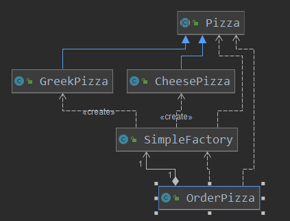
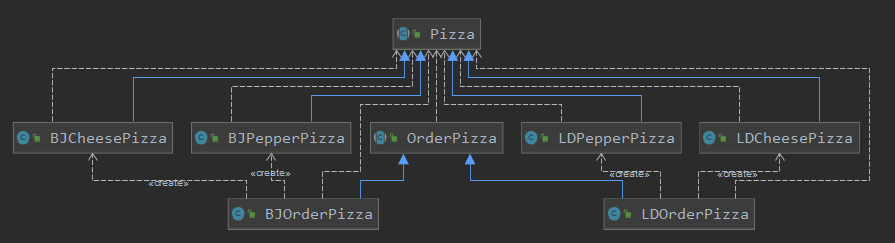
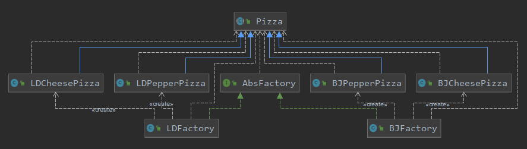
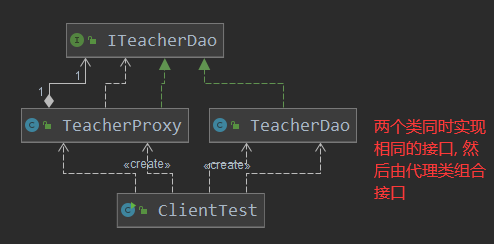
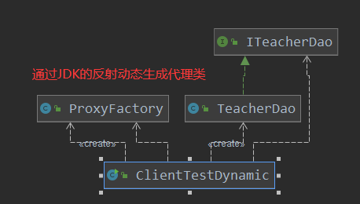
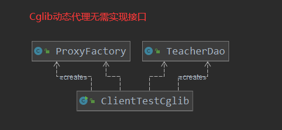
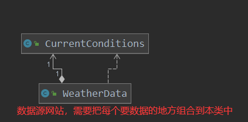
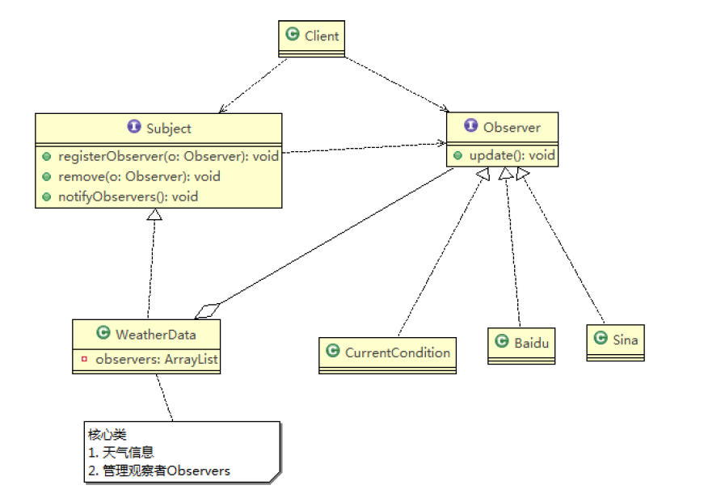
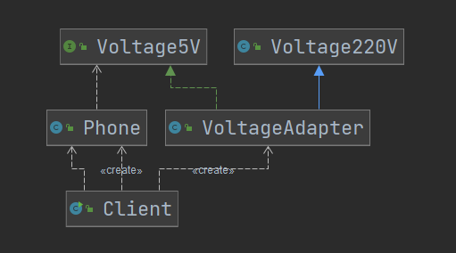

# DesignPattern

[1. 七种设计原则](#1.-七种设计原则)  
[1.1 单一职责原则](#1.1-单一职责原则)  
[1.2 接口隔离原则](#1.2-接口隔离原则)  
[1.3 依赖倒转原则](#1.3-依赖倒转原则)  
[1.4 里氏替换原则](#1.4-里氏替换原则)  
[1.5 开闭原则](#1.5-开闭原则)  
[1.6 迪米特法则](#1.6-迪米特法则)  
[1.7 合成复用原则](#1.7-合成复用原则)

## 1. 七种设计原则

设计模式原则, 其实就是程序员在编程时, 应当遵守的原则, 也是各种设计模式的基础(即设计模式为什么是这样的设计依据)

**设计模式常用的七大原则**

1. 单一职责原则
2. 接口隔离原则
3. 依赖倒转(置)原则
4. 里氏替换原则
5. 开闭原则
6. 迪米特法则
7. 合成复用原则

### 1.1 单一职责原则

对类来说的, 即一个类应该只负责一项职责. 如果类A负责两个不同的职责: 职责1, 职责2; 当职责1需求变更而修改类A时, 可能造成职责2执行错误, 所以将类A的粒度分解为A1, A2

代码分析1
```java
public class SingleResponsibility01 {
    public static void main(String[] args) {
        Vehicle vehicle = new Vehicle();
        vehicle.run("汽车");
        vehicle.run("摩托车");
        vehicle.run("飞机");
    }
}
/*
交通工具类
1. 在方式1中的run方法中, 违反了单一职责原则
2. 解决方案非常简单, 根据交通工具运行的方法不同, 分解成不同的类即可
 */
class Vehicle{
    public void run(String vehicle){
        System.out.println(vehicle + "在公路上跑...");
    }
}

```
代码分析2
```java
public class SingleResponsibility02 {

    public static void main(String[] args) {
        RoadVehicle roadVehicle = new RoadVehicle();
        roadVehicle.run("摩托车");
    }
}
/*
方案2分析:
1. 遵守单一职责原则
2. 但是改动很大, 即将类分解, 同时修改客户端
3. 直接修改Vehicle类, 改动的代码较少
 */
class RoadVehicle{
    public void run(String vehicle){
        System.out.println(vehicle + "在公路上运行...");
    }
}
class AirVehicle{
    public void run(String vehicle){
        System.out.println(vehicle + "在天空上运行...");
    }
}
class WaterVehicle{
    public void run(String vehicle){
        System.out.println(vehicle + "在水上运行...");
    }
}
```
代码分析3
```java
public class SingleResponsibility03 {

    public static void main(String[] args) {
        Vehicle2 vehicle = new Vehicle2();

        vehicle.runRoad("摩托车");
        vehicle.runRoad("汽车");
        vehicle.runAir("飞机");
    }
}

/*
方式3分析:
1. 这种修改方法没有对原来的类做大的修改, 只是增加方法
2. 这里虽然没有在类级别上没有违反单一职责原则, 但是在方法级别上违反了单一职责原则
 */
class Vehicle2 {
    public void runRoad(String vehicle){
        System.out.println(vehicle + "在公路上跑...");
    }

    public void runAir(String vehicle){
        System.out.println(vehicle + "在天空上跑...");
    }

    public void runWater(String vehicle){
        System.out.println(vehicle + "在水上跑...");
    }
}
```
> 单一职责原则的注意事项和细节

1) 降低类的复杂度, 一个类只负责一项职责
2) 提高类的可读性, 可维护性
3) 降低变更引起的风险
4) 通常情况下, 我们应当遵守单一职责原则, 只有逻辑足够简单, 才可以在代码级违反单一职责原则; 只有类中的方法数量足够少, 才可以在方法级别保持单一职责原则.

### 1.2 接口隔离原则

什么是接口隔离原则: 即客户端不应该依赖它不需要的接口, **即一个类对另一个类的依赖应该建立在最小的接口上.**

代码分析1
```java
interface Interface1{
    void operation1();
    void operation2();
    void operation3();
    void operation4();
    void operation5();
}

class B implements Interface1{
    @Override
    public void operation1() {
        System.out.println("B中实现了" + " operation1");
    }
    @Override
    public void operation2() {
        System.out.println("B中实现了" + " operation2");
    }
    @Override
    public void operation3() {
        System.out.println("B中实现了" + " operation3");
    }
    @Override
    public void operation4() {
        System.out.println("B中实现了" + " operation4");
    }
    @Override
    public void operation5() {
        System.out.println("B中实现了" + " operation5");
    }
}

class D implements Interface1{
    @Override
    public void operation1() {
        System.out.println("D中实现了" + " operation1");
    }
    @Override
    public void operation2() {
        System.out.println("D中实现了" + " operation2");
    }
    @Override
    public void operation3() {
        System.out.println("D中实现了" + " operation3");
    }
    @Override
    public void operation4() {
        System.out.println("D中实现了" + " operation4");
    }
    @Override
    public void operation5() {
        System.out.println("D中实现了" + " operation5");
    }
}

/*
A 类通过Interface1接口依赖(使用)B类, 但是只会使用1, 2, 3方法
 */
class A{
    public void depend1(Interface1 interface1){
        interface1.operation1();
    }
    public void depend2(Interface1 interface1){
        interface1.operation2();
    }
    public void depend3(Interface1 interface1){
        interface1.operation3();
    }
}

/*
C 类通过Interface1接口依赖(使用)D类, 但是只会使用1, 4, 5方法
 */
class C{
    public void depend1(Interface1 interface1){
        interface1.operation1();
    }
    public void depend4(Interface1 interface1){
        interface1.operation4();
    }
    public void depend5(Interface1 interface1){
        interface1.operation5();
    }
}
```
代码分析2
```java
public class Segregation02 {

    public static void main(String[] args) {
        A a = new A();
        a.depend1(new B()); // A类通过接口依赖B类
        a.depend2(new B());
        a.depend3(new B());

        C c = new C();
        c.depend1(new D());
        c.depend4(new D());
        c.depend5(new D());
    }
}
/*
拆分接口: 将原来的Interface拆分为三个接口
*/
interface Interface1{
    void operation1();
}

interface Interface2{
    void operation2();
    void operation3();
}

interface Interface3{
    void operation4();
    void operation5();
}

class B implements Interface1, Interface2 {
    @Override
    public void operation1() {
        System.out.println("B中实现了" + " operation1");
    }
    @Override
    public void operation2() {
        System.out.println("B中实现了" + " operation2");
    }
    @Override
    public void operation3() {
        System.out.println("B中实现了" + " operation3");
    }
}

class D implements Interface1, Interface3 {
    @Override
    public void operation1() {
        System.out.println("D中实现了" + " operation1");
    }
    @Override
    public void operation4() {
        System.out.println("D中实现了" + " operation4");
    }
    @Override
    public void operation5() {
        System.out.println("D中实现了" + " operation5");
    }
}

/*
A 类通过Interface1, Interface2接口依赖(使用)B类, 但是只会使用1, 2, 3方法
 */
class A{
    public void depend1(Interface1 interface1){
        interface1.operation1();
    }
    public void depend2(Interface2 interface2){
        interface2.operation2();
    }
    public void depend3(Interface2 interface2){
        interface2.operation3();
    }
}
/*
C 类通过Interface1, Interface3接口依赖(使用)D类, 但是只会使用1, 4, 5方法
 */
class C{
    public void depend1(Interface1 interface1){
        interface1.operation1();
    }
    public void depend4(Interface3 interface1){
        interface1.operation4();
    }
    public void depend5(Interface3 interface1){
        interface1.operation5();
    }
}
```

### 1.3 依赖倒转原则

依赖倒转原则是什么?
1. 高层模块不应该依赖于底层模块, 二者应该依赖抽象对象
2. 抽象对象不应该依赖细节, 细节应该依赖对象
3. 依赖倒转的中心思想是面向接口编程
4. 依赖倒转原则是基于这样的设计思想: 相对于细节的多变性, 抽象的东西要稳定的多. 以抽象为基础搭建出来的架构比以细节为基础的架构要稳定的多, 在java中, 抽象是指接口或者抽象类, 细节指的是具体的实现类. 
5. 使用接口或者抽象类的目的是制定好规范, 而不涉及具体的操作, 把细节全部交给具体的实现类去完成. 

代码分析1
```java
public class DependencyInversion {

    public static void main(String[] args) {
        Person person = new Person();
        person.receive(new Email());
    }
}

class Email{
    public String getInfo(){
        return "Hello, this is email";
    }
}

/* 完成Person类接收消息功能
1. 简单, 比较容易想到
2. 如果我们获取的消息是wechat或者短信等, 则需要新增类, 同时Person也需要新增相应的接收方法
3. 解决思路: 引入一个IReceiver, 表示接受者, 这样Person和IReceiver发生依赖
    因为Email、WeChat等等都属于接收的范畴, 他们各自实现IReceiver接口就行, 这就符合我们的
    依赖倒转原则
*/
class Person{
    public void receive(Email email){
        System.out.println(email.getInfo());
    }
}
```
代码分析2
```java
public class DependencyInversion {
    public static void main(String[] args) {
        // 此时客户端无需改变
        Person person = new Person();
        person.receive(new Email());

        person.receive(new WeChat());
    }
}

// 定义一个接口
interface IReceiver{
    public String getInfo();
}
class Email implements IReceiver{
    public String getInfo(){
        return "Hello, this is email IReceiver";
    }
}
class WeChat implements IReceiver{
    public String getInfo() {
        return "Hello, this is wechat IReceiver";
    }
}
/* 完成Person类接收消息功能
*/
class Person{
    public void receive(IReceiver receiver){
        System.out.println(receiver.getInfo());
    }
}
```

> 依赖关系传递的三种方式

1. 接口传递
2. 构造方法传递
3. setter方法传递

代码分析
```java
public class DependencyPass {

    public static void main(String[] args) {
    	// 1. 通过接口传递依赖关系
        ChangHong changHong = new ChangHong();
//		OpenAndClose openAndClose = new OpenAndClose();
//		openAndClose.open(changHong);

        // 2.通过构造方法传递
//		OpenAndClose openAndClose = new OpenAndClose(changHong);
//		openAndClose.open();
        // 3.通过setter方法传递
        OpenAndClose openAndClose = new OpenAndClose();
        openAndClose.setTv(changHong);
        openAndClose.open();

    }

}

// interface IOpenAndClose {
// public void open(ITV tv); //抽象类接口
// }
//
// interface ITV { //ITV接口
// public void play();
// }
// 
// class ChangHong implements ITV {
//
//	@Override
//	public void play() {
//		System.out.println("ChangHong TV is opening");
//	}
//	 
// }

// class OpenAndClose implements IOpenAndClose{
// public void open(ITV tv){
// tv.play();
// }
// }

// interface IOpenAndClose {
// public void open();
// }
// interface ITV { //ITV接口
// public void play();
// }
// class OpenAndClose implements IOpenAndClose{
// public ITV tv;
// public OpenAndClose(ITV tv){
// this.tv = tv;
// }
// public void open(){
// this.tv.play();
// }
// }


// 3. 通过setter方法传递依赖关系
interface IOpenAndClose {
    public void open();

    public void setTv(ITV tv);
}

interface ITV { // ITV接口
    public void play();
}

class OpenAndClose implements IOpenAndClose {
    private ITV tv;

    public void setTv(ITV tv) {
        this.tv = tv;
    }

    public void open() {
        this.tv.play();
    }
}
class ChangHong implements ITV {

    @Override
    public void play() {
        System.out.println("ChangHong is opening");
    }
}
```

### 1.4 里氏替换原则
1) 里氏替换原则 Liskov Substitution Principle在 1988 年, 由麻省理工学院的以为姓里的女士提出的.
2) 如果对每个类型为T1的对象o1, 都有类型为T2的对象o2使得以T1定义的所有程序P在所有的对象o1都代换成o2时, 程序P的行为没有发生变化, 那么类型T2是类型T1的子类型. 换 句话说，所有引用基类的地方必须能透明地使用其子类的对象.
3) 在使用继承时，遵循里氏替换原则，在子类中尽量不要重 写父类的方法
4) 里氏替换原则告诉我们，继承实际上让两个类耦合性增强了，在适当的情况下，可以通过聚合，组合，依赖 来解决问题。

代码分析1
```java
public class LiskovDemo {

    public static void main(String[] args) {
        A a = new A();

        System.out.println("11-3=" + a.func1(11, 3));
        System.out.println("1-8=" + a.func1(1, 8));

        System.out.println("=====================");
        B b = new B();
        System.out.println("11-3=" + b.func1(11, 3));
        System.out.println("1-8=" + b.func1(1, 8));
        System.out.println("11+3+9=" + b.func2(11, 3));
    }
}

class A {
    // 返回两个数的差
    public int func1(int num1, int num2) {
        return num1 - num2;
    }
}
/*
B继承A
新增一个函数: 完成两个数相加后与9求和
 */
class B extends A{
    public int func1(int num1, int num2){
        return num1 + num2;
    }
    public int func2(int a, int b){
        return func1(a, b) + 9;
    }
}
```
代码分析2
```java
public class LiskovDemo {
    public static void main(String[] args) {
        A a = new A();
        System.out.println("11-3=" + a.func1(11, 3));
        System.out.println("1-8=" + a.func1(1, 8));
        System.out.println("=====================");
        B b = new B();
        // 因为B类不在继承A类, 因此调用者不会在认为func1是求减法了
        System.out.println("11-3=" + b.func3(11, 3));
        System.out.println("1-8=" + b.func3(1, 8));
        System.out.println("11+3+9=" + b.func2(11, 3));
    }
}

// 创建一个更加基础的类
class Base{
    // 把最基础的成员和方法放在Base类中
}
class A extends Base{
    // 返回两个数的差
    public int func1(int num1, int num2) {
        return num1 - num2;
    }
}
/*
B继承A
新增一个函数: 完成两个数相加后与9求和
 */
class B extends Base {
    // 如果B类需要使用A类中的方法, 可以使用组合关系
    private A a = new A();
    public int func1(int num1, int num2){
        return num1 + num2;
    }
    public int func2(int a, int b){
        return func1(a, b) + 9;
    }
    // 通过组合的关系使用A类中的方法
    public int func3(int a1, int b1){
        return a.func1(a1, b1);
    }
}
```

### 1.5 开闭原则

1) 开闭原则（Open Closed Principle是编程中最基础、最重要的设计原则
2) 一个软件实体如类，模块和函数应该对扩展开放对提供方对修改关闭对使用方。用抽象构建框架，用实现扩展细节 。
3) 当软件需要变化时，尽量通过扩展软件实体的行为来实现变化，而不是通过修改已有的代码来实现变化 。
4) 编程中遵循其它原则，以及使用设计模式的目的就是遵循 开闭原则。

代码分析1
```java
public class OCPDemo {
    public static void main(String[] args) {
        // 使用绘制图形类
        GraphicEditor editor = new GraphicEditor();
        editor.drawShape(new Rectangle());
        editor.drawShape(new Circle());
    }
}
// 绘图类
class GraphicEditor {
    /*
    接收Shape对象, 根据type绘制不同的图形
     */
    public void drawShape(Shape s) {
        if (s.m_type == 1)
            drawRectangle(s);
        else if (s.m_type == 2)
            drawCircle(s);
        else if (s.m_type == 3)
            drawTriangle(s);
    }

    public void drawRectangle(Shape r) {
        System.out.println("绘制矩形");
    }

    public void drawCircle(Shape r) {
        System.out.println("绘制圆形");
    }

    public void drawTriangle(Shape r) {
        System.out.println("绘制三角形");
    }
}

// 基类
class Shape {
    int m_type;
}

class Rectangle extends Shape {
    Rectangle() {
        super.m_type = 1;
    }
}

class Circle extends Shape {
    Circle() {
        super.m_type = 2;
    }
}

/*
 当我们新增画三角形的类, 修改的地方较多
 特别的是需要在类的基础上进行修改, 而这违反了开闭原则
 对扩展开放, 对修改关闭
 */
class Triangle extends Shape {
    Triangle() {
        super.m_type = 3;
    }
}
```
代码分析2  
思路把创建Shape类做成抽象类，并提供一个抽象的 draw 方法，让子类去实现即可，这样我们有新的图形种类时，只需要让新的图形类继承Shape，并实现draw方法即可，使用方的代码就不需要修 --> 满足了开闭原则
```java
public class OCPDemo {
    public static void main(String[] args) {
        // 使用绘制图形类
        GraphicEditor editor = new GraphicEditor();
        editor.drawShape(new Rectangle());
        editor.drawShape(new Circle());
        editor.drawShape(new Triangle());
    }
}
// 绘图类
class GraphicEditor {
    /*
    接收Shape对象, 根据type绘制不同的图形
     */
    public void drawShape(Shape s) {
        s.draw();
    }
}

// 基类
abstract class Shape {
    int m_type;
    public abstract void draw(); // 抽象方法
}

class Rectangle extends Shape {
    public Rectangle() {
        super.m_type = 1;
    }
    @Override
    public void draw() {
        System.out.println("这是绘制矩形方法");
    }
}

class Circle extends Shape {
    public Circle() {
        super.m_type = 2;
    }
    @Override
    public void draw() {
        System.out.println("这是绘制圆形方法");
    }
}

/*
 当我们新增画三角形的类, 修改的地方较多
 特别的是需要在类的基础上进行修改, 而这违反了开闭原则
 对扩展开放, 对修改关闭
 */
class Triangle extends Shape {
    public Triangle() {
        super.m_type = 3;
    }
    @Override
    public void draw() {
        System.out.println("这是绘制三角形方法");
    }
}
```

### 1.6 迪米特法则
基本介绍  
1) 一个对象应该对其他对象保持最少的了解
2) 类与类关系越密切，耦合度越大
3) 迪米特法则Demeter Principle又叫最少知道原则，即一个类对自己依赖的类知道的越少越好。也就是说，对于被依赖的类不管多么复杂，都尽量将逻辑封装在类的内部。对外除了提供的public方法，不对外泄露任何信息
4) 迪米特法则还有个更简单的定义：只与直接的朋友通信
5) 直接的朋友 ：每个对象都会与其他对象有耦合关系，只要两个对象之间有耦合关系，我们就说这两个对象之间是朋友关系。耦合的方式很多，依赖，关联，组合，聚合等。其中，我们称出现成员变量，方法参数，方法返回值中的类为直接的朋友，而出现在局部变量中的类不是直接的朋友。也就是说，陌生的类最好不要以局部变量的形式出现在类的内部。

代码分析1
```java
public class Demeter1 {
	public static void main(String[] args) {
		// 创建SchoolManager
		SchoolManager schoolManager = new SchoolManager();
		// 获取学校总部员工和学院员工id
		schoolManager.printAllEmployee(new CollegeManager());
	}
}
// 学校总部员工
class Employee {
	private String id;

	public void setId(String id) {
		this.id = id;
	}

	public String getId() {
		return id;
	}
}


// 学院员工
class CollegeEmployee {
	private String id;

	public void setId(String id) {
		this.id = id;
	}

	public String getId() {
		return id;
	}
}

// 管理学院员工类
class CollegeManager {
	public List<CollegeEmployee> getAllEmployee() {
		// 返回学院的所有员工
		List<CollegeEmployee> list = new ArrayList<CollegeEmployee>();
		for (int i = 0; i < 10; i++) {
			CollegeEmployee emp = new CollegeEmployee();
			emp.setId("学院员工id= " + i);
			list.add(emp);
		}
		return list;
	}
}

/*学校管理类
 分析SchoolManager的直接朋友
 1. Employee (方法返回值中出现)
 2. CollegeManager(方法形参中出现)
 其中, CollegeEmployee不是直接朋友, 而是一个陌生类, 违反了迪米特原则
 */
class SchoolManager {
	// 返回学校总部所有员工
	public List<Employee> getAllEmployee() {
		List<Employee> list = new ArrayList<Employee>();
		for (int i = 0; i < 5; i++) { // list
			Employee emp = new Employee();
			emp.setId("学校总部员工id= " + i);
			list.add(emp);
		}
		return list;
	}

	// 打印学校总部和学院员工信息(id)
	void printAllEmployee(CollegeManager sub) {

		/*获取学院所有员工
		分析问题
		1. 这里的CollegeEmployee不是SchoolManager的直接朋友
		2. CollegeEmployee以局部变量的方式出现在SchoolManager里
		 */
		List<CollegeEmployee> list1 = sub.getAllEmployee();
		System.out.println("------------分公司员工------------");
		for (CollegeEmployee e : list1) {
			System.out.println(e.getId());
		}
		// 获取学校总部所有员工
		List<Employee> list2 = this.getAllEmployee();
		System.out.println("------------学校总部员工------------");
		for (Employee e : list2) {
			System.out.println(e.getId());
		}
	}
}
```
代码分析2
```java
public class Demeter1 {

	public static void main(String[] args) {
		// 创建SchoolManager
		SchoolManager schoolManager = new SchoolManager();
		// 获取学校总部员工和学院员工id
		schoolManager.printAllEmployee(new CollegeManager());
	}
}


// 学校总部员工
class Employee {
	private String id;

	public void setId(String id) {
		this.id = id;
	}

	public String getId() {
		return id;
	}
}


// 学院员工
class CollegeEmployee {
	private String id;

	public void setId(String id) {
		this.id = id;
	}

	public String getId() {
		return id;
	}
}


// 管理学院员工类
class CollegeManager {
	public List<CollegeEmployee> getAllEmployee() {
		// 返回学院的所有员工
		List<CollegeEmployee> list = new ArrayList<CollegeEmployee>();
		for (int i = 0; i < 10; i++) {
			CollegeEmployee emp = new CollegeEmployee();
			emp.setId("学院员工id= " + i);
			list.add(emp);
		}
		return list;
	}

	// 输出学院员工信息
	public void printEmployee(){
		List<CollegeEmployee> list1 = this.getAllEmployee();
		System.out.println("------------分公司员工------------");
		for (CollegeEmployee e : list1) {
			System.out.println(e.getId());
		}
	}

}

/*学校管理类
 分析SchoolManager的直接朋友
 1. Employee (方法返回值中出现)
 2. CollegeManager(方法形参中出现)
 其中, CollegeEmployee不是直接朋友, 而是一个陌生类, 违反了迪米特原则
 */
class SchoolManager {
	// 返回学校总部所有员工
	public List<Employee> getAllEmployee() {
		List<Employee> list = new ArrayList<Employee>();
		for (int i = 0; i < 5; i++) { // list
			Employee emp = new Employee();
			emp.setId("学校总部员工id= " + i);
			list.add(emp);
		}
		return list;
	}

	// 打印学校总部和学院员工信息(id)
	void printAllEmployee(CollegeManager sub) {

		/*获取学院所有员工
		分析问题
		1. 这里的CollegeEmployee不是SchoolManager的直接朋友
		2. CollegeEmployee以局部变量的方式出现在SchoolManager里
		改进问题
		1. 将输出学院员工信息的方法封装到CollegeManager类中
		 */
		sub.printEmployee();

		// 获取学校总部所有员工
		List<Employee> list2 = this.getAllEmployee();
		System.out.println("------------学校总部员工------------");
		for (Employee e : list2) {
			System.out.println(e.getId());
		}
	}
}
```

> 迪米特法则注意事项和细节
1) 迪米特法则的核心是降低类之间的耦合
2) 但是注意：由于每个类都减少了不必要的依赖，因此迪米特法则只是要求降低类间对象间耦合关系，并不是要求完全没有依赖关系

### 1.7 合成复用原则
基本介绍  
原则是尽量使用合成聚合的方式，而不是使用继承


## 2. 设计模式

> 设计模式类型

设计模式分为三种类型，共23种
1) 创建型模式:   **单例模式**、抽象工厂模式、原型模式、建造者模式、**工厂模式**
2) 结构型模式：适配器模式、桥接模式、**装饰模式**、组合模式、外观模式、享元模式、**代理模式**
3) 行为型模式：模版方法模式、命令模式、访问者模式、迭代器模式、**观察者模式**、中介者模式、备忘录模式、解释器模式（Interpreter模式）、状态模式、策略模式、职责链模式责任链模式

### 2.1 单例模式

所谓类的单例设计模式，就是采取一定的方法保证在整个的软件系统中，对某个类只能存在一个对象实例，并且该类只提供一个取得其对象实例的方法静态方法

> 饿汉式(普通)
```java
/*
1. 饿汉式单例模式
 */
class Singleton{
    // 1. 私有化构造方法
    private Singleton(){

    }

    // 2. 在类内部创建对象实例
    private static Singleton instance = new Singleton();

    // 3. 对外暴露公共静态方法, 返回实例对象
    public static Singleton getInstance(){
        return instance;
    }
}
```
> 饿汉式(静态代码块)
```java
/*
2. 饿汉式(静态代码块)
 */
class Singleton2{
    private Singleton2(){

    }

    private static Singleton2 instance;

    // 静态代码块只在类加载的时候初始化一次
    static{
        instance = new Singleton2();
    }

    public static Singleton2 getInstance(){
        return instance;
    }
}
```
> 懒汉式(普通)
```java
/*
3. 懒汉式(普通)
 */
class Singleton3{

    private Singleton3(){
        System.out.println(Thread.currentThread().getName() + "正在创建Singleton3");
    }

    private static Singleton3 instance;

    /*
    if (instance == null) 如果此处有多个线程同时执行会出现线程不安全问题
     */
    public static Singleton3 getInstance(){
        if (instance == null)
            instance = new Singleton3();
        return instance;
    }
}
```

```java
/*
4. 懒汉式(线程不安全)
*/
class Singleton4{

    private Singleton4(){
        System.out.println(Thread.currentThread().getName() + "正在创建Singleton3");
    }

    private static Singleton4 instance;

    /*
    if (instance == null) 如果此处有多个线程同时执行会出现线程不安全问题
    解决方案: 使用synchronized同步方法
    缺点: 执行效率太低
     */
    public static synchronized Singleton4 getInstance(){
        if (instance == null)
            instance = new Singleton4();
        return instance;
    }
}
```
> 懒汉式(双重检测)
```java
/*
6. 懒汉式(双重检测)
 */
class Singleton6{

    private Singleton6(){
        System.out.println(Thread.currentThread().getName() + "正在创建Singleton6");
    }

    private static volatile Singleton6 instance;

    /*
    if (instance == null) 如果此处有多个线程同时执行会出现线程不安全问题
    解决方案: 使用双重检测和volatile(轻量级同步机制), 当某一个线程创建了instance实例后
    volatile会将其同步到主存(即可见性), 其他线程也可以看到instance创建
     */
    public static Singleton6 getInstance(){
        if (instance == null) {
            synchronized (Singleton6.class){
                if (instance == null){
                    instance = new Singleton6();
                }
            }
        }
        return instance;
    }
}
```

> 静态内部类
```java
/*
7. 静态内部类
 */
class Singleton7{

    private Singleton7(){
        System.out.println(Thread.currentThread().getName() + "正在创建Singleton7");
    }

    /*
    静态内部类: 当Singleton7在加载的时候, SingletonInstance不会马上加载, 只有getInstance()
    被调用的时候, SingletonInstance才会被加载, 而且只会加载一次, 加载的时候也是线程安全的
     */
    private static class SingletonInstance{
        private static final Singleton7 INSTANCE = new Singleton7();
    }

    public static Singleton7 getInstance(){
        return SingletonInstance.INSTANCE;
    }
}
```
> 枚举
```java
public class SingletonTest8 {

    public static void main(String[] args) {
        Singleton8 instance1 = Singleton8.INSTANCE;
        Singleton8 instance2 = Singleton8.INSTANCE;
        System.out.println(instance1 == instance2);
    }
}

/*
8. 枚举
*/
enum Singleton8{
    INSTANCE;
}
```

> 单例设计模式在JDK源码中的应用

1) JDK中java.lang.Runtime就是经典的单例模式**饿汉式**
2) 代码分析 +Debug 源码 代码说明
```java
public class Runtime {
    private static Runtime currentRuntime = new Runtime();

    /**
     * Returns the runtime object associated with the current Java application.
     * Most of the methods of class <code>Runtime</code> are instance
     * methods and must be invoked with respect to the current runtime object.
     *
     * @return  the <code>Runtime</code> object associated with the current
     *          Java application.
     */
    public static Runtime getRuntime() {
        return currentRuntime;
    }

    /** Don't let anyone else instantiate this class */
    private Runtime() {}

    // ...
}
```

> 单例模式注意事项和细节说明

1) 单例模式保证了系统内存中该类只存在一个对象节省了系统资源，对于一些需要频繁创建销毁的对象，使用单例模式可以提高系统性能
2) 当想实例化一个单例类的时候，必须要记住使用相应的获取对象的方法，而不是使用new
3) 单例模式使用的场景：需要频繁的进行创建和销毁的对象、创建对象时耗时过多或耗费资源过多即：重量级对象但又经常用到的对象、工具类对象、频繁访问数据库或文件的对象比如数据源、session工厂等

### 2.2 工厂模式

> 简单工厂模式

举例:  
看一个披萨的项目：要便于披萨种类的扩展，要便于维护
1) 披萨的种类很多比如 GreekPizz、CheesePizz等
2) 披萨的制作有prepare bake, cut, box
3) 完成披萨店订购功能



核心代码:
```java
public class OrderPizza {

    SimpleFactory simpleFactory;

    public OrderPizza(SimpleFactory simpleFactory) {
        setFactory(simpleFactory);
    }

    public void setFactory(SimpleFactory simpleFactory) {
        String orderType = ""; // 用户输入
        this.simpleFactory = simpleFactory; // 设置简单工厂对象
        Pizza pizza = null;

        do {
            orderType = getOrderType();
            pizza = this.simpleFactory.createPizza(orderType);

            if (pizza != null){
                pizza.prepare();
                pizza.bake();
                pizza.cut();
                pizza.box();
            } else{
                System.out.println("没有预定Pizza");
                break;
            }
        } while (true);

    }
}
```
```java
public class SimpleFactory {

    // 简单工厂类
    public Pizza createPizza(String orderType){
        System.out.println("正在使用简单工厂模式...");
        Pizza pizza = null;
        if (orderType.equals("greek")){
            pizza = new GreekPizza();
            pizza.setName(orderType);
        } else if (orderType.equals("cheese")){
            pizza = new CheesePizza();
            pizza.setName(orderType);
        }
        return pizza;
    }
}
```

1) 优点是比较好理解，简单易操作。
2) 缺点是违反了设计模式的ocp原则，即对扩展开放，对修改关闭。即当我们给类增加新功能的时候，尽量不修改代码，或者尽可能少修改代码
3) 比如我们这时要新增加一个Pizza的种类(Pepper披萨)，我们需要做如下修改

> 工厂方法模式

看一个新的需求披萨项目新的需求:  
客户在点披萨时，可以点不同口味的披萨，比如北京的奶酪pizza、北京的胡椒pizza或者是伦敦的奶酪pizza、伦敦的胡椒pizza



核心代码:
```java
public abstract class OrderPizza {

    public abstract Pizza createPizza(String orderType);

    public OrderPizza(){
        Pizza pizza = null;
        String orderType = "";

        do {
            orderType = getOrderType();

            pizza = createPizza(orderType); // 抽象的方法, 由工厂子类完成

            if (pizza != null) {
                // 输出Pizza的制作过程
                pizza.prepare();
                pizza.bake();
                pizza.cut();
                pizza.box();
            } else {
                System.out.println("没有该口味的披萨");
                break;
            }

        } while (true);
    }
}
```
具体的BJOrderPizza实现OrderPizza类, 去实现createPizza()方法
```java
public class BJOrderPizza extends OrderPizza {
    @Override
    public Pizza createPizza(String orderType) {
        Pizza pizza = null;

        try {
            if (orderType.equals("cheese")){
                pizza = new BJCheesePizza();
            } else if (orderType.equals("pepper")){
                pizza = new BJPepperPizza();
            }
        } catch (Exception e){
            throw new RuntimeException("没有该口味类型的披萨");
        } finally {
            return pizza;
        }
    }
}
```
工厂方法模式介绍  
**工厂方法模式设计方案：将披萨项目的实例化功能抽象成抽象方法，在不同的口味点餐子类中具体实现**  
工厂方法模式：定义了一个创建对象的抽象方法，由子类决定要实例化的类。工厂方法模式将 对象的实例化推迟到子类 。

> 抽象工厂模式

基本介绍
1) 抽象工厂模式：定义了一个 interface 用于创建相关或有依赖关系的对象簇，而无需指明具体的类
2) 抽象工厂模式可以将简单工厂模式和工厂方法模式进行整合。
3) 从设计层面看，抽象工厂模式就是对简单工厂模式的改进 或者称为进一步的抽象。
4) 将工厂抽象成两层，AbsFactory(抽象工厂)和具体实现的工厂子类。程序员可以根据创建对象类型使用对应的工厂子类。这样将单个的简单工厂类变成了工厂簇更利于代码的维护和扩展。
5) 类图



核心代码:
```java
public interface AbsFactory {
    public Pizza createPizza(String orderType);
}
```

```java
public class BJFactory implements AbsFactory{
    @Override
    public Pizza createPizza(String orderType) {
        Pizza pizza = null;

        if (orderType.equals("cheese")){
            pizza = new BJCheesePizza();
            pizza.setName("北京奶酪披萨");
        } else if (orderType.equals("pepper")){
            pizza = new BJPepperPizza();
            pizza.setName("北京胡椒披萨");
        }
        return pizza;
    }
}
```
根据客户需要在发起订单时候, 在OrderPizza中传递对于披萨工厂
```java
public class OrderPizza {

    public OrderPizza(AbsFactory factory){
        Pizza pizza = null;
        String orderType = "";

        do {
            orderType = getOrderType();

            pizza = factory.createPizza(orderType); // 抽象的方法, 由工厂子类完成

            if (pizza != null) {
                // 输出Pizza的制作过程
                pizza.prepare();
                pizza.bake();
                pizza.cut();
                pizza.box();
            } else {
                System.out.println("没有该口味的披萨");
                break;
            }

        } while (true);
    }
}
```

工厂模式在JDK中应用:
1) JDK中的Calendar类中，就使用了简单工厂模式
2) 源码分析+Debug源码说明
```java
private static Calendar createCalendar(TimeZone zone,
                                           Locale aLocale)
    {
        CalendarProvider provider =
            LocaleProviderAdapter.getAdapter(CalendarProvider.class, aLocale)
                                 .getCalendarProvider();
        if (provider != null) {
            try {
                return provider.getInstance(zone, aLocale);
            } catch (IllegalArgumentException iae) {
                // fall back to the default instantiation
            }
        }

        Calendar cal = null;

        if (aLocale.hasExtensions()) {
            String caltype = aLocale.getUnicodeLocaleType("ca");
            if (caltype != null) {
                switch (caltype) {
                case "buddhist":
                cal = new BuddhistCalendar(zone, aLocale);
                    break;
                case "japanese":
                    cal = new JapaneseImperialCalendar(zone, aLocale);
                    break;
                case "gregory":
                    cal = new GregorianCalendar(zone, aLocale);
                    break;
                }
            }
        }
        if (cal == null) {
            if (aLocale.getLanguage() == "th" && aLocale.getCountry() == "TH") {
                cal = new BuddhistCalendar(zone, aLocale);
            } else if (aLocale.getVariant() == "JP" && aLocale.getLanguage() == "ja"
                       && aLocale.getCountry() == "JP") {
                cal = new JapaneseImperialCalendar(zone, aLocale);
            } else {
                cal = new GregorianCalendar(zone, aLocale);
            }
        }
        return cal;
    }
```

工厂模式小结
1) 工厂模式的意义将实例化对象的代码提取出来，放到一个类中统一管理和维护，达到和主项目的依赖关系的解耦。从而提高项目的扩展和维护性。
2) 三种工厂模式简单工厂模式、工厂方法模式、抽象工厂模式
3) 设计模式的依赖抽象原则创建对象实例时，不要直接new 类, 而是把这个new类的动作放在一个工厂的方法
中，并返回。有的书上说，变量不要直接持有具体类的引用。
不要让类继承具体类，而是继承抽象类或者是实现interface(接口不要覆盖基类中已经实现的方法)

### 2.3 原型模式

基本介绍
1) 原型模式Prototype模式是指：用原型实例指定创建对象的种类，并且通过拷贝这些原型创建新的对象
2) 原型模式是一种创建型设计模式，允许一个对象再创建另外一个可定制的对象无需知道如何创建的细节
3) 工作原理是通过将一个原型对象传给那个要发动创建的对象，这个要发动创建的对象通过请求原型对象拷贝它们自己来实施创建，即对象
4) 形象的理解：孙大圣拔出猴毛，变出其它孙大圣

问题引入: 克隆羊问题  
现在有一只羊姓名为:tom, 年龄为：1颜色为白色，请编写程序创建和tom羊属性完全相同的10只羊。

代码分析1:
```java
public static void main(String[] args) {
        Sheep sheep = new Sheep("Tom", 1, "白色");

        Sheep sheep1 = new Sheep(sheep.getName(), sheep.getAge(), sheep.getColor());
        Sheep sheep2 = new Sheep(sheep.getName(), sheep.getAge(), sheep.getColor());
        Sheep sheep3 = new Sheep(sheep.getName(), sheep.getAge(), sheep.getColor());

        System.out.println(sheep);
        System.out.println(sheep1);
        System.out.println(sheep2);
        System.out.println(sheep3);

}
```
传统的方式的优缺点
1) 优点是比较好理解，简单易操作。
2) 在创建新的对象时总是需要重新获取原始对象的属性，如果创建的对象比较复杂时，效率较低
3) 总是需要重新初始化对象，而不是动态地获得对象运行时的状态,不够灵活
4) 改进的思路分析  
思路: Java中Object类是所有类的根类Object类提供了一个 clone()方法，该方法可以将一个Java对象复制一份，但是需要实现clone的Java类必须要实现一个接口Cloneable该接口表示该类能够复制且具有复制的能力 => 原型模式

```java
    /**在需要克隆的类中实现Clone接口
     * 克隆该实例, 使用默认的clone方法来完成
     * @return
     */
    @Override
    protected Object clone(){
        Sheep sheep = null;
        try {
            sheep = (Sheep)super.clone();
        } catch (Exception e){
            System.out.println(e.getMessage());
        }
        return sheep;
    }

    // main方法中
    public static void main(String[] args) {
        Sheep sheep = new Sheep("Mike", 1, "白色");
        Sheep sheep2 = (Sheep)sheep.clone();
        Sheep sheep3 = (Sheep)sheep.clone();

        sheep.friend = new Sheep("Jack", 2, "黑色");
        System.out.println("sheep" + sheep + "sheep friend=" + sheep.friend.hashCode());
        System.out.println("sheep1" + sheep2 + "sheep2 friend=" + sheep.friend.hashCode());

    }
```

注意:  
此处的main方法中的clone方法属于浅拷贝, 即sheep.friend该对象在复制的过程中多有的对象都共用一份, 其他的对象都有一个指针指向第一个sheep.friend对象

原型模式在Spring框架中源码分析
1) Spring 中原 型 bean 的创建，就是原型模式的应用
2) 代码分析 +Debug 源码  
<bean id= id="id01" class="com.atguigu.spring.bean.Monster" scope="prototype">  
其中scope属性中的prototype就是原型模式

> 浅拷贝和深拷贝

**浅拷贝的介绍** 
1) 对于数据类型是基本数据类型的成员变量，浅拷贝会直接进行值传递，也就是将该属性值复制一份给新的对象。
2) 对于数据类型是引用数据类型的成员变量，比如说成员变量是某个数组、某个类的对象等，那么浅拷贝会进行引用传递，也就是只是将该成员变量的引用值（内存地址）复制一份给新的对象。因为实际上两个对象的该成员变量都指向同一个
实例。在这种情况下，在一个对象中修改该成员变量会影响到另一个对象的该成员变量值
3) 前面我们克隆羊就是浅拷贝
4) 浅拷贝是使用默认的clone()方法来实现 sheep = (Sheep) super.clone ();

**深拷贝基本介绍**
1) 复制对象的所有基本数据类型的成员变量值
2) 为所有引用数据类型的成员变量申请存储空间，并复制每个引用数据类型成员变量所引用的对象，直到该对象可达的所有对象。也就是说，对象进行深拷贝要对整个对象进行拷贝
3) 深拷贝实现方式1：重写clone方法来实现深拷贝
4) 深拷贝实现方式2：通过对象序列化实现深拷贝**推荐**

代码分析:
```java
public class DeepPrototype implements Serializable, Cloneable {

    private String name;
    private DeepCloneableTarget deepCloneableTarget;

    public DeepPrototype() {
    }

    public DeepPrototype(String name, DeepCloneableTarget deepCloneableTarget) {
        this.name = name;
        this.deepCloneableTarget = deepCloneableTarget;
    }

    public String getName() {
        return name;
    }

    public void setName(String name) {
        this.name = name;
    }

    public DeepCloneableTarget getDeepCloneableTarget() {
        return deepCloneableTarget;
    }

    public void setDeepCloneableTarget(DeepCloneableTarget deepCloneableTarget) {
        this.deepCloneableTarget = deepCloneableTarget;
    }

    // 深拷贝 方式1使用clone方法
    @Override
    protected Object clone() {

        Object deep = null;
        DeepPrototype deepPrototype = null;
        try {
            // 首先完成对基本属性的克隆, 包括String类型
            deep = super.clone();
            // 单独处理引用类型的数据
            deepPrototype = (DeepPrototype) deep;
            deepPrototype.deepCloneableTarget = (DeepCloneableTarget) deepCloneableTarget.clone();
        } catch (Exception e){
            e.printStackTrace();
        }
        return deepPrototype;
    }

    // 深拷贝 方式2通过对象的序列化实现深拷贝(推荐)
    public Object deepClone(){
        // 创建流对象
        ByteArrayOutputStream bos = null;
        ObjectOutputStream oos = null;
        ByteArrayInputStream bis = null;
        ObjectInputStream ois = null;

        DeepPrototype copyObj = null;
        try {

            // 序列化
            bos = new ByteArrayOutputStream();
            oos = new ObjectOutputStream(bos);
            // 当前对象以对象流的方式输出
            oos.writeObject(this);

            // 反序列化
            bis = new ByteArrayInputStream(bos.toByteArray());
            ois = new ObjectInputStream(bis);

            copyObj = (DeepPrototype)ois.readObject();
        } catch (Exception e){
            e.printStackTrace();
        } finally {
            try {
                ois.close();
                bis.close();
                oos.close();
                bos.close();
            } catch (Exception e){
                e.printStackTrace();
            }
        }
        return copyObj;
    }
}
```

原型模式的注意事项和细节
1) 创建新的对象比较复杂时，可以利用原型模式简化对象的创建过程，同时也能够提高效率
2) 不用重新初始化对象，而是动态地获得对象运行时的状态
3) 如果原始对象发生变化增加或者减少属性，其它克隆对象的也会发生相应的变化无需修改代码
4) 在实现深克隆的时候可能需要比较复杂的代码
5) 缺点：需要为每一个类配备一个克隆方法，这对全新的类来说不是很难，但对已有的类进行改造时，需要修改其源代码，违背了ocp原则

### 2.4 代理模式

代理模式的基本介绍
1) 代理模式：为一个对象提供一个替身，以控制对这个对象的访问。即通过代理对象访问目标对象这样做的好处是可以在目标对象实现的基础上增强额外的功能操作即扩展目标对象的功能。
2) 被代理的对象可以是远程对象、创建开销大的对象或需要安全控制的对象
3) 代理模式有不同的形式, 主要有三种静态代理、动态代理 (JDK代理、接口代理和Cglib代理可以在内存动态的创建对象，而不需要实现接口，他是属于动态代理的范畴。
4) 代理模式示意图

> 静态代理

静态代码模式的基本介绍:  
静态代理在使用时需要定义接口或者父类被代理对象即目标对象与代理对象一起实现相同的接口或者是继承相同父类  
应用实例  
具体要求
1) 定义一个接口ITeacherDao
2) 目标对象TeacherDAO实现接口ITeacherDAO
3) 使用静态代理方式 就需要在代理对象TeacherDAOProxy 中也实现ITeacherDAO
4) 调用的时候通过调用代理对象的方法来调用目标对象
5) 特别提醒：代理对象与目标对象要实现相同的接口然后通过调用相同的方法来调用目标对象的方法。



代码分析:

ITeacherDao.java
```java
public interface ITeacherDao {
    // 授课方法
    public void teach();
}
```
TeacherDao.java
```java
public class TeacherDao implements ITeacherDao {
    @Override
    public void teach() {
        System.out.println("老师正在授课...");
    }
}
```
TeacherProxy.java
```java
// 静态代理对象
public class TeacherProxy implements ITeacherDao{

    // 目标对象, 通过接口聚合
    private ITeacherDao iTeacherDao;

    public TeacherProxy(ITeacherDao iTeacherDao) {
        this.iTeacherDao = iTeacherDao;
    }

    @Override
    public void teach() {
        System.out.println("开始代理, 完成某些操作...");
        iTeacherDao.teach();
        System.out.println("代理结束");
    }
}
```
测试类
```java
public class ClientTest {
    public static void main(String[] args) {
        // 创建目标对象(被代理对象)
        TeacherDao teacherDao = new TeacherDao();

        // 创建代理对象
        TeacherProxy teacherProxy = new TeacherProxy(teacherDao);

        // 通过代理对象调用被代理对象内的方法
        // 执行的是代理对象的方法, 但是在代理对象内调用被代理对象的方法
        teacherProxy.teach();

    }
}
```

静态代理优缺点:  
1) 优点：在不修改目标对象的功能前提下,能通过代理对象对目标功能扩展
2) 缺点：因为代理对象需要与目标对象实现一样的接口 所以会有很多代理类
3) 一旦接口增加方法目标对象与代理对象都要维护

> 动态代理

动态代理模式的基本介绍:  
1) 代理对象不需要实现接口，但是目标对象要实现接口否则不能用动态代理
2) 代理对象的生成是利用JDK的API，动态的在内存中构建代理对象
3) 动态代理也叫做JDK代理、接口代理

**JDK中生成代理对象的API**  
1) 代理类所在包java.lang.reflect.Proxy
2) JDK实现代理只需要使用newProxyInstance方法但是该方法需要接收三个参数完整的写法是:  
static Object newProxyInstance (ClassLoader loader, Class<?>[]interfaces, InvocationHandler h)

类图



代码分析:  
ITeacherDao.java
```java
public interface ITeacherDao {

    // 授课方法
    public void teach();
    public void sayHello(String name);
}
```
TeacherDao.java
```java
public class TeacherDao implements ITeacherDao {

    @Override
    public void teach() {
        System.out.println("老师正在授课中...");
    }

    @Override
    public void sayHello(String name) {
        System.out.println("Hello " + name);
    }
}
```
ProxyFactory.java
```java
public class ProxyFactory {

    // 维护一个目标对象
    private Object target;

    public ProxyFactory(Object target) {
        this.target = target;
    }

    /**
     * 给目标对象生成一个代理对象
     * 1. ClassLoader loader: 指定当前目标对象使用的类加载器, 获取加载器的方法固定
     * 2. Class<?>[] interfaces: 要被代理对象(目标对象)的实现接口类型
     * 3. InvocationHandler h: 事件处理, 执行目标对象的方法时, 会触发事件处理器方法
     *                          会把当前执行的目标对象方法作为参数
     * target.getClass().getClassLoader()通过反射动态生成代理对象
     * @return
     */
    public Object getProxyInstance(){
        return Proxy.newProxyInstance(target.getClass().getClassLoader(),
                target.getClass().getInterfaces(), new InvocationHandler() {
                    @Override
                    public Object invoke(Object proxy, Method method, Object[] args) throws Throwable {
                        System.out.println("JDK动态代理开始...");
                        // 通过反射机制调用目标对象的方法
                        Object obj = method.invoke(target, args);
                        return obj;
                    }
                });
    }
}
```
测试类
```java
public class ClientTestDynamic {

    public static void main(String[] args) {
        // 创建目标对象
        ITeacherDao target = new TeacherDao();

        // 给目标对象创建代理对象
        ProxyFactory proxyFactory = new ProxyFactory(target);

        ITeacherDao teacherDao = (ITeacherDao)proxyFactory.getProxyInstance();
        teacherDao.teach();

//        System.out.println(teacherDao);

        teacherDao.sayHello("王小胖");

    }
}
```

**Cglib动态代理生成代理对象** 

Cglib代理模式的基本介绍
1) 静态代理和JDK代理模式都要 求目标对象是实现一个接口但是有时候目标对象只是一个单独的对象并没有实现任何的接口这个时候可使用目标对象子类来实现代理这就是Cglib 代理
2) Cglib代理也叫作子类代理它是在内存中构建一个子类对象从而实现对目标对象功能扩展, 有些书也将Cglib代理归属到动态代理。
3) Cglib是一个强大的高性能的代码生成包它可以在运行期扩展java类与实现java接口它广泛的被许多AOP的框架使用例如Spring AOP实现方法拦截
4) 在AOP编程中如何选择代理模式：
```
1. 目标对象需要实现接口用JDK代理
2. 目标对象不需要实现接口用Cglib代理
```
5) Cglib包的底层是通过使用字节码处理框架 ASM 来转换字节码并生成新的类

注意:
1) 需要引入cglib的jar文件
2) 在内存中动态构建子类，注意代理的类不能为final，否 则报错java.lang.IllegalArgumentException
3) 目标对象的方法如果为final/static, 那么就不会被拦截即不会执行目标对象额外的业务方法



代码分析:
TeacherDao.java
```java
public class TeacherDao {

    public void teach(){
        System.out.println("老师正在授课... cglib代理不需要实现接口");
    }
}
```
ProxyFactory.java
```java
public class ProxyFactory implements MethodInterceptor {

    // 维护一个目标对象
    private Object object;

    // 传入一个被代理的对象
    public ProxyFactory(Object object) {
        this.object = object;
    }

    // 返回一个代理对象, 当前target的目标对象
    public Object getProxyInstance(){
        // 1. 创建工具类
        Enhancer enhancer = new Enhancer();
        // 2. 设置父类
        enhancer.setSuperclass(object.getClass());
        // 3. 设置回调函数
        enhancer.setCallback(this);
        // 4. 创建子类对象, 即代理对象
        return enhancer.create();
    }

    // 重写intercept方法, 会调用目标函数的方法
    @Override
    public Object intercept(Object o, Method method, Object[] objects, MethodProxy methodProxy) throws Throwable {
        System.out.println("Cglib代理模式开始...");
        Object obj = method.invoke(object, objects);
        System.out.println("Cglib代理模式提交...");
        return obj;
    }
}
```
ClientTestCglib.java
```java
public class ClientTestCglib {

    public static void main(String[] args) {
        // 创建目标对象
        TeacherDao teacherDao = new TeacherDao();

        // 获取到代理对象, 并将目标对象传递到代理对象
        ProxyFactory proxyFactory = new ProxyFactory(teacherDao);
        TeacherDao proxyInstance = (TeacherDao)proxyFactory.getProxyInstance();
        // 执行代理对象的方法, 触发intecept方法, 从而实现对代理对象的方法调用
        proxyInstance.teach();
    }
}
```

> 代理模式Proxy的变体

几种常见的代理模式介绍,几种变体
1) 防火墙代理内网通过代理穿透防火墙，实现对公网的访问。
2) 缓存代理,比如: 当请求图片文件等资源时，先到缓存代理取，如果取到资源则ok, 如果取不到资源，再到公网或者数据库取，然后缓存。
3) 远程代理,远程对象的本地代表，通过它可以把远程对象当本地对象来调用。远程代理通过网络和真正的远程对象沟通信息。
4) 同步代理主要使用在多线程编程中，完成多线程间同步工作

### 2.5 观察者模式

> 问题引入

天气预报项目需 求 具体要求如下：
1) 气象站可以将每天测量到的温度，湿度，气压等等以公告的形式发布出去。比如发布到自己的网站或第三方
2) 需要设计开放型API，便于其他第三方也能接入气象站获取数据。
3) 提供温度、气压和湿度的接口
4) 测量数据更新时，要能实时的通知给第三方

1. **天气预报设计方案1-普通方案**

类图



源码分析

```java
/**
 * 类的核心
 * 1. 包含最新的天气情况信息
 * 2. 含有CurrentConditions对象
 * 3. 当前数据更新时 就主动调用 CurrentConditions对象的update（含有display）方法
 */
public class WeatherData {

	// 温度
	private float temperature;
	// 气压
	private float pressure;
	// 湿度
	private float humidity;

	private CurrentConditions currentConditions;

	public WeatherData(CurrentConditions currentConditions) {
		this.currentConditions = currentConditions;
	}

	public float getTemperature() {
		return temperature;
	}

	public float getPressure() {
		return pressure;
	}

	public float getHumidity() {
		return humidity;
	}

	public void dataChange() {
		currentConditions.update(getTemperature(), getPressure(), getHumidity());
	}

	// 当数据有更新时， 就调用setData方法
	public void setData(float temperature, float pressure, float humidity) {
		this.temperature = temperature;
		this.pressure = pressure;
		this.humidity = humidity;
		// 调用dataChange() 将最新的信息推送给接入方 currentConditions
		dataChange();
	}
}
```

```java
/**
 * 显示当前天气情况， 可以理解为气象站自己的网站
 * @author Administrator
 *
 */
public class CurrentConditions {
	// 温度，起亚，湿度
	private float temperature;
	private float pressure;
	private float humidity;

	// 更新天气情况，是由weatherData来调用，使用推送模式
	public void update(float temperature, float pressure, float humidity) {
		this.temperature = temperature;
		this.pressure = pressure;
		this.humidity = humidity;
		display();
	}

	// 显示
	public void display() {
		System.out.println("***Today mTemperature: " + temperature + "***");
		System.out.println("***Today mPressure: " + pressure + "***");
		System.out.println("***Today mHumidity: " + humidity + "***");
	}
}
```

测试类

```java
public class ClientObserver {

    public static void main(String[] args) {
        // 创建接入方
        CurrentConditions currentConditions = new CurrentConditions();

        // 创建weatherData 并将currentConditions传递到WeatherData
        WeatherData weatherData = new WeatherData(currentConditions);

        // 更新天气信息
        weatherData.setData(30, 150, 40);
    }
}
```

>  存在的问题分析

1) 其他第三方接入气象站获取数据的问题

2) 无法在运行时动态的添加第三方新浪网站

3) 违反ocp原则观察者模式

在WeatherData中当增加一个第三方，都需要创建一 个对应的第三方的公告板对象，并加入到dataChange, **不利于维护m也不是动态加入**

>  观察者模式原理

- 观察者模式类似订牛奶业务
  1) 奶站气象局： Subject
  2) 用户第三方网站：Observer

- Subject ：登记注册、移除和通 知
  - registerObserver注册
  - removeObserver移除
  - notifyObservers() 通知所有的注册的用户，根据不同需求，可以是更新数据，让用户来取，也可能是实施推送，看具体需求定

- Observer ：接收输入

观察者模式：对象之间多对一依赖的一种设计方案，被依赖的对象为 Subject依赖的对象为Observer Subject通知Observer变化比如这里的奶站是Subject 是1的一方。用户时Observer是多的一方。



源码分析

```java
// 观察者接口, 由具体的观察者实现
public interface Observer {

    public void update(float temperature, float pressure, float humidity);
}
```

```java
public interface Subject {
    // 注册观察者
    public void registerObserver(Observer o);
    // 移除观察者
    public void removeObserver(Observer o);
    // 通知所有观察者
    public void notifyObservers();
}
```

```java
/**
 * 类的核心
 * 1. 包含最新的天气情况信息
 * 2. 含有观察者对象的集合
 * 3. 当前数据更新时 就主动调用 ArrayList, 通知所有的(接入方) 看到最新的信息
 */
public class WeatherData implements Subject{

	// 温度
	private float temperature;
	// 气压
	private float pressure;
	// 湿度
	private float humidity;

	// 观察者集合
	private ArrayList<Observer> observers;

	public WeatherData() {
		observers = new ArrayList<>();
	}

	public float getTemperature() {
		return temperature;
	}

	public float getPressure() {
		return pressure;
	}

	public float getHumidity() {
		return humidity;
	}

	public void dataChange() {
		notifyObservers();
	}

	// 当数据有更新时， 就调用setData方法
	public void setData(float temperature, float pressure, float humidity) {
		this.temperature = temperature;
		this.pressure = pressure;
		this.humidity = humidity;
		// 调用dataChange() 将最新的信息推送给接入方 currentConditions
		dataChange();
	}

	/**
	 * 注册一个观察者
	 * @param o
	 */
	@Override
	public void registerObserver(Observer o) {
		observers.add(o);
	}

	/**
	 * 从注册的观察者中删除某个对象
	 * @param o 待删除的对象
	 */
	@Override
	public void removeObserver(Observer o) {
		// 验证待删除的对象是否存在
		if (observers.contains(o)) observers.remove(o);
	}

	/**
	 * 遍历所有的观察者，通知数据更新
	 */
	@Override
	public void notifyObservers() {
		for (Observer  observer: observers){
			observer.update(getTemperature(), getPressure(), getHumidity());
		}
	}
}
```

Observer

```java
public class CurrentConditions implements Observer {

    // 温度，起亚，湿度
    private float temperature;
    private float pressure;
    private float humidity;

    // 更新天气情况，是由weatherData来调用，使用推送模式
    public void update(float temperature, float pressure, float humidity) {
        this.temperature = temperature;
        this.pressure = pressure;
        this.humidity = humidity;
        display();
    }

    // 显示
    public void display() {
        System.out.println("***Today Temperature: " + temperature + " 摄氏度 ***");
        System.out.println("***Today Pressure: " + pressure + " 帕 ***");
        System.out.println("***Today Humidity: " + humidity + "% ***");
    }
}
```

```java
public class BaiduSite implements  Observer{
    // 温度，起亚，湿度
    private float temperature;
    private float pressure;
    private float humidity;

    // 更新天气情况，是由weatherData来调用，使用推送模式
    public void update(float temperature, float pressure, float humidity) {
        this.temperature = temperature;
        this.pressure = pressure;
        this.humidity = humidity;
        display();
    }

    // 显示
    public void display() {
        System.out.println("This is baidu site weather data");
        System.out.println("*** 百度网站 Today Temperature: " + temperature + " 摄氏度 ***");
        System.out.println("*** 百度网站 Today Pressure: " + pressure + " 帕 ***");
        System.out.println("*** 百度网站 Today Humidity: " + humidity + "% ***");
    }
}
```

测试类

```java
public class TestObserver {

    public static void main(String[] args) {
        // 创建一个weatherData 
        WeatherData weatherData = new WeatherData();

        // 创建一个观察者
        CurrentConditions currentConditions = new CurrentConditions();

        BaiduSite baiduSite = new BaiduSite();

        // 观察者currentConditions注册到weatherData
        weatherData.registerObserver(currentConditions);
        weatherData.registerObserver(baiduSite);

        // 通知各个注册的观察者
        weatherData.setData(19, 100, 30);
    }
}
```

**小结**

观察者模式的好处
1)  观察者模式设计后，会以集合的方式来管理用户 (Observer)，包括注册，移除和通知。
2)  这样，我们增加观察者(这里可以理解成一个新的公告板 )，就不需要去修改核心类 WeatherData不会修改代码，遵守了ocp 原则。


**观察者模式在JDK应用的源码分析**
1) JDK的Observable 类就使用了观察者模式
2) 代码分析模式角色分析

```java
public class Observable {
    private boolean changed = false;
    private Vector<Observer> obs;

    /** Construct an Observable with zero Observers. */

    public Observable() {
        obs = new Vector<>();
    }
}
```

3) 模式角色分析

- Observable的作用和地位等价于 我 们前面讲过 Subject
- Observable是类，不是接口，类中已经实现了核心的方法 即管理 Observer的方法 add.. delete .. notify...
- Observer的作用和地位等价于我们前面讲过的 Observer, 有update
- Observable和Observer 的使用方法和前面讲过的一样，只是Observable是类，通过继承来实现观察者模式

### 2.6 适配器模式

> 基本介绍

1. 适配器模 式 (Adapter 将 某个类的接口转换成客户端期望的另一个接口表示，主的目的是兼容性，让原本因接口不匹配不能一起工作的两个类可以协同
   工作。其别名为包装器(wrapper)
2. 适配器模式属于结构型模式
3. 主 要分为三类：类适配器模式、对象配器模式、接口适配器模式

> 工作原理

1. 适配器模式：将一个类的接口转换成另一种接口让原本接口不兼容的类可以兼容
2. 从用户的角度看不到被适配者，是解耦的
3. 用户调用适配器转化出来的目标接口方法适配器再调用被适配者的相关接口方法
4. 用户收到反馈结果，感觉只是和目标接口交互

> 问题引入

应用实例说明: 以生活中充电器的例子来讲解适配器，充电器本身相当于Adapter220V交流电相当于src (即被适配者我们的目dst(即目标是5V直流电)

基本介绍：Adapter类，通过继承src类，实现dst类接口，完成src->dst的适配 。

**类适配器模式注意事项和细节**
1) Java 是单继承机制 ，所以类适配器需要继承src类这一点算是一个缺点因为这要求dst 必须是接口，有一定局限性
2) src类的方法在Adapter中都会暴露出来，也增加了使用的成本
3) 由于其继承了src 类，所以它可以根据需求重写src类的方法，使得 Adapter的灵活性增强了

> 代码分析

1. 类适配器

类图



被适配类

```java
public class Voltage220V {
    public int output(){
        int src = 220;
        System.out.println("电压=" + src + "伏");
        return src;
    }
}
```

适配接口

```java
public interface Voltage5V {
    public int output5V();
}
```

适配器类

```java
// 适配器类
public class VoltageAdapter extends Voltage220V implements Voltage5V{
    @Override
    public int output5V() {
        // 获取220V电压
        int srcFrom220 = super.output();
        int destV = srcFrom220 / 44;
        return destV;
    }
}
```

使用方

```java
public class Phone {

    public void charging(Voltage5V voltage5V){
        if (voltage5V.output5V() == 5){
            System.out.println("电压为5伏, 可以充电.");
        } else System.out.println("电压大于5伏, 不能充电了.");
    }
}
```

调用方

```java
public class Client {

    public static void main(String[] args) {
        System.out.println("类适配器模式");
        Phone phone = new Phone();
        phone.charging(new VoltageAdapter());
    }
}
```

2. 对象适配器

```java
// 被适配的类
public class Voltage220V {
    public int output(){
        int src = 220;
        System.out.println("电压=" + src + "伏");
        return src;
    }
}
```

```java
// 适配接口
public interface Voltage5V {
    public int output5V();
}
```

```java
// 适配器类
public class VoltageAdapter implements Voltage5V {
    // 将被适配类聚合到适配器中
    private Voltage220V voltage220V;
    // 通过构造器, 传入Voltage220V的对象
    public VoltageAdapter(Voltage220V v){
        this.voltage220V = v;
    }
    @Override
    public int output5V() {
        int destV = 0;
        if (null != this.voltage220V){
            // 获取220V电压
            int srcFrom220 = voltage220V.output();
            destV = srcFrom220 / 44;
        }
        return destV;
    }
}
```

```java
// 使用方
public class Phone {
    public void charging(Voltage5V voltage5V){
        if (voltage5V.output5V() == 5){
            System.out.println("电压为5伏, 可以充电.");
        } else System.out.println("电压大于5伏, 不能充电了.");
    }
}
```

```java
public class Client {
	// 调用方
    public static void main(String[] args) {
        System.out.println("==对象适配器模式==");
        Phone phone = new Phone();
        phone.charging(new VoltageAdapter(new Voltage220V()));
    }
}
```

3. 接口适配器

接口适配器模式介绍

1. 一些书籍称为：适配器模式(Default Adapter)或缺省适配器模式
2. 当 不需要全部实现接口提供的方法时，可先设计一个抽象类实现接口，并为该接
   口中每个方法提供一个默认实现（空方法），那么该抽象类的子类可有选择地覆
   盖父类的某些方法来实现需 求
3. 适用于一个接口不想使用其所有的方法的情况

```java
public interface myInterface {
    public void m1();
    public void m2();
    public void m3();
    public void m4();
}
```

```java
public abstract class AdsAdapter implements myInterface{
    @Override
    public void m1() {
    }
    @Override
    public void m2() {
    }
    @Override
    public void m3() {
    }
    @Override
    public void m4() {
    }
}
```

```java
public class ClientInterface {

    public static void main(String[] args) {
        // 只需要我们覆盖需要使用的接口方法就可以
        AdsAdapter adapter = new AdsAdapter() {
            @Override
            public void m1() {
                System.out.println("使用了m1方法");
            }
        };
        adapter.m1();
    }
}
```

> 适配器模式在 SpringMVC框架应用的源码分析

适配器模式在 SpringMVC 框架应用的源码剖析

1. SpringMVC中的 HandlerAdapter, 就使用了适配器模式
2. SpringMVC处理请求的流程回顾
3. 使用HandlerAdapter的原因分析可以看到处理器的类型不同，有多重实现方式，那么调用方式就不是确定的，如果需要直接调用Controller方法，需要调用的时候就得不断是使用 if else 来进行判断是哪一种子类然后执行。那么如果后面要扩展Controller，就得修改原来的代码，这样违背了OCP原则。

>  适配器模式的注意事项和细节

1. 三种命名方式，是根据 src 是以怎样的形式给到 Adapter(在Adapter里的形式)来命名的。
2. 类适配器：以类给到，在 Adapter 里，就是将src当做类，继承对象适配器：以对象给到，在 Adapter里，将 src作为一个对象，持 有接口适配器：以接口给到，在 Adapter 里，将 src 作为一个接口实 现
3. Adapter模式最大的作用还是将原本不兼容的接口融合在一起工作
4. 实际开发中，实现起来不拘泥于我们讲解的三种经典形式