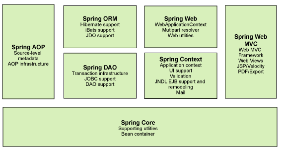

## Spring

### 1 简介

2002年，Rod Jahnson首次推出了Spring框架雏形interface21框架。  
2004年3月24日，Spring框架以interface21框架为基础，经过重新设计，发布了1.0正式版。  
很难想象Rod Johnson的学历 , 他是悉尼大学的博士，然而他的专业不是计算机，而是音乐学。  
Spring理念 : 使现有技术更加实用 . 本身就是一个大杂烩 , 整合现有的框架技术官网 : http://spring.io/

官方下载地址 : https://repo.spring.io/libs-release-local/org/springframework/spring/

GitHub : https://github.com/spring-projects

### 1.1 优点
1. Spring是一个开源免费的框架, 容器  .
2. Spring是一个轻量级的框架, 非侵入式的 .
3. 控制反转IoC, 面向切面Aop
4. 对事物的支持, 对框架的支持

### 1.2 组成



组成Spring框架的每个模块（或组件）都可以单独存在，或者与其他一个或多个模块联合实现。每个模块的功能如下:
- 核心容器：核心容器提供 Spring 框架的基本功能。核心容器的主要组件是BeanFactory，它是工厂模式的实现。BeanFactory使用控制反转（IOC）模式将应用程序的配置和依赖性规范与实际的应用程序代码分开。
- Spring上下文：Spring上下文是一个配置文件，向 Spring框架提供上下文信息。Spring上下文包括企业服务，例如JNDI、EJB、电子邮件、国际化、校验和调度功能。
- Spring AOP：通过配置管理特性，Spring AOP模块直接将面向切面的编程功能, 集成到了Spring框架中。所以，可以很容易地使Spring框架管理任何支持AOP的对象。Spring AOP模块为基于Spring 的应用程序中的对象提供了事务管理服务。通过使用Spring AOP，不用依赖组件，就可以将声明性事务管理集成到应用程序中。
- Spring DAO：JDBC DAO 抽象层提供了有意义的异常层次结构，可用该结构来管理异常处理和不同数据库供应商抛出的错误消息。异常层次结构简化了错误处理，并且极大地降低了需要编写的异常代码数量（例如打开和关闭连接）。Spring DAO 的面向 JDBC 的异常遵从通用的 DAO 异常层次结构。
- Spring ORM：Spring框架插入了若干个ORM 框架，从而提供了ORM的对象关系工具，其中包括JDO、Hibernate和 iBatis SQL Map。所有这些都遵从Spring的通用事务和DAO异常层次结构。
- Spring Web模块：Web上下文模块建立在应用程序上下文模块之上，为基于Web的应用程序提供了上下文。所以，Spring 框架支持与 Jakarta Struts 的集成。Web模块还简化了处理多部分请求以及将请求参数绑定到域对象的工作。
- Spring MVC框架：MVC框架是一个全功能的构建Web应用程序的MVC实现。通过策略接口，MVC框架变成为高度可配置的，MVC容纳了大量视图技术，其中包括JSP、Velocity、Tiles、iText和POI。
### 1.3 拓展


## 2 IOC理论推导

> IoC基础

1. 定义一个UserDao接口
```java
public class User {
    private String name;
}
```
2. 定义几个UserDao实现类(模拟通过不同的数据库获取用户信息)

默认获取方式
```java
public class UserDaoImpl implements UserDao {
    public void getUser() {
        System.out.println("默认获取用户数据");
    }
}
```
通过mysql数据库获取
```java
public class UserMySQLDaoImpl implements UserDao {
    public void getUser() {
        System.out.println("mysql获取用户信息");
    }
}
```
通过oracle方式获取
```java
public class UserOracleImpl implements UserDao {
    public void getUser() {
        System.out.println("Oracle获取用户数据");
    }
}
```
3. 定义UserService层接口

```java
public interface UserService {
    public void getUser();
}
```
4. 定义UserService的实现类
```java
public class UserServiceImpl implements UserService{

    private UserDao userDao;

    public UserServiceImpl() {
    }

    public UserServiceImpl(UserDao userDao) {
        this.userDao = userDao;
    }

    public UserDao getUserDao() {
        return userDao;
    }
    // 利用set方法注入
    public void setUserDao(UserDao userDao) {
        this.userDao = userDao;
    }

    public void getUser() {
        userDao.getUser();
    }
}
```
5. 测试
```java
public class TestUser {
    public static void main(String[] args) {
        // 此处通过set方法注入后, 只需要在使用的时候告诉程序需要service即可不需要修改源码
        UserService userService = 
        new UserServiceImpl(new UserMySQLDaoImpl());

        userService.getUser();
}
```
仔细去思考一下, 以前所有东西都是由程序去进行控制创建, 而现在是由我们自行控制创建对象, 把主动权交给了调用者. 程序不用去管怎么创建, 怎么实现了. 它只负责提供一个接口.

这种思想, 从本质上解决了问题, 我们程序员不再去管理对象的创建了, 更多的去关注业务的实现. 耦合性大大降低. 这也就是IOC的原型 !

> IoC本质

控制反转IoC(Inversion of Control)，是一种设计思想，DI(依赖注入)是实现IoC的一种方法，也有人认为DI只是IoC的另一种说法。没有IoC的程序中, 我们使用面向对象编程, 对象的创建与对象间的依赖关系完全硬编码在程序中，对象的创建由程序自己控制，控制反转后将对象的创建转移给第三方，个人认为所谓控制反转就是：获得依赖对象的方式反转了。

> 依赖注入

- 依赖注入（Dependency Injection,DI）。  
- 依赖: 指Bean对象的创建依赖于容器 . Bean对象的依赖资源
- 注入: 指Bean对象所依赖的资源 , 由容器来设置和装配.

1. 构造器注入

2. set注入
+ 要求被注入的属性, 必须有set方法

常见的类型注入
```java
public class Student {

    private String name;
    private Address address;
    private String[] books;
    private List<String> hobbies;
    private Map<String, String> card;
    private Set<String> game;
    private String isMarried;
    private Properties info;
}
```
xml文件配置
```xml
<?xml version="1.0" encoding="UTF-8"?>
<beans xmlns="http://www.springframework.org/schema/beans"
       xmlns:xsi="http://www.w3.org/2001/XMLSchema-instance"
       xmlns:p="http://www.springframework.org/schema/p"
       xmlns:c="http://www.springframework.org/schema/c"
       xsi:schemaLocation="http://www.springframework.org/schema/beans
        https://www.springframework.org/schema/beans/spring-beans.xsd">

    <!-- c命名空间注入, 通过构造器注入, 此时必须有有参构造: construct-args -->
    <bean id="myUser" class="edu.fzu.bean.MyUser" c:name="王小胖" c:age="28">
    </bean>
    <!-- p命名空间注入, 可以直接注入属性: property -->
    <bean id="myUser2" class="edu.fzu.bean.MyUser" p:name="王小胖" p:age="18">
    </bean>

    <bean id="student" class="edu.fzu.bean.Student">
        <!-- 第一种 普通值注入: 使用value -->
        <property name="name" value="JohnCarraway"/>
        <!-- 第二种 注入外部类: 使用ref  -->
        <property name="address" ref="address"/>
        <!-- 第三种 注入List: 使用list  -->
        <property name="hobbies">
            <list>
                <value>短跑</value>
                <value>滑雪</value>
            </list>
        </property>
        <!-- 第四种 注入map: 使用map  -->
        <property name="card">
            <map>
                <entry key="CCB" value="建设银行"></entry>
                <entry key="FZC" value="福州大学学生卡"></entry>
            </map>
        </property>
        <!-- 第五种 注入set: 使用set  -->
        <property name="game">
            <set>
                <value>和平精英</value>
                <value>王者荣耀</value>
            </set>
        </property>
        <property name="info">
            <props>
                <prop key="邮箱">x_junzhu@163.com</prop>
                <prop key="学校地址">福建省福州市</prop>
            </props>
        </property>
        <property name="isMarried">
            <null/>
        </property>
        <!-- 第六种 数组注入: 使用set  -->
        <property name="books">
            <array>
                <value>万历十五年</value>
                <value>明朝那些事</value>
            </array>
        </property>

    </bean>

    <bean id="address" class="edu.fzu.bean.Address">
        <property name="address" value="北京市亦庄经济开发区京东大厦A座"/>
    </bean>

</beans>
```

> Bean的作用域

在Spring中，那些组成应用程序的主体及由Spring IoC容器所管理的对象，被称之为bean。简单地讲，bean就是由IoC容器初始化、装配及管理的对象.


**Singleton**

当一个bean的作用域为Singleton，那么Spring IoC容器中只会存在一个共享的bean实例，并且所有对bean的请求，只要id与该bean定义相匹配，则只会返回bean的同一实例。Singleton是单例类型，就是在创建起容器时就同时自动创建了一个bean的对象，不管你是否使用，他都存在了，每次获取到的对象都是同一个对象。注意，Singleton作用域是Spring中的缺省作用域。要在XML中将bean定义成singleton，可以这样配置：
```xml
<bean id="ServiceImpl" class="cn.csdn.service.ServiceImpl" scope="singleton">
```

**Prototype**  
当一个bean的作用域为Prototype，表示一个bean定义对应多个对象实例。Prototype作用域的bean会导致在每次对该bean请求（将其注入到另一个bean中，或者以程序的方式调用容器的getBean()方法）时都会创建一个新的bean实例。Prototype是原型类型，它在我们创建容器的时候并没有实例化，而是当我们获取bean的时候才会去创建一个对象，而且我们每次获取到的对象都不是同一个对象。根据经验，对有状态的bean应该使用prototype作用域，而对无状态的bean则应该使用singleton作用域。在XML中将bean定义成prototype，可以这样配置：
```xml
 <bean id="account" class="com.foo.DefaultAccount" scope="prototype"/>  

 <bean id="account" class="com.foo.DefaultAccount" singleton="false"/>
 ```

 > Bean的自动装配

自动装配说明

1. 自动装配是使用spring满足bean依赖的一种方法

2. spring会在应用上下文中为某个bean寻找其依赖的bean。

Spring中bean有三种装配机制，分别是：

1. 在xml中显式配置；
2. 在java中显式配置；
3. 隐式的bean发现机制和自动装配。

这里我们主要讲第三种：自动化的装配bean。

Spring的自动装配需要从两个角度来实现，或者说是两个操作：

+ 组件扫描(component scanning)：spring会自动发现应用上下文中所创建的bean；

+ 自动装配(autowiring)：spring自动满足bean之间的依赖，也就是我们说的IoC/DI；

组件扫描和自动装配组合发挥巨大威力，使得显示的配置降低到最少

> byType

autowire byType (按类型自动装配)

使用autowire byType首先需要保证：同一类型的对象，在spring容器中唯一。如果不唯一，会报不唯一的异常。
```java
NoUniqueBeanDefinitionException
```

> 使用注解

jdk1.5开始支持注解，spring2.5开始全面支持注解。

准备工作：利用注解的方式注入属性。

1. 在spring配置文件中引入context文件头
```xml
xmlns:context="http://www.springframework.org/schema/context"

http://www.springframework.org/schema/context
http://www.springframework.org/schema/context/spring-context.xsd
```
2. 开启属性注解支持！
```xml
<context:annotation-config/>
```

**@Autowired**

+ @Autowired是按类型自动转配的，不支持id匹配。

+ 需要导入 spring-aop的包！

**注**  
@Autowired(required=false)  说明：false，对象可以为null；true，对象必须存对象，不能为null。
```java
//如果允许对象为null，设置required = false,默认为true
@Autowired(required = false)
private Cat cat;
```

**@Qualifier**

+ @Autowired是根据类型自动装配的，加上@Qualifier则可以根据byName的方式自动装配

+ @Qualifier不能单独使用。

**@Resource**

+ @Resource如有指定的name属性，先按该属性进行byName方式查找装配；

+ 其次再进行默认的byName方式进行装配；

+ 如果以上都不成功，则按byType的方式自动装配。

+ 都不成功，则报异常。
```java
public class User {
   //如果允许对象为null，设置required = false,默认为true
   @Resource(name = "cat2")
   private Cat cat;
   @Resource
   private Dog dog;
   private String str;
}
```

小结

@Autowired与@Resource异同：

1. @Autowired与@Resource都可以用来装配bean。都可以写在字段上，或写在setter方法上。
2. @Autowired默认按类型装配（属于spring规范），默认情况下必须要求依赖对象必须存在，如果要允许null 值，可以设置它的required属性为false，如：@Autowired(required=false) ，如果我们想使用名称装配可以结合@Qualifier注解进行使用
3. @Resource（属于J2EE复返），默认按照名称进行装配，名称可以通过name属性进行指定。如果没有指定name属性，当注解写在字段上时，默认取字段名进行按照名称查找，如果注解写在setter方法上默认取属性名进行装配。当找不到与名称匹配的bean时才按照类型进行装配。但是需要注意的是，如果name属性一旦指定，就只会按照名称进行装配。

它们的作用相同都是用注解方式注入对象，但执行顺序不同。@Autowired先byType，@Resource先byName。

> bean的实现

我们之前都是使用 bean 的标签进行bean注入，但是实际开发中，我们一般都会使用注解！

1. 配置扫描哪些包下的注解
```xml
<!--指定注解扫描包-->
<context:component-scan base-package="edu.fzu.bean"/>
```
2. 在指定包下编写类，增加注解
```java
@Component("user")
// 相当于配置文件中 <bean id="user" class="当前注解的类"/>
public class User {
   public String name = "John";
}
```

> 衍生注解

我们这些注解，就是替代了在配置文件当中配置步骤而已！更加的方便快捷！

@Component三个衍生注解

为了更好的进行分层，Spring可以使用其它三个注解，功能一样，目前使用哪一个功能都一样。

+ @Controller：web层

+ @Service：service层

+ @Repository：dao层

写上这些注解，就相当于将这个类交给Spring管理装配了！

> XML与注解比较

+ XML可以适用任何场景 ，结构清晰，维护方便

+ 注解不是自己提供的类使用不了，开发简单方便

xml与注解整合开发 ：推荐最佳实践

+ xml管理Bean

+ 注解完成属性注入

+ 使用过程中， 可以不用扫描，扫描是为了类上的注解
```xml
<context:annotation-config/>
```
作用：

+ 进行注解驱动注册，从而使注解生效

- 用于激活那些已经在spring容器里注册过的bean上面的注解，也就是显示的向Spring注册

- 如果不扫描包，就需要手动配置bean

- 如果不加注解驱动，则注入的值为null！

> 基于Java类进行配置

JavaConfig 原来是 Spring 的一个子项目，它通过 Java 类的方式提供 Bean 的定义信息，在 Spring4 的版本， JavaConfig 已正式成为 Spring4 的核心功能 。

测试：

1. 编写一个实体类，Dog
```java
@Component  //将这个类标注为Spring的一个组件，放到容器中！
public class Dog {
   public String name = "dog";
}
```
2. 新建一个config配置包，编写一个MyConfig配置类
```java
@Configuration  //代表这是一个配置类
public class MyConfig {

   @Bean //通过方法注册一个bean，这里的返回值就Bean的类型，方法名就是bean的id！
   public Dog dog(){
       return new Dog();
  }

}
```
3. 测试
```java
@Test
public void test2(){
   ApplicationContext applicationContext =
           new AnnotationConfigApplicationContext(MyConfig.class);
   Dog dog = (Dog) applicationContext.getBean("dog");
   System.out.println(dog.name);
}
```
关于这种Java类的配置方式，我们在之后的SpringBoot 和 SpringCloud中还会大量看到，我们需要知道这些注解的作用即可！