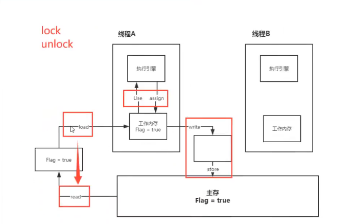

# JUC基础

> 锁是什么

锁是同步监视器, 即当前类的Class对象

> 公平锁与非公平锁

公平锁: 先来后到 缺点: 如果有两个线程执行时间分别是3h 3s那3s必须等3h执行完

非公平锁: 可以插队

> synchronized和Lock的区别
1. synchronized是java内置的关键字;Lock是一个类
2. synchronized无法判断锁的状态;Lock可以判断是否获取到了锁
3. synchronized会自动释放锁;Lock必须手动释放锁
4. synchronized 线程1(获得锁 阻塞)  线程2(等待 一直等);Lock不一定会一直等待下去(tryLock()尝试获取锁)
5. synchronized是可重入锁,不可中断,非公平的;Lock是可重入锁,可判断锁,非公平(可以自由设置是否公平)
6. synchronized适合锁少量代码块;Lock适合锁大量的代码同步

> Callable
1. 可以有返回值
2. 可以抛出异常
3. 方法不同 run()/call()
4. 多个线程执行会有缓存使得返回结果只有一个, 同时如果方法执行时间长可能会出现阻塞.

> 常用辅助类
1. CountDownLatch
```java
public static void main(String[] args) throws InterruptedException {
        CountDownLatch countDownLatch = new CountDownLatch(6);


        for (int i = 1; i <= 6 ; i++) {
            new Thread(() -> {
                System.out.println(Thread.currentThread().getName() + "离开教室");
                countDownLatch.countDown();//-1操作
            }, String.valueOf(i)).start();
        }

        // 等待计数器归零, 然后再向下执行
        countDownLatch.await();

        System.out.println("关门");
    }
```
2. CyclicBarrier
```java
public static void main(String[] args) {

        // 召唤神龙的线程
        CyclicBarrier cyclicBarrier = new CyclicBarrier(7, () -> {
            System.out.println("七颗龙珠集齐, 召唤神龙");
        });
        // 集齐七颗龙珠召唤神龙
        for (int i = 1; i <= 7 ; i++) {
            final int temp = i;
            new Thread(() -> {
                System.out.println(Thread.currentThread().getName() + "收集到第" + temp + "颗龙珠");
                try {
                    cyclicBarrier.await();
                } catch (InterruptedException e) {
                    e.printStackTrace();
                } catch (BrokenBarrierException e) {
                    e.printStackTrace();
                }
            }, String.valueOf(temp)).start();
        }
    }
```
3. Semaphore
```java
// 模拟停车位(3个), 应用场景: 限流
    public static void main(String[] args) {
        // 3个线程等同于3个停车位
        Semaphore semaphore = new Semaphore(3);

        for (int i = 1; i <= 6 ; i++) {
            final int temp = i;
            new Thread(() -> {
                try {
                    semaphore.acquire();
                    System.out.println(Thread.currentThread().getName() + "获取到第" + temp + "停车位");
                    // 模拟停车时间
                    TimeUnit.SECONDS.sleep(2);
                    System.out.println(Thread.currentThread().getName() + "离开到第" + temp + "停车位");
                } catch (InterruptedException e) {
                    e.printStackTrace();
                } finally {
                    semaphore.release();
                }
            }, "宝马X" + temp).start();

        }
    }
```
> ReadWriteLock
```java
public class ReadWriteLockDemo {
    public static void main(String[] args) {
        MyCacheLock myCache = new MyCacheLock();
        // 写入
        for (int i = 1; i <= 5; i++){
            final int temp = i;
            new Thread(() -> {
             myCache.put("第" + temp + "变量", "" + temp);
            }, String.valueOf(i)).start();
        }
        // 读取
        for (int i = 1; i <= 5; i++){
            final int temp = i;
            new Thread(() -> {
                myCache.get("第" + temp + "变量");
            }, String.valueOf(i)).start();
        }
    }
}
class MyCacheLock{
    private volatile Map<String, Object> map = new HashMap<>();
    // 读写锁: 更加细粒度的控制
    private ReadWriteLock readWriteLock = new ReentrantReadWriteLock();
    // 存 -> 写(只希望写入的时候只有一个线程在操作)
    public void put(String key, Object value){
        // 加锁
        readWriteLock.writeLock().lock();
        try {
            System.out.println(Thread.currentThread().getName() + "写入" + key);
            map.put(key, value);
            System.out.println(Thread.currentThread().getName() + "写入完成");
        } catch (Exception e) {
            e.printStackTrace();
        } finally {
            readWriteLock.writeLock().unlock();
        }
    }
    // 取 -> 读(所有线程都可以读取)
    public void get(String key){
        readWriteLock.readLock().lock();
        try {
            System.out.println(Thread.currentThread().getName() + "读取" + key);
            Object res = map.get(key);
            System.out.println(Thread.currentThread().getName() + "读取完成, value=" + res);
        } catch (Exception e){
            e.printStackTrace();
        } finally {
            readWriteLock.readLock().unlock();
        }
    }
}
```
1. 独占锁(写锁):一次只能被一个线程占有
2. 共享锁(读锁):多个线程可以同时占有

读-读: 可以共存

读-写: 不可共存

写-写: 不可共存

> BlockingQueue(四组API)

|方式|抛出异常|不会抛出异常,有返回值|阻塞等待|超时等待|
|:----:|:----:|:----:|:----:|:----:|
|添加|add()|offer()|put()|offer()|
|移除|remove()|poll()|take()|poll()|
|查看队首元素|element()|peek()|-|-|
1. 抛出异常
```java
    /**
     * 抛出异常
     */
    public static void throwException(){
        // FIFO: 需要初始化队列参数
        ArrayBlockingQueue blockingQueue = new ArrayBlockingQueue<>(3);

        System.out.println(blockingQueue.add("a"));
        System.out.println(blockingQueue.add("b"));
        System.out.println(blockingQueue.add("c"));

        // 查看对首元素
        System.out.println(blockingQueue.element());

        // 当队列满了抛出异常: java.lang.IllegalStateException: Queue full
//        System.out.println(blockingQueue.add("d"));

        // 弹出队列元素
        System.out.println(blockingQueue.remove());
        System.out.println(blockingQueue.remove());
        System.out.println(blockingQueue.remove());

        // 队列为空后再取元素: java.util.NoSuchElementException
        System.out.println(blockingQueue.remove());

    }
```
2. 不会抛出异常,有返回值
```java
/**
     * 不抛出异常,但带有返回值
     */
    public static void notThrowException(){
        // FIFO: 需要初始化队列参数
        ArrayBlockingQueue blockingQueue = new ArrayBlockingQueue<>(3);

        System.out.println(blockingQueue.offer("a"));
        System.out.println(blockingQueue.offer("b"));
        System.out.println(blockingQueue.offer("c"));

        // 查看对首元素
        System.out.println(blockingQueue.peek());

        // 当队列满了不抛出异常, 但会返回false
        System.out.println(blockingQueue.offer("d"));

        // 弹出队列元素
        System.out.println(blockingQueue.poll());
        System.out.println(blockingQueue.poll());
        System.out.println(blockingQueue.poll());

        // 队列为空后再取元素: 返回null
        System.out.println(blockingQueue.poll());
    }
```
3. 阻塞等待(一直阻塞)
```java
/**
     * 阻塞等待(一直等待)
     */
    public static void waiting() throws InterruptedException {
        // FIFO: 需要初始化队列参数
        ArrayBlockingQueue blockingQueue = new ArrayBlockingQueue<>(3);

        blockingQueue.put("a");
        blockingQueue.put("b");
        blockingQueue.put("c");

        // 当出现阻塞时会一直等待
//        blockingQueue.put("d");
        System.out.println(blockingQueue.take());
        System.out.println(blockingQueue.take());
        System.out.println(blockingQueue.take());

        // 队列为空后再取元素: 一直等待, 直到有元素
        System.out.println(blockingQueue.take());
    }
```
4. 超时等待
```java
    /**
     * 超时等待
     */
    public static void waitingCanStop() throws InterruptedException {
        // FIFO: 需要初始化队列参数
        ArrayBlockingQueue blockingQueue = new ArrayBlockingQueue<>(3);

        System.out.println(blockingQueue.offer("a", 3, TimeUnit.SECONDS));
        System.out.println(blockingQueue.offer("b", 3, TimeUnit.SECONDS));
        System.out.println(blockingQueue.offer("c", 3, TimeUnit.SECONDS));

        // 当队列满了之后, 会超时在规定时间内插入, 若无法插入则返回false
//        System.out.println(blockingQueue.offer("c", 3, TimeUnit.SECONDS));

        // 从队列中取出值
        System.out.println(blockingQueue.poll(2, TimeUnit.SECONDS));
        System.out.println(blockingQueue.poll(2, TimeUnit.SECONDS));
        System.out.println(blockingQueue.poll(2, TimeUnit.SECONDS));

        // 当队列为空后, 尝试在规定时间内从队列中取出值, 若无法取出则返回null
        System.out.println(blockingQueue.poll(2, TimeUnit.SECONDS));
    }
```
> SynchronousQueue 同步队列

SynchronousQueue和其他的BlockingQueue不一样, 它不存储元素, 当put()一个元素后, 必须等待take()出来后, 否则不能put()进去值

> 线程池

线程池的好处:

1. 降低资源的消耗
2. 提高响应的速度
3. 方便管理

**线程复用, 可以控制最大并发线程数, 管理线程**

> 线程池: 三大方法、七种策略、四种拒绝策略
1. 三大方法
```java
public static void main(String[] args) {
        // 单个线程
//        ExecutorService threadPool = Executors.newSingleThreadExecutor();
        // 创建固定大小的线程池
//        ExecutorService threadPool = Executors.newFixedThreadPool(5);
        // 可伸缩的线程池
        ExecutorService threadPool = Executors.newCachedThreadPool();

        try {
            for (int i = 1; i <= 1001; i++){
                // 使用线程池创建线程
                threadPool.execute(() -> {
                    System.out.println(Thread.currentThread().getName() + " is ok");
                });
            }
        } catch (Exception e){
            e.printStackTrace();
        } finally {
            // 线程池使用完, 需要关闭
            threadPool.shutdown();
        }
    }
```
**线程池本质**
```java
public ThreadPoolExecutor(int corePoolSize,//核心线程池大小
                              int maximumPoolSize,//最大核心线程池大小
                              long keepAliveTime,
                              // 超时后没有调用就是释放的时间
                              TimeUnit unit,// 超时单位
                              BlockingQueue<Runnable> workQueue,// 阻塞队列
                              ThreadFactory threadFactory,// 创建线程工厂, 一般不用动
                              RejectedExecutionHandler handler// 拒绝策略) {
        if (corePoolSize < 0 ||
            maximumPoolSize <= 0 ||
            maximumPoolSize < corePoolSize ||
            keepAliveTime < 0)
            throw new IllegalArgumentException();
        if (workQueue == null || threadFactory == null || handler == null)
            throw new NullPointerException();
        this.corePoolSize = corePoolSize;
        this.maximumPoolSize = maximumPoolSize;
        this.workQueue = workQueue;
        this.keepAliveTime = unit.toNanos(keepAliveTime);
        this.threadFactory = threadFactory;
        this.handler = handler;
    }
```
**线程池七大参数理解举例**


> 手动创建线程池
```java
@Test
    public void testThreadPool(){
        /*四大策略
        1. new ThreadPoolExecutor.AbortPolicy(): 银行满了, 还有人继续进来, 不处理此人, 抛出异常
        2. new ThreadPoolExecutor.CallerRunsPolicy(): 哪里来的去哪里(main 线程执行)
        3. new ThreadPoolExecutor.DiscardPolicy(): 队列满了, 丢掉任务, 不会抛出异常
        4. new ThreadPoolExecutor.DiscardOldestPolicy(): 队列满了, 尝试和最早的线程竞争, 不会抛出异常
         */
        ThreadPoolExecutor threadPool = new ThreadPoolExecutor(
                2,
                5,
                3,
                TimeUnit.SECONDS,
                new LinkedBlockingQueue<>(3),
                Executors.defaultThreadFactory(),
                new ThreadPoolExecutor.DiscardOldestPolicy());// 队列满了, 尝试和最早的线程竞争, 不会抛出异常
        try {
            /*
            最大承载: max + queue
            超过最大承载(拒绝策略为AbortPolicy()): java.util.concurrent.RejectedExecutionException
             */
            for (int i = 1; i <= 9; i++){
                // 使用线程池创建线程
                threadPool.execute(() -> {
                    System.out.println(Thread.currentThread().getName() + " is ok");
                });
            }
        } catch (Exception e){
            e.printStackTrace();
        } finally {
            // 线程池使用完, 需要关闭
            threadPool.shutdown();
        }
    }
```

**如何定义最大线程池大小**
1. CPU密集型: 计算机是几核的就定义为几个线程, 可以保证CPU效率最高.Runtime.getRuntime().availableProcessors();
2. IO密集型: 判断程序中十分占用IO的程序数, 只要最大线程数大于IO线程数即可

> 四大函数式接口

lambda表达式、链式编程、函数式接口、Stream流式计算

**函数式接口**

只有一个方法的接口
```java
@FunctionalInterface
public interface Runnable {
    public abstract void run();
}
/*
很多FunctionalInterface
简化编程模型, 在新版本框架底层大量应用
*/
```
> Function函数式接口: 有一个输入值, 返回输入值
```java
public static void main(String[] args) {
//        Function<String, String> function = new Function<String, String>() {
//            @Override
//            public String apply(String s) {
//                return s;
//            }
//        };
//        System.out.println(function.apply("王小胖"));
        Function function = (str) -> { return str; };
        System.out.println(function.apply("王小瘦"));
    }
```
> Predicate断言式接口: 有一个输入参数, 返回值只能是布尔值
```java
    /**
     * 断言式接口: 有一个输入参数, 返回值只能是布尔值
     */
    @Test
    public void testPredictFunction(){
//        Predicate<String> predicate = new Predicate<String>() {
//            @Override
//            public boolean test(String s) {
//                return s.isEmpty();
//            }
//        };

        Predicate<String> predicate = (str) -> { return str.isEmpty();};
        System.out.println(predicate.test(""));
    }
```
> Consumer消费型接口: 只有输入, 没有输出
```java
/*
    Consumer消费型接口: 只有输入, 没有输出
     */
    @Test
    public void testConsumer(){
//        Consumer<String> consumer = new Consumer<String>() {
//            @Override
//            public void accept(String s) {
//                System.out.println(s);
//            }
//        };
        Consumer<String> consumer = (s) -> {
            System.out.println(s);
        };
        consumer.accept("小王呀");
    }
```

> Supplier供给型接口:只有输出, 没有输入
```java
/*
    Supplier供给型接口:只有输出, 没有输入
     */
    @Test
    public void testSupplier(){
//        Supplier<Integer> supplier = new Supplier<Integer>() {
//            @Override
//            public Integer get() {
//                return 1024;
//            }
//        };
        Supplier<Integer> supplier = () -> {return 1024;};
        System.out.println(supplier.get());
    }
```
> ForkJoin

特点: 工作窃取
```java
public class ForkJoinDemo extends RecursiveTask<Long> {

    /*
    如何使用ForkJoin
    1. 通过ForkJoinPool来执行
    2. 计算任务execute(ForkJoinTask<?> task)
    3. 计算类必须继承ForkJoinTask
     */
    private long start;
    private long end;

    // 临界值, 拆分任务的临界
    private long tmp = 10000;

    public ForkJoinDemo(long start, long end) {
        this.start = start;
        this.end = end;
    }

    /**
     * ForkJoin计算方法
     * @return
     */
    @Override
    protected Long compute() {
        Long sum = 0L;
        if ((end - start) <= tmp){
            for (long i = start; i <= end; i++){
                sum += i;
            }
        } else {// ForkJoin
            long mid = (start + end) / 2;
            ForkJoinDemo task1 = new ForkJoinDemo(start, mid);
            task1.fork(); // 把任务拆分, 将线程压入队列
            ForkJoinDemo task2 = new ForkJoinDemo(mid + 1, end);
            task2.fork(); // 把任务拆分, 将线程压入队列

            // 合并子任务计算结果
            return task1.join() + task2.join();
        }
        return sum;
    }
}
```
**测试ForkJoin**
```java
public class ForkJoinTest {

    private static final Long computeStartNumber = 1L;
    private static final Long computeEndNumber = 10_0000_0000L;

    public static void main(String[] args) throws ExecutionException, InterruptedException {
//        test1(); // 3543
//        test2(); // 2225
        test3(); // 266
    }

    public static void test1(){
        long startTime = System.currentTimeMillis();
        long sum = 0;
        for (Long i = 1L; i <= 10_0000_0000; i++){
            sum += i;
        }
        long endTime = System.currentTimeMillis();
        System.out.println("结果为=" + sum + ", 执行时间=" + (endTime - startTime));
    }

    public static void test2() throws ExecutionException, InterruptedException {
        long startTime = System.currentTimeMillis();
        ForkJoinPool forkJoinPool = new ForkJoinPool();
        ForkJoinTask<Long> forkJoinTask = new ForkJoinDemo(computeStartNumber, computeEndNumber);
        // forkJoinPool.execute(forkJoinTask); execute()方法会执行, 但是不会返回执行结果
        ForkJoinTask<Long> res = forkJoinPool.submit(forkJoinTask);
        Long computeRes = res.get();
        long endTime = System.currentTimeMillis();
        System.out.println("结果为=" + computeRes + ", 执行时间=" + (endTime - startTime));
    }

    public static void test3(){
        long startTime = System.currentTimeMillis();
        // Stream并行流
        long reduce = LongStream.rangeClosed(computeStartNumber, computeEndNumber).parallel().reduce(0, Long::sum);
        long endTime = System.currentTimeMillis();
        System.out.println("结果为=" + reduce + ", 执行时间=" + (endTime - startTime));
    }
}
```

> 异步回调
```java
/**
     * 没有返回值的异步回调 runAsync
     * @throws ExecutionException
     * @throws InterruptedException
     */
    @Test
    public void testRunAsyncNotReturn() throws ExecutionException, InterruptedException {
        CompletableFuture<Void> completableFuture = CompletableFuture.runAsync(() -> {
            try {
                TimeUnit.SECONDS.sleep(3);
            } catch (InterruptedException e) {
                e.printStackTrace();
            }
            System.out.println(Thread.currentThread().getName() + "runAsync=>Void");
        });
        System.out.println("main线程");
        completableFuture.get(); // 阻塞获取结果
    }

    /**
     * 有返回值的异步回调 supplyAsync
     */
    @Test
    public void testRunAsyncWithReturn() throws ExecutionException, InterruptedException {
        CompletableFuture<Integer> completableFuture = CompletableFuture.supplyAsync(() -> {
            System.out.println(Thread.currentThread().getName() +" => supplyAsync with return");
            int sum  = 10 / 0;
            return 1024;
        });
        Integer res = completableFuture.whenComplete((t, u) -> {
            System.out.println("t=>" + t); // 正常的返回结果
            System.out.println("u=>" + u); // 异常的返回结果
        }).exceptionally((e) -> {
            System.out.println(e.getMessage());
            return 20002;
        }).get();

        System.out.println(res);
    }
```
## JMM

> 谈谈对volatile的理解

volatile是Java提供的**轻量级同步机制**
1. 保证可见性
2. 不保证原子性
3. 禁止指令重排

> 什么是JMM

Java内存模型, 不存在的东西, 是一种概念, 约定.

**关于JMM的约定**
1. 线程加锁前: 必须把共享变量*立刻*刷回主存
2. 线程解锁前: 必须读取内存中的最新值到工作内存中
3. 加锁和解锁是同一把锁

线程 工作内存、主内存(八种操作)



> 内存交互操作有8种，虚拟机实现必须保证每一个操作都是原子的，不可在分的（对于double和long类型的变量来说，load、store、read和write操作在某些平台上允许例外）

+ lock（锁定）：作用于主内存的变量，把一个变量标识为线程独占状态
+ unlock（解锁）：作用于主内存的变量，它把一个处于锁定状态的变量释放出来，释放后的变量才可以被其他线程锁定
+ read（读取）：作用于主内存变量，它把一个变量的值从主内存传输到线程的工作内存中，以便随后的load动作使用
+ load（载入）：作用于工作内存的变量，它把read操作从主存中变量放入工作内存中
+ use（使用）：作用于工作内存中的变量，它把工作内存中的变量传输给执行引擎，每当虚拟机遇到一个需要使用到变量的值，就会使用到这个指令
+ assign（赋值）：作用于工作内存中的变量，它把一个从执行引擎中接受到的值放入工作内存的变量副本中
+ store（存储）：作用于主内存中的变量，它把一个从工作内存中一个变量的值传送到主内存中，以便后续的write使用
+ write（写入）：作用于主内存中的变量，它把store操作从工作内存中得到的变量的值放入主内存的变量中
> JMM对这八种指令的使用，制定了如下规则：

+ 不允许read和load、store和write操作之一单独出现。即使用了read必须load，使用了store必须write
+ 不允许线程丢弃他最近的assign操作，即工作变量的数据改变了之后，必须告知主存
+ 不允许一个线程将没有assign的数据从工作内存同步回主内存
+ 一个新的变量必须在主内存中诞生，不允许工作内存直接使用一个未被初始化的变量。就是怼变量实施use、store操作之前，必须经过assign和load操作
+ 一个变量同一时间只有一个线程能对其进行lock。多次lock后，必须执行相同次数的unlock才能解锁
+ 如果对一个变量进行lock操作，会清空所有工作内存中此变量的值，在执行引擎使用这个变量前，必须重新load或assign操作初始化变量的值
+ 如果一个变量没有被lock，就不能对其进行unlock操作。也不能unlock一个被其他线程锁住的变量
+ 对一个变量进行unlock操作之前，必须把此变量同步回主内存