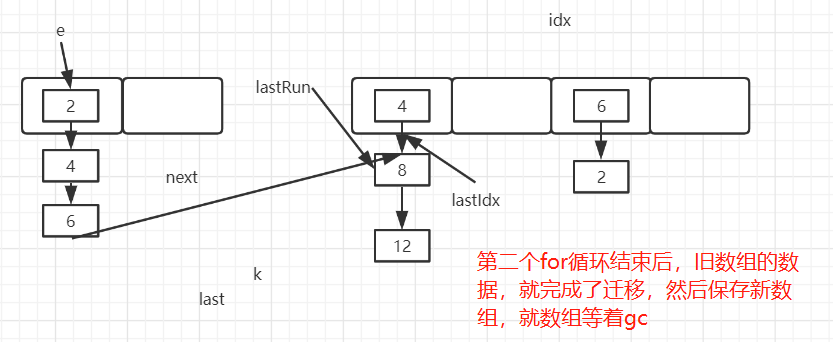

# Java

## 1.Java基础编程知识

### 1.1 Java关键字

特点：关键字中所有字母都是**小写**

> 用于定义数据类型的关键字

|  class  | interface | enum  |  byte  | short |
| :-----: | :-------: | :---: | :----: | :---: |
|   int   |   long    | float | double | char  |
| boolean |   void    |       |        |       |

> 用于定义流程控制的关键字

|   if   | else | switch | case  | default  |
| :----: | :--: | :----: | :---: | :------: |
| while  |  do  |  for   | break | continue |
| return |      |        |       |          |

> 其他关键字

| native | strictfp | transient | volatile | assert |
| ------ | -------- | --------- | -------- | ------ |

标识符的使用

+ 由26个英文字符大小写，0-9，_和$组成
+ 数字不可以开头
+ 不可以使用关键字和保留字，但是可以包含关键字和保留字
+ Java中严格区分大小写，长度无限制
+ 标识符中不能包含空格

### 1.2 变量的分类

**八种基本数据类型**

+ 基本数据类型
  + 数值型
    + 整数型：byte, short, int, long
    + 浮点型：float, double
  + 字符型：char
  + 布尔型：boolean
+ 引用数据类型
  + 类(class)
  + 接口(interface)
  + 数组([])

详细说明：

+ 整型：byte(1字节=8bit) , short(2字节), int(4字节), long(8字节)

byte: -2^7 ~ 2^7 - 1

short: -2^15 ~ 2^15 - 1

int：-2^31 ~ 2^31 - 1

long： -2^63 ~ 2^63 - 1

+ 浮点型：float(4字节), double(8字节)

  + float：2^-149 ~ 2^128 - 1 **(-1)^S\*[2^(E-127)]\*1.M**

    其中-149的来历，指数位全为0，即指数值为-127，这个时候尾数取最小，2^(-23)，即-127-23=-150，全0和全1为特殊值，不作为范围内的值，故取-149

  + double：2^-1074 ~ 2^1024 - 1 **(-1)^S\*[2^(E-1023)]\*1.M**

  

**关于浮点型float和double的补充说明：**

+ 在java编程语言中浮点数默认的是double型，如果要使用float需要在小数后加上f
+ double和float在运算中，**可能**会出现舍入误差

补充：


### 1.3 对面向对象的理解

**面向对象的三大特性：封装，继承，多态**

①为什么要设计封装性？

首先，我们的程序设计追求“高内聚，低耦合”

+ 高内聚：类的内部数据操作细节自己完成，不允许外部干涉
+ 低耦合：仅对外暴露少量的方法用于调用

其次，隐藏对象内部的复杂性，只对外公开简单的接口，便于外界调用，从而提高系统的可扩展性和可维护性。

最后，封装性的具体体现？

+ 将类的属性私有化，同时提供公共的获取和设置此属性的方法
+ 不对外暴露私有化方法，即外界无法调用类的内部私有方法，隐藏类的实现细节
+ 单例模式，即构造器私有化

②为什么要设计继承性？

​       继承是描述类与类之间的关系，通过继承，可以在无须重新编写原有类的情况下，对原有类的功能进行扩展。继承性不仅增强了代码的复用性，提高了开发效率，而且为程序的修改补充提供了便利。同时也为多态性的实现提供前提。

+ 子类A继承父类B后，类A就获取了父类B中的所有属性和方法。但是因为封装性，使得子类不能直接调用父类中的部分结构。
+ Java中的类是单继承：一个类只能有一个父类。

③为什么要设计多态性？

多态是父类的对象指向子类的对象，表现为方法的重写（注意与重载的区别），**是运行时行为**

+ 实现代码的通用性

具体体现：

+ 抽象类、接口的使用（抽象类和接口不能实例化）
+ Object类中定义的public boolean equals(Object obj){}

### 1.4 equals和==的区别

> equals和==区别(null哪个能用), 如果没有重写equals方法,那么a==b和a.equals(b)一样吗(2020字节提前批)

equals(): 方法

1. 是一个方法，而非运算符
2. 只能适用于引用数据类型
3. Object类中equals()的定义： public boolean equals(Object obj) { return (this == obj); }

- 说明：Object类中定义的equals()和==的作用是相同的：比较两个对象的地址值是否相同.即两个引用是否指向同一个对象实体

1. 像String、Date、File、包装类等都重写了Object类中的equals()方法。重写以后，比较的不是两个引用的地址是否相同，而是比较两个对象的"实体内容"是否相同。
2. 通常情况下，我们自定义的类如果使用equals()的话，也通常是比较两个对象的"实体内容"是否相同。那么，我们就需要对Object类中的equals()进行重写.重写的原则：比较两个对象的实体内容是否相同.

== ：运算符

1. 可以使用在基本数据类型变量和引用数据类型变量中
2. 如果比较的是基本数据类型变量：比较两个变量保存的数据是否相等。（不一定类型要相同）

- 如果比较的是引用数据类型变量：比较两个对象的地址值是否相同.即两个引用是否指向同一个对象实体
- 补充： == 符号使用时，必须保证符号左右两边的变量类型一致。

所以, ==可以判断对象为null, equals()不能, 如果该类没有重写equals方法, 则使用Object类的equals的方法, 而Object中的equals使用就是==判断

### 1.5 hashCode()和equals()函数

两个函数都是用来对比两个对象是否相等一致。

hashCode()

+ 在应用程序执行期间对同一个对象多次调用hashCode()方法时，返回的值必须相同。

+ 如果两个对象根据equals()方法相等，则对两个对象中的每个调用hashCode()方法必须产生相同的整数结果。
+ 如果根据equals()方法，两个对象不相等，则不需要对两个对象中的每个hashCode()方法都产生不同的整数结果（即两个对象hashCode值不同，两个对象也可能相等）

equals()：

```java
// Object对象中的equals()方法
public boolean equals(Object obj) {
        return (this == obj);
}
```

两个函数之间的区别：（性能和可靠性）

+ 重写Object对象中的equals()方法比较两个对象是否相等时，需要逐一对比对象中每个属性值是否相等，这样效率较低，而利用hashCode()方法只需要生成一个hash值即可，效率较高。
+ hashCode()方法的效率较高，为什么还需要equals()方法，因为hashCode()并不是绝对可靠的，所以我们在比较两个对象是否相等时，先比较两个对象的hashCode值是否相等，如果不相等则不需要进行下面比较了，如果相等再继续使用equals()判断对象的内部属性是否相等。在提高效率的同时，也保证了绝对的可靠性。

### 1.6 String的理解

> String三姐妹

String：不可变字符序列，底层采用final char[]存储

StringBuffer：可变字符序列， 线程安全，效率低， 底层采用transient char[]存储

StringBuilder：可变字符序列， jdk5.0新增， 线程不安全， 效率高， 底层采用char[]存储

**String**

+ String类声明为final, 不可被继承；可序列化并且可以比较大小
+ String内部定义了final char[] value用于存储字符串数据
+ 通过字面量的方式赋值(区别于new给一个字符串赋值，此时的字符串声明在字符串常量池中)
+ 字符串常量池中不会存储相同的字符串

**不可变性的说明**

+ 当对字符串重新进行赋值时，需要重新指定内存区域进行赋值，不能在原有的value内存区域覆盖
+ 当对现有的字符串进行连接操作时，也需要重新指定新的内存区域，不能使用原有的value进行赋值
+ 当调用String的replace()方法时修改指定的字符或者字符串时，也需要重新指定新的内存区域。

**字符串常量池中不会存储相同内容的字符串**

+ String的String Pool是一个固定大小的HashTable，默认值大小长度是1009。如果放进String Pool的String非常多，就会造成Hash冲突严重，从而导致链表非常长，而链表长了后直接造成的影响就是当调用String.intern时的性能下降。
+ 使用**-XX:StringTableSize**可以设置StringTable的长度

**字符串拼接操作**

+ 常量与常量的拼接结果放在常量池中，原理是编译期优化
+ 常量池中不会存在相同内容的常量
+ 只要其中一个是变量，结果就在堆中。变量拼接的原理是StringBuilder
+ 如果拼接的结果调用intern()方法，则主动将常量池中还没有的字符串对象放入池中，并返回此对象地址。

```java
@Test
public void test3(){
    String s1 = "a";
    String s2 = "b";
    String s3 = "ab";
    /*
    如下的s1 + s2的细节
    1、StringBuilder s = new StringBuilder();
    2、s.append("a");
    3、s.append("b");
    4、s.toString(); // 约等于new String("ab")
    */
    String s4 = s1 + s2;
    System.out.println(s3 == s4); // false
}
/*
通过StringBuilder的append方法的方式添加字符串的效率要远高于使用String的字符串拼接(+)方式
详情：① StringBuilder的append方法中，自始至终只创建了一个StringBuilder对象，
使用String拼接的方法过程中，会创建多个StringBuilder对象
②使用String拼接的方法过程：内存中创建了较多的StringBuilder和String对象，内存占用大；如果要进行垃圾回收会占用较多时间。

改进的方式：使用String的带参构造(基本知道字符串长度)，减少扩容带来的开销，提高效率。
*/
```

> intern的理解

如何保证变量s指向的是字符串常量池中的数据？

方式一：String s = "johncarraway";// 字面量定义的方式

方式二：String s = new String("johncarraway").intern();


> new String("ab")到底创建了几个对象

两个对象，看字节码

```java
public class StringNewTest{
    
    public static void main(String[] args) throws IOException{
        
        String str = new String("ab");
        /*
        共两个对象，一是行号0的new String()，在堆空间创建的
        二是行号4中的 字符串常量池中的对象"ab"
        */
    }
}
/*对应的字节码
 0 new #2 <java/lang/String>
 3 dup
 4 ldc #3 <ab>
 6 invokespecial #4 <java/lang/String.<init> : (Ljava/lang/String;)V>
 9 astore_1
10 return
*/
```

> new String("a") + new String("b")一共造了几个对象

```java
public class StringNewTest{
    
    public static void main(String[] args) throws IOException{
        
        String str = new String("a") + new String("b");
        /*
        对象1：new StringBuilder()
        对象2：new String("a")
        对象3：常量池中的对象"a"
        对象4：new String("b")
        对象5：常量池中的"b"
        如果有等号左边，则还会有第六个对象：StringBuilder的toString()方法
        对象6：return new String()
        强调，toString()的调用，在字符串常量池中，没有生成"ab"
        */
    }
}
/*对应的字节码
 0 new #2 <java/lang/StringBuilder>
 3 dup
 4 invokespecial #3 <java/lang/StringBuilder.<init> : ()V>
 7 new #4 <java/lang/String>
10 dup
11 ldc #5 <a>
13 invokespecial #6 <java/lang/String.<init> : (Ljava/lang/String;)V>
16 invokevirtual #7 <java/lang/StringBuilder.append : (Ljava/lang/String;)Ljava/lang/StringBuilder;>
19 new #4 <java/lang/String>
22 dup
23 ldc #8 <b>
25 invokespecial #6 <java/lang/String.<init> : (Ljava/lang/String;)V>
28 invokevirtual #7 <java/lang/StringBuilder.append : (Ljava/lang/String;)Ljava/lang/StringBuilder;>
31 invokevirtual #9 <java/lang/StringBuilder.toString : ()Ljava/lang/String;>
34 astore_1
35 return
*/
```

> 面试题

```java
public class StringIntern1{
    
    public static void main(String[] args) throws IOException{
        
        String s = new String("1");// 在堆空间和字符串常量池中均有一个对象"1"
        s.intern();// 此时调用此方法没有太大意义，在字符串常量池中已经存在对象"1"了
        String s2 = "1";
        System.out.println(s == s2);// jdk6:false  jdk7/8:false
        
        String s3 = new String("1") + new String("1");// s3记录的地址为：new String("11")在堆空间的地址
        // 上一步执行为在字符串常量池中是没有对象"11"的
        s3.intern();// 此步骤中字符串常量池中存在对象"11"了,如何理解：
        /*
        在jdk6中，使用上一行代码执行时，在常量池中生成"11"的地址
        在jdk7/8中，字符串常量池在堆空间中，我们在字符串常量池中创建"11"时，为了节省空间，保存的是堆空间中new String("11")的地址，所以s3==s4为true
        */
        System.out.println(s3 == s4);// jdk6:false  jdk7/8:true
    }
    
}
```

### 1.7 final和static关键字

static和final都不能被重写, 静态方法在编译期就被确定了, 所以不能被重写.

**final**

1. final 用来修饰一个类:此类不能被其他类所继承。比如：String类、System类、StringBuffer类
2. final 用来修饰方法：表明此方法不可以被重写比如：Object类中getClass()
3. final 用来修饰变量：此时的"变量"就称为是一个常量
4. final修饰属性：可以考虑赋值的位置：显式初始化、代码块中初始化、构造器中初始化
5. final修饰局部变量：尤其是使用final修饰形参时，表明此形参是一个常量。当我们调用此方法时，给常量形参赋一个实参。一旦赋值以后，就只能在方法体内使用此形参，但不能进行重新赋值。

**static**

**方便在没有创建对象的情况下进行调用(方法/变量)**

+ static修饰属性：静态变量（或类变量）
+ static修饰方法：静态方法
+ static修饰代码块：静态代码块
+ static修饰类：静态类(一般为静态内部类)

1. 修饰属性，是否使用static修饰，又分为：静态属性 vs 非静态属性(实例变量)
   + 实例变量(非静态)：我们创建了类的多个对象，每个对象都独立的拥一套类中的非静态属性。当修改其中一个对象中的非静态属性时，不会导致其他对象中同样的属性值的修改。 
   + 静态变量(静态)：我们创建了类的多个对象，多个对象共享同一个静态变量。当通过某一个对象修改静态变量时，会导致其他对象调用此静态变量时，是修改过了的。
   + **static是不允许用来修饰局部变量**
2. 修饰方法：static方法一般称作静态方法，由于静态方法不依赖于任何对象就可以进行访问，因此对于静态方法来说，是没有this的，因为它不依附于任何对象，既然都没有对象，就谈不上this了。
3. 修饰代码块：static块可以置于类中的任何地方，类中可以有多个static块。在类初次被加载的时候，会按照static块的顺序来执行每个static块，并且只会执行一次。
4. static修饰属性的其他说明： 
   + 静态变量随着类的加载而加载。可以通过"类.静态变量"的方式进行调用 
   + 静态变量的加载要早于对象的创建。
   + 由于类只会加载一次，则静态变量在内存中也只会存在一份：存在方法区的静态域中。

### 1.8 深拷贝与浅拷贝

> 浅拷贝：引用类型只复制引用

创建一个新对象，然后将当前对象的非静态字段复制到该新对象，如果字段是值类型的，那么对该字段执行复制；如果该字段是引用类型的话，则复制引用但不复制引用的对象。**因此，原始对象及其副本引用同一个对象**

>  深拷贝：所有属性都复制独立一份

创建一个新对象，然后将当前对象的非静态字段复制到该新对象，无论该字段是值类型的还是引用类型，都复制独立的一份。当你修改其中一个对象的任何内容时，都不会影响另一个对象的内容。

如何实现深拷贝？

Object类中提供的clone()方法只能实现浅拷贝

+ 让每个引用类型都重写clone()方法
+ 利用序列化：序列化是将对象写到流中便于传输，而反序列化则是把对象从流中读取出来。这里写到流中的对象则是原始对象的一个拷贝，因为原始对象还存在 JVM 中，所以我们可以利用对象的序列化产生克隆对象，然后通过反序列化获取这个对象。

```java
//深度拷贝
public Object deepClone() throws Exception{
    // 序列化
    ByteArrayOutputStream bos = new ByteArrayOutputStream();
    ObjectOutputStream oos = new ObjectOutputStream(bos);

    oos.writeObject(this);

    // 反序列化
    ByteArrayInputStream bis = new ByteArrayInputStream(bos.toByteArray());
    ObjectInputStream ois = new ObjectInputStream(bis);

    return ois.readObject();
}
```

### 1.9 值传递与引用传递的区别

|          | 值传递                 | 引用传递               |
| -------- | ---------------------- | ---------------------- |
| 根本区别 | 会创建副本(copy)       | 不创建副本             |
| 因此     | 函数中无法改变原始对象 | 函数中可以改变原始对象 |


### 1.10 接口和抽象类的区别

> abstract：可以修饰类或者方法

修饰类：抽象类

+ 此类不能实例化
+ 抽象类中一定有构造器，便于子类实例化时调用（涉及：子类对象实例化的全过程）
+ 开发中，都会提供抽象类的子类，让子类对象实例化，完成相关的操作 --->抽象的使用前提：继承性

修饰方法：抽象方法

+ 抽象方法只方法的声明，没方法体
+ 包含抽象方法的类，一定是一个抽象类。反之，抽象类中可以没有抽象方法的。
+ 若子类重写了父类中的所的抽象方法后，此子类方可实例化；若子类没重写父类中的所有的抽象方法，则此子类也是一个抽象类，需要使用abstract修饰

注意：

+ abstract不能用来修饰：属性、构造器等结构

+ abstract不能用来修饰私方法、静态方法、final的方法、final的类

具体应用：

IO流中涉及到的抽象类：InputStream/OutputStream / Reader /Writer。在其内部定义了抽象的read()、write()方法。

>  interface：接口

JDK7及以前：只能定义全局常量和抽象方法
 * 			全局常量：public static final的.但是书写时，可以省略不写
 * 			抽象方法：public abstract的

JDK8：除了定义全局常量和抽象方法之外，还可以定义静态方法、默认方法

**接口中不能定义构造器的！意味着接口不可以实例化**

Java类可以实现多个接口   --->弥补了Java单继承性的局限性

接口与接口之间可以继承，而且可以多继承

**接口的具体使用，体现多态性**


相同点：不能实例化；都可以包含抽象方法的。
不同点：

+ 把抽象类和接口(java7,java8,java9)的定义、内部结构解释说明

+ 类：单继承性    接口：多继承

   类与接口：多实现

### 1.11 重载和重写的区别

① 概念

重载:

**同一个类中**,相同的方法名;

不同的参数列表,包括**不同的参数类型**和**不同的参数个数**

重写:子类继承父类以后，可以对父类中同名同参数的方法，进行覆盖操作. 重写以后，当创建子类对象以后，通过子类对象调用子父类中的同名同参数的方法时，实际执行的是子类重写父类的方法。

② 重载和重写的规则

③ 重载: 不表现为多态性
重写: 表现为多态性

重载，是指允许存在多个同名方法，而这些方法的参数不同。编译器根据方法不同的参数表，对同名方法的名称做修饰。对于编译器而言，这些同名方法就成了不同的方法。它们的调用地址在编译期就绑定了。Java的重载是可以包括父类和子类的，即子类可以重载父类的同名不同参数的方法。 所以：对于重载而言，在方法调用之前，编译器就已经确定了所要调用的方法，这称为“早绑定”或“静态绑定”； 而对于多态，只等到方法调用的那一刻，解释运行器才会确定所要调用的具体方法，这称为“晚绑定”或“动态绑定”。


### 1.12 包装类

为什么引入包装类？

**为了使基本数据类型的变量具有类的特征，引入包装类。**

包装类是什么？

| 基本数据类型 | 包装类    |
| ------------ | --------- |
| byte         | Byte      |
| short        | Short     |
| int          | Integer   |
| long         | Long      |
| float        | Float     |
| Double       | Double    |
| char         | Character |
| boolean      | Boolean   |

其中，Byte,Short,Integer,Long,Float,Double的父类都是Number

类型间的转换：(基本数据类型，包装类，String)


装箱：基本数据类型 -> 包装类，通过调用对应的包装类的构造方法，如Integer t = new Integer(1);

自动装箱：如Integer s = 10;

拆箱：包装类 -> 基本数据类型，通过调用对应包装类的xxxValue()方法

自动拆箱：int s = new Integer(1);

**String--->基本数据类型、包装类:调用包装类的parseXxx(String s)**


### 1.13 java.lang.Object

1.Object类是所Java类的根父类

2.如果在类的声明中未使用extends关键字指明其父类，则默认父类为java.lang.Object类 

3.Object类中的功能(属性、方法)就具通用性。

+ 属性：无
+ 方法(9个方法)：equals() / toString() / getClass() /hashCode() / clone() / finalize() / wait() 、 notify()、notifyAll()

+ Object类只声明了一个空参的构造器

拓展：final, finally, finalize的区别？

+ final 是Java语言中的一个关键字

+ finally 是try catch finally中的一部分

+ finalize 是java.lang.Object类中的一个方法,用来销毁内存中没有指针指向的对象,一般不显示调用,而是有Java的垃圾回收器自行调用.

### 1.14 异常类型及常见的异常

```java
java.lang.Throwable
  |-----java.lang.Error:一般不编写针对性的代码进行处理。
  |-----java.lang.Exception:可以进行异常的处理
      |------编译时异常(checked)
        |-----IOException
        |-----FileNotFoundException
        |-----ClassNotFoundException
      |------运行时异常(unchecked,RuntimeException)
        |-----NullPointerException
        |-----ArrayIndexOutOfBoundsException
        |-----ClassCastException
        |-----NumberFormatException
        |-----InputMismatchException
        |-----ArithmeticException
```

try catch能捕获到java.lang.Exception

编程中常见的异常有哪些？

- java.lang.OutOfMemoryError：内存不足错误。当可用内存不足以让Java虚拟机分配给一个对象时抛出该错误。 
- java.lang.StackOverflflowError：堆栈溢出错误。当一个应用递归调用的层次太深而导致堆栈溢出或者陷入死循环时抛出该错误。


### 1.15 List、Set和Map的区别

Collection接口：单列接口用来存储一个一个的对象

+ List接口：存储有序的、可重复的数据，如ArrayList、LinkedList和Vector
+ Set接口：存储无序的的、不可重复的数据，如HashSet、LinkedHashSet和TreeSet


ArrayList、LinkedList和Vector的异同点及使用场景？

相同点: 三者都是实现了List接口，存储数据的特点的相同：存储有序的、可重复的数据
不同点:
ArrayList:是List的主要实现类，线程不安全、效率高；底层使用Object[] elementData存储.
源码分析(jdk1.8):ArrayList list = new ArrayList()初始化时(没有添加元素之前)底层是只是新建一个空的Object[]对象数组,当开始add数据的时候,则见一个长度为10的默认Object[]对象数组,用来保存数据,当添加到超过数据长度是,开始扩容, 默认情况是扩容为当前数组长度的1.5倍,同时将原来数组中的数据复制到当前数组. 而(jdk1.7)在初始化时候就建立默认长度的Object[]对象数组,其他的过程和jdk1.8一样.

LinkedList: 底层使用双向列表存储，对于频繁的插入和删除操作，使用此类效率比ArrayList高.
源码分析(jdk1.8):LinkedList list = new LinkedList()初始化时,在内部声明了一个内部类Node节点,维护的是一个双链表结构,每一次add操作都是将该对象封装到Node节点中.

Vector:作为List接口的古老实现类；线程安全、效率低；底层使用Object[] elementData存储.
源码分析:jdk7和jdk8中通过Vector()构造器创建对象时，底层都创建了长度为10的数组在扩容方面，默认扩容为原来的数组长度的2倍。

> 谈一谈HashSet

是一个存储数据的集合，**存储的数据特点：无序的、不可重复的元素**

+ 无序性：不等于随机性。存储的数据在底层数组中并非照数组索引的顺序添加，而是根据数据的哈希值决定的
+ 不可重复性：保证添加的元素按照equals()判断时，不能返回true.即：相同的元素只能添加一个。


TreeSet:
1.自然排序中，比较两个对象是否相同的标准为：compareTo()返回0.不再是equals().
2.定制排序中，比较两个对象是否相同的标准为：compare()返回0.不再是equals().


> 谈一谈HashMap

HashMap底层源码解析(jdk1.7)

​      从元素的存放位置开始谈起，HashMap底层创建一个长度为16的数组用来保存数据，每个元素添加时根据hash值确定该元素的存放位置，如果该位置没有存放元素，则添加成功，否则在该位置上形成链表，存储存在hash冲突的元素。如果冲突位置的链表太长，导致查询的效率较低，如何让存取效率更高呢？

如果每个元素均存储在对应的角标位，即不存在hash冲突。

+ 尽可能的减少hash冲突：hash函数计算出的位置尽可能的均匀

```java
static int indexFor(int h, int length) {
	return h & (length-1); //length是map中数组的长度
}
```

其中**length**的长度规则：2的幂次方，为什么？

```java
public class HashMap<K,V> extends AbstractMap<K,V>
    implements Map<K,V>, Cloneable, Serializable {
 	
    /* 
    初始化数组的容量，为什么是2^4不是其他的非2的整次幂数，如19,21等
    因为在计算当前元素的位置i时,需要利用&运算
    i = hash % m 但是求余的效率低，不如与运算效率高
    我们可以将求余操作转换为与运算，如数组长度16，当前元素的hash值为11，7
    11:0000 1011
       0000 1111 &
       0000 1011 = 11
     9:0000 1001
       0000 1111 &
       0000 0111 = 9
    通过与操作可以很快求出元素的位置，并且保证不同的hash值得到不同的位置i
    如果选择的值不是2的整次幂，如13
    11:0000 1011
       0000 1101 &
       0000 1001 = 9
     9:0000 1001
       0000 1101 &
       0000 1001 = 9
    很容易就产生了哈希冲突，哈希表的空间利用率较低
    */
    static final int DEFAULT_INITIAL_CAPACITY = 1 << 4; // aka 16
    
    // 数组的最大容量
    static final int MAXIMUM_CAPACITY = 1 << 30;
    
    /*
    默认的加载因子，为什么不是0.5或者1或者其他小于1的数字
    假设为1,那么数组需要等到全部填满时才进行扩容，这样数组的空间利用率提高了，但是哈希碰撞的次数增加，使得链表的长度加长
    假设为0.5，那么数组的利用率比较低，只填一半就开始扩容了，空间利用率低，但是减少了哈希碰撞
    所以，进过学者的大量统计分析得出0.75是平衡空间利用率和哈希碰撞的最好参数
    */
    static final float DEFAULT_LOAD_FACTOR = 0.75f;
    // 链表进行树化时的最小长度
    static final int TREEIFY_THRESHOLD = 8;
    // 树转化为链表的临界值
    static final int UNTREEIFY_THRESHOLD = 6;
    // 主数组上的链表转化为树时，数组的最小长度
    static final int MIN_TREEIFY_CAPACITY = 64;
    // 静态内部类(嵌套类)：Node节点的数据结构
    static class Node<K,V> implements Map.Entry<K,V> {
        final int hash;
        final K key;
        V value;
        Node<K,V> next;
    }
    // 定义主数组
    transient Node<K,V>[] table;
    // 已经修改的元素个数
    transient int modCount;
    // table中已经放入元素的个数
    transient int size;
    // table数组的大小
    int threshold;
    // 加载因子
    final float loadFactor;
    
}
```

+ 确实产生了hash冲突：扩容+数据结构(提高查询和插入效率)

> ①**通过扩容解决hash冲突**

**什么时候扩容？**

JDK1.7 

判断当前数据容量是否达到阈值(0.75*数组长度)，同时判断当前添加元素是否产生hash冲突

JDK1.8

先添加元素，再判断是否达到阈值

**怎样扩容？**

JDK1.7

添加元素的时候，采用头插法，同时将单向链表的数据进行迁移

JDK1.8

添加元素采用尾插法

​	如果对应角标位置是单链表，则将单链表进行数据迁移

​	如果对应角标位置是红黑树，则将双向链表进行迁移，如果迁移完后双向链表的长度小于等于6，则会将红黑树转换成单向链表

**HashMap(JDK1.8)在扩容的时候，会维护两个结构，如果当前桶上是链表，可以直接迁移数据，如果当前桶上是红黑树，则会迁移红黑树上的双向链表(因为直接迁移红黑树非常的复杂)**

```java
/* 
扩容时，元素的hash值存在两种情况
情况1.保持不变，在原来的位置上
情况2.发生改变，在原位置的基础上，加上扩容的长度，如原来数组长度是8，扩容为16，则加上的数为8
JDK1.8扩容时的操作：
通过高、低位两个指针整体迁移数据
loHead 记录情况1的首位，loTail记录情况1的末位
hiHead 记录情况2的首位，loTail记录情况2的末位
*/
Node<K,V> loHead = null, loTail = null;
Node<K,V> hiHead = null, hiTail = null;
Node<K,V> next;
    do {
        next = e.next;
        if ((e.hash & oldCap) == 0) {// if条件成立，表示情况1
            if (loTail == null)
                loHead = e;
            else
                loTail.next = e;
            loTail = e;
        }
        else {// if条件不成立，表示情况2
            if (hiTail == null)
                hiHead = e;
            else
                hiTail.next = e;
            hiTail = e;
        }
    } while ((e = next) != null);
    if (loTail != null) {
        loTail.next = null;
        newTab[j] = loHead;
    }
	if (hiTail != null) {
    hiTail.next = null;
    newTab[j + oldCap] = hiHead;
	}
}
```


**扩容过程中存在的问题？**

单线程环境下，扩容不存在问题

多线程环境下

JDK1.7：产生环形链表，主要因为尾插法会出现倒序的现象，当一个线程正在准备迁移数据，此时CPU资源被另一个线程抢夺，并完成数据迁移，上一个线程重新获取CPU资源后，会形成环形链表。

JDK1.8：会出现数据丢失现象

> ②**通过数据结构解决哈希冲突**

JDK1.7：如果当前位置出现hash冲突，通过形成单向链表解决冲突问题

JDK1.8：出现冲突时，会形成单向链表，如果单向链表长度超过8时，会转换成红黑树和双向链表(扩容时使用)


HashMap添加元素过程简要概述

```java
从JDK 1.7开始说起:
HashMap map = new HashMap()开始在底层创建一个长度为16的Entry[] 数组.在此之前已经
put(key, value)多次,直到本次map.put(key1, value1),首先通过所在类的hashCode()计算哈希值，
即该条数据在Entry[]数组中位置：
  如果该哈希值对应Entry[]数组的位置为空，则插入成功 --> 情况1
  如果该哈希值对应Entry[]数组的位置不为空(可能存在一条数据或者一个链表),开始对比
  (key1, value1)的哈希值与该位置上所有元素的哈希值:
      如果(key1, value1)与该位置上所有元素的哈希值均不相同，则插入成功 --> 情况2
      如果(key1, value1)与该位置上的某条数据(key2, value2)的哈希值相等，则开始比较key1.value.equals(key2.value):
          如果equals返回false，则添加成功 --> 情况3
          如果equals返回true,则用value2替换value1
说明: 情况2和情况3(key1, value1)都是采用链表方式存储.
补充JDK 1.8:
1.new HashMap()的时候不会一开始就创建一个长度为16的数组，只有在第一次put()操作后，才创建数组。
2.JDK 1.8底层使用的数组是Node[],而非Entry[]
3.JDK 1.7底层使用的是数组+链表, JDK 1.8使用的是数组+链表+红黑树
4.JDK 1.7的链表采用的是头插法，JDK 1.8的链表采用的是尾插法。
5.JDK 1.8中当链表长度大于8，并且Node[]数组长度大于64时，链表转换成红黑树。
在不断添加的过程中会涉及到扩容问题，当数组中位置使用超过临界值且下一个存储的位置不空的时候，
将数组长度扩容为原来的两倍，并且把原数组复制到新的数组中。
HashMap底层典型属性的属性的说明：
DEFAULT_INITIAL_CAPACITY : HashMap的默认容量，16
DEFAULT_LOAD_FACTOR：HashMap的默认加载因子：0.75
threshold：扩容的临界值，=容量*填充因子：16 * 0.75 => 12
TREEIFY_THRESHOLD：Bucket中链表长度大于该默认值，转化为红黑树:8
MIN_TREEIFY_CAPACITY：桶中的Node被树化时最小的hash表容量:64
```


**为了解决HashMap在多线程下的并发安全问题，出现ConcurrentHashMap**

> 谈一谈ConcurrentHashMap

ConcurrentHashMap源码解析(JDK1.7)

从无参构造开始说起

```java
//空参构造
public ConcurrentHashMap() {
    //调用本类的带参构造
    //DEFAULT_INITIAL_CAPACITY = 16
    //DEFAULT_LOAD_FACTOR = 0.75f
    //int DEFAULT_CONCURRENCY_LEVEL = 16
    this(DEFAULT_INITIAL_CAPACITY, DEFAULT_LOAD_FACTOR, DEFAULT_CONCURRENCY_LEVEL);
}
```


> Segment是什么

```java
static class Segment<K,V> extends ReentrantLock implements Serializable {
    private static final long serialVersionUID = 2249069246763182397L;
    final float loadFactor;
    Segment(float lf) { this.loadFactor = lf; }
}
```

我们发现Segment是继承自ReentrantLock的，它可以实现同步操作，从而保证多线程下的安全。因为每个Segment之间的锁互不影响，所以我们也将ConcurrentHashMap中的这种锁机制称之为**分段锁**，这比HashTable的线程安全操作高效的多。

> HashEntry是什么

```java
//ConcurrentHashMap中真正存储数据的对象
static final class HashEntry<K,V> {
    final int hash; //通过运算，得到的键的hash值
    final K key; // 存入的键
    volatile V value; //存入的值
    volatile HashEntry<K,V> next; //记录下一个元素，形成单向链表

    HashEntry(int hash, K key, V value, HashEntry<K,V> next) {
        this.hash = hash;
        this.key = key;
        this.value = value;
        this.next = next;
    }
}
```

>  ConcurrentHashMap(JDK1.7)如何保证多线程环境下添加安全？

**ConcurrentHashMap的put()方法**

```java
public V put(K key, V value) {
    Segment<K,V> s;
    if (value == null)// hashmap中的value不能为null
        throw new NullPointerException();
    //基于key，计算hash值
    int hash = hash(key);
    //因为一个键要计算两个数组的索引，为了避免冲突，这里取高位计算Segment[]的索引
    int j = (hash >>> segmentShift) & segmentMask;
    //判断该索引位的Segment对象是否创建，没有就创建
    if ((s = (Segment<K,V>)UNSAFE.getObject          // nonvolatile; recheck
         (segments, (j << SSHIFT) + SBASE)) == null) //  in ensureSegment
        s = ensureSegment(j);
    //调用Segmetn的put方法实现元素添加
    return s.put(key, hash, value, false);
}
```

**ConcurrentHashMap的ensureSegment()方法**

```java
//创建对应索引位的Segment对象，并返回
private Segment<K,V> ensureSegment(int k) {
    final Segment<K,V>[] ss = this.segments;
    long u = (k << SSHIFT) + SBASE; // raw offset
    Segment<K,V> seg;
    //获取，如果为null，即创建
    if ((seg = (Segment<K,V>)UNSAFE.getObjectVolatile(ss, u)) == null) {
        //以0角标位的Segment为模板
        Segment<K,V> proto = ss[0]; // use segment 0 as prototype
        int cap = proto.table.length;
        float lf = proto.loadFactor;
        int threshold = (int)(cap * lf);
        HashEntry<K,V>[] tab = (HashEntry<K,V>[])new HashEntry[cap];
        //获取，如果为null，即创建
        if ((seg = (Segment<K,V>)UNSAFE.getObjectVolatile(ss, u))
            == null) { // recheck
            //创建
            Segment<K,V> s = new Segment<K,V>(lf, threshold, tab);
            //自旋方式，将创建的Segment对象放到Segment[]中，确保线程安全
            while ((seg = (Segment<K,V>)UNSAFE.getObjectVolatile(ss, u))
                   == null) {
                if (UNSAFE.compareAndSwapObject(ss, u, null, seg = s))
                    break;
            }
        }
    }
    //返回
    return seg;
}
```

**Segment的put()方法**

```java
final V put(K key, int hash, V value, boolean onlyIfAbsent) {
    //尝试获取锁，获取成功，node为null，代码向下执行
    //如果有其他线程占据锁对象，那么去做别的事情，而不是一直等待，提升效率
    //scanAndLockForPut 稍后分析
    HashEntry<K,V> node = tryLock() ? null :
        scanAndLockForPut(key, hash, value);
    V oldValue;
    try {
        HashEntry<K,V>[] tab = table;
        //取hash的低位，计算HashEntry[]的索引
        int index = (tab.length - 1) & hash;
        //获取索引位的元素对象
        HashEntry<K,V> first = entryAt(tab, index);
        for (HashEntry<K,V> e = first;;) {
            //获取的元素对象不为空
            if (e != null) {
                K k;
                //如果是重复元素，覆盖原值
                if ((k = e.key) == key ||
                    (e.hash == hash && key.equals(k))) {
                    oldValue = e.value;
                    if (!onlyIfAbsent) {
                        e.value = value;
                        ++modCount;
                    }
                    break;
                }
                //如果不是重复元素，获取链表的下一个元素，继续循环遍历链表
                e = e.next;
            }
            else { //如果获取到的元素为空
                //当前添加的键值对的HashEntry对象已经创建
                if (node != null)
                    node.setNext(first); //头插法关联即可
                else
                    //创建当前添加的键值对的HashEntry对象
                    node = new HashEntry<K,V>(hash, key, value, first);
                //添加的元素数量递增
                int c = count + 1;
                //判断是否需要扩容
                if (c > threshold && tab.length < MAXIMUM_CAPACITY)
                    //需要扩容
                    rehash(node);
                else
                    //不需要扩容
                    //将当前添加的元素对象，存入数组角标位，完成头插法添加元素
                    setEntryAt(tab, index, node);
                ++modCount;
                count = c;
                oldValue = null;
                break;
            }
        }
    } finally {
        //释放锁
        unlock();
    }
    return oldValue;
}
```

**Segment的scanAndLockForPut()方法**

该方法在线程没有获取到锁的情况下，去完成HashEntry对象的创建，提升效率

```java
private HashEntry<K,V> scanAndLockForPut(K key, int hash, V value) {
    //获取头部元素
    HashEntry<K,V> first = entryForHash(this, hash);
    HashEntry<K,V> e = first;
    HashEntry<K,V> node = null；
    int retries = -1; // negative while locating node
    while (!tryLock()) {
        //获取锁失败
        HashEntry<K,V> f; // to recheck first below
        if (retries < 0) {
            //没有下一个节点，并且也不是重复元素，创建HashEntry对象，不再遍历
            if (e == null) {
                if (node == null) // speculatively create node
                    node = new HashEntry<K,V>(hash, key, value, null);
                retries = 0;
            }
            else if (key.equals(e.key))
                //重复元素，不创建HashEntry对象，不再遍历
                retries = 0;
            else
                //继续遍历下一个节点
                e = e.next;
        }
        else if (++retries > MAX_SCAN_RETRIES) {
            //如果尝试获取锁的次数过多，直接阻塞
            //MAX_SCAN_RETRIES会根据可用cpu核数来确定
            lock();
            break;
        }
        else if ((retries & 1) == 0 &&
                 (f = entryForHash(this, hash)) != first) {
            //如果期间有别的线程获取锁，重新遍历
            e = first = f; // re-traverse if entry changed
            retries = -1;
        }
    }
    return node;
}
```

**总结：首先，采用加锁的机制保证多线程下的并发安全，当多个线程操作同一个冲突位置时，只有第一个获取到锁的线程操作该位置，其他线程自旋等待，如果自旋次数超过最大自旋次数则阻塞等待；其次，为了提高多线程下的效率，采用分段锁机制，加锁的时候只针对冲突位置进行加锁，其他未加锁的位置上仍然可以进行操作。**

> ConcurrentHashMap(JDK1.7)如何保证扩容安全？

此处的rehash方法时在包含锁的方法内，所以是线程安全的

```java
private void rehash(HashEntry<K,V> node) {
    HashEntry<K,V>[] oldTable = table;
    int oldCapacity = oldTable.length;
    //两倍容量
    int newCapacity = oldCapacity << 1;
    threshold = (int)(newCapacity * loadFactor);
    //基于新容量，创建HashEntry数组
    HashEntry<K,V>[] newTable =
        (HashEntry<K,V>[]) new HashEntry[newCapacity];
    int sizeMask = newCapacity - 1;
   	//实现数据迁移
    for (int i = 0; i < oldCapacity ; i++) {
        HashEntry<K,V> e = oldTable[i];
        if (e != null) {
            HashEntry<K,V> next = e.next;
            int idx = e.hash & sizeMask;
            if (next == null)   //  Single node on list
                //原位置只有一个元素，直接放到新数组即可
                newTable[idx] = e;
            else { // Reuse consecutive sequence at same slot
                //=========图一=====================
                HashEntry<K,V> lastRun = e;
                int lastIdx = idx;
                for (HashEntry<K,V> last = next;
                     last != null;
                     last = last.next) {
                    int k = last.hash & sizeMask;
                    if (k != lastIdx) {
                        lastIdx = k;
                        lastRun = last;
                    }
                }
                //=========图一=====================
                
                //=========图二=====================
                newTable[lastIdx] = lastRun;
                //=========图二=====================
                // Clone remaining nodes
                //=========图三=====================
                for (HashEntry<K,V> p = e; p != lastRun; p = p.next) {
                    V v = p.value;
                    int h = p.hash;
                    int k = h & sizeMask;
                    HashEntry<K,V> n = newTable[k];
                    //这里旧的HashEntry不会放到新数组
                    //而是基于原来的数据创建了一个新的HashEntry对象，放入新数组
                    newTable[k] = new HashEntry<K,V>(h, p.key, v, n);
                }
                //=========图三=====================
            }
        }
    }
    //采用头插法，将新元素加入到数组中
    int nodeIndex = node.hash & sizeMask; // add the new node
    node.setNext(newTable[nodeIndex]);
    newTable[nodeIndex] = node;
    table = newTable;
}
```

> 图1


> 图2


> 图3



带有三个参数的构造函数：一些非核心逻辑的代码已经省略

```java
//initialCapacity 定义ConcurrentHashMap存放元素的容量
//concurrencyLevel 定义ConcurrentHashMap中Segment[]的大小
public ConcurrentHashMap(int initialCapacity,
                         float loadFactor, int concurrencyLevel) {
   
    int sshift = 0;
    int ssize = 1;
    //计算Segment[]的大小，保证是2的幂次方数
    while (ssize < concurrencyLevel) {
        ++sshift;
        ssize <<= 1;
    }
    //这两个值用于后面计算Segment[]的角标
    this.segmentShift = 32 - sshift;
    this.segmentMask = ssize - 1;
    
    //计算每个Segment中存储元素的个数
    int c = initialCapacity / ssize;
    if (c * ssize < initialCapacity)
        ++c;
    //最小Segment中存储元素的个数为2
    int cap = MIN_SEGMENT_TABLE_CAPACITY;
    //矫正每个Segment中存储元素的个数，保证是2的幂次方，最小为2
    while (cap < c)
        cap <<= 1;
    //创建一个Segment对象，作为其他Segment对象的模板
    // Segment是继承ReentrantLock对象，所以Segment本质是一个锁对象，即分段锁
    Segment<K,V> s0 =
        new Segment<K,V>(loadFactor, (int)(cap * loadFactor),
                         (HashEntry<K,V>[])new HashEntry[cap]);
    Segment<K,V>[] ss = (Segment<K,V>[])new Segment[ssize];
    //利用Unsafe类，将创建的Segment对象存入0角标位置
    UNSAFE.putOrderedObject(ss, SBASE, s0); // ordered write of segments[0]
    this.segments = ss;
}
```

**综上：ConcurrentHashMap中保存了一个默认长度为16的Segment[]，每个Segment元素中保存了一个默认长度为2的HashEntry[]，我们添加的元素，是存入对应的Segment中的HashEntry[]中。所以ConcurrentHashMap中默认元素的长度是32个，而不是16个**


> ConcurrentHashMap(JDK1.7)中如何保证获取集合中元素个数并发安全

通过多次获取当前集合元素中的个数，如果存在多个线程同时添加或者删除集合中的元素，size会发生变化，所以多次获取的结果不一样，如果前后两次获取的size大小一样，则返回当前的size

```java
public int size() {
    // Try a few times to get accurate count. On failure due to
    // continuous async changes in table, resort to locking.
    final Segment<K,V>[] segments = this.segments;
    int size;
    boolean overflow; // true if size overflows 32 bits
    long sum;         // sum of modCounts
    long last = 0L;   // previous sum
    int retries = -1; // first iteration isn't retry
    try {
        for (;;) {
            //当第4次走到这个地方时，会将整个Segment[]的所有Segment对象锁住
            if (retries++ == RETRIES_BEFORE_LOCK) {
                for (int j = 0; j < segments.length; ++j)
                    ensureSegment(j).lock(); // force creation
            }
            sum = 0L;
            size = 0;
            overflow = false;
            for (int j = 0; j < segments.length; ++j) {
                Segment<K,V> seg = segmentAt(segments, j);
                if (seg != null) {
                    //累加所有Segment的操作次数
                    sum += seg.modCount;
                    int c = seg.count;
                    //累加所有segment中的元素个数 size+=c
                    if (c < 0 || (size += c) < 0)
                        overflow = true;
                }
            }
            //当这次累加值和上一次累加值一样，证明没有进行新的增删改操作，返回sum
            //第一次last为0，如果有元素的话，这个for循环最少循环两次的
            if (sum == last)
                break;
            //记录累加的值
            last = sum;
        }
    } finally {
        //如果之前有锁住，解锁
        if (retries > RETRIES_BEFORE_LOCK) {
            for (int j = 0; j < segments.length; ++j)
                segmentAt(segments, j).unlock();
        }
    }
    //溢出，返回int的最大值，否则返回累加的size
    return overflow ? Integer.MAX_VALUE : size;
}
```


**ConcurrentHashMap源码解析(JDK1.8)**


从构造函数开始谈起，JDK1.8在初始化对象时，均没有对初始数组大小进行初始化，**数组的初始化在第一次添加元素的时候进行的。**

```java
//没有维护任何变量的操作，如果调用该方法，数组长度默认是16
public ConcurrentHashMap() {
}
```


```java
//传递进来一个初始容量，ConcurrentHashMap会基于这个值计算一个比这个值大的2的幂次方数作为初始容量
public ConcurrentHashMap(int initialCapacity) {
    if (initialCapacity < 0)
        throw new IllegalArgumentException();
    int cap = ((initialCapacity >= (MAXIMUM_CAPACITY >>> 1)) ?
               MAXIMUM_CAPACITY :
               tableSizeFor(initialCapacity + (initialCapacity >>> 1) + 1));
    /*
    上一行代码中，会将传递过来的initialCapacity变成大于initialCapacity最小的2的整数次幂
    如initialCapacity=15，则15+7+1=23，最后数组的大小为大于23的最小2的整数次幂，即32
    */
    this.sizeCtl = cap;
}
```


**重要！重要！重要！`sizeCtl`含义解释**

注意：以上这些构造方法中，都涉及到一个变量`sizeCtl`，这个变量是一个非常重要的变量，而且具有非常丰富的含义，它的值不同，对应的含义也不一样，这里我们先对这个变量不同的值的含义做一下说明，后续源码分析过程中，进一步解释

`sizeCtl`为0，代表数组未初始化， 且数组的初始容量为16

`sizeCtl`为正数，如果数组未初始化，那么其记录的是数组的初始容量，如果数组已经初始化，那么其记录的是数组的扩容阈值

`sizeCtl`为-1，表示数组正在进行初始化

`sizeCtl`小于0，并且不是-1，表示数组正在扩容， -(1+n)，表示此时有n个线程正在共同完成数组的扩容操作


> 初始化过程如何保证多线程并发安全？

**ConcurrentHashMap(JDK1.8)的initTable()方法**

```java
private final Node<K,V>[] initTable() {
    Node<K,V>[] tab; int sc;
    //cas+自旋，保证线程安全，对数组进行初始化操作
    while ((tab = table) == null || tab.length == 0) {
        //如果sizeCtl的值（-1）小于0，说明此时正在初始化， 让出cpu
        if ((sc = sizeCtl) < 0)
            Thread.yield(); // lost initialization race; just spin
        //cas修改sizeCtl的值为-1，修改成功，进行数组初始化，失败，继续自旋
        else if (U.compareAndSwapInt(this, SIZECTL, sc, -1)) {
            try {
                if ((tab = table) == null || tab.length == 0) {
                    //sizeCtl为0，取默认长度16，否则去sizeCtl的值
                    int n = (sc > 0) ? sc : DEFAULT_CAPACITY;
                    @SuppressWarnings("unchecked")
                    //基于初始长度，构建数组对象
                    Node<K,V>[] nt = (Node<K,V>[])new Node<?,?>[n];
                    table = tab = nt;
                    //计算扩容阈值，并赋值给sc
                    sc = n - (n >>> 2);
                }
            } finally {
                //将扩容阈值，赋值给sizeCtl
                sizeCtl = sc;
            }
            break;
        }
    }
    return tab;
}
```

**总结：sizeCtl为-1时表示正在初始化数组大小。如果sizeCtl为-1表示正在初始化，让出线程占用的资源；否则，如果第9行修改sizeCtl失败，则会继续进入while循环，进行比较和修改sizeCtl，即通过CAS+自旋的方式来确保多线程下并发安全。**


**添加元素的方法put()/putVal()方法**

```java
public V put(K key, V value) {
    return putVal(key, value, false);
}
```


```java
final V putVal(K key, V value, boolean onlyIfAbsent) {
    //如果有空值或者空键，直接抛异常
    if (key == null || value == null) throw new NullPointerException();
    //基于key计算hash值，并进行一定的扰动
    int hash = spread(key.hashCode());
    //记录某个桶上元素的个数，如果超过8个，会转成红黑树
    int binCount = 0;
    for (Node<K,V>[] tab = table;;) {
        Node<K,V> f; int n, i, fh;
        //如果数组还未初始化，先对数组进行初始化
        if (tab == null || (n = tab.length) == 0)
            tab = initTable();
	    //如果hash计算得到的桶位置没有元素，利用cas将元素添加
        else if ((f = tabAt(tab, i = (n - 1) & hash)) == null) {
            //cas+自旋（和外侧的for构成自旋循环），保证元素添加安全
            if (casTabAt(tab, i, null,
                         new Node<K,V>(hash, key, value, null)))
                break;                   // no lock when adding to empty bin
        }
        //如果hash计算得到的桶位置元素的hash值为MOVED，证明正在扩容，那么协助扩容
        else if ((fh = f.hash) == MOVED)
            tab = helpTransfer(tab, f);
        else {
            //hash计算的桶位置元素不为空，且当前没有处于扩容操作，进行元素添加
            V oldVal = null;
            //对当前桶进行加锁，保证线程安全，执行元素添加操作
            synchronized (f) {
                if (tabAt(tab, i) == f) {
                    //普通链表节点
                    if (fh >= 0) {
                        binCount = 1;
                        for (Node<K,V> e = f;; ++binCount) {
                            K ek;
                            if (e.hash == hash &&
                                ((ek = e.key) == key ||
                                 (ek != null && key.equals(ek)))) {
                                oldVal = e.val;
                                if (!onlyIfAbsent)
                                    e.val = value;
                                break;
                            }
                            Node<K,V> pred = e;
                            if ((e = e.next) == null) {
                                pred.next = new Node<K,V>(hash, key,
                                                          value, null);
                                break;
                            }
                        }
                    }
                    //树节点，将元素添加到红黑树中
                    else if (f instanceof TreeBin) {
                        Node<K,V> p;
                        binCount = 2;
                        if ((p = ((TreeBin<K,V>)f).putTreeVal(hash, key,
                                                       value)) != null) {
                            oldVal = p.val;
                            if (!onlyIfAbsent)
                                p.val = value;
                        }
                    }
                }
            }
            if (binCount != 0) {
                //链表长度大于/等于8，将链表转成红黑树
                if (binCount >= TREEIFY_THRESHOLD)
                    treeifyBin(tab, i);
                //如果是重复键，直接将旧值返回
                if (oldVal != null)
                    return oldVal;
                break;
            }
        }
    }
    //添加的是新元素，维护集合长度，并判断是否要进行扩容操作
    addCount(1L, binCount);
    return null;
}
```

第14-19行中，如果索引位置没有元素，则通过CAS添加key-value键值对，同时与最外层for循环组成自旋操作，共同保证并发添加安全。

第23-72行中，如果当前桶上元素不为空，并且没有在进行扩容，则将该元素添加到对应链表上或者添加到红黑树中。

+ 如果添加完元素发现当前桶上的元素个数大于8，则要对当前桶进行树化处理

**第27行，对正在添加元素的桶位上加上synchronized锁**

第75行是维护数组中已有元素个数的方法，并判断是否进行扩容操作


> 如何保证多线程在并发条件下获取数组中元素个数安全？

统计数组中元素个数的基本结构，其中，CounterCell的大小和CPU核数有关


**① CounterCell数组不为空，优先利用数组中的CounterCell记录数量**

**② 如果数组为空，尝试对baseCount进行累加，失败后，会执行fullAddCount逻辑**

**③ 如果是添加元素操作，会继续判断是否需要扩容**

**addCount()方法**

```java
private final void addCount(long x, int check) {
    CounterCell[] as; long b, s;
    //当CounterCell数组不为空，则优先利用数组中的CounterCell记录数量
    //或者当baseCount的累加操作失败，会利用数组中的CounterCell记录数量
    if ((as = counterCells) != null ||
        !U.compareAndSwapLong(this, BASECOUNT, b = baseCount, s = b + x)) {
        CounterCell a; long v; int m;
        //标识是否有多线程竞争
        boolean uncontended = true;
        //当as数组为空
        //或者当as长度为0
        //或者当前线程对应的as数组桶位的元素为空
        //或者当前线程对应的as数组桶位不为空，但是累加失败
        if (as == null || (m = as.length - 1) < 0 ||
            (a = as[ThreadLocalRandom.getProbe() & m]) == null ||
            !(uncontended =
              U.compareAndSwapLong(a, CELLVALUE, v = a.value, v + x))) {
            //以上任何一种情况成立，都会进入该方法，传入的uncontended是false
            fullAddCount(x, uncontended);
            return;
        }
        if (check <= 1)
            return;
        //计算元素个数
        s = sumCount();
    }
    if (check >= 0) {
        Node<K,V>[] tab, nt; int n, sc;
        //当元素个数达到扩容阈值
        //并且数组不为空
        //并且数组长度小于限定的最大值
        //满足以上所有条件，执行扩容
        while (s >= (long)(sc = sizeCtl) && (tab = table) != null &&
               (n = tab.length) < MAXIMUM_CAPACITY) {
            //这个是一个很大的正数
            int rs = resizeStamp(n);
            //sc小于0，说明有线程正在扩容，那么会协助扩容
            if (sc < 0) {
                //扩容结束或者扩容线程数达到最大值或者扩容后的数组为null或者没有更多的桶位需要转移，结束操作
                if ((sc >>> RESIZE_STAMP_SHIFT) != rs || sc == rs + 1 ||
                    sc == rs + MAX_RESIZERS || (nt = nextTable) == null ||
                    transferIndex <= 0)
                    break;
                //扩容线程加1，成功后，进行协助扩容操作
                if (U.compareAndSwapInt(this, SIZECTL, sc, sc + 1))
                    //协助扩容，newTable不为null
                    transfer(tab, nt);
            }
            //没有其他线程在进行扩容，达到扩容阈值后，给sizeCtl赋了一个很大的负数
            //1+1=2 --》 代表此时有一个线程在扩容
            
            //rs << RESIZE_STAMP_SHIFT)是一个很大的负数
            else if (U.compareAndSwapInt(this, SIZECTL, sc,
                                         (rs << RESIZE_STAMP_SHIFT) + 2))
                //扩容，newTable为null
                transfer(tab, null);
            s = sumCount();
        }
    }
}
```


**① 当CounterCell数组不为空，优先对CounterCell数组中的CounterCell的value累加**

**② 当CounterCell数组为空，会去创建CounterCell数组，默认长度为2，并对数组中的CounterCell的value累加**

**③ 当数组为空，并且此时有别的线程正在创建数组，那么尝试对baseCount做累加，成功即返回，否则自旋**


```java
private final void fullAddCount(long x, boolean wasUncontended) {
    int h;
    //获取当前线程的hash值
    if ((h = ThreadLocalRandom.getProbe()) == 0) {
        ThreadLocalRandom.localInit();      // force initialization
        h = ThreadLocalRandom.getProbe();
        wasUncontended = true;
    }
    //标识是否有冲突，如果最后一个桶不是null，那么为true
    boolean collide = false;                // True if last slot nonempty
    for (;;) {
        CounterCell[] as; CounterCell a; int n; long v;
        //数组不为空，优先对数组中CouterCell的value累加
        if ((as = counterCells) != null && (n = as.length) > 0) {
            //线程对应的桶位为null
            if ((a = as[(n - 1) & h]) == null) {
                if (cellsBusy == 0) {            // Try to attach new Cell
                    //创建CounterCell对象
                    CounterCell r = new CounterCell(x); // Optimistic create
                    //利用CAS修改cellBusy状态为1，成功则将刚才创建的CounterCell对象放入数组中
                    if (cellsBusy == 0 &&
                        U.compareAndSwapInt(this, CELLSBUSY, 0, 1)) {
                        boolean created = false;
                        try {               // Recheck under lock
                            CounterCell[] rs; int m, j;
                            //桶位为空， 将CounterCell对象放入数组
                            if ((rs = counterCells) != null &&
                                (m = rs.length) > 0 &&
                                rs[j = (m - 1) & h] == null) {
                                rs[j] = r;
                                //表示放入成功
                                created = true;
                            }
                        } finally {
                            cellsBusy = 0;
                        }
                        if (created) //成功退出循环
                            break;
                        //桶位已经被别的线程放置了已给CounterCell对象，继续循环
                        continue;           // Slot is now non-empty
                    }
                }
                collide = false;
            }
            //桶位不为空，重新计算线程hash值，然后继续循环
            else if (!wasUncontended)       // CAS already known to fail
                wasUncontended = true;      // Continue after rehash
            //重新计算了hash值后，对应的桶位依然不为空，对value累加
            //成功则结束循环
            //失败则继续下面判断
            else if (U.compareAndSwapLong(a, CELLVALUE, v = a.value, v + x))
                break;
            //数组被别的线程改变了，或者数组长度超过了可用cpu大小，重新计算线程hash值，否则继续下一个判断
            else if (counterCells != as || n >= NCPU)
                collide = false;            // At max size or stale
            //当没有冲突，修改为有冲突，并重新计算线程hash，继续循环
            else if (!collide)
                collide = true;
            //如果CounterCell的数组长度没有超过cpu核数，对数组进行两倍扩容
            //并继续循环
            else if (cellsBusy == 0 &&
                     U.compareAndSwapInt(this, CELLSBUSY, 0, 1)) {
                try {
                    if (counterCells == as) {// Expand table unless stale
                        CounterCell[] rs = new CounterCell[n << 1];
                        for (int i = 0; i < n; ++i)
                            rs[i] = as[i];
                        counterCells = rs;
                    }
                } finally {
                    cellsBusy = 0;
                }
                collide = false;
                continue;                   // Retry with expanded table
            }
            h = ThreadLocalRandom.advanceProbe(h);
        }
        //CounterCell数组为空，并且没有线程在创建数组，修改标记，并创建数组
        else if (cellsBusy == 0 && counterCells == as &&
                 U.compareAndSwapInt(this, CELLSBUSY, 0, 1)) {
            boolean init = false;
            try {                           // Initialize table
                if (counterCells == as) {
                    CounterCell[] rs = new CounterCell[2];
                    rs[h & 1] = new CounterCell(x);
                    counterCells = rs;
                    init = true;
                }
            } finally {
                cellsBusy = 0;
            }
            if (init)
                break;
        }
        //数组为空，并且有别的线程在创建数组，那么尝试对baseCount做累加，成功就退出循环，失败就继续循环
        else if (U.compareAndSwapLong(this, BASECOUNT, v = baseCount, v + x))
            break;                          // Fall back on using base
    }
}
```


**为了提高多线程下扩容的效率，使用多个线程协助扩容后迁移数据**

```java
private final void transfer(Node<K,V>[] tab, Node<K,V>[] nextTab) {
    int n = tab.length, stride;
    //如果是多cpu，那么每个线程划分任务，最小任务量是16个桶位的迁移
    if ((stride = (NCPU > 1) ? (n >>> 3) / NCPU : n) < MIN_TRANSFER_STRIDE)
        stride = MIN_TRANSFER_STRIDE; // subdivide range
    //如果是扩容线程，此时新数组为null
    if (nextTab == null) {            // initiating
        try {
            @SuppressWarnings("unchecked")
            //两倍扩容创建新数组
            Node<K,V>[] nt = (Node<K,V>[])new Node<?,?>[n << 1];
            nextTab = nt;
        } catch (Throwable ex) {      // try to cope with OOME
            sizeCtl = Integer.MAX_VALUE;
            return;
        }
        nextTable = nextTab;
        //记录线程开始迁移的桶位，从后往前迁移
        transferIndex = n;
    }
    //记录新数组的末尾
    int nextn = nextTab.length;
    //已经迁移的桶位，会用这个节点占位（这个节点的hash值为-1--MOVED）
    ForwardingNode<K,V> fwd = new ForwardingNode<K,V>(nextTab);
    boolean advance = true;
    boolean finishing = false; // to ensure sweep before committing nextTab
    for (int i = 0, bound = 0;;) {
        Node<K,V> f; int fh;
        while (advance) {
            int nextIndex, nextBound;
            //i记录当前正在迁移桶位的索引值
            //bound记录下一次任务迁移的开始桶位
            
            //--i >= bound 成立表示当前线程分配的迁移任务还没有完成
            if (--i >= bound || finishing)
                advance = false;
            //没有元素需要迁移 -- 后续会去将扩容线程数减1，并判断扩容是否完成
            else if ((nextIndex = transferIndex) <= 0) {
                i = -1;
                advance = false;
            }
            //计算下一次任务迁移的开始桶位，并将这个值赋值给transferIndex
            else if (U.compareAndSwapInt
                     (this, TRANSFERINDEX, nextIndex,
                      nextBound = (nextIndex > stride ?
                                   nextIndex - stride : 0))) {
                bound = nextBound;
                i = nextIndex - 1;
                advance = false;
            }
        }
        //如果没有更多的需要迁移的桶位，就进入该if
        if (i < 0 || i >= n || i + n >= nextn) {
            int sc;
            //扩容结束后，保存新数组，并重新计算扩容阈值，赋值给sizeCtl
            if (finishing) {
                nextTable = null;
                table = nextTab;
                sizeCtl = (n << 1) - (n >>> 1);
                return;
            }
		   //扩容任务线程数减1
            if (U.compareAndSwapInt(this, SIZECTL, sc = sizeCtl, sc - 1)) {
                //判断当前所有扩容任务线程是否都执行完成
                if ((sc - 2) != resizeStamp(n) << RESIZE_STAMP_SHIFT)
                    return;
                //所有扩容线程都执行完，标识结束
                finishing = advance = true;
                i = n; // recheck before commit
            }
        }
        //当前迁移的桶位没有元素，直接在该位置添加一个fwd节点
        else if ((f = tabAt(tab, i)) == null)
            advance = casTabAt(tab, i, null, fwd);
        //当前节点已经被迁移
        else if ((fh = f.hash) == MOVED)
            advance = true; // already processed
        else {
            //当前节点需要迁移，加锁迁移，保证多线程安全
            //此处迁移逻辑和jdk7的ConcurrentHashMap相同，不再赘述
            synchronized (f) {
                if (tabAt(tab, i) == f) {
                    Node<K,V> ln, hn;
                    if (fh >= 0) {
                        int runBit = fh & n;
                        Node<K,V> lastRun = f;
                        for (Node<K,V> p = f.next; p != null; p = p.next) {
                            int b = p.hash & n;
                            if (b != runBit) {
                                runBit = b;
                                lastRun = p;
                            }
                        }
                        if (runBit == 0) {
                            ln = lastRun;
                            hn = null;
                        }
                        else {
                            hn = lastRun;
                            ln = null;
                        }
                        for (Node<K,V> p = f; p != lastRun; p = p.next) {
                            int ph = p.hash; K pk = p.key; V pv = p.val;
                            if ((ph & n) == 0)
                                ln = new Node<K,V>(ph, pk, pv, ln);
                            else
                                hn = new Node<K,V>(ph, pk, pv, hn);
                        }
                        setTabAt(nextTab, i, ln);
                        setTabAt(nextTab, i + n, hn);
                        setTabAt(tab, i, fwd);
                        advance = true;
                    }
                    else if (f instanceof TreeBin) {
                        TreeBin<K,V> t = (TreeBin<K,V>)f;
                        TreeNode<K,V> lo = null, loTail = null;
                        TreeNode<K,V> hi = null, hiTail = null;
                        int lc = 0, hc = 0;
                        for (Node<K,V> e = t.first; e != null; e = e.next) {
                            int h = e.hash;
                            TreeNode<K,V> p = new TreeNode<K,V>
                                (h, e.key, e.val, null, null);
                            if ((h & n) == 0) {
                                if ((p.prev = loTail) == null)
                                    lo = p;
                                else
                                    loTail.next = p;
                                loTail = p;
                                ++lc;
                            }
                            else {
                                if ((p.prev = hiTail) == null)
                                    hi = p;
                                else
                                    hiTail.next = p;
                                hiTail = p;
                                ++hc;
                            }
                        }
                        ln = (lc <= UNTREEIFY_THRESHOLD) ? untreeify(lo) :
                            (hc != 0) ? new TreeBin<K,V>(lo) : t;
                        hn = (hc <= UNTREEIFY_THRESHOLD) ? untreeify(hi) :
                            (lc != 0) ? new TreeBin<K,V>(hi) : t;
                        setTabAt(nextTab, i, ln);
                        setTabAt(nextTab, i + n, hn);
                        setTabAt(tab, i, fwd);
                        advance = true;
                    }
                }
            }
        }
    }
}
```


**多线程协助扩容的操作会在两个地方被触发：**

+ 当添加元素时，发现添加的元素对用的桶位为fwd节点，就会先去协助扩容，然后再添加元素

+ 当添加完元素后，判断当前元素个数达到了扩容阈值，此时发现sizeCtl的值小于0，并且新数组不为空，这个时候，会去协助扩容


**fwd节点是为了在添加元素时，如果发现正在扩容，则帮助扩容**


### 1.16 创建线程的方法及区别

**从操作系统层面的线程状态(5种)**


+ 【初始状态】仅是在语言层面创建了线程对象，还未与操作系统线程关联
+ 【可运行状态】（就绪状态）指该线程已经被创建（与操作系统线程关联），可以由 CPU 调度执行
+ 【运行状态】指获取了 CPU 时间片运行中的状态

​	当 CPU 时间片用完，会从【运行状态】转换至【可运行状态】，会导致线程的上下文切换

+ 【阻塞状态】

 	1. 如果调用了阻塞 API，如 BIO 读写文件，这时该线程实际不会用到 CPU，会导致线程上下文切换，进入【阻塞状态】
 	2. 等 BIO 操作完毕，会由操作系统唤醒阻塞的线程，转换至【可运行状态】
	1. 与【可运行状态】的区别是，对【阻塞状态】的线程来说只要它们一直不唤醒，调度器就一直不会考虑
	调度它们

+ 【终止状态】表示线程已经执行完毕，生命周期已经结束，不会再转换为其它状态


**Java层面线程的六种状态**

```java
public enum State {
        /**新建
         * Thread state for a thread which has not yet started.
         */
        NEW,

        /**运行：指Java程序运行在JVM上，但是可能还在等在处理器去执行
         * Thread state for a runnable thread.  A thread in the runnable
         * state is executing in the Java virtual machine but it may
         * be waiting for other resources from the operating system
         * such as processor.
         */
        RUNNABLE,

        /**阻塞
         * Thread state for a thread blocked waiting for a monitor lock.
         * A thread in the blocked state is waiting for a monitor lock
         * to enter a synchronized block/method or
         * reenter a synchronized block/method after calling
         * {@link Object#wait() Object.wait}.
         */
        BLOCKED,

        /**阻塞等待
         * Thread state for a waiting thread.
         * A thread is in the waiting state due to calling one of the
         * following methods:
         * <ul>
         *   <li>{@link Object#wait() Object.wait} with no timeout</li>
         *   <li>{@link #join() Thread.join} with no timeout</li>
         *   <li>{@link LockSupport#park() LockSupport.park}</li>
         * </ul>
         *
         * <p>A thread in the waiting state is waiting for another thread to
         * perform a particular action.
         *
         * For example, a thread that has called <tt>Object.wait()</tt>
         * on an object is waiting for another thread to call
         * <tt>Object.notify()</tt> or <tt>Object.notifyAll()</tt> on
         * that object. A thread that has called <tt>Thread.join()</tt>
         * is waiting for a specified thread to terminate.
         */
        WAITING,

        /**超时等待
         * Thread state for a waiting thread with a specified waiting time.
         * A thread is in the timed waiting state due to calling one of
         * the following methods with a specified positive waiting time:
         * <ul>
         *   <li>{@link #sleep Thread.sleep}</li>
         *   <li>{@link Object#wait(long) Object.wait} with timeout</li>
         *   <li>{@link #join(long) Thread.join} with timeout</li>
         *   <li>{@link LockSupport#parkNanos LockSupport.parkNanos}</li>
         *   <li>{@link LockSupport#parkUntil LockSupport.parkUntil}</li>
         * </ul>
         */
        TIMED_WAITING,

        /**终止
         * Thread state for a terminated thread.
         * The thread has completed execution.
         */
        TERMINATED;
}
```


+ `NEW` 线程刚被创建，但是还没有调用 `start()` 方法
+ `RUNNABLE` 当调用了 `start()` 方法之后，注意，Java API 层面的 RUNNABLE 状态涵盖了 操作系统 层面的
  【可运行状态】、【运行状态】和【阻塞状态】（由于 BIO 导致的线程阻塞，在 Java 里无法区分，仍然认为
  是可运行）
+ `BLOCKED` ， `WAITING` ， `TIMED_WAITING` 都是 Java API 层面对【阻塞状态】的细分
+ `TERMINATED` 当线程代码运行结束


**线程状态之间的转换**

假设有线程 Thread t

> 情况1：`NEW -> RUNNABLE`

当调用 `t.start()`方法时，由 `NEW --> RUNNABLE`

> 情况 2：`RUNNABLE <--> WAITING`

t 线程用 synchronized(obj) 获取了对象锁后

+ 调用 `obj.wait()` 方法时，t 线程从 `RUNNABLE --> WAITING`
+ 调用 `obj.notify()` ， `obj.notifyAll()` ， `t.interrupt()` 时

1. 竞争锁成功，t 线程从 `WAITING --> RUNNABLE`
2. 竞争锁失败，t 线程从 `WAITING --> BLOCKED`

+ 当前线程调用 `t.join() `方法时，当前线程从 `RUNNABLE --> WAITING`：注意是当前线程在t 线程对象的监视器上等待

+ t 线程运行结束，或调用了当前线程的 `interrupt() `时，当前线程从 `WAITING --> RUNNABLE`

> 情况3：`RUNNABLE <--> TIMED_WAITING`

+ 当前线程调用 `Thread.sleep(long n)` ，当前线程从 `RUNNABLE --> TIMED_WAITING`
+ 当前线程等待时间超过了 n 毫秒，当前线程从 `TIMED_WAITING --> RUNNABLE`

> 情况4：`RUNNABLE <--> BLOCKED`

+ t 线程用` synchronized(obj) `获取了对象锁时如果竞争失败，从` RUNNABLE --> BLOCKED`
+ 持 obj 锁线程的同步代码块执行完毕，会唤醒该对象上所有 BLOCKED 的线程重新竞争，如果其中 t 线程竞争
  成功，从 `BLOCKED --> RUNNABLE` ，其它失败的线程仍然 BLOCKED

> 情况5：`RUNNABLE --> TERMINATED`

当前线程所有代码运行完毕，进入`TERMINATED`


**创建线程的四种方法**

方式一：继承Thread类的方式

>  使用start()和run()方法启动线程的区别？

+ 使用run()方法启动，该方法仍然是由主线程执行，不会重新开辟一个新线程执行

+ 使用start()方法启动，会重新开辟一个新的线程执行

方式二：实现Runnable接口的方式

方式三：实现Callable接口。 --- JDK 5.0新增

如何理解实现Callable接口的方式创建多线程比实现Runnable接口创建多线程方式强大？

1. call()可以返回值的。
2. call()可以抛出异常，被外面的操作捕获，获取异常的信息
3. Callable是支持泛型的

方式四：使用线程池

好处：

+ 提高响应速度（减少了创建新线程的时间） 
+ 降低资源消耗（重复利用线程池中线程，不需要每次都创建） 
+ 便于线程管理 corePoolSize：核心池的大小 maximumPoolSize：最大线程数 keepAliveTime：线程没任务时最多保持多长时间后会终止

**线程池: 三大方法、七个参数、四种拒绝策略**

> 创建线程池的三大方法

```java
public static void main(String[] args) {
        // 1.创建单个线程
//        ExecutorService threadPool = Executors.newSingleThreadExecutor();
        // 2.创建固定大小的线程池
//        ExecutorService threadPool = Executors.newFixedThreadPool(5);
        // 3.创建一个可伸缩的线程池
        ExecutorService threadPool = Executors.newCachedThreadPool();

        try {
            for (int i = 1; i <= 1001; i++){
                // 使用线程池创建线程
                threadPool.execute(() -> {
                    System.out.println(Thread.currentThread().getName() + " is ok");
                });
            }
        } catch (Exception e){
            e.printStackTrace();
        } finally {
            // 线程池使用完, 需要关闭
            threadPool.shutdown();
        }
    }
```

**注意：**

​       线程池不允许使用Executors去创建，而是通过ThreadPoolExecutor的方式，这样的处理方式让写的同学更加明确线程池的运行规则，规避资源耗尽的风险。

说明：Executors返回的线程池对象的弊端如下：

+ FixedThreadPool和SingleThreadPool：允许的请求队列长度为Integer.MAX_VALUE，可能会堆积大量的请求，从而导致OOM。
+ CachedThreadPool：允许的创建线程数量为Integer.MAX_VALUE，可能会创建大量的线程，从而导致OOM。


**日常工作中创建线程池过程都要使用ThreadPoolExecutor**

> ThreadPoolExecutor的七大参数

```java
public ThreadPoolExecutor(int corePoolSize,//核心线程池大小
                              int maximumPoolSize,//最大核心线程池大小
                              long keepAliveTime,
                              // 超时后没有调用就是释放的时间
                              TimeUnit unit,// 超时单位
                              BlockingQueue<Runnable> workQueue,// 阻塞队列
                              ThreadFactory threadFactory,// 创建线程工厂, 一般不用动
                              RejectedExecutionHandler handler// 拒绝策略) {
        if (corePoolSize < 0 ||
            maximumPoolSize <= 0 ||
            maximumPoolSize < corePoolSize ||
            keepAliveTime < 0)
            throw new IllegalArgumentException();
        if (workQueue == null || threadFactory == null || handler == null)
            throw new NullPointerException();
        this.corePoolSize = corePoolSize;
        this.maximumPoolSize = maximumPoolSize;
        this.workQueue = workQueue;
        this.keepAliveTime = unit.toNanos(keepAliveTime);
        this.threadFactory = threadFactory;
        this.handler = handler;
    }
```


> 四种拒绝策略

```java
@Test
    public void testThreadPool(){
        /*四大策略
        1. new ThreadPoolExecutor.AbortPolicy(): 银行满了, 还有人继续进来, 不处理此人, 抛出异常
        2. new ThreadPoolExecutor.CallerRunsPolicy(): 哪里来的去哪里(main 线程执行)
        3. new ThreadPoolExecutor.DiscardPolicy(): 队列满了, 丢掉任务, 不会抛出异常
        4. new ThreadPoolExecutor.DiscardOldestPolicy(): 队列满了, 尝试和最早的线程竞争, 不会抛出异常
         */
        ThreadPoolExecutor threadPool = new ThreadPoolExecutor(
                2,
                5,
                3,
                TimeUnit.SECONDS,
                new LinkedBlockingQueue<>(3),
                Executors.defaultThreadFactory(),
                new ThreadPoolExecutor.DiscardOldestPolicy());// 队列满了, 尝试和最早的线程竞争, 不会抛出异常
        try {
            /*
            最大承载: max + queue
            超过最大承载(拒绝策略为AbortPolicy()): java.util.concurrent.RejectedExecutionException
             */
            for (int i = 1; i <= 9; i++){
                // 使用线程池创建线程
                threadPool.execute(() -> {
                    System.out.println(Thread.currentThread().getName() + " is ok");
                });
            }
        } catch (Exception e){
            e.printStackTrace();
        } finally {
            // 线程池使用完, 需要关闭
            threadPool.shutdown();
        }
    }
```

**如何定义最大线程池大小**

+ CPU密集型: 计算机是几核的就定义为几个线程, 可以保证CPU效率最高.Runtime.getRuntime().availableProcessors();

+ IO密集型: 判断程序中十分占用IO的程序数, 只要最大线程数大于IO线程数即可


### 1.17 sychronized和volatile

> 关于一些锁的概念

悲观锁和乐观锁

+ 悲观锁：

  总是假设最坏的情况，每次去拿数据的时候都认为别人会修改，所以每次在拿数据的时候都会上锁，这样别人想拿这个数据就会阻塞直到它拿到锁（**共享资源每次只给一个线程使用，其它线程阻塞，用完后再把资源转让给其它线程**  )，如synchronized

+ 乐观锁：

  总是假设最好的情况，每次去拿数据的时候都认为别人不会修改，所以不会上锁，但是在更新的时候会判断一下在此期间别人有没有去更新这个数据，可以使用版本号机制和CAS算法实现。    **乐观锁适用于多读的应用类型，这样可以提高吞吐量**    如：使用CAS+自旋实现乐观锁

Java对象的内存布局


+ 对象头Hearder：其主要包括两部分数据：Mark Word、Class对象指针。特别地对于数组对象而言，其还包括了数组长度数据。在64位的HotSpot虚拟机下，Mark Word占**8个字节**，**其记录了Hash Code、GC信息、锁信息等相关信息**；而Class对象指针则指向该实例的Class对象，在开启指针压缩的情况下占用4个字节，否则占8个字节；如果其是一个数组对象，则还需要4个字节用于记录数组长度信息。这里列出64位HotSpot虚拟机Mark Word的具体含义，以供参考。需要注意的是在下图的Mark Word中，左侧为高字节，右侧为低字节


+ 实例数据：用于存放该对象的实例数据
+ 内存填充：64位的HotSpot要求Java对象地址按8字节对齐，即每个对象所占内存的字节数必须是8字节的整数倍。


**sychronized是可重入锁**

重入次数必须记录，因为要知道解几次锁

偏向锁记录在线程栈中，记录在Lock Record(LR + 1)

+ 可重入锁：广义上的可重入锁指的是可重复可递归调用的锁，在外层使用锁之后，在内层仍然可以使用，并且不发生死锁（前提得是同一个对象或者class），这样的锁就叫做可重入锁。ReentrantLock和synchronized   都是可重入锁

```java
synchronized void setA() throws Exception{
   Thread.sleep(1000);
   setB();
}
synchronized void setB() throws Exception{
   Thread.sleep(1000);
}
/*
上面的代码就是一个可重入锁的一个特点，如果不是可重入锁的话，setB可能不会被当前线程执行，可能造成死锁。
*/
```

+ 不可重入锁，与可重入锁相反，不可递归调用，递归调用就发生死锁。

**锁升级过程**


>  synchronized的锁流程

1. 检测Mark Word里面是不是当前线程的ID，如果是，表示当前线程处于偏向锁 

2. 如果不是，则使用CAS将当前线程的ID替换Mard Word，如果成功则表示当前线程获得偏向锁，置偏向标志位1 

3. 如果失败，则说明发生竞争，撤销偏向锁，进而升级为轻量级锁。 

4. 当前线程使用CAS将对象头的Mark Word替换为锁记录指针，如果成功，当前线程获得锁 

5. 如果失败，表示其他线程竞争锁，当前线程便尝试使用自旋来获取锁。 

6. 如果自旋成功则依然处于轻量级状态。 

7. 如果自旋失败，则升级为重量级锁。


用户空间锁 vs 重量级锁

偏向锁 自旋锁都是用户空间完成的

重量级锁需要向内核申请的

**偏向锁是线程的id放入对象的头信息中**

> 为什么有自旋锁还要重量级锁？

自旋**(自适应自旋)**是消耗CPU资源的，如果锁的时间长或者参与自旋的线程较多，CPU资源会被大量消耗

重要级锁是管理这些参与竞争的线程，ObjectMonitor对象里包含WaitSet队列管理这些竞争的线程，减少自旋消耗CPU资源

```C++
ObjectMonitor{
    _header  = null; //对象头，锁的状态
    _count   =0; // 记录该线程获取锁的次数
    _waiters =0; // 当前有多少线程处于wait的状态
    _recursions = 0; // 锁的重入次数
    _object = null;
    _owner  = null; // 指向持有ObjectMonitor对象的线程
    _WatiSet = null; // 存放处于wait状态的线程
    ...
    _EntryList = null; // 存放处于block锁阻塞状态的线程队列
}
```


**偏向锁默认是打开的，只是它会延迟4秒打开**

> 偏向锁是否一定比自旋锁效率高？

不一定，在明确知道当前资源存在会存在多个线程竞争该资源，偏向锁会涉及到锁撤销的过程，这时直接使用轻量级锁更好

2)为什么会延迟4秒

因为JVM启动时，会加载其他类的信息，在加载其他类的信息时也包括对它上锁的过程，等待其他类的上锁完成后，在考虑当前用户的上锁情况，如果我们明确知道当前线程会有多个线程竞争当前资源，可以不用考虑加偏向锁直接升级到轻量级锁


**CAS(compare and swap)的缺点**

+ ABA问题：所谓的ABA问题，指的就是一个线程在操作数据的时候，有别的线程对数据进行了一系列操作，但是在该线程重新读取该数据的时候，被修改过的数据却和该线程一开始读取的数据一致，该线程不会知道该数据已经被修改过了，然后CAS操作就被判断是成功了。**可以通过添加版本号，解决ABA问题。**
+ 高竞争下的开销问题：在并发冲突的概率较大的高竞争场景下，如果CAS操作一直失败，就会一直重试，造成CPU开销大的问题。针对这个问题，一个简单的思路是引入退出机制，如果重试次数超过一定阈值，就强制失败退出。当然了，最好是避免在高竞争的场景下使用乐观锁。
+ 自身的局限性：CAS的功能是比较受限的，比如CAS只能保证单个变量（或者说单个内存值）操作的原子性。这就意味着原子性不一定能保证线程安全，当涉及到多个变量（或者说多个内存值），CAS也是无能为力。除此之外，CAS的实现需要硬件层面处理器的支持，在Java中普通的用户是无法直接使用的，只有借助atomic包下的原子类才能使用，灵活性有限。


> volatile

volatile是Java提供的**轻量级同步机制**

1. 保证可见性
2. 禁止指令重排
3. 不保证原子性

volatile 的底层实现原理是内存屏障，Memory Barrier（Memory Fence）

+ 对 volatile 变量的写指令后会加入写屏障
+ 对 volatile 变量的读指令前会加入读屏障

在JVM层面包含四种屏障：

+ LoadLoad
+ StoreStore
+ LoadStore
+ StoreLoad


如何保证可见性？

+ 写屏障（sfence）保证在该屏障之前的，对共享变量的改动，都同步到主存当中

+ 读屏障（lfence）保证在该屏障之后，对共享变量的读取，加载的是主存中最新数据

如何保证有序性？

+ 写屏障会确保指令重排序时，不会将写屏障之前的代码排在写屏障之后
+ 读屏障会确保指令重排序时，不会将读屏障之后的代码排在读屏障之前


但是，volatile不能解决指令交错

+ 写屏障仅仅是保证之后的读能够读到最新的结果，但不能保证读跑到它前面去
+ 而有序性的保证也只是保证了本线程内相关代码不被重排序，无法保证线程间的指令交错

### 1.18 原子类Atomic

在多线程不加锁的情况下，仍然保持线程安全，原子更新同步资源，不出现中断

主要基于CAS+volatile+unsafe

CAS：比较并交换

unsafe：操作C/C++库，发送指令操作硬件资源，直接操作内存，原子操作

volatile：可见性、禁止指令重排


## 2.Java高级编程知识