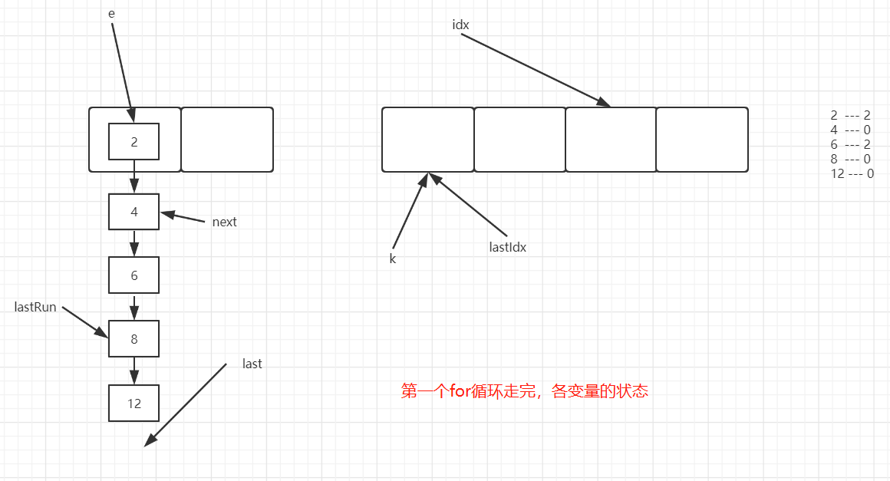
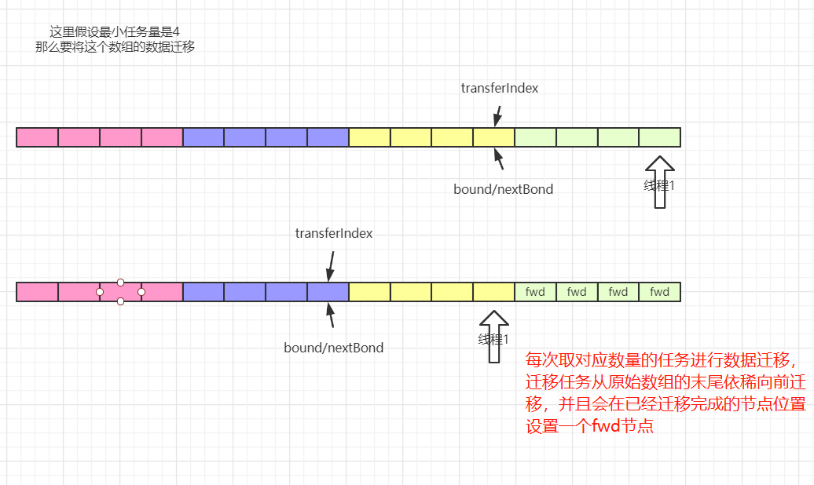
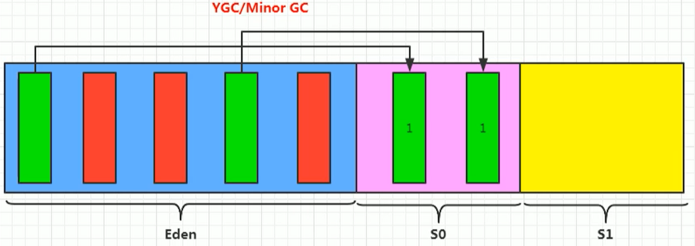
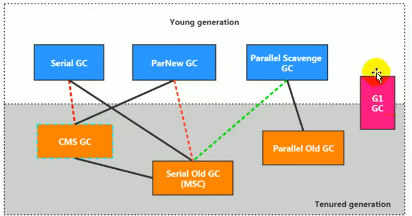
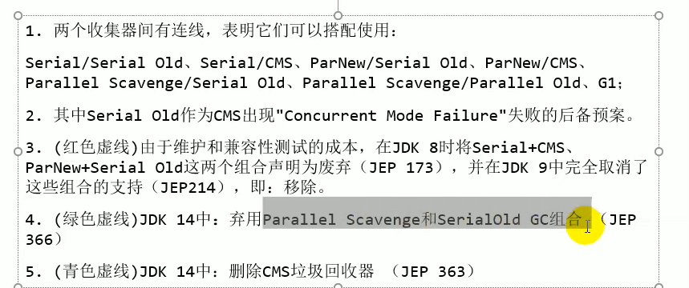
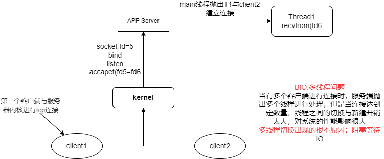

# Java

## 1.Java基础编程知识

### 1.1 Java关键字

特点：关键字中所有字母都是**小写**

> 用于定义数据类型的关键字

|  class  | interface | enum  |  byte  | short |
| :-----: | :-------: | :---: | :----: | :---: |
|   int   |   long    | float | double | char  |
| boolean |   void    |       |        |       |

> 用于定义流程控制的关键字

|   if   | else | switch | case  | default  |
| :----: | :--: | :----: | :---: | :------: |
| while  |  do  |  for   | break | continue |
| return |      |        |       |          |

> 其他关键字

| native | strictfp | transient | volatile | assert |
| ------ | -------- | --------- | -------- | ------ |

标识符的使用

+ 由26个英文字符大小写，0-9，_和$组成
+ 数字不可以开头
+ 不可以使用关键字和保留字，但是可以包含关键字和保留字
+ Java中严格区分大小写，长度无限制
+ 标识符中不能包含空格

```java
retry: // 标记外层for循环
for(; ;){
    for (; ;){

        break retry; // 跳出最外层的for循环
    }
}
```


### 1.2 变量的分类

**八种基本数据类型**

+ 基本数据类型
  + 数值型
    + 整数型：byte, short, int, long
    + 浮点型：float, double
  + 字符型：char
  + 布尔型：boolean
+ 引用数据类型
  + 类(class)
  + 接口(interface)
  + 数组([])

详细说明：

+ 整型：byte(1字节=8bit) , short(2字节), int(4字节), long(8字节)

byte: -2^7 ~ 2^7 - 1

short: -2^15 ~ 2^15 - 1

int：-2^31 ~ 2^31 - 1

long： -2^63 ~ 2^63 - 1

+ 浮点型：float(4字节), double(8字节)

  + float：2^-149 ~ 2^128 - 1 **(-1)^S\*[2^(E-127)]\*1.M**

    其中-149的来历，指数位全为0，即指数值为-127，这个时候尾数取最小，2^(-23)，即-127-23=-150，全0和全1为特殊值，不作为范围内的值，故取-149

  + double：2^-1074 ~ 2^1024 - 1 **(-1)^S\*[2^(E-1023)]\*1.M**

  

**关于浮点型float和double的补充说明：**

+ 在java编程语言中浮点数默认的是double型，如果要使用float需要在小数后加上f
+ double和float在运算中，**可能**会出现舍入误差

补充：


### 1.3 对面向对象的理解

**面向对象的三大特性：封装，继承，多态**

①为什么要设计封装性？

首先，我们的程序设计追求“高内聚，低耦合”

+ 高内聚：类的内部数据操作细节自己完成，不允许外部干涉
+ 低耦合：仅对外暴露少量的方法用于调用

其次，隐藏对象内部的复杂性，只对外公开简单的接口，便于外界调用，从而提高系统的可扩展性和可维护性。

最后，封装性的具体体现？

+ 将类的属性私有化，同时提供公共的获取和设置此属性的方法
+ 不对外暴露私有化方法，即外界无法调用类的内部私有方法，隐藏类的实现细节
+ 单例模式，即构造器私有化

②为什么要设计继承性？

​       继承是描述类与类之间的关系，通过继承，可以在无须重新编写原有类的情况下，对原有类的功能进行扩展。继承性不仅增强了代码的复用性，提高了开发效率，而且为程序的修改补充提供了便利。同时也为多态性的实现提供前提。

+ 子类A继承父类B后，类A就获取了父类B中的所有属性和方法。但是因为封装性，使得子类不能直接调用父类中的部分结构。
+ Java中的类是单继承：一个类只能有一个父类。

③为什么要设计多态性？

多态是父类的对象指向子类的对象，表现为方法的重写（注意与重载的区别），**是运行时行为**

+ 实现代码的通用性

具体体现：

+ 抽象类、接口的使用（抽象类和接口不能实例化）
+ Object类中定义的public boolean equals(Object obj){}

### 1.4 equals和==的区别

> equals和==区别(null哪个能用), 如果没有重写equals方法,那么a==b和a.equals(b)一样吗(2020字节提前批)

equals(): 方法

1. 是一个方法，而非运算符
2. 只能适用于引用数据类型
3. Object类中equals()的定义： public boolean equals(Object obj) { return (this == obj); }

- 说明：Object类中定义的equals()和==的作用是相同的：比较两个对象的地址值是否相同.即两个引用是否指向同一个对象实体

1. 像String、Date、File、包装类等都重写了Object类中的equals()方法。重写以后，比较的不是两个引用的地址是否相同，而是比较两个对象的"实体内容"是否相同。
2. 通常情况下，我们自定义的类如果使用equals()的话，也通常是比较两个对象的"实体内容"是否相同。那么，我们就需要对Object类中的equals()进行重写.重写的原则：比较两个对象的实体内容是否相同.

== ：运算符

1. 可以使用在基本数据类型变量和引用数据类型变量中
2. 如果比较的是基本数据类型变量：比较两个变量保存的数据是否相等。（不一定类型要相同）

- 如果比较的是引用数据类型变量：比较两个对象的地址值是否相同.即两个引用是否指向同一个对象实体
- 补充： == 符号使用时，必须保证符号左右两边的变量类型一致。

所以, ==可以判断对象为null, equals()不能, 如果该类没有重写equals方法, 则使用Object类的equals的方法, 而Object中的equals使用就是==判断

### 1.5 hashCode()和equals()函数

两个函数都是用来对比两个对象是否相等一致。

hashCode()

+ 在应用程序执行期间对同一个对象多次调用hashCode()方法时，返回的值必须相同。

+ 如果两个对象根据equals()方法相等，则对两个对象中的每个调用hashCode()方法必须产生相同的整数结果。
+ 如果根据equals()方法，两个对象不相等，则不需要对两个对象中的每个hashCode()方法都产生不同的整数结果（即两个对象hashCode值不同，两个对象也可能相等）

equals()：

```java
// Object对象中的equals()方法
public boolean equals(Object obj) {
        return (this == obj);
}
```

两个函数之间的区别：（性能和可靠性）

+ 重写Object对象中的equals()方法比较两个对象是否相等时，需要逐一对比对象中每个属性值是否相等，这样效率较低，而利用hashCode()方法只需要生成一个hash值即可，效率较高。
+ hashCode()方法的效率较高，为什么还需要equals()方法，因为hashCode()并不是绝对可靠的，所以我们在比较两个对象是否相等时，先比较两个对象的hashCode值是否相等，如果不相等则不需要进行下面比较了，如果相等再继续使用equals()判断对象的内部属性是否相等。在提高效率的同时，也保证了绝对的可靠性。

### 1.6 String的理解

> String三姐妹

String：不可变字符序列，底层采用final char[]存储

StringBuffer：可变字符序列， 线程安全，效率低， 底层采用transient char[]存储

StringBuilder：可变字符序列， jdk5.0新增， 线程不安全， 效率高， 底层采用char[]存储

**transient只能修饰变量，修饰后该变量不能被序列化**

**String**

+ String类声明为final, 不可被继承；可序列化并且可以比较大小
+ String内部定义了final char[] value用于存储字符串数据
+ 通过字面量的方式赋值(区别于new给一个字符串赋值，此时的字符串声明在字符串常量池中)
+ 字符串常量池中不会存储相同的字符串

**不可变性的说明**

+ 当对字符串重新进行赋值时，需要重新指定内存区域进行赋值，不能在原有的value内存区域覆盖
+ 当对现有的字符串进行连接操作时，也需要重新指定新的内存区域，不能使用原有的value进行赋值
+ 当调用String的replace()方法时修改指定的字符或者字符串时，也需要重新指定新的内存区域。

**字符串常量池中不会存储相同内容的字符串**

+ String的String Pool是一个固定大小的HashTable，默认值大小长度是1009。如果放进String Pool的String非常多，就会造成Hash冲突严重，从而导致链表非常长，而链表长了后直接造成的影响就是当调用String.intern时的性能下降。
+ 使用**-XX:StringTableSize**可以设置StringTable的长度

**字符串拼接操作**

+ 常量与常量的拼接结果放在常量池中，原理是编译期优化
+ 常量池中不会存在相同内容的常量
+ 只要其中一个是变量，结果就在堆中。变量拼接的原理是StringBuilder
+ 如果拼接的结果调用intern()方法，则主动将常量池中还没有的字符串对象放入池中，并返回此对象地址。

```java
@Test
public void test3(){
    String s1 = "a";
    String s2 = "b";
    String s3 = "ab";
    /*
    如下的s1 + s2的细节
    1、StringBuilder s = new StringBuilder();
    2、s.append("a");
    3、s.append("b");
    4、s.toString(); // 约等于new String("ab")
    */
    String s4 = s1 + s2;
    System.out.println(s3 == s4); // false
}
/*
通过StringBuilder的append方法的方式添加字符串的效率要远高于使用String的字符串拼接(+)方式
详情：① StringBuilder的append方法中，自始至终只创建了一个StringBuilder对象，
使用String拼接的方法过程中，会创建多个StringBuilder对象
②使用String拼接的方法过程：内存中创建了较多的StringBuilder和String对象，内存占用大；如果要进行垃圾回收会占用较多时间。

改进的方式：使用String的带参构造(基本知道字符串长度)，减少扩容带来的开销，提高效率。
*/
```

> intern的理解

如何保证变量s指向的是字符串常量池中的数据？

方式一：String s = "johncarraway";// 字面量定义的方式

方式二：String s = new String("johncarraway").intern();


> new String("ab")到底创建了几个对象

两个对象，看字节码

```java
public class StringNewTest{
    
    public static void main(String[] args) throws IOException{
        
        String str = new String("ab");
        /*
        共两个对象，一是行号0的new String()，在堆空间创建的
        二是行号4中的 字符串常量池中的对象"ab"
        */
    }
}
/*对应的字节码
 0 new #2 <java/lang/String>
 3 dup
 4 ldc #3 <ab>
 6 invokespecial #4 <java/lang/String.<init> : (Ljava/lang/String;)V>
 9 astore_1
10 return
*/
```

> new String("a") + new String("b")一共造了几个对象

```java
public class StringNewTest{
    
    public static void main(String[] args) throws IOException{
        
        String str = new String("a") + new String("b");
        /*
        对象1：new StringBuilder()
        对象2：new String("a")
        对象3：常量池中的对象"a"
        对象4：new String("b")
        对象5：常量池中的"b"
        如果有等号左边，则还会有第六个对象：StringBuilder的toString()方法
        对象6：return new String()
        强调，toString()的调用，在字符串常量池中，没有生成"ab"
        */
    }
}
/*对应的字节码
 0 new #2 <java/lang/StringBuilder>
 3 dup
 4 invokespecial #3 <java/lang/StringBuilder.<init> : ()V>
 7 new #4 <java/lang/String>
10 dup
11 ldc #5 <a>
13 invokespecial #6 <java/lang/String.<init> : (Ljava/lang/String;)V>
16 invokevirtual #7 <java/lang/StringBuilder.append : (Ljava/lang/String;)Ljava/lang/StringBuilder;>
19 new #4 <java/lang/String>
22 dup
23 ldc #8 <b>
25 invokespecial #6 <java/lang/String.<init> : (Ljava/lang/String;)V>
28 invokevirtual #7 <java/lang/StringBuilder.append : (Ljava/lang/String;)Ljava/lang/StringBuilder;>
31 invokevirtual #9 <java/lang/StringBuilder.toString : ()Ljava/lang/String;>
34 astore_1
35 return
*/
```

> 面试题

```java
public class StringIntern1{
    
    public static void main(String[] args) throws IOException{
        
        String s = new String("1");// 在堆空间和字符串常量池中均有一个对象"1"
        s.intern();// 此时调用此方法没有太大意义，在字符串常量池中已经存在对象"1"了
        String s2 = "1";
        System.out.println(s == s2);// jdk6:false  jdk7/8:false
        
        String s3 = new String("1") + new String("1");// s3记录的地址为：new String("11")在堆空间的地址
        // 上一步执行为在字符串常量池中是没有对象"11"的
        s4 = s3.intern();// 此步骤中字符串常量池中存在对象"11"了,如何理解：
        /*
        在jdk6中，使用上一行代码执行时，在常量池中生成"11"的地址
        在jdk7/8中，字符串常量池在堆空间中，我们在字符串常量池中创建"11"时，为了节省空间，保存的是堆空间中new String("11")的地址，所以s3==s4为true
        */
        System.out.println(s3 == s4);// jdk6:false  jdk7/8:true
    }
    
}
```

### 1.7 final和static关键字

static和final都不能被重写, 静态方法在编译期就被确定了, 所以不能被重写.

**final**

1. final 用来修饰一个类:此类不能被其他类所继承。比如：String类、System类、StringBuffer类
2. final 用来修饰方法：表明此方法不可以被重写比如：Object类中getClass()
3. final 用来修饰变量：此时的"变量"就称为是一个常量
4. final修饰属性：可以考虑赋值的位置：显式初始化、代码块中初始化、构造器中初始化
5. final修饰局部变量：尤其是使用final修饰形参时，表明此形参是一个常量。当我们调用此方法时，给常量形参赋一个实参。一旦赋值以后，就只能在方法体内使用此形参，但不能进行重新赋值。

**static**

**方便在没有创建对象的情况下进行调用(方法/变量)**

+ static修饰属性：静态变量（或类变量）
+ static修饰方法：静态方法
+ static修饰代码块：静态代码块
+ static修饰类：静态类(一般为静态内部类)

1. 修饰属性，是否使用static修饰，又分为：静态属性 vs 非静态属性(实例变量)
   + 实例变量(非静态)：我们创建了类的多个对象，每个对象都独立的拥一套类中的非静态属性。当修改其中一个对象中的非静态属性时，不会导致其他对象中同样的属性值的修改。 
   + 静态变量(静态)：我们创建了类的多个对象，多个对象共享同一个静态变量。当通过某一个对象修改静态变量时，会导致其他对象调用此静态变量时，是修改过了的。
   + **static是不允许用来修饰局部变量**
2. 修饰方法：static方法一般称作静态方法，由于静态方法不依赖于任何对象就可以进行访问，因此对于静态方法来说，是没有this的，因为它不依附于任何对象，既然都没有对象，就谈不上this了。
3. 修饰代码块：static块可以置于类中的任何地方，类中可以有多个static块。在类初次被加载的时候，会按照static块的顺序来执行每个static块，并且只会执行一次。
4. static修饰属性的其他说明： 
   + 静态变量随着类的加载而加载。可以通过"类.静态变量"的方式进行调用 
   + 静态变量的加载要早于对象的创建。
   + 由于类只会加载一次，则静态变量在内存中也只会存在一份：存在方法区的静态域中。

### 1.8 深拷贝与浅拷贝

> 浅拷贝：引用类型只复制引用

创建一个新对象，然后将当前对象的非静态字段复制到该新对象，如果字段是值类型的，那么对该字段执行复制；如果该字段是引用类型的话，则复制引用但不复制引用的对象。**因此，原始对象及其副本引用同一个对象**

>  深拷贝：所有属性都复制独立一份

创建一个新对象，然后将当前对象的非静态字段复制到该新对象，无论该字段是值类型的还是引用类型，都复制独立的一份。当你修改其中一个对象的任何内容时，都不会影响另一个对象的内容。

如何实现深拷贝？

Object类中提供的clone()方法只能实现浅拷贝

+ 让每个引用类型都重写clone()方法
+ 利用序列化：序列化是将对象写到流中便于传输，而反序列化则是把对象从流中读取出来。这里写到流中的对象则是原始对象的一个拷贝，因为原始对象还存在 JVM 中，所以我们可以利用对象的序列化产生克隆对象，然后通过反序列化获取这个对象。

```java
//深度拷贝
public Object deepClone() throws Exception{
    // 序列化
    ByteArrayOutputStream bos = new ByteArrayOutputStream();
    ObjectOutputStream oos = new ObjectOutputStream(bos);

    oos.writeObject(this);

    // 反序列化
    ByteArrayInputStream bis = new ByteArrayInputStream(bos.toByteArray());
    ObjectInputStream ois = new ObjectInputStream(bis);

    return ois.readObject();
}
```

### 1.9 值传递与引用传递的区别

|          | 值传递                 | 引用传递               |
| -------- | ---------------------- | ---------------------- |
| 根本区别 | 会创建副本(copy)       | 不创建副本             |
| 因此     | 函数中无法改变原始对象 | 函数中可以改变原始对象 |


### 1.10 接口和抽象类的区别

> abstract：可以修饰类或者方法

修饰类：抽象类

+ 此类不能实例化
+ 抽象类中一定有构造器，便于子类实例化时调用（涉及：子类对象实例化的全过程）
+ 开发中，都会提供抽象类的子类，让子类对象实例化，完成相关的操作 --->抽象的使用前提：继承性

修饰方法：抽象方法

+ 抽象方法只方法的声明，没方法体
+ 包含抽象方法的类，一定是一个抽象类。反之，抽象类中可以没有抽象方法的。
+ 若子类重写了父类中的所的抽象方法后，此子类方可实例化；若子类没重写父类中的所有的抽象方法，则此子类也是一个抽象类，需要使用abstract修饰

注意：

+ abstract不能用来修饰：属性、构造器等结构

+ abstract不能用来修饰私方法、静态方法、final的方法、final的类

具体应用：

IO流中涉及到的抽象类：InputStream/OutputStream / Reader /Writer。在其内部定义了抽象的read()、write()方法。

>  interface：接口

JDK7及以前：只能定义全局常量和抽象方法
 * 			全局常量：public static final的.但是书写时，可以省略不写
 * 			抽象方法：public abstract的

JDK8：除了定义全局常量和抽象方法之外，还可以定义静态方法、默认方法

**接口中不能定义构造器的！意味着接口不可以实例化**

Java类可以实现多个接口   --->弥补了Java单继承性的局限性

接口与接口之间可以继承，而且可以多继承

**接口的具体使用，体现多态性**


相同点：不能实例化；都可以包含抽象方法的。
不同点：

+ 把抽象类和接口(java7,java8,java9)的定义、内部结构解释说明

+ 类：单继承性    接口：多继承

   类与接口：多实现

### 1.11 重载和重写的区别

① 概念

重载:

**同一个类中**,相同的方法名;

不同的参数列表,包括**不同的参数类型**和**不同的参数个数**

重写:子类继承父类以后，可以对父类中同名同参数的方法，进行覆盖操作. 重写以后，当创建子类对象以后，通过子类对象调用子父类中的同名同参数的方法时，实际执行的是子类重写父类的方法。

② 重载和重写的规则

③ 重载: 不表现为多态性
重写: 表现为多态性

重载，是指允许存在多个同名方法，而这些方法的参数不同。编译器根据方法不同的参数表，对同名方法的名称做修饰。对于编译器而言，这些同名方法就成了不同的方法。它们的调用地址在编译期就绑定了。Java的重载是可以包括父类和子类的，即子类可以重载父类的同名不同参数的方法。 所以：对于重载而言，在方法调用之前，编译器就已经确定了所要调用的方法，这称为“早绑定”或“静态绑定”； 而对于多态，只等到方法调用的那一刻，解释运行器才会确定所要调用的具体方法，这称为“晚绑定”或“动态绑定”。


### 1.12 包装类

为什么引入包装类？

**为了使基本数据类型的变量具有类的特征，引入包装类。**

包装类是什么？

| 基本数据类型 | 包装类    |
| ------------ | --------- |
| byte         | Byte      |
| short        | Short     |
| int          | Integer   |
| long         | Long      |
| float        | Float     |
| Double       | Double    |
| char         | Character |
| boolean      | Boolean   |

其中，Byte,Short,Integer,Long,Float,Double的父类都是Number

类型间的转换：(基本数据类型，包装类，String)


装箱：基本数据类型 -> 包装类，通过调用对应的包装类的构造方法，如Integer t = new Integer(1);

自动装箱：如Integer s = 10;

拆箱：包装类 -> 基本数据类型，通过调用对应包装类的xxxValue()方法

自动拆箱：int s = new Integer(1);

**String--->基本数据类型、包装类:调用包装类的parseXxx(String s)**


### 1.13 java.lang.Object

1.Object类是所Java类的根父类

2.如果在类的声明中未使用extends关键字指明其父类，则默认父类为java.lang.Object类 

3.Object类中的功能(属性、方法)就具通用性。

+ 属性：无
+ 方法(9个方法)：equals() / toString() / getClass() /hashCode() / clone() / finalize() / wait() 、 notify()、notifyAll()

+ Object类只声明了一个空参的构造器

拓展：final, finally, finalize的区别？

+ final 是Java语言中的一个关键字

+ finally 是try catch finally中的一部分

+ finalize 是java.lang.Object类中的一个方法,用来销毁内存中没有指针指向的对象,一般不显示调用,而是有Java的垃圾回收器自行调用.

### 1.14 异常类型及常见的异常

```java
java.lang.Throwable
  |-----java.lang.Error:一般不编写针对性的代码进行处理。
  |-----java.lang.Exception:可以进行异常的处理
      |------编译时异常(checked)
        |-----IOException
        |-----FileNotFoundException
        |-----ClassNotFoundException
      |------运行时异常(unchecked,RuntimeException)
        |-----NullPointerException
        |-----ArrayIndexOutOfBoundsException
        |-----ClassCastException
        |-----NumberFormatException
        |-----InputMismatchException
        |-----ArithmeticException
```

try catch能捕获到java.lang.Exception

编程中常见的异常有哪些？

- java.lang.OutOfMemoryError：内存不足错误。当可用内存不足以让Java虚拟机分配给一个对象时抛出该错误。 
- java.lang.StackOverflflowError：堆栈溢出错误。当一个应用递归调用的层次太深而导致堆栈溢出或者陷入死循环时抛出该错误。


### 1.15 List、Set和Map的区别

Collection接口：单列接口用来存储一个一个的对象

+ List接口：存储有序的、可重复的数据，如ArrayList、LinkedList和Vector
+ Set接口：存储无序的的、不可重复的数据，如HashSet、LinkedHashSet和TreeSet


ArrayList、LinkedList和Vector的异同点及使用场景？

相同点: 三者都是实现了List接口，存储数据的特点的相同：存储有序的、可重复的数据
不同点:
ArrayList:是List的主要实现类，线程不安全、效率高；底层使用Object[] elementData存储.
源码分析(jdk1.8):ArrayList list = new ArrayList()初始化时(没有添加元素之前)底层是只是新建一个空的Object[]对象数组,当开始add数据的时候,则新建一个长度为10的默认Object[]对象数组,用来保存数据,当添加到超过数据长度是,开始扩容, 默认情况是扩容为当前数组长度的1.5倍,同时将原来数组中的数据复制到当前数组. 而(jdk1.7)在初始化时候就建立默认长度的Object[]对象数组,其他的过程和jdk1.8一样.

LinkedList: 底层使用双向链表存储，对于频繁的插入和删除操作，使用此类效率比ArrayList高.
源码分析(jdk1.8):LinkedList list = new LinkedList()初始化时,在内部声明了一个内部类Node节点,维护的是一个双链表结构,每一次add操作都是将该对象封装到Node节点中.

Vector:作为List接口的古老实现类；线程安全、效率低；底层使用Object[] elementData存储.
源码分析:jdk7和jdk8中通过Vector()构造器创建对象时，底层都创建了长度为10的数组在扩容方面，默认扩容为原来的数组长度的2倍。

> 谈一谈HashSet

底层就是一个Map集合，Map<E, Object> map, 是一个存储数据的集合，**存储的数据特点：无序的、不可重复的元素**

+ 无序性：不等于随机性。存储的数据在底层数组中并非照数组索引的顺序添加，而是根据数据的哈希值决定的
+ 不可重复性：保证添加的元素按照equals()判断时，不能返回true.即：相同的元素只能添加一个。


TreeSet:
1.自然排序中，比较两个对象是否相同的标准为：compareTo()返回0.不再是equals().
2.定制排序中，比较两个对象是否相同的标准为：compare()返回0.不再是equals().


> 谈一谈HashMap

HashMap底层源码解析(jdk1.7)

​      从元素的存放位置开始谈起，HashMap底层创建一个长度为16的数组用来保存数据，每个元素添加时根据hash值确定该元素的存放位置，如果该位置没有存放元素，则添加成功，否则在该位置上形成链表，存储存在hash冲突的元素。如果冲突位置的链表太长，导致查询的效率较低，如何让存取效率更高呢？

如果每个元素均存储在对应的角标位，即不存在hash冲突。

+ 尽可能的减少hash冲突：hash函数计算出的位置尽可能的均匀

```java
static int indexFor(int h, int length) {
	return h & (length-1); //length是map中数组的长度
}
```

其中**length**的长度规则：2的幂次方，为什么？

```java
public class HashMap<K,V> extends AbstractMap<K,V>
    implements Map<K,V>, Cloneable, Serializable {
 	
    /* 
    初始化数组的容量，为什么是2^4不是其他的非2的整次幂数，如19,21等
    因为在计算当前元素的位置i时,需要利用&运算
    i = hash % m 但是求余的效率低，不如与运算效率高
    我们可以将求余操作转换为与运算，如数组长度16，当前元素的hash值为11，7
    11:0000 1011
       0000 1111 &
       0000 1011 = 11
     9:0000 1001
       0000 1111 &
       0000 0111 = 9
    通过与操作可以很快求出元素的位置，并且保证不同的hash值得到不同的位置i
    如果选择的值不是2的整次幂，如13
    11:0000 1011
       0000 1101 &
       0000 1001 = 9
     9:0000 1001
       0000 1101 &
       0000 1001 = 9
    很容易就产生了哈希冲突，哈希表的空间利用率较低
    */
    static final int DEFAULT_INITIAL_CAPACITY = 1 << 4; // aka 16
    
    // 数组的最大容量
    static final int MAXIMUM_CAPACITY = 1 << 30;
    
    /*
    默认的加载因子，为什么不是0.5或者1或者其他小于1的数字
    假设为1,那么数组需要等到全部填满时才进行扩容，这样数组的空间利用率提高了，但是哈希碰撞的次数增加，使得链表的长度加长
    假设为0.5，那么数组的利用率比较低，只填一半就开始扩容了，空间利用率低，但是减少了哈希碰撞
    所以，经过学者的大量统计分析得出0.75是平衡空间利用率和哈希碰撞的最好参数
    */
    static final float DEFAULT_LOAD_FACTOR = 0.75f;
    // 链表进行树化时的最小长度
    static final int TREEIFY_THRESHOLD = 8;
    // 树转化为链表的临界值
    static final int UNTREEIFY_THRESHOLD = 6;
    // 主数组上的链表转化为树时，数组的最小长度
    static final int MIN_TREEIFY_CAPACITY = 64;
    // 静态内部类(嵌套类)：Node节点的数据结构
    static class Node<K,V> implements Map.Entry<K,V> {
        final int hash;
        final K key;
        V value;
        Node<K,V> next;
    }
    // 定义主数组
    transient Node<K,V>[] table;
    // 已经修改的元素个数
    transient int modCount;
    // table中已经放入元素的个数
    transient int size;
    // table数组的大小
    int threshold;
    // 加载因子
    final float loadFactor;
    
}
```

+ 确实产生了hash冲突：扩容+数据结构(提高查询和插入效率)

> ①**通过扩容解决hash冲突**

**什么时候扩容？**

JDK1.7 

判断当前数据容量是否达到阈值(0.75*数组长度)，同时判断当前添加元素是否产生hash冲突

JDK1.8

先添加元素，再判断是否达到阈值

**怎样扩容？**

JDK1.7

添加元素的时候，采用头插法，同时将单向链表的数据进行迁移

JDK1.8

添加元素采用尾插法

​	如果对应角标位置是单链表，则将单链表进行数据迁移

​	如果对应角标位置是红黑树，则将双向链表进行迁移，如果迁移完后双向链表的长度小于等于6，则会将红黑树转换成单向链表

**HashMap(JDK1.8)在扩容的时候，会维护两个结构，如果当前桶上是链表，可以直接迁移数据，如果当前桶上是红黑树，则会迁移红黑树上的双向链表(因为直接迁移红黑树非常的复杂)**

>  为什么底层使用数组+链表+红黑树，不使用AVL树或者普通二叉树？

普通的二叉树在插入过程中个，可能造成节点都在树的左子树或者右子树，使得二叉树退化成链表，查询效率依旧很低

平衡二叉树，通过减少树的高度，每次插入时保证左右子树的高度差不大于1，解决了树的单一侧节点过多导致的查询效率低。但是平衡二叉树，牺牲了插入性能(如果左右子树不平衡，会进行左旋或者右旋，使得插入效率低)，使得查询性能变高。

红黑树，是在插入性能和查询性能之间做了一个平衡，使得插入效率不是很低，同时保证了查询效率较高


红黑树主要是在平衡二叉树和二叉搜索树之间的一个平衡，使得插入效率与查询效率都较高，减少因为插入效率低或者查询效率低对算法性能的影响。

常见操作

查找前驱节点：小于当前节点的最大值

查找后继节点：大于当前节点的最小值


红黑树是黑色节点平衡，从根节点到叶子节点的所有路径中黑色节点的个数是相等的。

红黑树的5大性质：

1. 节点都是红色或者黑色
2. 根节点是黑色
3. 所有叶子节点都是黑色
4. 每个红色节点必须有两个黑色节点（从每个叶子节点到根的所有路径上不能有两个连续的红色节点）
5. 从任一节点到其每个叶子节点的所有简单路径都包含相同数目的黑色节点（黑色平衡）


```java
/* 
扩容时，元素的hash值存在两种情况
情况1.保持不变，在原来的位置上
情况2.发生改变，在原位置的基础上，加上扩容的长度，如原来数组长度是8，扩容为16，则加上的数为8
JDK1.8扩容时的操作：
通过高、低位两个指针整体迁移数据
loHead 记录情况1的首位，loTail记录情况1的末位
hiHead 记录情况2的首位，loTail记录情况2的末位
*/
Node<K,V> loHead = null, loTail = null;
Node<K,V> hiHead = null, hiTail = null;
Node<K,V> next;
    do {
        next = e.next;
        if ((e.hash & oldCap) == 0) {// if条件成立，表示情况1
            if (loTail == null)
                loHead = e;
            else
                loTail.next = e;
            loTail = e;
        }
        else {// if条件不成立，表示情况2
            if (hiTail == null)
                hiHead = e;
            else
                hiTail.next = e;
            hiTail = e;
        }
    } while ((e = next) != null);
    if (loTail != null) {
        loTail.next = null;
        newTab[j] = loHead;
    }
	if (hiTail != null) {
    hiTail.next = null;
    newTab[j + oldCap] = hiHead;
	}
}
```


**扩容过程中存在的问题？**

单线程环境下，扩容不存在问题

多线程环境下

JDK1.7：产生环形链表，主要因为头插法会出现倒序的现象，当一个线程正在准备迁移数据，此时CPU资源被另一个线程抢夺，并完成数据迁移，上一个线程重新获取CPU资源后，会形成环形链表。

JDK1.8：会出现数据丢失现象

> ②**通过数据结构解决哈希冲突**

JDK1.7：如果当前位置出现hash冲突，通过形成单向链表解决冲突问题

JDK1.8：出现冲突时，会形成单向链表，如果单向链表长度超过8时，会转换成红黑树和双向链表(扩容时使用)


HashMap添加元素过程简要概述

```java
从JDK 1.7开始说起:
HashMap map = new HashMap()开始在底层创建一个长度为16的Entry[] 数组.在此之前已经
put(key, value)多次,直到本次map.put(key1, value1),首先通过所在类的hashCode()计算哈希值，
即该条数据在Entry[]数组中位置：
  如果该哈希值对应Entry[]数组的位置为空，则插入成功 --> 情况1
  如果该哈希值对应Entry[]数组的位置不为空(可能存在一条数据或者一个链表),开始对比
  (key1, value1)的哈希值与该位置上所有元素的哈希值:
      如果(key1, value1)与该位置上所有元素的哈希值均不相同，则插入成功 --> 情况2
      如果(key1, value1)与该位置上的某条数据(key2, value2)的哈希值相等，则开始比较key1.value.equals(key2.value):
          如果equals返回false，则添加成功 --> 情况3
          如果equals返回true,则用value2替换value1
说明: 情况2和情况3(key1, value1)都是采用链表方式存储.
补充JDK 1.8:
1.new HashMap()的时候不会一开始就创建一个长度为16的数组，只有在第一次put()操作后，才创建数组。
2.JDK 1.8底层使用的数组是Node[],而非Entry[]
3.JDK 1.7底层使用的是数组+链表, JDK 1.8使用的是数组+链表+红黑树
4.JDK 1.7的链表采用的是头插法，JDK 1.8的链表采用的是尾插法。
5.JDK 1.8中当链表长度大于8，并且Node[]数组长度大于64时，链表转换成红黑树。
在不断添加的过程中会涉及到扩容问题，当数组中位置使用超过临界值且下一个存储的位置不空的时候，
将数组长度扩容为原来的两倍，并且把原数组复制到新的数组中。
HashMap底层典型属性的属性的说明：
DEFAULT_INITIAL_CAPACITY : HashMap的默认容量，16
DEFAULT_LOAD_FACTOR：HashMap的默认加载因子：0.75
threshold：扩容的临界值，=容量*填充因子：16 * 0.75 => 12
TREEIFY_THRESHOLD：Bucket中链表长度大于该默认值，转化为红黑树:8
MIN_TREEIFY_CAPACITY：桶中的Node被树化时最小的hash表容量:64
```


**为了解决HashMap在多线程下的并发安全问题，出现ConcurrentHashMap**

> 谈一谈ConcurrentHashMap

ConcurrentHashMap源码解析(JDK1.7)

从无参构造开始说起

```java
//空参构造
public ConcurrentHashMap() {
    //调用本类的带参构造
    //DEFAULT_INITIAL_CAPACITY = 16
    //DEFAULT_LOAD_FACTOR = 0.75f
    //int DEFAULT_CONCURRENCY_LEVEL = 16
    this(DEFAULT_INITIAL_CAPACITY, DEFAULT_LOAD_FACTOR, DEFAULT_CONCURRENCY_LEVEL);
}
```


> Segment是什么

```java
static class Segment<K,V> extends ReentrantLock implements Serializable {
    private static final long serialVersionUID = 2249069246763182397L;
    final float loadFactor;
    Segment(float lf) { this.loadFactor = lf; }
}
```

我们发现Segment是继承自ReentrantLock的，它可以实现同步操作，从而保证多线程下的安全。因为每个Segment之间的锁互不影响，所以我们也将ConcurrentHashMap中的这种锁机制称之为**分段锁**，这比HashTable的线程安全操作高效的多。

> HashEntry是什么

```java
//ConcurrentHashMap中真正存储数据的对象
static final class HashEntry<K,V> {
    final int hash; //通过运算，得到的键的hash值
    final K key; // 存入的键
    volatile V value; //存入的值
    volatile HashEntry<K,V> next; //记录下一个元素，形成单向链表

    HashEntry(int hash, K key, V value, HashEntry<K,V> next) {
        this.hash = hash;
        this.key = key;
        this.value = value;
        this.next = next;
    }
}
```

>  ConcurrentHashMap(JDK1.7)如何保证多线程环境下添加安全？

**ConcurrentHashMap的put()方法**

```java
public V put(K key, V value) {
    Segment<K,V> s;
    if (value == null)// hashmap中的value不能为null
        throw new NullPointerException();
    //基于key，计算hash值
    int hash = hash(key);
    //因为一个键要计算两个数组的索引，为了避免冲突，这里取高位计算Segment[]的索引
    int j = (hash >>> segmentShift) & segmentMask;
    //判断该索引位的Segment对象是否创建，没有就创建
    if ((s = (Segment<K,V>)UNSAFE.getObject          // nonvolatile; recheck
         (segments, (j << SSHIFT) + SBASE)) == null) //  in ensureSegment
        s = ensureSegment(j);
    //调用Segmetn的put方法实现元素添加
    return s.put(key, hash, value, false);
}
```

**ConcurrentHashMap的ensureSegment()方法**

```java
//创建对应索引位的Segment对象，并返回
private Segment<K,V> ensureSegment(int k) {
    final Segment<K,V>[] ss = this.segments;
    long u = (k << SSHIFT) + SBASE; // raw offset
    Segment<K,V> seg;
    //获取，如果为null，即创建
    if ((seg = (Segment<K,V>)UNSAFE.getObjectVolatile(ss, u)) == null) {
        //以0角标位的Segment为模板
        Segment<K,V> proto = ss[0]; // use segment 0 as prototype
        int cap = proto.table.length;
        float lf = proto.loadFactor;
        int threshold = (int)(cap * lf);
        HashEntry<K,V>[] tab = (HashEntry<K,V>[])new HashEntry[cap];
        //获取，如果为null，即创建
        if ((seg = (Segment<K,V>)UNSAFE.getObjectVolatile(ss, u))
            == null) { // recheck
            //创建
            Segment<K,V> s = new Segment<K,V>(lf, threshold, tab);
            //自旋方式，将创建的Segment对象放到Segment[]中，确保线程安全
            while ((seg = (Segment<K,V>)UNSAFE.getObjectVolatile(ss, u))
                   == null) {
                if (UNSAFE.compareAndSwapObject(ss, u, null, seg = s))
                    break;
            }
        }
    }
    //返回
    return seg;
}
```

**Segment的put()方法**

```java
final V put(K key, int hash, V value, boolean onlyIfAbsent) {
    //尝试获取锁，获取成功，node为null，代码向下执行
    //如果有其他线程占据锁对象，那么去做别的事情，而不是一直等待，提升效率
    //scanAndLockForPut 稍后分析
    HashEntry<K,V> node = tryLock() ? null :
        scanAndLockForPut(key, hash, value);
    V oldValue;
    try {
        HashEntry<K,V>[] tab = table;
        //取hash的低位，计算HashEntry[]的索引
        int index = (tab.length - 1) & hash;
        //获取索引位的元素对象
        HashEntry<K,V> first = entryAt(tab, index);
        for (HashEntry<K,V> e = first;;) {
            //获取的元素对象不为空
            if (e != null) {
                K k;
                //如果是重复元素，覆盖原值
                if ((k = e.key) == key ||
                    (e.hash == hash && key.equals(k))) {
                    oldValue = e.value;
                    if (!onlyIfAbsent) {
                        e.value = value;
                        ++modCount;
                    }
                    break;
                }
                //如果不是重复元素，获取链表的下一个元素，继续循环遍历链表
                e = e.next;
            }
            else { //如果获取到的元素为空
                //当前添加的键值对的HashEntry对象已经创建
                if (node != null)
                    node.setNext(first); //头插法关联即可
                else
                    //创建当前添加的键值对的HashEntry对象
                    node = new HashEntry<K,V>(hash, key, value, first);
                //添加的元素数量递增
                int c = count + 1;
                //判断是否需要扩容
                if (c > threshold && tab.length < MAXIMUM_CAPACITY)
                    //需要扩容
                    rehash(node);
                else
                    //不需要扩容
                    //将当前添加的元素对象，存入数组角标位，完成头插法添加元素
                    setEntryAt(tab, index, node);
                ++modCount;
                count = c;
                oldValue = null;
                break;
            }
        }
    } finally {
        //释放锁
        unlock();
    }
    return oldValue;
}
```

**Segment的scanAndLockForPut()方法**

该方法在线程没有获取到锁的情况下，去完成HashEntry对象的创建，提升效率

```java
private HashEntry<K,V> scanAndLockForPut(K key, int hash, V value) {
    //获取头部元素
    HashEntry<K,V> first = entryForHash(this, hash);
    HashEntry<K,V> e = first;
    HashEntry<K,V> node = null；
    int retries = -1; // negative while locating node
    while (!tryLock()) {
        //获取锁失败
        HashEntry<K,V> f; // to recheck first below
        if (retries < 0) {
            //没有下一个节点，并且也不是重复元素，创建HashEntry对象，不再遍历
            if (e == null) {
                if (node == null) // speculatively create node
                    node = new HashEntry<K,V>(hash, key, value, null);
                retries = 0;
            }
            else if (key.equals(e.key))
                //重复元素，不创建HashEntry对象，不再遍历
                retries = 0;
            else
                //继续遍历下一个节点
                e = e.next;
        }
        else if (++retries > MAX_SCAN_RETRIES) {
            //如果尝试获取锁的次数过多，直接阻塞
            //MAX_SCAN_RETRIES会根据可用cpu核数来确定
            lock();
            break;
        }
        else if ((retries & 1) == 0 &&
                 (f = entryForHash(this, hash)) != first) {
            //如果期间有别的线程获取锁，重新遍历
            e = first = f; // re-traverse if entry changed
            retries = -1;
        }
    }
    return node;
}
```

**总结：首先，采用加锁的机制保证多线程下的并发安全，当多个线程操作同一个冲突位置时，只有第一个获取到锁的线程操作该位置，其他线程自旋等待，如果自旋次数超过最大自旋次数则阻塞等待；其次，为了提高多线程下的效率，采用分段锁机制，加锁的时候只针对冲突位置进行加锁，其他未加锁的位置上仍然可以进行操作。**

> ConcurrentHashMap(JDK1.7)如何保证扩容安全？

此处的rehash方法时在包含锁的方法内，所以是线程安全的

```java
private void rehash(HashEntry<K,V> node) {
    HashEntry<K,V>[] oldTable = table;
    int oldCapacity = oldTable.length;
    //两倍容量
    int newCapacity = oldCapacity << 1;
    threshold = (int)(newCapacity * loadFactor);
    //基于新容量，创建HashEntry数组
    HashEntry<K,V>[] newTable =
        (HashEntry<K,V>[]) new HashEntry[newCapacity];
    int sizeMask = newCapacity - 1;
   	//实现数据迁移
    for (int i = 0; i < oldCapacity ; i++) {
        HashEntry<K,V> e = oldTable[i];
        if (e != null) {
            HashEntry<K,V> next = e.next;
            int idx = e.hash & sizeMask;
            if (next == null)   //  Single node on list
                //原位置只有一个元素，直接放到新数组即可
                newTable[idx] = e;
            else { // Reuse consecutive sequence at same slot
                //=========图一=====================
                HashEntry<K,V> lastRun = e;
                int lastIdx = idx;
                for (HashEntry<K,V> last = next;
                     last != null;
                     last = last.next) {
                    int k = last.hash & sizeMask;
                    if (k != lastIdx) {
                        lastIdx = k;
                        lastRun = last;
                    }
                }
                //=========图一=====================
                
                //=========图二=====================
                newTable[lastIdx] = lastRun;
                //=========图二=====================
                // Clone remaining nodes
                //=========图三=====================
                for (HashEntry<K,V> p = e; p != lastRun; p = p.next) {
                    V v = p.value;
                    int h = p.hash;
                    int k = h & sizeMask;
                    HashEntry<K,V> n = newTable[k];
                    //这里旧的HashEntry不会放到新数组
                    //而是基于原来的数据创建了一个新的HashEntry对象，放入新数组
                    newTable[k] = new HashEntry<K,V>(h, p.key, v, n);
                }
                //=========图三=====================
            }
        }
    }
    //采用头插法，将新元素加入到数组中
    int nodeIndex = node.hash & sizeMask; // add the new node
    node.setNext(newTable[nodeIndex]);
    newTable[nodeIndex] = node;
    table = newTable;
}
```

> 图1



> 图2


> 图3


带有三个参数的构造函数：一些非核心逻辑的代码已经省略

```java
//initialCapacity 定义ConcurrentHashMap存放元素的容量
//concurrencyLevel 定义ConcurrentHashMap中Segment[]的大小
public ConcurrentHashMap(int initialCapacity,
                         float loadFactor, int concurrencyLevel) {
   
    int sshift = 0;
    int ssize = 1;
    //计算Segment[]的大小，保证是2的幂次方数
    while (ssize < concurrencyLevel) {
        ++sshift;
        ssize <<= 1;
    }
    //这两个值用于后面计算Segment[]的角标
    this.segmentShift = 32 - sshift;
    this.segmentMask = ssize - 1;
    
    //计算每个Segment中存储元素的个数
    int c = initialCapacity / ssize;
    if (c * ssize < initialCapacity)
        ++c;
    //最小Segment中存储元素的个数为2
    int cap = MIN_SEGMENT_TABLE_CAPACITY;
    //矫正每个Segment中存储元素的个数，保证是2的幂次方，最小为2
    while (cap < c)
        cap <<= 1;
    //创建一个Segment对象，作为其他Segment对象的模板
    // Segment是继承ReentrantLock对象，所以Segment本质是一个锁对象，即分段锁
    Segment<K,V> s0 =
        new Segment<K,V>(loadFactor, (int)(cap * loadFactor),
                         (HashEntry<K,V>[])new HashEntry[cap]);
    Segment<K,V>[] ss = (Segment<K,V>[])new Segment[ssize];
    //利用Unsafe类，将创建的Segment对象存入0角标位置
    UNSAFE.putOrderedObject(ss, SBASE, s0); // ordered write of segments[0]
    this.segments = ss;
}
```

**综上：ConcurrentHashMap中保存了一个默认长度为16的Segment[]，每个Segment元素中保存了一个默认长度为2的HashEntry[]，我们添加的元素，是存入对应的Segment中的HashEntry[]中。所以ConcurrentHashMap中默认元素的长度是32个，而不是16个**


> ConcurrentHashMap(JDK1.7)中如何保证获取集合中元素个数并发安全

通过多次获取当前集合元素中的个数，如果存在多个线程同时添加或者删除集合中的元素，size会发生变化，所以多次获取的结果不一样，如果前后两次获取的size大小一样，则返回当前的size

```java
public int size() {
    // Try a few times to get accurate count. On failure due to
    // continuous async changes in table, resort to locking.
    final Segment<K,V>[] segments = this.segments;
    int size;
    boolean overflow; // true if size overflows 32 bits
    long sum;         // sum of modCounts
    long last = 0L;   // previous sum
    int retries = -1; // first iteration isn't retry
    try {
        for (;;) {
            //当第4次走到这个地方时，会将整个Segment[]的所有Segment对象锁住
            if (retries++ == RETRIES_BEFORE_LOCK) {
                for (int j = 0; j < segments.length; ++j)
                    ensureSegment(j).lock(); // force creation
            }
            sum = 0L;
            size = 0;
            overflow = false;
            for (int j = 0; j < segments.length; ++j) {
                Segment<K,V> seg = segmentAt(segments, j);
                if (seg != null) {
                    //累加所有Segment的操作次数
                    sum += seg.modCount;
                    int c = seg.count;
                    //累加所有segment中的元素个数 size+=c
                    if (c < 0 || (size += c) < 0)
                        overflow = true;
                }
            }
            //当这次累加值和上一次累加值一样，证明没有进行新的增删改操作，返回sum
            //第一次last为0，如果有元素的话，这个for循环最少循环两次的
            if (sum == last)
                break;
            //记录累加的值
            last = sum;
        }
    } finally {
        //如果之前有锁住，解锁
        if (retries > RETRIES_BEFORE_LOCK) {
            for (int j = 0; j < segments.length; ++j)
                segmentAt(segments, j).unlock();
        }
    }
    //溢出，返回int的最大值，否则返回累加的size
    return overflow ? Integer.MAX_VALUE : size;
}
```


**ConcurrentHashMap源码解析(JDK1.8)**


从构造函数开始谈起，JDK1.8在初始化对象时，均没有对初始数组大小进行初始化，**数组的初始化在第一次添加元素的时候进行的。**

```java
//没有维护任何变量的操作，如果调用该方法，数组长度默认是16
public ConcurrentHashMap() {
}
```


```java
//传递进来一个初始容量，ConcurrentHashMap会基于这个值计算一个比这个值大的2的幂次方数作为初始容量
public ConcurrentHashMap(int initialCapacity) {
    if (initialCapacity < 0)
        throw new IllegalArgumentException();
    int cap = ((initialCapacity >= (MAXIMUM_CAPACITY >>> 1)) ?
               MAXIMUM_CAPACITY :
               tableSizeFor(initialCapacity + (initialCapacity >>> 1) + 1));
    /*
    上一行代码中，会将传递过来的initialCapacity变成大于initialCapacity最小的2的整数次幂
    如initialCapacity=15，则15+7+1=23，最后数组的大小为大于23的最小2的整数次幂，即32
    */
    this.sizeCtl = cap;
}
```


**重要！重要！重要！`sizeCtl`含义解释**

注意：以上这些构造方法中，都涉及到一个变量`sizeCtl`，这个变量是一个非常重要的变量，而且具有非常丰富的含义，它的值不同，对应的含义也不一样，这里我们先对这个变量不同的值的含义做一下说明，后续源码分析过程中，进一步解释

`sizeCtl`为0，代表数组未初始化， 且数组的初始容量为16

`sizeCtl`为正数，如果数组未初始化，那么其记录的是数组的初始容量，如果数组已经初始化，那么其记录的是数组的扩容阈值

`sizeCtl`为-1，表示数组正在进行初始化

`sizeCtl`小于0，并且不是-1，表示数组正在扩容， -(1+n)，表示此时有n个线程正在共同完成数组的扩容操作


> 初始化过程如何保证多线程并发安全？

**ConcurrentHashMap(JDK1.8)的initTable()方法**

```java
private final Node<K,V>[] initTable() {
    Node<K,V>[] tab; int sc;
    //cas+自旋，保证线程安全，对数组进行初始化操作
    while ((tab = table) == null || tab.length == 0) {
        //如果sizeCtl的值（-1）小于0，说明此时正在初始化， 让出cpu
        if ((sc = sizeCtl) < 0)
            Thread.yield(); // lost initialization race; just spin
        //cas修改sizeCtl的值为-1，修改成功，进行数组初始化，失败，继续自旋
        else if (U.compareAndSwapInt(this, SIZECTL, sc, -1)) {
            try {
                if ((tab = table) == null || tab.length == 0) {
                    //sizeCtl为0，取默认长度16，否则去sizeCtl的值
                    int n = (sc > 0) ? sc : DEFAULT_CAPACITY;
                    @SuppressWarnings("unchecked")
                    //基于初始长度，构建数组对象
                    Node<K,V>[] nt = (Node<K,V>[])new Node<?,?>[n];
                    table = tab = nt;
                    //计算扩容阈值，并赋值给sc
                    sc = n - (n >>> 2);
                }
            } finally {
                //将扩容阈值，赋值给sizeCtl
                sizeCtl = sc;
            }
            break;
        }
    }
    return tab;
}
```

**总结：sizeCtl为-1时表示正在初始化数组大小。如果sizeCtl为-1表示正在初始化，让出线程占用的资源；否则，如果第9行修改sizeCtl失败，则会继续进入while循环，进行比较和修改sizeCtl，即通过CAS+自旋的方式来确保多线程下并发安全。**


**添加元素的方法put()/putVal()方法**

```java
public V put(K key, V value) {
    return putVal(key, value, false);
}
```


```java
final V putVal(K key, V value, boolean onlyIfAbsent) {
    //如果有空值或者空键，直接抛异常
    if (key == null || value == null) throw new NullPointerException();
    //基于key计算hash值，并进行一定的扰动
    int hash = spread(key.hashCode());
    //记录某个桶上元素的个数，如果超过8个，会转成红黑树
    int binCount = 0;
    for (Node<K,V>[] tab = table;;) {
        Node<K,V> f; int n, i, fh;
        //如果数组还未初始化，先对数组进行初始化
        if (tab == null || (n = tab.length) == 0)
            tab = initTable();
	    //如果hash计算得到的桶位置没有元素，利用cas将元素添加
        else if ((f = tabAt(tab, i = (n - 1) & hash)) == null) {
            //cas+自旋（和外侧的for构成自旋循环），保证元素添加安全
            if (casTabAt(tab, i, null,
                         new Node<K,V>(hash, key, value, null)))
                break;                   // no lock when adding to empty bin
        }
        //如果hash计算得到的桶位置元素的hash值为MOVED，证明正在扩容，那么协助扩容
        else if ((fh = f.hash) == MOVED)
            tab = helpTransfer(tab, f);
        else {
            //hash计算的桶位置元素不为空，且当前没有处于扩容操作，进行元素添加
            V oldVal = null;
            //对当前桶进行加锁，保证线程安全，执行元素添加操作
            synchronized (f) {
                if (tabAt(tab, i) == f) {
                    //普通链表节点
                    if (fh >= 0) {
                        binCount = 1;
                        for (Node<K,V> e = f;; ++binCount) {
                            K ek;
                            if (e.hash == hash &&
                                ((ek = e.key) == key ||
                                 (ek != null && key.equals(ek)))) {
                                oldVal = e.val;
                                if (!onlyIfAbsent)
                                    e.val = value;
                                break;
                            }
                            Node<K,V> pred = e;
                            if ((e = e.next) == null) {
                                pred.next = new Node<K,V>(hash, key,
                                                          value, null);
                                break;
                            }
                        }
                    }
                    //树节点，将元素添加到红黑树中
                    else if (f instanceof TreeBin) {
                        Node<K,V> p;
                        binCount = 2;
                        if ((p = ((TreeBin<K,V>)f).putTreeVal(hash, key,
                                                       value)) != null) {
                            oldVal = p.val;
                            if (!onlyIfAbsent)
                                p.val = value;
                        }
                    }
                }
            }
            if (binCount != 0) {
                //链表长度大于/等于8，将链表转成红黑树
                if (binCount >= TREEIFY_THRESHOLD)
                    treeifyBin(tab, i);
                //如果是重复键，直接将旧值返回
                if (oldVal != null)
                    return oldVal;
                break;
            }
        }
    }
    //添加的是新元素，维护集合长度，并判断是否要进行扩容操作
    addCount(1L, binCount);
    return null;
}
```

第14-19行中，如果索引位置没有元素，则通过CAS添加key-value键值对，同时与最外层for循环组成自旋操作，共同保证并发添加安全。

第23-72行中，如果当前桶上元素不为空，并且没有在进行扩容，则将该元素添加到对应链表上或者添加到红黑树中。

+ 如果添加完元素发现当前桶上的元素个数大于8，则要对当前桶进行树化处理

**第27行，对正在添加元素的桶位上加上synchronized锁**

第75行是维护数组中已有元素个数的方法，并判断是否进行扩容操作


> 如何保证多线程在并发条件下获取数组中元素个数安全？

统计数组中元素个数的基本结构，其中，CounterCell的大小和CPU核数有关


**① CounterCell数组不为空，优先利用数组中的CounterCell记录数量**

**② 如果数组为空，尝试对baseCount进行累加，失败后，会执行fullAddCount逻辑**

**③ 如果是添加元素操作，会继续判断是否需要扩容**

**addCount()方法**

```java
private final void addCount(long x, int check) {
    CounterCell[] as; long b, s;
    //当CounterCell数组不为空，则优先利用数组中的CounterCell记录数量
    //或者当baseCount的累加操作失败，会利用数组中的CounterCell记录数量
    if ((as = counterCells) != null ||
        !U.compareAndSwapLong(this, BASECOUNT, b = baseCount, s = b + x)) {
        CounterCell a; long v; int m;
        //标识是否有多线程竞争
        boolean uncontended = true;
        //当as数组为空
        //或者当as长度为0
        //或者当前线程对应的as数组桶位的元素为空
        //或者当前线程对应的as数组桶位不为空，但是累加失败
        if (as == null || (m = as.length - 1) < 0 ||
            (a = as[ThreadLocalRandom.getProbe() & m]) == null ||
            !(uncontended =
              U.compareAndSwapLong(a, CELLVALUE, v = a.value, v + x))) {
            //以上任何一种情况成立，都会进入该方法，传入的uncontended是false
            fullAddCount(x, uncontended);
            return;
        }
        if (check <= 1)
            return;
        //计算元素个数
        s = sumCount();
    }
    if (check >= 0) {
        Node<K,V>[] tab, nt; int n, sc;
        //当元素个数达到扩容阈值
        //并且数组不为空
        //并且数组长度小于限定的最大值
        //满足以上所有条件，执行扩容
        while (s >= (long)(sc = sizeCtl) && (tab = table) != null &&
               (n = tab.length) < MAXIMUM_CAPACITY) {
            //这个是一个很大的正数
            int rs = resizeStamp(n);
            //sc小于0，说明有线程正在扩容，那么会协助扩容
            if (sc < 0) {
                //扩容结束或者扩容线程数达到最大值或者扩容后的数组为null或者没有更多的桶位需要转移，结束操作
                if ((sc >>> RESIZE_STAMP_SHIFT) != rs || sc == rs + 1 ||
                    sc == rs + MAX_RESIZERS || (nt = nextTable) == null ||
                    transferIndex <= 0)
                    break;
                //扩容线程加1，成功后，进行协助扩容操作
                if (U.compareAndSwapInt(this, SIZECTL, sc, sc + 1))
                    //协助扩容，newTable不为null
                    transfer(tab, nt);
            }
            //没有其他线程在进行扩容，达到扩容阈值后，给sizeCtl赋了一个很大的负数
            //1+1=2 --》 代表此时有一个线程在扩容
            
            //rs << RESIZE_STAMP_SHIFT)是一个很大的负数
            else if (U.compareAndSwapInt(this, SIZECTL, sc,
                                         (rs << RESIZE_STAMP_SHIFT) + 2))
                //扩容，newTable为null
                transfer(tab, null);
            s = sumCount();
        }
    }
}
```


**① 当CounterCell数组不为空，优先对CounterCell数组中的CounterCell的value累加**

**② 当CounterCell数组为空，会去创建CounterCell数组，默认长度为2，并对数组中的CounterCell的value累加**

**③ 当数组为空，并且此时有别的线程正在创建数组，那么尝试对baseCount做累加，成功即返回，否则自旋**


```java
private final void fullAddCount(long x, boolean wasUncontended) {
    int h;
    //获取当前线程的hash值
    if ((h = ThreadLocalRandom.getProbe()) == 0) {
        ThreadLocalRandom.localInit();      // force initialization
        h = ThreadLocalRandom.getProbe();
        wasUncontended = true;
    }
    //标识是否有冲突，如果最后一个桶不是null，那么为true
    boolean collide = false;                // True if last slot nonempty
    for (;;) {
        CounterCell[] as; CounterCell a; int n; long v;
        //数组不为空，优先对数组中CouterCell的value累加
        if ((as = counterCells) != null && (n = as.length) > 0) {
            //线程对应的桶位为null
            if ((a = as[(n - 1) & h]) == null) {
                if (cellsBusy == 0) {            // Try to attach new Cell
                    //创建CounterCell对象
                    CounterCell r = new CounterCell(x); // Optimistic create
                    //利用CAS修改cellBusy状态为1，成功则将刚才创建的CounterCell对象放入数组中
                    if (cellsBusy == 0 &&
                        U.compareAndSwapInt(this, CELLSBUSY, 0, 1)) {
                        boolean created = false;
                        try {               // Recheck under lock
                            CounterCell[] rs; int m, j;
                            //桶位为空， 将CounterCell对象放入数组
                            if ((rs = counterCells) != null &&
                                (m = rs.length) > 0 &&
                                rs[j = (m - 1) & h] == null) {
                                rs[j] = r;
                                //表示放入成功
                                created = true;
                            }
                        } finally {
                            cellsBusy = 0;
                        }
                        if (created) //成功退出循环
                            break;
                        //桶位已经被别的线程放置了已给CounterCell对象，继续循环
                        continue;           // Slot is now non-empty
                    }
                }
                collide = false;
            }
            //桶位不为空，重新计算线程hash值，然后继续循环
            else if (!wasUncontended)       // CAS already known to fail
                wasUncontended = true;      // Continue after rehash
            //重新计算了hash值后，对应的桶位依然不为空，对value累加
            //成功则结束循环
            //失败则继续下面判断
            else if (U.compareAndSwapLong(a, CELLVALUE, v = a.value, v + x))
                break;
            //数组被别的线程改变了，或者数组长度超过了可用cpu大小，重新计算线程hash值，否则继续下一个判断
            else if (counterCells != as || n >= NCPU)
                collide = false;            // At max size or stale
            //当没有冲突，修改为有冲突，并重新计算线程hash，继续循环
            else if (!collide)
                collide = true;
            //如果CounterCell的数组长度没有超过cpu核数，对数组进行两倍扩容
            //并继续循环
            else if (cellsBusy == 0 &&
                     U.compareAndSwapInt(this, CELLSBUSY, 0, 1)) {
                try {
                    if (counterCells == as) {// Expand table unless stale
                        CounterCell[] rs = new CounterCell[n << 1];
                        for (int i = 0; i < n; ++i)
                            rs[i] = as[i];
                        counterCells = rs;
                    }
                } finally {
                    cellsBusy = 0;
                }
                collide = false;
                continue;                   // Retry with expanded table
            }
            h = ThreadLocalRandom.advanceProbe(h);
        }
        //CounterCell数组为空，并且没有线程在创建数组，修改标记，并创建数组
        else if (cellsBusy == 0 && counterCells == as &&
                 U.compareAndSwapInt(this, CELLSBUSY, 0, 1)) {
            boolean init = false;
            try {                           // Initialize table
                if (counterCells == as) {
                    CounterCell[] rs = new CounterCell[2];
                    rs[h & 1] = new CounterCell(x);
                    counterCells = rs;
                    init = true;
                }
            } finally {
                cellsBusy = 0;
            }
            if (init)
                break;
        }
        //数组为空，并且有别的线程在创建数组，那么尝试对baseCount做累加，成功就退出循环，失败就继续循环
        else if (U.compareAndSwapLong(this, BASECOUNT, v = baseCount, v + x))
            break;                          // Fall back on using base
    }
}
```


**为了提高多线程下扩容的效率，使用多个线程协助扩容后迁移数据**

```java
private final void transfer(Node<K,V>[] tab, Node<K,V>[] nextTab) {
    int n = tab.length, stride;
    //如果是多cpu，那么每个线程划分任务，最小任务量是16个桶位的迁移
    if ((stride = (NCPU > 1) ? (n >>> 3) / NCPU : n) < MIN_TRANSFER_STRIDE)
        stride = MIN_TRANSFER_STRIDE; // subdivide range
    //如果是扩容线程，此时新数组为null
    if (nextTab == null) {            // initiating
        try {
            @SuppressWarnings("unchecked")
            //两倍扩容创建新数组
            Node<K,V>[] nt = (Node<K,V>[])new Node<?,?>[n << 1];
            nextTab = nt;
        } catch (Throwable ex) {      // try to cope with OOME
            sizeCtl = Integer.MAX_VALUE;
            return;
        }
        nextTable = nextTab;
        //记录线程开始迁移的桶位，从后往前迁移
        transferIndex = n;
    }
    //记录新数组的末尾
    int nextn = nextTab.length;
    //已经迁移的桶位，会用这个节点占位（这个节点的hash值为-1--MOVED）
    ForwardingNode<K,V> fwd = new ForwardingNode<K,V>(nextTab);
    boolean advance = true;
    boolean finishing = false; // to ensure sweep before committing nextTab
    for (int i = 0, bound = 0;;) {
        Node<K,V> f; int fh;
        while (advance) {
            int nextIndex, nextBound;
            //i记录当前正在迁移桶位的索引值
            //bound记录下一次任务迁移的开始桶位
            
            //--i >= bound 成立表示当前线程分配的迁移任务还没有完成
            if (--i >= bound || finishing)
                advance = false;
            //没有元素需要迁移 -- 后续会去将扩容线程数减1，并判断扩容是否完成
            else if ((nextIndex = transferIndex) <= 0) {
                i = -1;
                advance = false;
            }
            //计算下一次任务迁移的开始桶位，并将这个值赋值给transferIndex
            else if (U.compareAndSwapInt
                     (this, TRANSFERINDEX, nextIndex,
                      nextBound = (nextIndex > stride ?
                                   nextIndex - stride : 0))) {
                bound = nextBound;
                i = nextIndex - 1;
                advance = false;
            }
        }
        //如果没有更多的需要迁移的桶位，就进入该if
        if (i < 0 || i >= n || i + n >= nextn) {
            int sc;
            //扩容结束后，保存新数组，并重新计算扩容阈值，赋值给sizeCtl
            if (finishing) {
                nextTable = null;
                table = nextTab;
                sizeCtl = (n << 1) - (n >>> 1);
                return;
            }
		   //扩容任务线程数减1
            if (U.compareAndSwapInt(this, SIZECTL, sc = sizeCtl, sc - 1)) {
                //判断当前所有扩容任务线程是否都执行完成
                if ((sc - 2) != resizeStamp(n) << RESIZE_STAMP_SHIFT)
                    return;
                //所有扩容线程都执行完，标识结束
                finishing = advance = true;
                i = n; // recheck before commit
            }
        }
        //当前迁移的桶位没有元素，直接在该位置添加一个fwd节点
        else if ((f = tabAt(tab, i)) == null)
            advance = casTabAt(tab, i, null, fwd);
        //当前节点已经被迁移
        else if ((fh = f.hash) == MOVED)
            advance = true; // already processed
        else {
            //当前节点需要迁移，加锁迁移，保证多线程安全
            //此处迁移逻辑和jdk7的ConcurrentHashMap相同，不再赘述
            synchronized (f) {
                if (tabAt(tab, i) == f) {
                    Node<K,V> ln, hn;
                    if (fh >= 0) {
                        int runBit = fh & n;
                        Node<K,V> lastRun = f;
                        for (Node<K,V> p = f.next; p != null; p = p.next) {
                            int b = p.hash & n;
                            if (b != runBit) {
                                runBit = b;
                                lastRun = p;
                            }
                        }
                        if (runBit == 0) {
                            ln = lastRun;
                            hn = null;
                        }
                        else {
                            hn = lastRun;
                            ln = null;
                        }
                        for (Node<K,V> p = f; p != lastRun; p = p.next) {
                            int ph = p.hash; K pk = p.key; V pv = p.val;
                            if ((ph & n) == 0)
                                ln = new Node<K,V>(ph, pk, pv, ln);
                            else
                                hn = new Node<K,V>(ph, pk, pv, hn);
                        }
                        setTabAt(nextTab, i, ln);
                        setTabAt(nextTab, i + n, hn);
                        setTabAt(tab, i, fwd);
                        advance = true;
                    }
                    else if (f instanceof TreeBin) {
                        TreeBin<K,V> t = (TreeBin<K,V>)f;
                        TreeNode<K,V> lo = null, loTail = null;
                        TreeNode<K,V> hi = null, hiTail = null;
                        int lc = 0, hc = 0;
                        for (Node<K,V> e = t.first; e != null; e = e.next) {
                            int h = e.hash;
                            TreeNode<K,V> p = new TreeNode<K,V>
                                (h, e.key, e.val, null, null);
                            if ((h & n) == 0) {
                                if ((p.prev = loTail) == null)
                                    lo = p;
                                else
                                    loTail.next = p;
                                loTail = p;
                                ++lc;
                            }
                            else {
                                if ((p.prev = hiTail) == null)
                                    hi = p;
                                else
                                    hiTail.next = p;
                                hiTail = p;
                                ++hc;
                            }
                        }
                        ln = (lc <= UNTREEIFY_THRESHOLD) ? untreeify(lo) :
                            (hc != 0) ? new TreeBin<K,V>(lo) : t;
                        hn = (hc <= UNTREEIFY_THRESHOLD) ? untreeify(hi) :
                            (lc != 0) ? new TreeBin<K,V>(hi) : t;
                        setTabAt(nextTab, i, ln);
                        setTabAt(nextTab, i + n, hn);
                        setTabAt(tab, i, fwd);
                        advance = true;
                    }
                }
            }
        }
    }
}
```





**多线程协助扩容的操作会在两个地方被触发：**

+ 当添加元素时，发现添加的元素对用的桶位为fwd节点，就会先去协助扩容，然后再添加元素

+ 当添加完元素后，判断当前元素个数达到了扩容阈值，此时发现sizeCtl的值小于0，并且新数组不为空，这个时候，会去协助扩容


**fwd节点是为了在添加元素时，如果发现正在扩容，则帮助扩容**


### 1.16 创建线程的方法及区别

**从操作系统层面的线程状态(5种)**


+ 【初始状态】仅是在语言层面创建了线程对象，还未与操作系统线程关联
+ 【可运行状态】（就绪状态）指该线程已经被创建（与操作系统线程关联），可以由 CPU 调度执行
+ 【运行状态】指获取了 CPU 时间片运行中的状态

​	当 CPU 时间片用完，会从【运行状态】转换至【可运行状态】，会导致线程的上下文切换

+ 【阻塞状态】

 	1. 如果调用了阻塞 API，如 BIO 读写文件，这时该线程实际不会用到 CPU，会导致线程上下文切换，进入【阻塞状态】
 	2. 等 BIO 操作完毕，会由操作系统唤醒阻塞的线程，转换至【可运行状态】
 	1. 与【可运行状态】的区别是，对【阻塞状态】的线程来说只要它们一直不唤醒，调度器就一直不会考虑
 	调度它们

+ 【终止状态】表示线程已经执行完毕，生命周期已经结束，不会再转换为其它状态


**Java层面线程的六种状态**

```java
public enum State {
        /**新建
         * Thread state for a thread which has not yet started.
         */
        NEW,

        /**运行：指Java程序运行在JVM上，但是可能还在等在处理器去执行
         * Thread state for a runnable thread.  A thread in the runnable
         * state is executing in the Java virtual machine but it may
         * be waiting for other resources from the operating system
         * such as processor.
         */
        RUNNABLE,

        /**阻塞
         * Thread state for a thread blocked waiting for a monitor lock.
         * A thread in the blocked state is waiting for a monitor lock
         * to enter a synchronized block/method or
         * reenter a synchronized block/method after calling
         * {@link Object#wait() Object.wait}.
         */
        BLOCKED,

        /**阻塞等待
         * Thread state for a waiting thread.
         * A thread is in the waiting state due to calling one of the
         * following methods:
         * <ul>
         *   <li>{@link Object#wait() Object.wait} with no timeout</li>
         *   <li>{@link #join() Thread.join} with no timeout</li>
         *   <li>{@link LockSupport#park() LockSupport.park}</li>
         * </ul>
         *
         * <p>A thread in the waiting state is waiting for another thread to
         * perform a particular action.
         *
         * For example, a thread that has called <tt>Object.wait()</tt>
         * on an object is waiting for another thread to call
         * <tt>Object.notify()</tt> or <tt>Object.notifyAll()</tt> on
         * that object. A thread that has called <tt>Thread.join()</tt>
         * is waiting for a specified thread to terminate.
         */
        WAITING,

        /**超时等待
         * Thread state for a waiting thread with a specified waiting time.
         * A thread is in the timed waiting state due to calling one of
         * the following methods with a specified positive waiting time:
         * <ul>
         *   <li>{@link #sleep Thread.sleep}</li>
         *   <li>{@link Object#wait(long) Object.wait} with timeout</li>
         *   <li>{@link #join(long) Thread.join} with timeout</li>
         *   <li>{@link LockSupport#parkNanos LockSupport.parkNanos}</li>
         *   <li>{@link LockSupport#parkUntil LockSupport.parkUntil}</li>
         * </ul>
         */
        TIMED_WAITING,

        /**终止
         * Thread state for a terminated thread.
         * The thread has completed execution.
         */
        TERMINATED;
}
```


+ `NEW` 线程刚被创建，但是还没有调用 `start()` 方法
+ `RUNNABLE` 当调用了 `start()` 方法之后，注意，Java API 层面的 RUNNABLE 状态涵盖了 操作系统 层面的
  【可运行状态】、【运行状态】和【阻塞状态】（由于 BIO 导致的线程阻塞，在 Java 里无法区分，仍然认为
  是可运行）
+ `BLOCKED` ， `WAITING` ， `TIMED_WAITING` 都是 Java API 层面对【阻塞状态】的细分
+ `TERMINATED` 当线程代码运行结束


**线程状态之间的转换**

假设有线程 Thread t

> 情况1：`NEW -> RUNNABLE`

当调用 `t.start()`方法时，由 `NEW --> RUNNABLE`

> 情况 2：`RUNNABLE <--> WAITING`

t 线程用 synchronized(obj) 获取了对象锁后

+ 调用 `obj.wait()` 方法时，t 线程从 `RUNNABLE --> WAITING`
+ 调用 `obj.notify()` ， `obj.notifyAll()` ， `t.interrupt()` 时

1. 竞争锁成功，t 线程从 `WAITING --> RUNNABLE`
2. 竞争锁失败，t 线程从 `WAITING --> BLOCKED`

+ 当前线程调用 `t.join() `方法时，当前线程从 `RUNNABLE --> WAITING`：注意是当前线程在t 线程对象的监视器上等待

+ t 线程运行结束，或调用了当前线程的 `interrupt() `时，当前线程从 `WAITING --> RUNNABLE`

> 情况3：`RUNNABLE <--> TIMED_WAITING`

+ 当前线程调用 `Thread.sleep(long n)` ，当前线程从 `RUNNABLE --> TIMED_WAITING`
+ 当前线程等待时间超过了 n 毫秒，当前线程从 `TIMED_WAITING --> RUNNABLE`

> 情况4：`RUNNABLE <--> BLOCKED`

+ t 线程用` synchronized(obj) `获取了对象锁时如果竞争失败，从` RUNNABLE --> BLOCKED`
+ 持 obj 锁线程的同步代码块执行完毕，会唤醒该对象上所有 BLOCKED 的线程重新竞争，如果其中 t 线程竞争
  成功，从 `BLOCKED --> RUNNABLE` ，其它失败的线程仍然 BLOCKED

> 情况5：`RUNNABLE --> TERMINATED`

当前线程所有代码运行完毕，进入`TERMINATED`


**创建线程的四种方法**

方式一：继承Thread类的方式

>  使用start()和run()方法启动线程的区别？

+ 使用run()方法启动，该方法仍然是由主线程执行，不会重新开辟一个新线程执行

+ 使用start()方法启动，会重新开辟一个新的线程执行

方式二：实现Runnable接口的方式

方式三：实现Callable接口。 --- JDK 5.0新增

如何理解实现Callable接口的方式创建多线程比实现Runnable接口创建多线程方式强大？

1. call()可以返回值的。
2. call()可以抛出异常，被外面的操作捕获，获取异常的信息
3. Callable是支持泛型的

方式四：使用线程池

好处：

+ 提高响应速度（减少了创建新线程的时间） 
+ 降低资源消耗（重复利用线程池中线程，不需要每次都创建） 
+ 便于线程管理 corePoolSize：核心池的大小 maximumPoolSize：最大线程数 keepAliveTime：线程没任务时最多保持多长时间后会终止

**线程池: 三大方法、七个参数、四种拒绝策略**

> 创建线程池的三大方法

```java
public static void main(String[] args) {
        // 1.创建单个线程
//        ExecutorService threadPool = Executors.newSingleThreadExecutor();
        // 2.创建固定大小的线程池
//        ExecutorService threadPool = Executors.newFixedThreadPool(5);
        // 3.创建一个可伸缩的线程池
        ExecutorService threadPool = Executors.newCachedThreadPool();

        try {
            for (int i = 1; i <= 1001; i++){
                // 使用线程池创建线程
                threadPool.execute(() -> {
                    System.out.println(Thread.currentThread().getName() + " is ok");
                });
            }
        } catch (Exception e){
            e.printStackTrace();
        } finally {
            // 线程池使用完, 需要关闭
            threadPool.shutdown();
        }
    }
```

**注意：**

​       线程池不允许使用Executors去创建，而是通过ThreadPoolExecutor的方式，这样的处理方式让写的同学更加明确线程池的运行规则，规避资源耗尽的风险。

说明：Executors返回的线程池对象的弊端如下：

+ FixedThreadPool和SingleThreadPool：允许的请求队列长度为Integer.MAX_VALUE，可能会堆积大量的请求，从而导致OOM。
+ CachedThreadPool：允许的创建线程数量为Integer.MAX_VALUE，可能会创建大量的线程，从而导致OOM。


**日常工作中创建线程池过程都要使用ThreadPoolExecutor**

> ThreadPoolExecutor的七大参数

```java
public ThreadPoolExecutor(int corePoolSize,//核心线程池大小
                              int maximumPoolSize,//最大核心线程池大小
                              long keepAliveTime,
                              // 超时后没有调用就是释放的时间
                              TimeUnit unit,// 超时单位
                              BlockingQueue<Runnable> workQueue,// 阻塞队列
                              ThreadFactory threadFactory,// 创建线程工厂, 一般不用动
                              RejectedExecutionHandler handler// 拒绝策略) {
        if (corePoolSize < 0 ||
            maximumPoolSize <= 0 ||
            maximumPoolSize < corePoolSize ||
            keepAliveTime < 0)
            throw new IllegalArgumentException();
        if (workQueue == null || threadFactory == null || handler == null)
            throw new NullPointerException();
        this.corePoolSize = corePoolSize;
        this.maximumPoolSize = maximumPoolSize;
        this.workQueue = workQueue;
        this.keepAliveTime = unit.toNanos(keepAliveTime);
        this.threadFactory = threadFactory;
        this.handler = handler;
    }
```


> 四种拒绝策略

```java
@Test
    public void testThreadPool(){
        /*四大策略
        1. new ThreadPoolExecutor.AbortPolicy(): 银行满了, 还有人继续进来, 不处理此人, 抛出异常
        2. new ThreadPoolExecutor.CallerRunsPolicy(): 哪里来的去哪里(main 线程执行)
        3. new ThreadPoolExecutor.DiscardPolicy(): 队列满了, 丢掉任务, 不会抛出异常
        4. new ThreadPoolExecutor.DiscardOldestPolicy(): 队列满了, 尝试和最早的线程竞争, 不会抛出异常
         */
        ThreadPoolExecutor threadPool = new ThreadPoolExecutor(
                2,
                5,
                3,
                TimeUnit.SECONDS,
                new LinkedBlockingQueue<>(3),
                Executors.defaultThreadFactory(),
                new ThreadPoolExecutor.DiscardOldestPolicy());// 队列满了, 尝试和最早的线程竞争, 不会抛出异常
        try {
            /*
            最大承载: max + queue
            超过最大承载(拒绝策略为AbortPolicy()): java.util.concurrent.RejectedExecutionException
             */
            for (int i = 1; i <= 9; i++){
                // 使用线程池创建线程
                threadPool.execute(() -> {
                    System.out.println(Thread.currentThread().getName() + " is ok");
                });
            }
        } catch (Exception e){
            e.printStackTrace();
        } finally {
            // 线程池使用完, 需要关闭
            threadPool.shutdown();
        }
    }
```

**如何定义最大线程池大小**

+ CPU密集型: 计算机是几核的就定义为几个线程, 可以保证CPU效率最高.Runtime.getRuntime().availableProcessors();

+ IO密集型: 判断程序中十分占用IO的程序数, 只要最大线程数大于IO线程数即可


### 1.17 synchronized和volatile

> 关于一些锁的概念

悲观锁和乐观锁

+ 悲观锁：

  总是假设最坏的情况，每次去拿数据的时候都认为别人会修改，所以每次在拿数据的时候都会上锁，这样别人想拿这个数据就会阻塞直到它拿到锁（**共享资源每次只给一个线程使用，其它线程阻塞，用完后再把资源转让给其它线程**  )，如synchronized

+ 乐观锁：

  总是假设最好的情况，每次去拿数据的时候都认为别人不会修改，所以不会上锁，但是在更新的时候会判断一下在此期间别人有没有去更新这个数据，可以使用版本号机制和CAS算法实现。    **乐观锁适用于多读的应用类型，这样可以提高吞吐量**    如：使用CAS+自旋实现乐观锁


**（1）公平锁**  

   公平锁是指多个线程按照申请锁的顺序来获取锁，类似排队打饭，先来后到。  

**（2）非公平锁**  

   非公平锁是指多个线程获取锁的顺序并不是按照申请锁的顺序，有可能后申请的线程比先申请的线程优先获取锁。有可能，会造成优先级反转或者饥饿现象。  

-  对于Java ReentrantLock而言，通过构造函数指定该锁是否是公平锁，默认是非公平锁。非公平锁的优点在于吞吐量比公平锁大。 
-  对于Synchronized而言，也是一种非公平锁。由于其并不像ReentrantLock是通过AQS的来实现线程调度，所以并没有任何办法使其变成公平锁。 

   **关于两者的区别：**  

-  公平锁：Threads acquire a fair lock in the order which they requested it. 

   公平锁，就是很公平，在并发环境中，每个线程在获取锁时会先查看此锁维护的等待队列，如果为空，或者当前线程是等待队列的第一个，就占有锁，否则就会加入到等待队列中，以后按照FIFO的规则从队列中取到自己。  

-  非公平锁：a nonfair lock permits barging: treads requesting a lock can jump ahead of the queue of waiting threads if the lock happens to be available when it is requested. 

   非公平锁，毕竟粗鲁，上来就直接尝试占有锁，如果尝试失败，就再采用类似公平锁的那种方式；


Java对象的内存布局


+ 对象头Hearder：其主要包括两部分数据：Mark Word、Class对象指针。特别地对于数组对象而言，其还包括了数组长度数据。在64位的HotSpot虚拟机下，Mark Word占**8个字节**，**其记录了Hash Code、GC信息、锁信息等相关信息**；而Class对象指针则指向该实例的Class对象，在开启指针压缩的情况下占用4个字节，否则占8个字节；如果其是一个数组对象，则还需要4个字节用于记录数组长度信息。这里列出64位HotSpot虚拟机Mark Word的具体含义，以供参考。需要注意的是在下图的Mark Word中，左侧为高字节，右侧为低字节


+ 实例数据：用于存放该对象的实例数据
+ 内存填充：64位的HotSpot要求Java对象地址按8字节对齐，即每个对象所占内存的字节数必须是8字节的整数倍。


**ReentrantLock 和 synchronized 都是可重入锁**

**sychronized是可重入锁**

重入次数必须记录，因为要知道解几次锁

偏向锁记录在线程栈中，记录在Lock Record(LR + 1)

+ 可重入锁：广义上的可重入锁指的是可重复可递归调用的锁，在外层使用锁之后，在内层仍然可以使用，并且不发生死锁（前提得是同一个对象或者class），这样的锁就叫做可重入锁。ReentrantLock和synchronized   都是可重入锁

```java
synchronized void setA() throws Exception{
   Thread.sleep(1000);
   setB();
}
synchronized void setB() throws Exception{
   Thread.sleep(1000);
}
/*
上面的代码就是一个可重入锁的一个特点，如果不是可重入锁的话，setB可能不会被当前线程执行，可能造成死锁。
*/
```

+ 不可重入锁，与可重入锁相反，不可递归调用，递归调用就发生死锁。

**锁升级过程**


>  synchronized的锁流程

1. 检测Mark Word里面是不是当前线程的ID，如果是，表示当前线程处于偏向锁 

2. 如果不是，则使用CAS将当前线程的ID替换Mard Word，如果成功则表示当前线程获得偏向锁，置偏向标志位1 

3. 如果失败，则说明发生竞争，撤销偏向锁，进而升级为轻量级锁。 

4. 当前线程使用CAS将对象头的Mark Word替换为锁记录指针，如果成功，当前线程获得锁 

5. 如果失败，表示其他线程竞争锁，当前线程便尝试使用自旋来获取锁。 

6. 如果自旋成功则依然处于轻量级状态。 

7. 如果自旋失败，则升级为重量级锁。


用户空间锁 vs 重量级锁

偏向锁 自旋锁都是用户空间完成的

重量级锁需要向内核申请的

**偏向锁是线程的id放入对象的头信息中**

> 为什么有自旋锁还要重量级锁？

自旋**(自适应自旋)**是消耗CPU资源的，如果锁的时间长或者参与自旋的线程较多，CPU资源会被大量消耗

重要级锁是管理这些参与竞争的线程，ObjectMonitor对象里包含WaitSet队列管理这些竞争的线程，减少自旋消耗CPU资源

```C++
ObjectMonitor{
    _header  = null; //对象头，锁的状态
    _count   =0; // 记录该线程获取锁的次数
    _waiters =0; // 当前有多少线程处于wait的状态
    _recursions = 0; // 锁的重入次数
    _object = null;
    _owner  = null; // 指向持有ObjectMonitor对象的线程
    _WatiSet = null; // 存放处于wait状态的线程
    ...
    _EntryList = null; // 存放处于block锁阻塞状态的线程队列
}
```


**偏向锁默认是打开的，只是它会延迟4秒打开**

> 偏向锁是否一定比自旋锁效率高？

不一定，在明确知道当前资源存在会存在多个线程竞争该资源，偏向锁会涉及到锁撤销的过程，这时直接使用轻量级锁更好

2)为什么会延迟4秒

因为JVM启动时，会加载其他类的信息，在加载其他类的信息时也包括对它上锁的过程，等待其他类的上锁完成后，在考虑当前用户的上锁情况，如果我们明确知道当前线程会有多个线程竞争当前资源，可以不用考虑加偏向锁直接升级到轻量级锁


**CAS(compare and swap)的缺点**

+ ABA问题：所谓的ABA问题，指的就是一个线程在操作数据的时候，有别的线程对数据进行了一系列操作，但是在该线程重新读取该数据的时候，被修改过的数据却和该线程一开始读取的数据一致，该线程不会知道该数据已经被修改过了，然后CAS操作就被判断是成功了。**可以通过添加版本号，解决ABA问题。**
+ 高竞争下的开销问题：在并发冲突的概率较大的高竞争场景下，如果CAS操作一直失败，就会一直重试，造成CPU开销大的问题。针对这个问题，一个简单的思路是引入退出机制，如果重试次数超过一定阈值，就强制失败退出。当然了，最好是避免在高竞争的场景下使用乐观锁。
+ 自身的局限性：CAS的功能是比较受限的，比如CAS只能保证单个变量（或者说单个内存值）操作的原子性。这就意味着原子性不一定能保证线程安全，当涉及到多个变量（或者说多个内存值），CAS也是无能为力。除此之外，CAS的实现需要硬件层面处理器的支持，在Java中普通的用户是无法直接使用的，只有借助atomic包下的原子类才能使用，灵活性有限。


> volatile

volatile是Java提供的**轻量级同步机制**

1. 保证可见性
2. 禁止指令重排
3. 不保证原子性

volatile 的底层实现原理是内存屏障，Memory Barrier（Memory Fence）

+ 对 volatile 变量的写指令后会加入写屏障
+ 对 volatile 变量的读指令前会加入读屏障

在JVM层面包含四种屏障：

+ LoadLoad
+ StoreStore
+ LoadStore
+ StoreLoad


如何保证可见性？

+ 写屏障（sfence）保证在该屏障之前的，对共享变量的改动，都同步到主存当中

+ 读屏障（lfence）保证在该屏障之后，对共享变量的读取，加载的是主存中最新数据

如何保证有序性？

+ 写屏障会确保指令重排序时，不会将写屏障之前的代码排在写屏障之后
+ 读屏障会确保指令重排序时，不会将读屏障之后的代码排在读屏障之前


但是，volatile不能解决指令交错

+ 写屏障仅仅是保证之后的读能够读到最新的结果，但不能保证读跑到它前面去
+ 而有序性的保证也只是保证了本线程内相关代码不被重排序，无法保证线程间的指令交错


wait()和notify()这些方法只能在持有锁对象的方法里调用

notify()方法时随机唤醒阻塞队列的线程

```java
synchronized(this){
    this.wait();
}
```


### 1.18 AQS和ReentrantLock

`AbstractQueuedSynchronizer`

```java
/**
     * The synchronization state.
     */
private volatile int state;

static final class Node {
        /** Marker to indicate a node is waiting in shared mode */
        static final Node SHARED = new Node();
        /** Marker to indicate a node is waiting in exclusive mode */
        static final Node EXCLUSIVE = null;

        /** waitStatus value to indicate thread has cancelled */
        static final int CANCELLED =  1;
        /** waitStatus value to indicate successor's thread needs unparking */
        static final int SIGNAL    = -1;// 表示下一个阻塞线程需要被唤醒

        /**
         * Status field, taking on only the values:
         *   SIGNAL:     The successor of this node is (or will soon be)
         *               blocked (via park), so the current node must
         *               unpark its successor when it releases or
         *               cancels. To avoid races, acquire methods must
         *               first indicate they need a signal,
         *               then retry the atomic acquire, and then,
         *               on failure, block.
         *   CANCELLED:  This node is cancelled due to timeout or interrupt.
         *               Nodes never leave this state. In particular,
         *               a thread with cancelled node never again blocks.
         *   CONDITION:  This node is currently on a condition queue.
         *               It will not be used as a sync queue node
         *               until transferred, at which time the status
         *               will be set to 0. (Use of this value here has
         *               nothing to do with the other uses of the
         *               field, but simplifies mechanics.)
         *   PROPAGATE:  A releaseShared should be propagated to other
         *               nodes. This is set (for head node only) in
         *               doReleaseShared to ensure propagation
         *               continues, even if other operations have
         *               since intervened.
         *   0:          None of the above
         *
         * The values are arranged numerically to simplify use.
         * Non-negative values mean that a node doesn't need to
         * signal. So, most code doesn't need to check for particular
         * values, just for sign.
         *
         * The field is initialized to 0 for normal sync nodes, and
         * CONDITION for condition nodes.  It is modified using CAS
         * (or when possible, unconditional volatile writes).
         */
        volatile int waitStatus;

        /**
         * Link to predecessor node that current node/thread relies on
         * for checking waitStatus. Assigned during enqueuing, and nulled
         * out (for sake of GC) only upon dequeuing.  Also, upon
         * cancellation of a predecessor, we short-circuit while
         * finding a non-cancelled one, which will always exist
         * because the head node is never cancelled: A node becomes
         * head only as a result of successful acquire. A
         * cancelled thread never succeeds in acquiring, and a thread only
         * cancels itself, not any other node.
         */
        volatile Node prev;

        /**
         * Link to the successor node that the current node/thread
         * unparks upon release. Assigned during enqueuing, adjusted
         * when bypassing cancelled predecessors, and nulled out (for
         * sake of GC) when dequeued.  The enq operation does not
         * assign next field of a predecessor until after attachment,
         * so seeing a null next field does not necessarily mean that
         * node is at end of queue. However, if a next field appears
         * to be null, we can scan prev's from the tail to
         * double-check.  The next field of cancelled nodes is set to
         * point to the node itself instead of null, to make life
         * easier for isOnSyncQueue.
         */
        volatile Node next;

        /**
         * The thread that enqueued this node.  Initialized on
         * construction and nulled out after use.
         */
        volatile Thread thread;

        /**
         * Link to next node waiting on condition, or the special
         * value SHARED.  Because condition queues are accessed only
         * when holding in exclusive mode, we just need a simple
         * linked queue to hold nodes while they are waiting on
         * conditions. They are then transferred to the queue to
         * re-acquire. And because conditions can only be exclusive,
         * we save a field by using special value to indicate shared
         * mode.
         */
        Node nextWaiter;
}
```


**ReentrantLock既可以实现公平锁也可以实现非公平锁，也是一个互斥锁或者可重入锁**


> 锁的入口

```java
// sync有公平和非公平两种，默认非公平锁
public void lock() {
    sync.lock();
}
```

如果从非公平锁进入

```java
final void lock() {
    // 使用CAS将state修改为1，如果成果返回true
    if (compareAndSetState(0, 1))
        // 成功后将一个属性设置为当前线程，该属性是从AQS的父类继承过来的
        setExclusiveOwnerThread(Thread.currentThread());
    else
        acquire(1);
}
```

继续查看acquire()方法

```java
public final void acquire(int arg) {
    if (!tryAcquire(arg) &&
        // 获取资源失败后，需要将当前线程封装成一个Node，追加到AQS队列中
        acquireQueued(addWaiter(Node.EXCLUSIVE), arg))
        // 线程中断
        selfInterrupt();
}
```

继续查看tryAcquire()方法

```java
final boolean nonfairTryAcquire(int acquires) {
    final Thread current = Thread.currentThread();
    // 获取AQS锁的状态state
    int c = getState();
    // state=0表示之前的线程已经释放了锁资源，可以尝试竞争了
    if (c == 0) {
        if (compareAndSetState(0, acquires)) {
            setExclusiveOwnerThread(current);
            return true;
        }
    }
    // 当前占有资源的线程是否是当前的线程，即重入锁的操作
    else if (current == getExclusiveOwnerThread()) {
        // 将可重入次数+1
        int nextc = c + acquires;
        // 这里的判断，表明超出锁的最大可重入值，可以参照Integer.MAX_VALUE+1溢出后，符号位为1表示负数
        if (nextc < 0) // overflow
            throw new Error("Maximum lock count exceeded");
        // 重新对锁进行赋值
        setState(nextc);
        return true;
    }
    return false;
}
```

查看addWaiter()方法

```java
// 执行到该方法中，说明前面获取锁资源失败，现在执行将线程放入阻塞队列中
private Node addWaiter(Node mode) {
    // 创建当前Node,并且设置为当前线程
    Node node = new Node(Thread.currentThread(), mode);
    // Try the fast path of enq; backup to full enq on failure
    // 获取AQS队列中的尾部节点
    Node pred = tail;
    // 如果当前队列尾部不为空，则将当前的Node接在尾部
    if (pred != null) {
        node.prev = pred;
        // 同时使用CAS将Node设置为尾部
        if (compareAndSetTail(pred, node)) {
            pred.next = node;
            return node;
        }
    }
    enq(node);
    return node;
}
```


继续查看acquireQueued()方法

```java
// 执行到此处已经将node节点加入到双向队列当中
final boolean acquireQueued(final Node node, int arg) {
    boolean failed = true;
    try {
        boolean interrupted = false;
        for (;;) {
            // 获取当前节点的上一个节点，否则抛出异常
            final Node p = node.predecessor();
            // 如果p是头节点（即当前节点的上一个节点是头结点），然后再次尝试获取锁资源(state:0-1,或者锁重入操作)
            // 这里开始体现非公平锁了，如果p是头节点，并且开始尝试获取锁
            if (p == head && tryAcquire(arg)) {
                // 如果抢到资源，通过setHead方法将node前面的排队线程置空
                setHead(node);
                p.next = null; // help GC
                failed = false; // 更改标识，说明已经拿到资源，影响finally
                return interrupted;
            }
            if (shouldParkAfterFailedAcquire(p, node) &&
                // 使用UnSafe的park()方法抛出异常
                parkAndCheckInterrupt())
                interrupted = true;
        }
    } finally {
        if (failed)
            cancelAcquire(node);
    }
}
```

继续看

```java
// node是当前节点，pred是前驱节点
private static boolean shouldParkAfterFailedAcquire(Node pred, Node node) {
    // 上一个节点的状态，如果为Node.SIGNAL表示正常
    int ws = pred.waitStatus;
    if (ws == Node.SIGNAL)
        /*
             * This node has already set status asking a release
             * to signal it, so it can safely park.
             */
        return true;
    // ws>0表示该节点已经失效了
    if (ws > 0) {
        // 这里是一个循环，找到为失效的节点
        do {
            node.prev = pred = pred.prev;
        } while (pred.waitStatus > 0);
        pred.next = node;
    } else {
       	// 小于等于0，但是不等于-1，修改有效节点的状态为-1,因为只有为-1才会被下一个唤醒
        compareAndSetWaitStatus(pred, ws, Node.SIGNAL);
    }
    return false;
}
```


**基于AQS实现的其他辅助类**

> CountDownLatch


```java
// 类似于计算器
public static void main(String[] args) throws InterruptedException {
        CountDownLatch countDownLatch = new CountDownLatch(6);


        for (int i = 1; i <= 6 ; i++) {
            new Thread(() -> {
                System.out.println(Thread.currentThread().getName() + "离开教室");
                countDownLatch.countDown();//-1操作
            }, String.valueOf(i)).start();
        }

        // 等待计数器归零, 然后再向下执行
        countDownLatch.await();

        System.out.println("关门");
    }
```

> CyclicBarrier

```java
// 类似于累加工具，达到设定的某个值后执行下面逻辑
public static void main(String[] args) {

        // 召唤神龙的线程
        CyclicBarrier cyclicBarrier = new CyclicBarrier(7, () -> {
            System.out.println("七颗龙珠集齐, 召唤神龙");
        });
        // 集齐七颗龙珠召唤神龙
        for (int i = 1; i <= 7 ; i++) {
            final int temp = i;
            new Thread(() -> {
                System.out.println(Thread.currentThread().getName() + "收集到第" + temp + "颗龙珠");
                try {
                    cyclicBarrier.await();
                } catch (InterruptedException e) {
                    e.printStackTrace();
                } catch (BrokenBarrierException e) {
                    e.printStackTrace();
                }
            }, String.valueOf(temp)).start();
        }
    }
```


> Semaphore

```java
// 模拟停车位(3个), 应用场景: 限流
    public static void main(String[] args) {
        // 3个线程等同于3个停车位
        Semaphore semaphore = new Semaphore(3);

        for (int i = 1; i <= 6 ; i++) {
            final int temp = i;
            new Thread(() -> {
                try {
                    semaphore.acquire();
                    System.out.println(Thread.currentThread().getName() + "获取到第" + temp + "停车位");
                    // 模拟停车时间
                    TimeUnit.SECONDS.sleep(2);
                    System.out.println(Thread.currentThread().getName() + "离开到第" + temp + "停车位");
                } catch (InterruptedException e) {
                    e.printStackTrace();
                } finally {
                    semaphore.release();
                }
            }, "宝马X" + temp).start();

        }
    }
```


> BlockingQueue

|     方式     | 抛出异常  | 不会抛出异常,有返回值 | 阻塞等待 | 超时等待 |
| :----------: | :-------: | :-------------------: | :------: | :------: |
|     添加     |   add()   |        offer()        |  put()   | offer()  |
|     移除     | remove()  |        poll()         |  take()  |  poll()  |
| 查看队首元素 | element() |        peek()         |    -     |    -     |

### 1.19 原子类Atomic

> 为什么引入原子类？

在多线程并发操作过程中，对基本数据类型的**操作不是原子的**，这样会导致并发安全问题，但是如果使用synchronized等加锁处理，**效率较低**。

> 原子类的底层实现

在多线程不加锁的情况下，仍然保持线程安全，原子更新同步资源，不出现中断

主要基于CAS+volatile+unsafe

CAS：比较并交换

unsafe：操作C/C++库，发送指令通过硬件资源，直接操作内存，属于原子操作

volatile：可见性、禁止指令重排

原子类包括：

+ 原子整数类型：AtomicInteger...
+ 原子引用类型：AtomicReference
+ 原子数据类型
+ 原子更新器
+ 原子累加器


### 1.20 ThreadLocal

ThreadLocal为每一个线程都提供了变量的副本，使得每一个线程在某一时间访问到的并不是同一个对象，这样就**隔离了多个线程对数据的数据共享，**这样的结果无非是耗费了内存，也大大减少了线程同步所带来的性能消耗，也减少了线程并发控制的复杂度。

ThreadLocal<Object> tl = new ThreadLocal<>();

ThreadLoca底层是一个ThreadLocalMap集合，该集合在set(T value)时，会以当前的ThreadLocal 的this为key, value为值放入ThreadLocalMap集合

```java
public void set(T value) {
    Thread t = Thread.currentThread();
    ThreadLocalMap map = getMap(t);
    if (map != null)
        map.set(this, value);
    else
        createMap(t, value);
}
```

其中，ThreadLocalMap是每个线程独有的一个集合，tl.set(new Object()) 会以tl的this为key，obj为value值放入当前线程的ThreadLocalMap集合中


```java
// Entry数组 子类为WeakReference
static class Entry extends WeakReference<ThreadLocal<?>> {
    /** The value associated with this ThreadLocal. */
    Object value;

    Entry(ThreadLocal<?> k, Object v) {
        super(k);
        value = v;
    }
}
```

如果我们使用线程池，每次使用完线程都会放回池中，可能存在上一次未使用完的key-value没有被清除，这就可能存在数据错乱问题，所以需要通过remove方法清理，ThreadLocalMap集合中的key-value元素。

###  1.21 反射

Reflection(反射)是被视为动态语言的关键，反射机制允许程序在执行期借助于Reflection API取得任何类的内部信息，并能直接操作任意对象的内部属性及方法。

>  Class类

+ 类的加载过程：
  程序经过javac.exe命令以后，会生成一个或多个字节码文件(.class结尾)。接着我们使用java.exe命令对某个字节码文件进行解释运行。相当于将某个字节码文件加载到内存中。此过程就称为类的加载。加载到内存中的类，我们就称为运行时类，此运行时类，就作为Class的一个实例。
+ 换句话说，Class的实例就对应着一个运行时类。
+ 加载到内存中的运行时类，会缓存一定的时间。在此时间之内，我们可以通过不同的方式
  来获取此运行时类。

```java
		//方式一：调用运行时类的属性：.class
        Class clazz1 = Person.class;
        System.out.println(clazz1);
        //方式二：通过运行时类的对象,调用getClass()
        Person p1 = new Person();
        Class clazz2 = p1.getClass();
        System.out.println(clazz2);

        //方式三：调用Class的静态方法：forName(String classPath)
        Class clazz3 = Class.forName("com.atguigu.java.Person");
//        clazz3 = Class.forName("java.lang.String");
        System.out.println(clazz3);

        System.out.println(clazz1 == clazz2);
        System.out.println(clazz1 == clazz3);

        //方式四：使用类的加载器：ClassLoader  (了解)
        ClassLoader classLoader = ReflectionTest.class.getClassLoader();
        Class clazz4 = classLoader.loadClass("com.atguigu.java.Person");
        System.out.println(clazz4);

        System.out.println(clazz1 == clazz4);
```


> 反射的应用

+ 创建运行时类的对象：newInstance()
+ 获取运行时类的完整结构
+ 调用运行时类的指定结构

```java
	@Test
    public void testMethod() throws Exception {

        Class clazz = Person.class;

        //创建运行时类的对象
        Person p = (Person) clazz.newInstance();

        /*
        1.获取指定的某个方法
        getDeclaredMethod():参数1 ：指明获取的方法的名称  参数2：指明获取的方法的形参列表
         */
        Method show = clazz.getDeclaredMethod("show", String.class);
        //2.保证当前方法是可访问的
        show.setAccessible(true);

        /*
        3. 调用方法的invoke():参数1：方法的调用者  参数2：给方法形参赋值的实参
        invoke()的返回值即为对应类中调用的方法的返回值。
         */
        Object returnValue = show.invoke(p,"CHN"); //String nation = p.show("CHN");
        System.out.println(returnValue);

        System.out.println("*************如何调用静态方法*****************");

        // private static void showDesc()

        Method showDesc = clazz.getDeclaredMethod("showDesc");
        showDesc.setAccessible(true);
        //如果调用的运行时类中的方法没返回值，则此invoke()返回null
//        Object returnVal = showDesc.invoke(null);
        Object returnVal = showDesc.invoke(Person.class);
        System.out.println(returnVal);//null

}
```


+ 动态代理


## 2.Java高级编程知识

> JVM

### 2.1 JVM是什么

JVM是运行在操作系统之上的一个Java应用程序，负责执行执行字节码文件


**JVM详细架构图**


其中，**堆和方法区**是线程**共享的，** **栈、本地方法栈和程序计数器**是线程**独占的**

### 2.2 类的加载过程

类加载过程: 加载(loading)=>链接(验证->准备->解析)=>初始化

***加载阶段***

1. 通过一个类的全限定名获取定义此类的二进制字节流
2. 将这个字节流所代表的静态存储结构转化为方法区的运行时数据结构
3. 在内存中生成一个代表这个类的java.lang.Class对象，作为方法区这个类的各种数据的访问入口

***链接阶段***

1. 验证

* 目的在于确保Class文件的字节流中包含信息符合当前虚拟机要求, 保证被加载类的正确性, 不会危害虚拟机自身安全
* 主要包括四种验证: 文件格式验证, 元数据验证, 字节码验证, 符号引用验证

> 使用BinaryViewer查看字节码文件，其开头均为 CAFE BABE ，如果出现不合法的字节码文件，那么将会验证不通过

2. 准备

* 为类变量分配内存并且设置类变量的默认初始值, 即零值
* 这里不包含用final修饰的static, 因为final在编译的时候就会分配了, 准备阶段会显示初始化.
* 这里不会为实例变量分配初始化, 类变量会分配在方法区中, 而实例变量会随着对象一起分配到Java堆中。

3. 解析

* 将常量池内的符号引用转换为直接引用的过程.
* 事实上, 解析操作往往会伴随着JVM在执行完初始化之后再执行.
* 符号引用就是一组符号来描述所以引用的目标。符号引用的字面量形式明确定义在《Java虚拟机规范》的Class文件格式中。直接引用就是直接指向目标的指针、相对偏移或一个间接定位到目标的句柄。
* 解析的主要针对类或接口、字段、类方法、接口方法、方法类型等。对应常量池中的CONSTANT_Class_info、CONSTANT_Fieldref_info、CONSTANT_Methodref_info等

***初始化阶段***

1. 初始化阶段就是执行类构造器方法\<clinit>()的过程
2. 此方法不需定义，是javac编译器自动收集类中的所有类变量的赋值动作和静态代码块中的语句合并而来。也就是说，当我们代码中包含**static变量或者静态代码块**的时候，就会有\<clinit>()方法
3. \<clinit>()方法中的指令按语句在源文件中出现的顺序执行
4. \<clinit>()不同于类的构造器(关联：构造器是虚拟机视角下的\<init>())
5. 若该类具有父类，JVM会保证子类的\<clinit>()执行前，父类的\<clinit>()已经执行完毕
6. 虚拟机必须保证一个类的\<clinit>()方法在多线程下被同步加锁,即：一个类只会被类的加载器加载一次

#### 2.2.1 双亲委派机制

类加载器分类(启动类加载器和自定义加载器[扩展类加载器和应用程序加载器])

1. 启动类加载器（引导类加载器，Bootstrap ClassLoader）

* 这个类加载使用C/C++语言实现的，嵌套在JVM内部。
* 它用来加载Java的核心库（JAVAHOME/jre/1ib/rt.jar、resources.jar或sun.boot.class.path路径下的内容），用于提供JVM自身需要的类。
* 并不继承自ava.lang.ClassLoader，没有父加载器。
* 加载扩展类和应用程序类加载器，并指定为他们的父类加载器。
* 出于安全考虑，Bootstrap启动类加载器只加载包名为java、javax、sun等开头的类

2. 扩展类加载器（Extension ClassLoader）

* Java语言编写，由sun.misc.Launcher$ExtClassLoader实现。
* 派生于ClassLoader类
* 父类加载器为启动类加载器
* 从java.ext.dirs系统属性所指定的目录中加载类库，或从JDK的安装目录的jre/1ib/ext子目录（扩展目录）下加载类库。如果用户创建的JAR放在此目录下，也会自动由扩展类加载器加载。

3. 应用程序类加载器（系统类加载器，AppClassLoader）

* java语言编写，由sun.misc.LaunchersAppClassLoader实现
* 派生于ClassLoader类
* 父类加载器为启动类加载器
* 它负责加载环境变量classpath或系统属性java.class.path指定路径下的类库
* 该类加载是程序中默认的类加载器，一般来说，Java应用的类都是由它来完成加载
* 通过classLoader#getSystemclassLoader()方法可以获取到该类加载器


**工作原理:**

* 如果一个类加载器收到了类加载请求，它并不会自己先去加载，而是把这个请求委托给父类的加载器去执行;
* 如果父类加载器还存在其父类加载器，则进一步向上委托，依次递归，请求最终将到达顶层的启动类加载器;
* 如果父类加载器可以完成类加载任务，就成功返回，倘若父类加载器无法完成此加载任务，子加载器才会尝试自己去加载，这就是双亲委派模式。

**为什么要引入双亲委派机制？**

+ 避免类的重复加载

+ 保护程序安全，防止核心API被随意篡改

  1. 自定义类，java.lang.String

  2. 自定义类，java.lang.abc

### 2.3 运行时数据区

> 运行时数据区有什么？有什么用途？会出现什么异常？

运行时数据区主要分为以下几部分：

**堆、方法区、程序计数器、虚拟机栈和本地方法栈**

#### 2.3.1 堆


堆内保存的是new的对象

**堆的划分: 年轻代和老年代, **在年轻代中又可以划分为Eden和Survivor0、Survivor1区

* Eden : Survivor0 : Survivor1 = 8 : 1 : 1
* Young Gen : Old Gen = 1 : 2

**堆内的垃圾回收**

我们创建的对象, 一般都是存放在Eden区的, 当我们Eden区满了后，就会触发Minor GC(Young GC)操作



当我们进行一次垃圾收集后，红色的(没有指针指向的对象)将会被回收, 而绿色的还会被占用着, 将绿色存放到Survivor0(From)区。同时我们给每个对象设置了一个年龄计数器, 每一次回收后就是加1

同时Eden区继续存放对象, 当Eden区再次存满的时候, 又会触发一个Minor GC操作, 此时GC将会把 Eden和 Survivor0(From)中的对象 进行一次收集, 把存活的对象放到 Survivor1(To)区, 同时把Survivor0(From)中的对象拷贝到Survivor1(To)区并让其年龄加1


我们继续不断的进行对象生成 和 垃圾回收, 当Survivor0/1中的对象的年龄达到15的时候, 将会触发一次 Promotion晋升的操作, 也就是将年轻代中的对象 晋升到 老年代中


思考：幸存者区满了后?

* 特别注意，在Eden区满了的时候，才会触发MinorGC，而幸存者区满了后，不会触发MinorGC操作
* 如果Survivor区满了后，将会触发一些特殊的规则，也就是可能直接晋升老年代

***对象分配的特殊情况***


堆空间一定都是共享的吗 ？

不一定，在堆中还可以为堆划分私有的缓存区(Thread Lcoal Allocation Buffer, TLAB),

栈上分配，逃逸分析

> TLAB

+ 堆区是线程共享区域，任何线程都可以访问到堆区中的共享数据
+ 由于对象实例的创建在JVM非常频繁，因此在并发环境下从堆区中划分内存是线程不安全的
+ 为了避免多线程操作同一个地址，需要使用加锁等机制，进而影响分配速度

从内存模型而不是垃圾回收角度，对Eden区域继续进行划分，JVM为**每个线程分配一个私有的缓冲区域**，它包含在Eden空间内

多线程同时分配内存时，使用TLAB可以避免一系列的非线程安全问题，同时还能提示内存分配的吞吐量，因此我们可以将这种内存分配方式称为**快速分配策略。**

**TLAB的再说明**

+ 尽管不是内存的对象实例都能在TLAB中成功分配内存，但是JVM确实将TLAB作为内存分配的首选
+ 可以使用"-XX:UseTLAB"设置是否开启TLAB空间
+ 默认情况下，TLAB的内存空间非常下，仅仅**占有整个Eden空间的1%**，当然我们可以使用选项"-XX:TLABWasteTargetPercent"设置TLAB空间所占用Eden空间的百分比大小
+ 一旦对象在TLAB空间中分配内存失败，JVM就会尝试通过使用加锁机制确保数据操作的原子性，从而直接在Eden空间中分配内存。


#### 2.3.2 虚拟机栈

以栈帧的形式存在, 一个栈帧即程序中的一个方法, 每个栈帧主要包含4大块和一些附加信息,**栈里没有垃圾回收**

* 局部变量表: 存储方法中的形参和局部变量, 以Slot的形式存在, 包括8中基本数据类型和引用数据类型(类、接口、数组). 在非静态方法中, 局部变量表中索引0的位置存储的是this
* 操作数栈(表达式栈): 根据字节码指令弹出和压入操作数. 其中byte、short、char、boolean都是以int形式存储(4 byte)
* 动态链接: 指向运行时常量池的方法引用, 因为一个类运行过程中需要需多其他类, 所以JVM将所需要的的类加载的运行时常量池中, 每个方法通过一个指针指向该引用, 在需要使用的时候通过符号引用找到该类即可，**指向堆空间对应的对象**
* 方法返回地址: 存储调用该方法的程序计数器的值. 

#### 2.3.3 方法区

《深入理解Java虚拟机》书中对方法区(Method Area)存储内容描述如下：它用于存储已被虚拟机加载的类型信息、常量、静态变量、即时编译器编译后的代码缓存等

1. **类型信息: **对每个加载的类型（类class、接口interface、枚举enum、注解annotation），JVM必须在方法区中存储以下类型信息

* 这个类型的完整有效名称(全名=包名.类名)
* 这个类型直接父类的完整有效名(对于interface或是java.lang.object, 都没有父类)
* 这个类型的修饰符(public，abstract，final的某个子集)
* 这个类型直接接口的一个有序列表

2. **域信息:** JVM必须在方法区中保存类型的所有域的相关信息以及域的声明顺序

* 域的相关信息包括：域名称、域类型、域修饰符(public，private，protected，static，final，volatile，transient的某个子集)

3. **方法(Method)信息:** JVM必须保存所有方法的以下信息, 同域信息一样包括声明顺序

* 方法名称
* 方法的返回类型（或void）
* 方法参数的数量和类型（按顺序）
* 方法的修饰符（public, private, protected, static, final, synchronized, native, abstract的一个子集）
* 方法的字节码（bytecodes）、操作数栈、局部变量表及大小（abstract和native方法除外）
* 异常表（abstract和native方法除外）

3. **non-final的类变量**

静态变量和类关联在一起，随着类的加载而加载，他们成为类数据在逻辑上的一部分

类变量被类的所有实例共享，即使没有类实例时，你也可以访问它

4. **全局常量**

全局常量就是使用 static final 进行修饰

被声明为final的类变量的处理方法则不同，每个全局常量在编译的时候就会被分配了。

***不同版本方法区的演进细节***

| JDK1.6及以前 |               有永久代，静态变量存储在永久代上               |
| :----------: | :----------------------------------------------------------: |
|    JDK1.7    | 有永久代，但已经逐步 “去永久代”，字符串常量池，静态变量移除，保存在堆中 |
|    JDK1.8    | 无永久代，类型信息，字段，方法，常量保存在本地内存的元空间，但字符串常量池、静态变量仍然在堆中 |

> JDK1.6


> JDK1.7


> JDK1.8, 此时元空间大小只受物理内存影响


> 为什么要调整StringTable的位置？

**因为永久代的回收效率很低，在full gc的时候才会触发，而full gc是老年代空间不足、永久代空间不足才会触发，因此这就导致了StringTable的回收效率很低，而在开发过程中会大量的使用字符串，回收效率低会导致永久代内存不足，放到堆里可以及时的回收，减少内存的占用。**

***为什么永久代要被元空间替代***

JRockit是和HotSpot融合后的结果，因为JRockit没有永久代，所以他们不需要配置永久代

随着Java8的到来，HotSpot VM中再也见不到永久代了。但是这并不意味着类的元数据信息也消失了。这些数据被移到了一个与堆不相连的本地内存区域，这个区域叫做元空间（Metaspace）

由于类的元数据分配在本地内存中，元空间的最大可分配空间就是系统可用内存空间，这项改动是很有必要的，原因有: 

* 为永久代设置空间大小是很难确定的

在某些场景下, 如果动态加载类过多, 容易产生Perm区的OOM。比如某个实际Web工程中, 因为功能点比较多, 在运行过程中, 要不断动态加载很多类, 经常出现致命错误。

“Exception in thread‘dubbo client x.x connector'java.lang.OutOfMemoryError:PermGen space”

而元空间和永久代之间最大的区别在于: 元空间并不在虚拟机中，而是使用本地内存。因此, 默认情况下, 元空间的大小仅受本地内存限制。

* 对永久代进行调优是很困难的, 而调优的目的主要是为了降低Full GC

有些人认为方法区（如HotSpot虚拟机中的元空间或者永久代）是没有垃圾收集行为的，其实不然。《Java虚拟机规范》对方法区的约束是非常宽松的，提到过可以不要求虚拟机在方法区中实现垃圾收集。事实上也确实有未实现或未能完整实现方法区类型卸载的收集器存在（如JDK11时期的ZGC收集器就不支持类卸载）。一般来说这个区域的回收效果比较难令人满意，尤其是类型的卸载，条件相当苛刻。但是这部分区域的回收有时又确实是必要的。以前sun公司的Bug列表中，曾出现过的若干个严重的Bug就是由于低版本的HotSpot虚拟机对此区域未完全回收而导致内存泄漏


#### 2.3.4 程序计数器

记录下一个要执行的字节码指令

#### 2.3.5 本地方法栈

首先了解本地方法, 使用native(与abstract关键字不能同时使用)修饰调用C/C++语言的方法. 而本地方法栈就是管理本地方法的调用. 也允许实现固定或者动态可扩展其内存大小. 

### 2.4 对象创建的六个步骤

+ 1. 判断对象对应的类是否加载、链接和初始化

+ 2. 为对象分配内存

  + 如果内存规整：指针碰撞，即按顺序分配
  + 如果内存不规整：虚拟机维护一个列表或者空闲列表分配

+ 3. 处理并发安全问题，内存也是一块共享资源，需要防止多线程操作带来的问题

  + 采用CAS失败重试、区域加锁保证更行的原子性
  + 为每个线程预先分配一块TLAB-- 通过-XX:+UseTLAB参数设置

+ 4. 初始化分配到的内存空间，所有属性设置默认值，保证对象实例字段在不赋值的情况下直接使用

+ 5. 设置对象头

+ 6. 执行init方法进行初始化


### 2.5 垃圾回收算法

**什么是垃圾(为什么回收垃圾): **

垃圾是指在运行程序中没有任何指针指向的对象，这个对象就是需要被回收的垃圾，没有指针指向的对象仍然占用内存空间。

**垃圾收集思想**

+ 分代收集算法
  + 年轻代特点：区域相对老年代较小，对象生命周期短、存活率低，回收频繁。
  + 老年代特点：区域较大，对象生命周期长、存活率高，回收不及年轻代频繁。
+ 增量收集算法
+ 分区收集算法

**怎样回收垃圾**

分为两个阶段

① 标记阶段: 判断对象存活一般有两种方式：**引用计数算法**和**可达性分析算法**

② 清除阶段

> **标记阶段**

* 引用计数算法: 引用计数算法（Reference Counting）比较简单，对每个对象保存一个整型的引用计数器属性, 用于记录对象被引用的情况。

  优点：实现简单，垃圾对象便于辨识；判定效率高，回收没有延迟性。

  缺点：它需要单独的字段存储计数器，这样的做法增加了存储空间的开销。

  > 每次赋值都需要更新计数器，伴随着加法和减法操作，这增加了时间开销。 引用计数器有一个严重的问题，即无法处理循环引用的情况。这是一条致命缺陷，导致在Java的垃圾回收器中没有使用这类算法。

* 可达性分析算法: 也可以称为 根搜索算法、追踪性垃圾收集, 相较于引用计数算法，这里的可达性分析就是Java、C#选择的。这种类型的垃圾收集通常也叫作追踪性垃圾收集（Tracing Garbage Collection）

**具体思路**

所谓"GCRoots”根集合就是一组必须活跃的引用

+ 可达性分析算法是以根对象集合（GCRoots）为起始点，按照从上至下的方式搜索被根对象集合所连接的目标对象是否可达
+ 使用可达性分析算法后，内存中的存活对象都会被根对象集合直接或间接连接着，搜索所走过的路径称为引用链（Reference Chain）
+ 如果目标对象没有任何引用链相连，则是不可达的，就意味着该对象己经死亡，可以标记为垃圾对象
+ 在可达性分析算法中，只有能够被根对象集合直接或者间接连接的对象才是存活对象。

GC Roots可以是那些？

* 虚拟机栈中引用的对象：比如各个线程被调用的方法中使用到的参数、局部变量等
* 本地方法栈内JNI（通常说的本地方法）引用的对象方法区中类静态属性引用的对象: 
* 方法区中常量引用的对象
* 所有被同步锁synchronized持有的对象
* Java虚拟机内部的引用
* 反映java虚拟机内部情况的JMXBean、JVMTI中注册的回调、本地代码缓存等

> **清除阶段**

* 标记-清除算法

  当堆中的有效内存空间（available memory）被耗尽的时候，就会停止整个程序（也被称为stop the world），然后进行两项工作，第一项则是标记，第二项则是清除

  * **标记**：Collector从引用根节点开始遍历，**标记所有被引用的对象**。一般是在对象的Header中记录为可达对象，***注：标记的是引用对象，不是垃圾！！！***
  * **清除**：Collector对堆内存从头到尾进行线性的遍历，如果发现某个对象在其Header中没有标记为可达对象，则将其回收

  什么是清除？

  这里所谓的清除并不是真的置空，而是把需要清除的对象地址保存在空闲的地址列表里。下次有新对象需要加载时，判断垃圾的位置空间是否够，如果够，就存放覆盖原有的地址

  如果内存规整：采用指针碰撞的方式进行内存分配

  如果内存不规整: 虚拟机需要维护一个列表，即空闲列表分配

  + 优点：比较常见，容易实现
  + 缺点：
    + 效率不高：从根节点经过两次的全遍历
    + 在GC过程中需要STW，用户体验较差
    + 清理出的内存是一个不连续的，需要维护一个空闲列表

* 复制算法

  核心思想：将活着的内存空间分为两块，每次只使用其中一块，在垃圾回收时将正在使用的内存中的存活对象复制到未被使用的内存块中，之后清除正在使用的内存块中的所有对象，交换两个内存的角色，最后完成垃圾回收

  优点：① 没有标记和清除过程，实现简单，运行高效 ②复制过去以后保证空间的连续性，不会出现“碎片”问题。

  缺点：①此算法的缺点也是很明显的，就是需要两倍的内存空间② 对于G1这种分拆成为大量region的GC，复制而不是移动，意味着GC需要维护region之间对象引用关系，不管是内存占用或者时间开销也不小

* 标记-整理算法

  第一阶段和标记清除算法一样，从根节点开始标记所有被引用对象

  第二阶段将所有的存活对象压缩到内存的一端，按顺序排放。之后，清理边界外所有的空间

  优点

  * 消除了标记-清除算法当中，内存区域分散的缺点，我们需要给新对象分配内存时，JVM只需要持有一个内存的起始地址即可。
  * 消除了复制算法当中，内存减半的高额代价

  缺点

  * 从效率上来说，标记-整理算法要低于复制算法。
  * 移动对象的同时，如果对象被其他对象引用，则还需要调整引用的地址
  * 移动过程中，需要全程暂停用户应用程序。即：STW

### 2.6 垃圾回收器

评价垃圾回收器性能的指标：

+ **吞吐量：**运行用户代码的时间占总运行时间的比例(总时间=程序运行时间+内存回收时间)
+ 垃圾收集开销：吞吐量的补数
+ **暂停时间：**执行垃圾收集时，程序的工作线程被暂停的时间
+ 收集频率：相对于应用程序的执行，收集操作发生的频率
+ **内存占用：**Java堆区占的内存大小
+ 快速：一个对象从诞生到回收经历的时间

查看当前JDK版本中使用的默认垃圾回收器：-XX:+PrintCommandLineFlags

```java
//           垃圾回收器名称   进程号
jinfo -flag UseParallelGC 27968
```




**各个垃圾回收器的发展历史：**



Serial GC:新生代中采用**复制算法**，串行回收和Stop the World机制的方式执行内存回收

配合Serial Old GC对老年代进行串行回收和Stop the World机制，内存回收算法采用**标记-压缩算法**


其中Serial Old GC在Server模式下可以配合Parallel Scavenge GC的使用，对CMS回收器的后备收集方案，因为CMS是并行回收，gc时可能会产生垃圾，所以Serial Old GC作为一个备份。


ParNew GC是Serial的多线程版本：Par是Parallel的缩写，New是新生代

ParNew GC采用并行回收，在年轻代中采用**复制算法**和STW机制


对于新生代，回收次数频繁，使用并行方式高效

对于老年代，回收次数少，使用串行方式节省资源，CPU并行需要切换线程，串行可以省去切换线程的资源。


Parallel Scavenge GC是新生代中的垃圾回收器，采用**复制算法**，并行回收，和STW机制

与ParNew不同，Parallel Scavenge GC目标是达到一个**可控制吞吐量**，它也被称为**吞吐量优先**的垃圾回收器

自适应调节策略也是Parallel Scavenge GC与ParNew GC的区别


高吞吐量则可以在高效的利用CPU时间，尽快的完成运算任务，主要适合在后台运算不需要太多交互的任务，如批量处理，订单处理，工资支付，科学计算


Paralle Old GC同样在老年代采用**标记-压缩算法**，并行回收，和STW机制


CMS(Concurrent-Mark-Sweep)并发垃圾回收器，实现让用户线程和垃圾回收线程同时工作：**低延迟**

CMS尽可能的缩短垃圾收集时用户线程的停顿时间。停顿时间越短(低延迟)就越适合与用户交互，良好的响应速度可以提升用户体验。采用**标记-清除算法**和STW机制

+ 初始标记
+ 并发标记
+ 重新标记
+ 并发清除

当用户线程执行的速度超过垃圾回收线程，导致标记过程中也产生许多垃圾，这时会产生一个Current Mode Failure ,此时会启动Serial Old GC进行垃圾回收。

为什么标记-压缩算法不能用在并发处理过程中？

因为Mark-Compact算法在执行过程中，存在对象的移动，而并发过程中存在用户线程的执行，如果对象的地址进行了移动会出现严重错误。


CMS弊端：

+ 会产生内存碎片，导致并发清除后，用户线程可用空间不足，在无法分配大对象的情况下，不得不提前触发Full GC
+ CMS收集器对CPU资源非常敏感，在并发阶段，它虽然不会暂停用户进程，但是会因为一部分线程进行了垃圾回收导致应用程序变慢，总吞吐量降低
+ CMS无法处理浮动垃圾。在并发过程，用户线程仍然在运行，就会产生垃圾，CMS无法对这些垃圾进行处理，只能留在下一次垃圾回收。


Garbage First(G1)：JDK9中默认的垃圾回收器，兼顾年轻代和老年代

+ G1是一个并行回收器，它把堆内存分割为很多不相关的区域(物理上不连续)，使用不同的Region表示Eden,幸存者0区，幸存者1区和老年代
+ G1有计划的避免了在Java堆中进行垃圾回收，G1跟踪各个Region里面的垃圾堆积的价值，在后台维护一个优先列表，每个根据允许的收集时间，优先回收价值最大的Region
+ 由于这种方式则重点在回收垃圾最大量的区间，所以应该理解为：垃圾优先(Garbage First)


采用G1垃圾回收器的堆内存划分为：Eden, Survivor, Old和Humongous(大对象)，堆被划分为大约2048个块，每块的大小是2的整数次幂，如1M、2M、4M、8M等，G1中增加了一个新的内存区域，叫做Humongous，当对象的大小**超过0.5个region，**就会放到Humongous中


G1 GC的垃圾回收过程主要包括如下三个环节：

+ 年轻代GC(Young GC)
+ 老年代的并发标记过程(Concurrent Marking)
+ 混合回收(Mixed GC)

### 2.7 强软弱虚(引用)

+ 强引用：最传统的引用定义，是指在程序代码之中普遍存在的引用赋值，即类似Object obj = new Object();这种引用关系，无论在任何情况下，只要强引用关系存在，垃圾回收器就永远不会回收掉被引用的对象。

+ 软引用：在系统将要发生内部溢出的时候，将会把这些对象列入回收范围之中进行第二次回收，如果这次回收后还没有足够的内存，才会报OOM异常。**内存不足即回收，通过SoftReference建立。**适用于做缓存

+ 弱引用：被弱引用关联的对象只能生存到下一次垃圾回收之前。当垃圾回收器工作的时候，无论内存空间是否足够，都会回收掉被弱引用关联的对象。**通过WeakReference建立，只要有gc,就将该对象回收**

+ 虚引用：一个对象是否有虚引用的存在，完全不会对其生命周期构成影响，也无法通过虚引用获得一个对象的实例。为一个对象设置虚引用关联的唯一目的是能在这个对象被收集器回收之前收到一个系统通知。**无法通过get()方法获取，但是当该对象进行回收的时候会给系统一个通知。管理直接内存。对象放在队列里。**

## 3 计算机网络


**机器和机器之间怎样通信**

> 物理层

通过网线(双绞线)，光纤等实现两个物理设备之间的互联，传输的数据以01的形式，即**比特流**

> 数据链路层

怎样处理物理层传来的比特流？

通过分组的形式，8位(=1byte)为一组，依次按顺序发送数据

怎样知道发送给谁？

MAC地址，每一台计算机的唯一标识，其中数据以**帧**的形式传输

主机A --> 主机F,其中A与F不是直接连接的，中间隔着B,C,D,E，路径有很多，如何选择最优路径？怎样知道对方的MAC地址？

> 网络层

ARP(address resolution protocol)地址解析协议，通过IP地址获取目的主机的MAC地址

如何判断目的IP与本机是否在同一个子网？ 通过IP协议判断

如何选择本机与目的主机之间的最优路径？ 通过路由协议


如何在两台主机之间发送数据包？如果发送过程中网络出现中断，如何重传？如何确保数据发送的是完整的？

> 传输层

对发送的数据进行封装，通过TCP/UDP数据进行封装和传输

如何确定两个应用程序(QQ--QQ)之间的通信，而不是我在QQ上发送的数据 传到对方的WeChat上---通过定义端口


### 3.1 TCP三次握手与四次挥手


TCP报文常见字段详解

**序号(sequence number)：**数据分段的编号，TCP数据包过大，通过分段的形式进行发送，而序号则表示第几段，接收到后按序重组

**确认号(acknowledge number)：**服务端响对请求方的消息确认，和序号的关系ack=seq+1,即表示服务端期望收到下一个包的序号

ACK：确认位，ACK=1，表示这个消息是确认消息

RST: RESET(重置) RST=1表示这个消息释放连接，常见的是在TCP连接出现错误，如主机崩溃，断开连接

SYN: synchronous：同步，SYN=1有两种情况

+ 一个发起连接的消息
+ 确认接收连接的消息

FIN:Final(终止) FIN=1表示报文发送接收，释放这个连接


**TCP三次握手**


> 为什么是三次?

tcp是面向连接的，站在Client角度已经发送和接受到，而站在Server的角度在发出确认后没有接受到Client的返回，三次是Client和Server互相确认对方可以接受的最小次数

**TCP四次挥手**


>  为什么第二次和第三次不能一起发送？

因为TCP是全双工的，Client和Server都可以同时发送数据，当Client发送fin时，Server还在发送数据，所以等到Server发送数据结束后再发送一个我也可以断开连接了


第四次挥手：客户端收到 FIN 之后，一样发送一个 ACK 报文作为应答，且把服务端的序列号值 + 1 作为自己 ACK 报文的序列号值，此时客户端处于 **TIME_WAIT** 状态。需要过一阵子以确保服务端收到自己的 ACK 报文之后才会进入 CLOSED 状态。

为什么客户端发送 ACK 之后不直接关闭，而是要等一阵子才关闭？

**这其中的原因就是，要确保服务器是否已经收到了我们的 ACK 报文，如果没有收到的话，服务器会重新发 FIN 报文给客户端，客户端再次收到 ACK 报文之后，就知道之前的 ACK 报文丢失了，然后再次发送 ACK 报文。**


### 3.2 cookie和session

cookie和session的区别:

1、Cookie和Session都是会话技术，Cookie是运行在客户端，Session是运行在服务器端。

2、Cookie有大小限制以及浏览器在存cookie的个数也有限制，Session是没有大小限制和服务器的内存大小有关。

3、Cookie有安全隐患，通过拦截或本地文件找得到你的cookie后可以进行攻击。

4、Session是保存在服务器端上会存在一段时间才会消失，如果session过多会增加服务器的压力。


### 3.3 HTTP报文格式

http协议主要由三个部分组成

起始行：描述请求和响应的基本信息

头部字段：使用key-value形式更详细的描述说明报文

消息正文：实际传输的数据，它不一定是纯文本，可以是图片、视频或者二进制数据

**其中，起始行和头部字段并称为请求头 或者响应头 统称Header; 消息正文也叫做实体，称为body**


#### 3.3.1 HTTP状态码

> 200-299表示成功

+ **200 OK：**从客户端发来的请求在服务器端被正常处理了，实体的主体部分包含了所请求的资源。

300-399表示重定向

+ **304 Not Modified：**此状态码适用于客户端发送了一个有条件的请求（ If-Match，If-ModifiedSince，If-None-Match，If-Range，If-Unmodified-Since ）。比如客户端想获取某个资源，并且是在XXX时间修改过的新的资源，如果这个资源没有修改，[服务端](https://www.zhihu.com/search?q=服务端&search_source=Entity&hybrid_search_source=Entity&hybrid_search_extra={"sourceType"%3A"article"%2C"sourceId"%3A"68184454"})就返回304给客户端。

>  400-499表示客户端错误

+ 400 Bad Request：该状态码表示请求报文中存在语法错误。

+ 401 Unauthorized：告诉客户端，要想获取资源的访问权，首先要对自己认证。

+ 403 Forbidden：表明服务器拒绝了这个来自客户端的请求。一般不会说明缘由。

+ 404 Not Found：表明服务器上无法找到请求的资源。一般还会包含一个实体（比如[404页面](https://www.zhihu.com/search?q=404页面&search_source=Entity&hybrid_search_source=Entity&hybrid_search_extra={"sourceType"%3A"article"%2C"sourceId"%3A"68184454"})），以便客户端给用户看。

+ 405 Method Not Allowed：客户端发起的请求中带有所有请求的URL不支持的方法。同时应该在响应中包含Allow首部，以告诉客户端可以使用什么方法。

>  500-599表示服务器错误

+ **500 Internal Server Error：**该状态码表明服务器端在执行请求时遇到了一个妨碍它为请求提供服务的错误，也有可能是 Web 应用存在的 bug 或某些临时的故障。

+ 501 Not Implemented：客户端发起的请求超出服务器的能力范围(比如使用了服务器不支持的请求方法)

+ 502 Bad Gateway：作为代理或网关使用的服务器从请求响应链的下一条链路上受到了一条伪响应(比如，它无法连接到其他父网关)时，使用此码。

+ **503 Service Unavailable：**该状态码表明服务器暂时处于超负载或正在进行停机维护，现在无法处理请求，但是将来可以。如果服务器知道什么时候能回复，可以在响应首部中添加Retry-After

+ 504 Gateway Timeout：与408类似，只是这里的响应来自一个网关或者代理，他们等待另一个服务器对齐请求进行响应超时了。

+ 505 HTTP Version Not Supported：服务器收的请求使用了它无法或者不愿支持的协议版本时，使用此状态码。

#### 3.3.2 请求转发与重定向

>  重定向

+ 可以理解为是**客户端行为**，客户端发起一次请求，服务器端给出一次响应，但这个响应包含下一次客户端需要访问的服务器端处理程序的地址，客户端再次发起请求，将会得到处理结果，也就意味着重定向**客户端至少发起两次请求**

+ 当使用了重定向跳转页面后，在其客户端路径栏显示的应该是其重定向的路径，客户端是可以观察到页面地址变化的，重定向是客户端至少做了两次访问请求的

> 请求转发

+ 可以理解是**服务器端行为**，客户端发起一次请求，这个请求在整个服务器端可以被多次传递，但都是由服务器端的处理程序传递给另一个处理程序，客户端不需要发起二次请求，无论这个请求经历过多少个处理程序，始终都是同一个请求，也就意味着，这个请求中的数据经历过的每一个处理程序都可以使用

+ 中间传递的是自己容器的request，客户端的路径栏显示的还是第一次访问的路径，客户端是感觉不到服务器做了转发的，请求转发客户端是只做了一次请求。

#### 3.3.3 URL和URI

URI = Uniform Resource Identifier 统一资源**标志符**

URL = Uniform Resource Locator 统一资源**定位符**
URN = Uniform Resource Name 统一资源**名称**


**大白话，就是**URI是抽象的定义，不管用什么方法表示，只要能定位一个资源，就叫URI，本来设想的的使用两种方法定位：1，URL，用地址定位；2，URN 用名称定位。

举个例子：去村子找个具体的人（URI），如果用地址：某村多少号房子第几间房的主人 就是URL， 如果用身份证号+名字 去找就是URN了。


#### 3.3.4 POST和GET

GET方法将请求参数放在URL中，长度受限，直接将请求数据放在URL存在安全问题

POST方法将请求参数放在请求体中，request body，没有限制长度


**对于GET方式的请求，浏览器会把http header和data一并发送出去，服务器响应200（返回数据）；而对于POST，浏览器先发送header，服务器响应100 continue，浏览器再发送data，服务器响应200 ok（返回数据）。**


#### 3.3.5 TCP如何保证可靠传输

> 1 数据分片和排序

数据较大，无法一次性将所有数据全部发送到接收方，那么将数据分片编号依次传输

> 2 数据校验

发送的数据包的二进制相加然后取反，**目的是检测数据在传输过程中的任何变化**。如果收到段的检验和有差错，TCP将丢弃这个报文段和不确认收到此报文段。 

> 3 确认与重传

+ 确认：接收方收到报文就会确认（累积确认：对所有按序接收的数据的确认），TCP给发送的**每一个包进行编号**，接收方**对数据包进行排序**，把有序数据传送给应用层。 
+ 重传：当TCP**发出一个段后，它启动一个定时器**，**等待目的端确认收到这个报文段**。**如果不能及时收到一个确认，将重发这个报文段**。 

> 4 流量控制

**TCP连接的每一方都有固定大小的缓冲空间**，TCP的**接收端只允许发送端发送接收端缓冲区能接纳的数据**。当接收方来不及处理发送方的数据，能提示发送方降低发送的速率，防止包丢失。TCP使用的流量控制协议是可变大小的滑动窗口协议。**接收方有即时窗口（滑动窗口），随ACK报文发送**

> 5 拥塞控制

当网络拥塞时，减少数据的发送。

**发送方有拥塞窗口，发送数据前比对接收方发过来的即使窗口，缩小**

**慢启动、拥塞避免、快重传、快速恢复**


发送方维护一个拥塞窗口(cwnd)的状态变量，其值取决于网络的拥塞程度，并且动态变化

+ 拥塞窗口的维护原则：只要网络没有出现拥塞，拥塞窗口就在增大一些，但是只要网络出现拥塞，拥塞窗口就减少一些
+ 判断出现拥塞的依据：没有按时收到应当到达的确认报文（即发生了重传）
+ 发送方将拥塞窗口作为发送窗口，即swnd=cwnd
+ 维护一个慢开始门限ssthresh状态变量

+ + 当cwnd < ssthresh**(慢开始的初始值)**，使用慢开始算法
  + 当cwnd > ssthresh，停止使用慢开始算法而改用拥塞避免算法
  + 当cwnd = ssthresh，即可使用慢开始算法，也可以使用拥塞避免算法

拥塞控制流程：

首先设置ssthresh=16,初始cwnd=1,每次发送方给接收方发送1个报文段，接收方给发送方发送1个确认，下一次cwnd=2,即发送方给接收方发送2个报文段，接收方给发送方发送2个确认，接着，cwnd=4,即发送方给接收方发送4个报文段，接收方给发送方发送4个确认；继续，cwnd=8,即发送方给接收方发送8个报文段，接收方给发送方发送8个确认，继续，cwnd=16,即发送方给接收方发送16个报文段，接收方给发送方发送16个确认；然后cwnd超过ssthresh值后，下面cwnd窗口就变成了每次只增加1，即cwnd=17,发送方给接收方发送17个报文段，接收方给发送方发送17个确认,继续增加，假如，某次cwnd=24,出现报文丢失，发送方只收到20个报文确认，此时发生了网络拥塞，会进行一个超时重传，会将ssthresh的值更新为拥塞时cwnd的一半，即ssthresh=12,而cwnd=1，重新开始执行慢开始算法。

**快重传**


快重传，就是是发送方尽快进行重传，而不是等待超时重传计时器超时再重传

+ 要求接收方不要等待自己发送数据时才进行捎带确认，而是立即发送确认
+ 即使收到了失序的报文段也要立即发出对自己已收到的报文段的重复确认
+ 发送方一旦收到3个连续的重复确认，就将相应的报文段立即重传，而不是等待该报文段超时重传计时器超时再重传
+ 对于个别丢失的报文段，发送方不会出现超时重传，也就是不会误认为出现拥塞，进而降低拥塞窗口cwnd=1


发送方一旦收到了3个重复的确认，就知道现在只是丢失了个别报文段，于是不启动慢开始算法，而是执行快恢复算法

+ 发送方将慢开始门限ssthresh值和拥塞窗口cwnd值调整为当前窗口的一半，开始执行拥塞避免算法
+ 也就是把快恢复开始时的拥塞窗口值在增大一些，即ssthresh+3
  + 既然发送方收到三个重复确认，就表明3个数据报文段已经离开网络
  + 这三个报文段不在消耗网络资源而是停留在接收方的缓存里
  + 可见出现网络中不是堆积了报文段而是减少了3个报文段，因此可以适当把拥塞窗口增加一些

#### 3.3.6 TCP和UDP

>  TCP

- 面向连接
- 传输是可靠的，保证了数据的正确性和数据顺序
- 以字节流的形式进行传输，实际上是TCP把数据看成一连串无结构的字节流

一般应用在文件传输等


> UDP

- 面向无连接
- 传输不可靠，可能会出现丢包、UDP不能保证数据的发送顺序
- 以数据报文段的形式进行传输，UDP是面向报文的

一般应用在视频电话，直播等


#### 3.3.7 HTTP1.x和HTTP2.0

HTTP1.0：

- 浏览器与服务器只保持短暂的连接，浏览器的每次请求都需要与服务器建立一个TCP连接

HTTP1.1：

- 引入了持久连接，即TCP连接默认不关闭，可以被多个请求复用
- 在同一个TCP连接里面，客户端可以同时发送多个请求
- 虽然允许复用TCP连接，但是同一个TCP连接里面，所有的数据通信是按次序进行的，服务器只有处理完一个请求，才会接着处理下一个请求。如果前面的处理特别慢，后面就会有许多请求排队等着
- 新增了一些请求方法
- 新增了一些请求头和响应头

HTTP2.0：

- 采用二进制格式而非文本格式
- 完全多路复用，而非有序并阻塞的、只需一个连接即可实现并行
- 使用报头压缩，降低开销
- 服务器推送

### 3.4 IO模型

BIO(Blocked Input/Output)阻塞IO：client与server建立连接，每次的IO server都需要阻塞等待IO




**Linux的标准输出是1(文件描述符) 标准输入是0**

非阻塞

同步阻塞

同步非阻塞


## 4 操作系统

### 4.1 进程、线程和协程

1. 线程是程序执行的最小单位，而进程是操作系统分配资源的最小单位；
2. 一个进程由一个或多个线程组成，线程是一个进程中代码的不同执行路线；
3. 进程之间相互独立，但同一进程下的各个线程之间共享程序的内存空间(包括代码段、数据集、堆等)及一些进程级的资源(如打开文件和信号)，某进程内的线程在其它进程不可见；
4. 调度和切换：线程上下文切换比进程上下文切换要快得多。


协程，又称微线程，协程是一种用户态的轻量级线程。

协程拥有自己的寄存器上下文和栈。协程调度切换时，将寄存器上下文和栈保存到其他地方，在切回来的时候，恢复先前保存的寄存器上下文和栈。因此：
协程能保留上一次调用时的状态（即所有局部状态的一个特定组合），每次过程重入时，就相当于进入上一次调用的状态，换种说法：进入上一次离开时所处逻辑流的位置。


协程的好处：

1. 无需线程上下文切换的开销
2. 无需原子操作锁定及同步的开销
3. 方便切换控制流，简化编程模型

高并发+高扩展性+低成本：一个CPU支持上万的协程都不是问题。所以很适合用于高并发处理。


进程和线程之间通信

进程：

信号量、消息队列、共享内存


线程：

锁机制、wait/notify/yield、Semaphore(信号量)、volatile(内存共享)


### 4.2 死锁

产生死锁的四个条件

+ 互斥条件：资源是独占的且排他使用，进程互斥使用资源，即任意时刻一个资源只能给一个进程使用，其他进程若申请一个资源，而该资源被另一进程占有时，则申请者等待直到资源被占有者释放。
+ 不可剥夺条件：进程所获得的资源在未使用完毕之前，不被其他进程强行剥夺，而只能由获得该资源的进程资源释放。
+ 请求和保持条件：进程每次申请它所需要的一部分资源，在申请新的资源的同时，继续占用已分配到的资源
+ 循环等待条件：在发生死锁时必然存在一个进程等待队列{P1,P2,…,Pn},其中P1等待P2占有的资源，P2等待P3占有的资源，…，Pn等待P1占有的资源，形成一个进程等待环路，环路中每一个进程所占有的资源同时被另一个申请，也就是前一个进程占有后一个进程所深情地资源。


**死锁避免的基本思想**：系统对进程发出的每一个系统能够满足的资源申请进行动态检查，并根据检查结果决定是否分配资源，如果分配后系统可能发生死锁，则不予分配，否则予以分配，这是一种保证系统不进入死锁状态的动态策略。
如果操作系统能保证所有进程在有限时间内得到需要的全部资源，则系统处于安全状态否则系统是不安全的。


## 5 MySQL

**事务是数据库管理系统(DBMS)执行过程中的一个逻辑单位，由一个有限的数据库操作序列构成**。

事务的四个特性(ACID)

+ 原子性：是指一个事务是一个不可分割的工作单位，其中的操作要么都做，要么都不做
+ 隔离性：是指多个事务并发执行的时候，事务内部的操作与其他事务是隔离的，并发执行的各个事务之间不能互相干扰。
+ 持久性：是指事务一旦提交，它对数据库的改变就应该是永久性的。
+ 一致性：一致性是指事务执行前后，数据处于一种合法的状态。

### 5.1 如何保证事务的原子性

利用Innodb的`undo log`。 `undo log`名为回滚日志，是实现原子性的关键，当事务回滚时能够撤销所有已经成功执行的sql语句，他需要记录你要回滚的相应日志信息。 例如 

- (1)当你delete一条数据的时候，就需要记录这条数据的信息，回滚的时候，insert这条旧数据 
- (2)当你update一条数据的时候，就需要记录之前的旧值，回滚的时候，根据旧值执行update操作 
- (3)当年insert一条数据的时候，就需要这条记录的主键，回滚的时候，根据主键执行delete操作

`undo log`记录了这些回滚需要的信息，当事务执行失败或调用了rollback，导致事务需要回滚，便可以利用undo log中的信息将数据回滚到修改之前的样子。

### 5.2 如何保证事务的隔离性

> 数据一致性未得到保证，事务可能出现的问题

脏读（Dirty Read） **脏读是指一个事务读到了其它事务未提交的数据**

不可重复读（Non-Repeatable Read） **不可重复读指的是在一个事务执行过程中，读取到其它事务已提交的数据，导致两次读取的结果不一致。已提交的事务主要是修改和删除的**

幻读（Phantom） **幻读是指的是在一个事务执行过程中，读取到了其他事务新插入数据，导致两次读取的结果不一致**。

> 不可重复读和幻读的区别在于**不可重复读是读到的是其他事务修改或者删除的数据，而幻读读到的是其它事务新插入的数据**。

不同的隔离级别解决的问题

| 隔离级别 | 脏读   | 不可重复读 | 幻读   |
| -------- | ------ | ---------- | ------ |
| 读未提交 | 可能   | 可能       | 可能   |
| 读已提交 | 不可能 | 可能       | 可能   |
| 可重复读 | 不可能 | 不可能     | 可能   |
| 可串行化 | 不可能 | 不可能     | 不可能 |

**如果当前的所有操作都是当前读，那么不会产生幻读问题，只有当前读和快照读一起使用的时候才会产生幻读问题**


如何解决幻读问题，通过加锁select for update

mysql中存在两种读取数据的方式：

+ 快照读：读取的是mysql的对应数据的历史版本，如select
+ 当前读：读取到最新结果，如select lock in share mode、select for update、insert/delete/update

**MVCC(多版本并发控制)指的是一个数据的多个版本，使得读写操作没有冲突，快照读是mysql为了实现MVCC的一个非阻塞读功能**

**MVCC(Muti-Version Concurrency Control)：多版本并发控制**

MVCC的实现通过三个部分：隐藏字段，undolog(版本链)，readview

> 隐藏字段

每个表上都会包含几个用户不可见的字段，分别是：

+ DB_TRX_ID：创建或者最后一次修改该记录的事务id
+ DB_ROW_ID：隐藏主键
+ DB_ROLL_PTR：回滚指针


> undolog(版本链)

记录各个事务修改的版本，在undolog中形成历史版本链，链首位置是最新数据，链尾是最老的数据

undolog会形成一个链表，链表首部存储的是最新的旧记录，链表尾部存储的是最旧的旧记录

**undolog不会无限膨胀下去，后台存在一个purge线程，发现当前记录不需要回滚且不参与MVCC的时候，就会把数据清理掉**


> readview(快照读)

**事务在进行快照读的时候产生读视图**

读视图维护一个活跃列表

+ trx_list：系统中活跃的事务id
+ up_list_id：列表中事务的最小id
+ low_limit_id：系统中尚未分配事务的id

通过可见性算法，确定是否可以看到修改后的数据

```sql
# 1. 首先比较DB_TRX_ID < up_limit_id，如果小于，则当前事务能看到DB_TRX_ID所在的记录，如果大于等于则进入下一个判断

# 2. 接下来判断DB_TRX_ID >= low_limit_id，如果大于等于则表示DB_TRX_ID躲在的距离在readview生成后才出现的，那么对于当前事务是不可见的，如果小于，则进入下一步判断

# 3. 判断DB_TRX_ID是否在活跃事务中，如果在，则代表在readview生成时，这个事务还是活跃状态，还没有commit,修改的数据，当前事务也是看不到的，如果不在，则说明这个事务在readview生成之前就已经开始commit，那么修改的结果时能够看见的。
```


在`MySQL`中，`READ COMMITTED`和`REPEATABLE READ`隔离级别的的一个非常大的区别就是它们生成`ReadView`的时机不同。**`READ COMMITTED`在每次读取数据前都会生成一个`ReadView`**，这样就能保证每次都能读到其它事务已提交的数据。**`REPEATABLE READ` 只在第一次读取数据时生成一个`ReadView`**，这样就能保证后续读取的结果完全一致。


**锁的粒度**

按锁作用的数据范围进行分类的话，锁可以分为`行级锁`和`表级锁`。

1. `行级锁`：作用在数据行上，锁的粒度比较小。
2. `表级锁`：作用在整张数据表上，锁的粒度比较大。

**锁的分类**

为了实现`读-读`之间不受影响，并且`写-写`、`读-写`之间能够相互阻塞，`Mysql`使用了`读写锁`的思路进行实现，具体来说就是分为了`共享锁`和`排它锁`：

1. `共享锁(Shared Locks)`：简称`S锁`，在事务要读取一条记录时，需要先获取该记录的`S锁`。`S锁`可以在同一时刻被多个事务同时持有。我们可以用`select ...... lock in share mode;`的方式手工加上一把`S锁`。
2. `排他锁(Exclusive Locks)`：简称`X锁`，在事务要改动一条记录时，需要先获取该记录的`X锁`。`X锁`在同一时刻最多只能被一个事务持有。`X锁`的加锁方式有两种，第一种是自动加锁，在对数据进行增删改的时候，都会默认加上一个`X锁`。还有一种是手工加锁，我们用一个`FOR UPDATE`给一行数据加上一个`X锁`。

### 5.3 如何保证事务的持久性

我们都知道，事务的四大特性里面有一个是**持久性**，具体来说就是**只要事务提交成功，那么对数据库做的修改就被永久保存下来了，不可能因为任何原因再回到原来的状态**。那么`mysql`是如何保证持久性的呢？最简单的做法是在每次事务提交的时候，将该事务涉及修改的数据页全部刷新到磁盘中。但是这么做会有严重的性能问题，主要体现在两个方面：

1. 因为`Innodb`是以`页`为单位进行磁盘交互的，而一个事务很可能只修改一个数据页里面的几个字节，这个时候将完整的数据页刷到磁盘的话，太浪费资源了！
2. 一个事务可能涉及修改多个数据页，并且这些数据页在物理上并不连续，使用随机IO写入性能太差！

因此`mysql`设计了`redo log`，**具体来说就是只记录事务对数据页做了哪些修改**，这样就能完美地解决性能问题了(相对而言文件更小并且是顺序IO)。


这里存在一个bin log和redo log的写入时机

如果先写redo log，那么当redo log写入完成后，此时断电了，导致bin log没有写入，而此时整个项目是有A(主)h和B(从)，主机B需要从主机A中通过bin log同步数据，此时会造成数据丢失。


如果先写bin log，那么主机B通过bin log通过数据后，主机A中的redo log没有读取到数据，导致主机A中缺失当前数据。


**两阶段提交**

首先写入redo log，然后将状态置为prepare状态，如果此时断电(①处断电)，恢复后，要首先检查redo log的状态，发现是prepare状态，去bin log中找对象修改的数据，如果没有则将当前redo log中记录的数据置为失效状态；如果有，则将redo log的状态改为commit状态。

如果是②处断电，同样首先检查redo log状态，如果是prepare状态，再去检查bin log是否有对应的数据，如果有则将redo log的状态置为commit，如果没有则将此时的数据redo log写入的数据置为失效，以此保证数据的一致性。

`redo log`包括两部分：

+ 一个是内存中的日志缓冲(`redo log buffer`)，
+ 另一个是磁盘上的日志文件(`redo log file`)。`mysql`每执行一条`DML`语句，先将记录写入`redo log buffer`，后续某个时间点再一次性将多个操作记录写到`redo log file`。

这种**先写日志，再写磁盘**的技术就是`MySQL`里经常说到的`WAL(Write-Ahead Logging)` 技术。


在计算机操作系统中，用户空间(`user space`)下的缓冲区数据一般情况下是无法直接写入磁盘的，中间必须经过操作系统内核空间(`kernel space`)缓冲区(`OS Buffer`)。因此，`redo log buffer`写入`redo log file`实际上是先写入`OS Buffer`，然后再通过系统调用`fsync()`将其刷到`redo log file`中，过程如下：


`mysql`支持三种将`redo log buffer`写入`redo log file`的时机，可以通过`innodb_flush_log_at_trx_commit`参数配置，各参数值含义如下：

| 参数值              | 含义                                                         |
| ------------------- | ------------------------------------------------------------ |
| 0（延迟写）         | 事务提交时不会将`redo log buffer`中日志写入到`os buffer`，而是每秒写入`os buffer`并调用`fsync()`写入到`redo log file`中。也就是说设置为0时是(大约)每秒刷新写入到磁盘中的，当系统崩溃，会丢失1秒钟的数据。 |
| 1（实时写，实时刷） | 事务每次提交都会将`redo log buffer`中的日志写入`os buffer`并调用`fsync()`刷到`redo log file`中。这种方式即使系统崩溃也不会丢失任何数据，但是因为每次提交都写入磁盘，IO的性能较差。 |
| 2（实时写，延迟刷） | 每次提交都仅写入到`os buffer`，然后是每秒调用`fsync()`将`os buffer`中的日志写入到`redo log file`。 |


**redo log记录形式**

前面说过，`redo log`实际上记录数据页的变更，而这种变更记录是没必要全部保存，因此`redo log`实现上采用了大小固定，循环写入的方式，当写到结尾时，会回到开头循环写日志。如下图：


同时我们很容易得知，**在innodb中，既有`redo log`需要刷盘，还有`数据页`也需要刷盘，`redo log`存在的意义主要就是降低对`数据页`刷盘的要求**。在上图中，`write pos`表示`redo log`当前记录的`LSN`(逻辑序列号)位置，`check point`表示**数据页更改记录**刷盘后对应`redo log`所处的`LSN`(逻辑序列号)位置。`write pos`到`check point`之间的部分是`redo log`空着的部分，用于记录新的记录；`check point`到`write pos`之间是`redo log`待落盘的数据页更改记录。当`write pos`追上`check point`时，会先推动`check point`向前移动，空出位置再记录新的日志。

启动`innodb`的时候，不管上次是正常关闭还是异常关闭，总是会进行恢复操作。因为`redo log`记录的是数据页的物理变化，因此恢复的时候速度比逻辑日志(如`binlog`)要快很多。 重启`innodb`时，首先会检查磁盘中数据页的`LSN`，如果数据页的`LSN`小于日志中的`LSN`，则会从`checkpoint`开始恢复。 还有一种情况，在宕机前正处于`checkpoint`的刷盘过程，且数据页的刷盘进度超过了日志页的刷盘进度，此时会出现数据页中记录的`LSN`大于日志中的`LSN`，这时超出日志进度的部分将不会重做，因为这本身就表示已经做过的事情，无需再重做。


redo log 和bin log的区别

|          | redo log                                                     | bin log                                                      |
| -------- | ------------------------------------------------------------ | ------------------------------------------------------------ |
| 文件大小 | `redo log`的大小是固定的。                                   | `binlog`可通过配置参数`max_binlog_size`设置每个`binlog`文件的大小。 |
| 实现方式 | `redo log`是`InnoDB`引擎层实现的，并不是所有引擎都有。       | `binlog`是`Server`层实现的，所有引擎都可以使用 `binlog`日志  |
| 记录方式 | redo log 采用循环写的方式记录，当写到结尾时，会回到开头循环写日志。 | binlog 通过追加的方式记录，当文件大小大于给定值后，后续的日志会记录到新的文件上 |
| 适用场景 | `redo log`适用于崩溃恢复(crash-safe)                         | `binlog`适用于主从复制和数据恢复                             |


**关于bin log的写入时机**

对支持事务的引擎如InnoDB而言，**必须要提交了事务才会记录binlog。**binlog 什么时候**刷新到磁盘**跟参数 `sync_binlog` 相关。

- 如果设置为0，则表示MySQL不控制binlog的刷新，由文件系统去控制它缓存的刷新；
- 如果设置为不为0的值，则表示每 `sync_binlog` 次事务，MySQL调用文件系统的刷新操作刷新binlog到磁盘中。
- 设为1是最安全的，在系统故障时最多丢失一个事务的更新，但是会对性能有所影响。

如果 `sync_binlog=0` 或 `sync_binlog大于1`，当发生电源故障或操作系统崩溃时，可能有一部分已提交但其binlog未被同步到磁盘的事务会被丢失，恢复程序将无法恢复这部分事务。


### 5.4 索引

#### 5.4.1 聚簇索引与非聚簇索引

每一个索引是一棵B+树，还是所有所有索引共用一棵B+树？一个索引一棵B+树

如果多棵B+树，那么数据保存几份？一份

数据只保存一份，那么其他索引的叶子节点存放什么？该表的唯一标识（主键、唯一键或者row_id）

数据和索引存储在一起的是聚簇索引

数据和索引没有存储在一起的是非聚簇索引

innodb存储引擎在进行数据插入时，数据必须和某个索引列存储在一起，这个索引可以是主键，如果没有主键选择唯一键，如果没有唯一键，选择6字节的row_id来存储

数据必定是和某一个索引绑定在一起的，绑定的数据索引叫做聚簇索引

其他索引的叶子节点存储的数据不再是整行的记录，二是聚簇索引的id值


+ 对于MySQL数据库目前只有Innodb数据引擎支持聚簇索引，而MyISAM并不支持聚簇索引
+ 由于数据物理存储排序只能有一种，所以每个MySQL的表中**只能有一个聚簇索引，**一般情况下就是该表的主键


**联合索引也是非聚簇索引，如(name, age)先按照name构建B+Tree，当name相同的时候，再排序age**

**innodb中包含聚簇索引和非聚簇索引**

myisam只有非聚簇索引


```sql
CREATE TABLE `edu_student` (
  `id` int(19) NOT NULL COMMENT 'ID',
  `name` VARCHAR(20) NOT NULL COMMENT '姓名',
  `age` int(5) NOT NULL COMMENT '年龄',
  `gender` char(2) NOT NULL COMMENT '性别',
  PRIMARY KEY (`id`)
) ENGINE=INNODB DEFAULT CHARSET=utf8mb4 COMMENT='学生表';
# name是普通索引
# id是聚簇索引，name对应的索引的B+Tree上的叶子节点存储的是id值
```

> 回表

name 列上存在普通索引

select * from edu_student name='john'

先根据name的B+树匹配到对应的叶子节点，查询到对应行记录id,再根据id去主键id的索引(B+Tree)中检索整行记录，这个过程称作回表，回表的效率较低，所以在开发中尽可能的避免回表，采用复合索引减少回表的次数


> 索引覆盖

name和age上存在组合索引

select name ,age from edu_student

查询的结果均在索引列上，则称作索引覆盖


> 最左匹配原则

```sql
select * from edu_student where name=? and age=?;
select * from edu_student where name=?;
select * from edu_student where age=?;
select * from edu_student where age=? and name=?;
# 索引的查询从左到右依次进行匹配，如果跳跃查询则无法使用索引
```


### 5.5 有关字段

char和varchar的区别

> 最大长度不一样

char的最大长度是255，varchar理论上最大长度为**65535**个字节

> 存储方式不同

**varchar**它存储的长度并不固定，只要实际存储的长度小于创建表时设置的**N**长度就可以。

**char**在存储的时候假如实际存储的字符没有达到设置的**N**字符空间长度，那么会在存储的时候用空格去补全，但是当我们去查询拿到对应的数据时会把多余的空格为抹去，得到的还是实际存储的字符


## 6 Redis

基础数据结构：

> String

String类型是二进制安全的。意味着String可以存储任何数据对象。包括图片jpg或者序列化对象value中最多存储数据大小为512M

> List

List单键多值底层是一个双向链表，对两端的操作效率很高

> Hash表

Hash是键值对(filed value映射关系)集合,适合用于对象的存储类似于Java对象中的HashMap<String,Object>

> Set

与List相似也是单键多值，但是Set可以自动去重Set是String类型的无序集合，底层是value为null的Hash表，所以添加、删除和查找时间复杂度均为O(1)

> ZSet

**ZSet是一个有序的、没有重复的字符串集合，每一条数据都关联一个score，根据score值进行排序**


**缓存穿透**

访问突然增减，但是缓存中没有这些查询数据，导致大量查询结果都打到数据库上，使得数据库访问压力急剧增大

出现的原因：

+ redis查询不到数据库
+ 出现大量非正常url访问

解决方案：

+ 对空值进行访问：对一个查询为null的值仍然进行缓存，但是将该键值的过期时间设置较短
+ 设置访问白名单
+ 布隆过滤器


**缓存击穿**

出现的前提：

+ 数据库的访问压力突然增加
+ redis没有出现大量的key过期
+ redis正常运行

原因：

redis的某个key过期，此时访问使用到这个key值

解决方案：

+ 预先设置一些热门数据

**缓存雪崩**

前提：

数据库压力增大

出现的原因：

在极少的时间段内，redis内缓存的大量数据出现同时过期

解决：

+ 构建多级缓存架构
+ 使用锁或者队列
+ 设置过期标志，更新缓存
+ 设置随机过期时间

## 7 Spring

### 7.1 谈谈你对微服务架构的理解(SpringCloud)

微服务架构的4个核心问题？

1. 服务很多，客户端怎么访问
2. 这么多服务，服务之间如何通信
3. 这么多服务，如何治理
4. 某个服务挂了怎么办


解决方案：

Spring Cloud 生态 SpringBoot

1. Spring Cloud NetFlix：一站式解决方案

- 对于一：api网关，zuul组件
- 对于二：Feign --httpclient-- http通信方式，同步、阻塞
- 对于三：服务注册于发现：Eureka
- 对于四：Hystrix熔断机制


2. Apache Dubbo Zookeeper：半自动，需要整合别人的组件

- 对于一：API网关：没有需要融合其他第三方组件或者自己实现
- 对于二：Dubbo 高性能的通信RPC框架
- 对于三：服务注册于发现：Zookeeper
- 对于四：熔断机制没有需要融合第三方组件


3. Spring Cloud Alibaba：一站式解决方案，更简单

万变不离其宗：

1. API
2. Http,RPC
3. 注册与发现
4. 熔断机制

**SpringBoot和SpringCloud的关系**

- SpringBoot专注于快速方便的开发单个个体微服务
- SpringCloud是关注全局的微服务协调整理治理框架，它将SpringBoot开发的一个个单体微服务整合并管理起来，为各个微服务之间提供：配置管理、服务发现、熔断器、路由、微代理、事件总线、全局锁、决策竞选
- SpringBoot可以离开SpringCloud独立使用，开发项目，但是SpringCloud离不开SpringBoot，属于依赖关系
- SpringBoot专注于快速、方便的开发单个个体微服务，SpringCloud关注全局的服务治理框架


### 7.2 IOC和AOP

> IOC

控制反转IoC(Inversion of Control)，是一种设计思想，DI(依赖注入)是实现IoC的一种方法，也有人认为DI只是IoC的另一种说法。没有IoC的程序中, 我们使用面向对象编程, 对象的创建与对象间的依赖关系完全硬编码在程序中，对象的创建由程序自己控制，控制反转后将对象的创建转移给第三方，个人认为所谓控制反转就是：获得依赖对象的方式反转了。

**依赖注入**

- 依赖注入（Dependency Injection,DI）。  
- 依赖: 指Bean对象的创建依赖于容器 . Bean对象的依赖资源
- 注入: 指Bean对象所依赖的资源 , 由容器来设置和装配.

1. 构造器注入

2. set注入

+ 要求被注入的属性, 必须有set方法

> AOP

AOP（Aspect Oriented Programming）意为：面向切面编程，通过预编译方式和运行期动态代理实现程序功能的统一维护的一种技术。AOP是OOP的延续，是软件开发中的一个热点，也是Spring框架中的一个重要内容，是函数式编程的一种衍生范型。利用AOP可以对业务逻辑的各个部分进行隔离，从而使得业务逻辑各部分之间的耦合度降低，提高程序的可重用性，同时提高了开发的效率。  

 AOP的底层实现-代理模式

代理模式: 

+ 静态代理
+ 动态代理(包括JDK动态代理和Cglib动态代理)

**静态代理**

静态代理角色分析

+ 抽象角色: 一般使用接口或者抽象类来实现
+ 真实角色: 被代理的角色
+ 代理角色: 代理真实角色; 代理真实角色后, 一般会做一些附属的操作.
+ 客户: 使用代理角色来进行一些操作.


### 7.3 说明Bean的生命周期

Spring是一个帮助我们简化开发的框架，它的核心功能主要包括两个部分：一是IOC，二是AOP,而Bean的生命周期只是IOC创建对象的一个过程，里面大体包含实例化，初始化，对象使用和对象销毁，这是一个粗粒度的描述。

然后我们从**实例化**开始描述，首先通过BeanDefinitionReader读取配置文件中的Bean的信息，然后通过反射的方式创建对象，此时只是在堆空间中申请对象空间，接着进行对象的**初始化**，通过populateBean()方法对自定义对象进行属性值赋值(默认值)，在该方法中会调用Bean的set()方法进行赋值操作，而还有一个部分容器属性，即Spring框架帮我们定义的一些属性，如ApplicationContext，在我们自定义对象中也可能使用到这些对象，此时会调用Aware接口判断自定义类是否实现了对应的容器属性接口，通过Aware接口判断是否能进行容器对象的赋值操作。相当于populateBean()和invokeAwareMethods()都执行成功后，我们的Bean对象就可以使用了。

但是Spring是一个框架，在设计的过程中要充分考虑扩展性，在Bean完成创建后，可能存在一些需要对该对象进行扩展的操作，比如AOP的实现，就是对生成对象进行扩展的操作，因此在BeanPostProcessor接口中的after和before进行扩展操作，比如AOP的扩展操作就是在After()方法中进行的扩展操作，而在after()和before()方法之间还有一个还有一个初始化方法的调用，即invokeInitMethods()，这个方法在一般工作中很少使用，而它有一个非常重要的类**InitializingBean**，会给我们的对象留一个afterPropertiesSet()方法，这个方法会给用户最后一次机会完成对象中属性和方法的扩展操作。当这些步骤都执行完成后，我们的对象就创建完成了，可以通过context.getBean()获取对象。当对象使用完成后，容器关闭，会调用close()方法关闭对象。销毁产生的对象。


实例化和初始化

实例化：在堆中开辟一块空间，属性都是默认值

初始化：给属性完成赋值操作

+ 填充属性和复制
+ 调用具体的初始化方法


Spring中的Aware接口

```java
public interface Aware {
}
```

Aware接口的实现类

```java
public interface ApplicationContextAware extends Aware {

	/**
	 * Set the ApplicationContext that this object runs in.
	 * Normally this call will be used to initialize the object.
	 * <p>Invoked after population of normal bean properties but before an init callback such
	 * as {@link org.springframework.beans.factory.InitializingBean#afterPropertiesSet()}
	 * or a custom init-method. Invoked after {@link ResourceLoaderAware#setResourceLoader},
	 * {@link ApplicationEventPublisherAware#setApplicationEventPublisher} and
	 * {@link MessageSourceAware}, if applicable.
	 * @param applicationContext the ApplicationContext object to be used by this object
	 * @throws ApplicationContextException in case of context initialization errors
	 * @throws BeansException if thrown by application context methods
	 * @see org.springframework.beans.factory.BeanInitializationException
	 */
	void setApplicationContext(ApplicationContext applicationContext) throws BeansException;

}
```

加入我们在自定义类中也定义了容器对象为私有属性，如

```java
public class Student{
    private int id;
    private String name;
    
    private ApplicationContext applicationContext;
    
    public void setId(int id){
        this.id = id;
    }
    
    public int getId(){
        return this.id;
    }
    
    public void setName(String name){
        this.name = name;
    }
    
    public String getName(){
        return this.name;
    }
    
    /* 这里容器对象的set方法由谁在什么时候调用
    肯定是由Spring容器进行调用
    定义一个规范的接口来判断是否进行set方法的调用，此接口即为Aware接口
    在某一个固定的步骤中判断该类是否实现了Aware接口，如果实现了在进行子类的判断
    */
    public void setApplicationContext(ApplicationContext applicationContext){
        this.applicationContext = applicationContext;
    }
    
    public ApplicationContext getApplicationContext(){
        return this.applicationContext;
    }
}
```


### 7.4 循环依赖


### 7.5 三级缓存

```java
// 一级缓存
private final Map<String, Object> singletonObjects = new ConcurrentHashMap(256);
// 三级缓存
private final Map<String, ObjectFactory<?>> singletonFactories = new HashMap(16);
// 二级缓存
private final Map<String, Object> earlySingletonObjects = new HashMap(16);  
```

ObjectFactory：函数式接口，有且仅有一个方法，叫做getObject()，可以将lambda表达式放到具体的方法参数中，再执行的时候不会调用当前的lambda表达式，而是在调用getObject()方法的时候开始执行lambda()表达式中的逻辑

+ 三个map集合中分别存储什么对象

一级缓存：实例化和初始化完成的对象(成品)

二级对象：实例化但没有初始化的对象(半成品)

三级缓存：一个lambda表达式的引用

+ 三个map的查找方式是什么

先从一级中查找，如果没有从二级缓存中查找，没有的话再从三级缓存中查找

+ 如果只有只有一个map缓存，可以解决三级缓存问题?

不能，如果只用一个map结构，那么半成品和成品会放到同一个map对象中，半成品对象无法直接暴露给用户，所以想解决一个缓存的问题，就需要给value值上作标记，每次获取的时候，对value值进行判断，比较麻烦，所以使用两个map结构可以解决问题，但是一个map不行。

> 如果只有两个map缓存，能解决循环依赖问题吗？

可以解决，但是存在前提，整个循环引用过程中没有aop的过程，二级缓存可以解决，如果有aop的话必须使用三级缓存

> 为什么使用aop后就必须使用三级缓存？

+ 在创建代理对象的时候，是否创建原始对象：需要
+ 同一个map结构中，能否包含同名的两个对象：不能
+ 当创建完代理对象之后，对外暴露的是原始对象还是代理对象：程序无法判断是那一个具体的对象，所以当创建代理对象之后要覆盖原始对象
+ 对象暴露在对外暴露调用使用的时候，无法预估在什么时间对外暴露，也就是无法确定覆盖时间，怎么办？

### 7.6 FactoryBean和beanFactory

相同点：

都是用来创建Bean对象的

不同点：

使用BeanFactory创建对象的时候，必须要遵循严格的生命周期，比较复杂，如果想要简单的自定义某个对象的创建，同时创建完交给Spring管理，那么就需要实现FactoryBean接口了

+ isSingleton: 是否是单例对象
+ getObjectType:获取返回对象的类型
+ getObject:自定义创建对象的过程

### 7.7 ApplicationContext和BeanFactory的区别


### 7.8 设计模式

#### 7.8.1 单例模式

> 饿汉式(普通)

```java
// 饿汉式
public class Singleton{
    
    // 1.私有化构造方法
    private Singleton(){
        
    }
    // 2.在类内部创建实例对象
    private static Singleton INSTANCE = new Singleton();
    
    // 3.提供公有的静态方法，返回实例
    public static Singleton getInstance(){
        return INSTANCE;
    }
}
```

> 懒汉式

```java
public class Singleton{
    
    private Singleton(){
        
    }
    
    private static Singleton INSTANCE = null;
    
    public static Singleton getInstance(){
        if(INSTANCE == null) INSTANCE = new Singleton();
        return INSTANCE;
    }
}
```

> 懒汉式(双重检测)

```java
public class Singleton{
    
    private Singleton(){
        
    }
    
    private static volatile Singleton INSTANCE;
    /*
    if (instance == null) 如果此处有多个线程同时执行会出现线程不安全问题
    解决方案: 使用双重检测和volatile(轻量级同步机制), 当某一个线程创建了instance实例后
    volatile会将其同步到主存(即可见性), 其他线程也可以看到instance创建
     */
    public static Singleton getInstance(){
        if(INSTANCE == null){
            synchronized(Singleton.class){
                if(INSTANCE == null) INSTANCE = new Singleton();
            }
        }
        return INSTANCE;
    }
    
}
```

> 静态内部类

```java
public class Singleton{
    
    private Singleton(){
        
    }
    
    private static class SingletonInstance{
        private static final Singleton INSTANCE = new Singleton();
    }
    
    public static Singleton getInstance(){
        return SingletonInstance.INSTANCE;
    }
}
```

> 枚举

```java
public class SingleTest{
    
    public static void main(String[] args){
        Singleton s1 = Singleton.INSTANCE;
        Singleton s2 = Singleton.INSTANCE;
        
        System.out.println(s1 == s2);
    }
    
}
enum Singleton{
    INSTANCE;
}

```


## 8 中间件


### 8.1 RabbitMQ

为什么要用MQ：

+ 异步处理
+ 流量削峰
+ 系统解耦


## 9 Linux

### 9.1 常用命令

**cd （change directory：英文释义是改变目录）切换目录**

**pwd （print working directory：显示当前工作目录的绝对路径）**

**ls （ls：list的缩写，查看列表）查看当前目录下的所有文件夹（ls 只列出文件名或目录名）**

**ll （ll：list的缩写，查看列表详情）查看当前目录下的所有详细信息和文件夹（ll 结果是详细,有时间,是否可读写等信息）**

**touch （touch：创建文件）创建文件**

**mkdir （mkdir：创建目录） 创建目录**

**tail（尾巴） 查看文件命令（看最后多少行）**

**vim （VI IMproved：改进版视觉）改进版文本编辑器**

find -name 文件名;按照指定名称查找在当前目录下查找文件

find / -name 文件名按照指定名称全局查找文件

find -name '*文件名' ;任意前缀加上文件名在当前目录下查找文件

find / -name '*文件名*' ;全局进行模糊查询带文件名的文件

**$ grep "被查找的字符串" 文件名**
**例子：在当前目录里第一级文件夹中寻找包含指定字符串的.in文件**
**grep "thermcontact" \*/\*.in**

> 查找文件内的某个字符串

查找匹配的行数：
$ grep -c "被查找的字符串" 文件名

从文件内容查找与正则表达式匹配的行：
$ grep –e “正则表达式” 文件名

查找时不区分大小写：
$ grep –i "被查找的字符串" 文件名


**ps （process status：进程状态，类似于windows的任务管理器）**

ps aux|grep java ；查找带java关键字的进程

ps -aux|grep redis BSD格式查看进程名称带有redis的系统进程（常用技巧）

**netstat 命令**

- VSZ //该进程使用的虚拟內存量（KB）
- RSS //该进程占用的固定內存量（KB）
- STAT //进程的状态
- START //该进程被触发启动时间
- TIME //该进程实际使用CPU运行的时间


kill 命令用来中止一个进程。（要配合ps命令使用，配合pid关闭进程）

- （ps类似于打开任务管理器，kill类似于关闭进程）
- kill -5 进程的PID ;推荐,和平关闭进程
- kill -9 PID ;不推荐,强制杀死进程


## X 项目

### 10.1 单点登录

单点登录(Single Sign on, SSO)

> session广播机制

实质是session复制

> 使用cookie+redis实现

1 在项目任何一个模块进行登录，登录成功之后将数据放入两个地方

+ redis：在key中：生成用户唯一标识(根据用户id,登录ip)，在value中：保存用户登录数据
+ cookie：把放入redis的数据放入cookie中

2 在访问项目中的其他模块时，发送请求带着cookie进行发送，然后拿着cookie值进行验证：

把获取的cookie值，到redis进行查询，根据key值进行查询，如果可以查到则证明登录成功，否则未进行登录

> 使用token实现

token是什么？是按照一定规则生成的字符串，可以包含用户信息

1 在项目某个模块进行登录，登录之后，按照规则生成字符串，把登录之后用户的信息包含到生成的字符串里面，把字符串返回

+ 可以把字符串通过cookie返回
+ 可以把字符串通过地址栏进行返回

2 再去访问其他项目模块时，每次访问在地址栏都会带着生成的字符串，在访问模块里面获取地址栏的字符串，根据字符串解析用户信息，如果可以获取到，就是已经登录，否则未登录。


**使用token的具体落地-> JWT(Json Web Token)**


JWT生成字符串包含三个部分

+ jwt头信息
+ 有效载荷：包含主体信息（用户信息）
+ 签名哈希：即防伪标志

```java
// 定义两个常量
public static final long EXPIRE = 1000 * 60 * 60 * 24;// 设置token过期时间
public static final String APP_SECRET = "ukc8BDbRigUDaY6pZFfWus2jZWLPHO";// 秘钥


public static String getJwtToken(Integer id, String nickname){

    String JwtToken = Jwts.builder()
        .setHeaderParam("typ", "JWT")// 设置jwt头信息
        .setHeaderParam("alg", "HS256")
        .setSubject("guli-user")
        .setIssuedAt(new Date())
        .setExpiration(new Date(System.currentTimeMillis() + EXPIRE))// 设置过期时间，和当前时间对比

        .claim("id", id)// 设置token主体部分, 本次只放了用户id和姓名
        .claim("nickname", nickname)

        .signWith(SignatureAlgorithm.HS256, APP_SECRET)// 签名哈希
        .compact();

    return JwtToken;
}


/**
     * 判断token是否存在与有效
     * @param jwtToken
     * @return
     */
public static boolean checkToken(String jwtToken) {
    if(StringUtils.isEmpty(jwtToken)) return false;
    try {
        Jwts.parser().setSigningKey(APP_SECRET).parseClaimsJws(jwtToken);
    } catch (Exception e) {
        e.printStackTrace();
        return false;
    }
    return true;
}

    /**
     * 根据token获取用户id
     * @param request
     * @return
     */
public static String getMemberIdByJwtToken(HttpServletRequest request) {
    String jwtToken = request.getHeader("token");
    if(StringUtils.isEmpty(jwtToken)) return "";
    Jws<Claims> claimsJws = 		Jwts.parser().setSigningKey(APP_SECRET).parseClaimsJws(jwtToken);
    Claims claims = claimsJws.getBody();
    // (String)claims.get("id");
    return String.valueOf(claims.get("id"));
}
```


### 10.2 Spring Security

Spring Security 基于 Spring 框架，提供了一套 Web 应用安全性的完整解决方案。一般来说，Web 应用的安全性包括**用户认证**（**Authentication**）和用户授权（**Authorization**）两个部分。

（1）用户认证指的是：验证某个用户是否为系统中的合法主体，也就是说用户能否访问该系统。用户认证一般要求用户提供用户名和密码。系统通过校验用户名和密码来完成认证过程。

（2）用户授权指的是验证某个用户是否有权限执行某个操作。在一个系统中，不同用户所具有的权限是不同的。比如对一个文件来说，有的用户只能进行读取，而有的用户可以进行修改。一般来说，系统会为不同的用户分配不同的角色，而每个角色则对应一系列的权限。


**Spring Security其实就是用filter，多请求的路径进行过滤。**

（1）如果是基于Session，那么Spring-security会对cookie里的sessionid进行解析，找到服务器存储的sesion信息，然后判断当前用户是否符合请求的要求。

（2）如果是token，则是解析出token，然后将当前请求加入到Spring-security管理的权限信息中去


> 用户认证

实现UserDetails类, 在UserDetails中有四种状态，分别是账户是否过期、账户是否被锁定、用户凭据(密码)是否过期和用户是否失效。

```java
public interface UserDetails extends Serializable {

	Collection<? extends GrantedAuthority> getAuthorities();

	String getPassword();

	String getUsername();

	/**
	 * Indicates whether the user's account has expired. An expired account cannot be
	 * authenticated.
	 *
	 * @return <code>true</code> if the user's account is valid (ie non-expired),
	 * <code>false</code> if no longer valid (ie expired)
	 */
	boolean isAccountNonExpired();

	/**
	 * Indicates whether the user is locked or unlocked. A locked user cannot be
	 * authenticated.
	 *
	 * @return <code>true</code> if the user is not locked, <code>false</code> otherwise
	 */
	boolean isAccountNonLocked();

	/**
	 * Indicates whether the user's credentials (password) has expired. Expired
	 * credentials prevent authentication.
	 *
	 * @return <code>true</code> if the user's credentials are valid (ie non-expired),
	 * <code>false</code> if no longer valid (ie expired)
	 */
	boolean isCredentialsNonExpired();

	/**
	 * Indicates whether the user is enabled or disabled. A disabled user cannot be
	 * authenticated.
	 *
	 * @return <code>true</code> if the user is enabled, <code>false</code> otherwise
	 */
	boolean isEnabled();
}
```


> 用户授权

覆盖**WebSecurityConfigurerAdapter**类中的configure方法，配置拦截措施。

BCryptPasswordEncoder：提供的密码加密的类

```java
protected void configure(HttpSecurity http) throws Exception {
    logger.debug("Using default configure(HttpSecurity). If subclassed this will potentially override subclass configure(HttpSecurity).");

    http
        .authorizeRequests()
        .anyRequest().authenticated()
        .and()
        .formLogin().and()
        .httpBasic();
}
```


### 10.3 课程支付

支付流程：

如果课程是免费的或者已经购买过，直接点击立即观看即可。

如果课程是收费的，点击课程后进入课程详情页面，然后点击立即购买，生成订单，跳转到订单页面，点击立即支付，跳转到支付页面，生成微信扫描支付的二维码。支付成功后跳转到页面详情，即可点击观看。


涉及到的接口：

+ 生成订单的接口
+ 根据订单id查询订单信息的接口
+ 生成微信支付的二维码
+ 查询订单支付状态


>  订单模块

service-order 通过Nacos，根据**课程id(在地址栏中)**远程调用service-edu模块中的课程信息，生成订单信息

通过token获取用户id,然后通过id，远程调用service-ucenter查询用户信息，保存用户信息到 订单信息中，

最后返回**订单号**


### 10.4 mysql调优

```sql
# 查询慢查询次数
show status like 'slow_queries'
# 查询当前数据库执行CURD执行的返回的行数
show status like 'innodb_rows_%'
innodb_rows_read: select查询返回的行数
innodb_rows_inserted: 执行insert操作返回的行数
innodb_rows_updated:执行update操作返回的行数
innodb_rows_deleted:执行delete操作返回的行数
# 查询上一次操作查询的数据页的次数
show status like 'last_query_cost';
```


> 慢查询日志

```sql
# 如果当前的查询等操作时间唱过long_query_time，就会被记录在慢查询日志中，默认为10s
long_query_time
```


Explain+SQL语句分析性能

**分析的主要字段**


**select_type**

select_type 代表查询的类型，主要是用于区别普通查询、联合查询、子查询等的复杂查询。

| select_type 属性     | 含义                                                         |
| -------------------- | ------------------------------------------------------------ |
| SIMPLE               | 简单的select 查询,查询中不包含子查询或者UNION                |
| PRIMARY              | 查询中若包含任何复杂的子部分，最外层查询则被标记为Primary    |
| DERIVED              | 在FROM 列表中包含的子查询被标记为DERIVED(衍生)<br>MySQL 会递归执行这些子查询, 把结果放在临时表里。 |
| SUBQUERY             | 在SELECT或WHERE列表中包含了子查询                            |
| DEPEDENT SUBQUERY    | 在SELECT或WHERE列表中包含了子查询,子查询基于外层             |
| UNCACHEABLE SUBQUERY | 无法使用缓存的子查询                                         |
| UNION                | 若第二个SELECT出现在UNION之后，则被标记为UNION；<br/>若UNION包含在FROM子句的子查询中,外层SELECT将被标记为：DERIVED |
| UNION RESULT         | 从UNION表获取结果的SELECT                                    |


**type**

type 是查询的访问类型。是较为重要的一个指标，结果值从最好到最坏依次是:

system > const > eq_ref > ref > fulltext > ref_or_null > index_merge > unique_subquery > index_subquery > range > index > ALL 

一般来说，得保证查询至少达到**range **级别，最好能达到ref。


**Extra**

其他的额外重要的信息

+ Using filesort:说明mysql 会对数据使用一个外部的索引排序，而不是按照表内的索引顺序进行读取。MySQL 中无法利用索引完成的排序操作称为“文件排序”。
+ Using temporary:使了用临时表保存中间结果,MySQL 在对查询结果排序时使用临时表。常见于排序order by 和分组查询group by。
+ Using index:Using index 代表表示相应的select 操作中使用了覆盖索引(Covering Index)，避免访问了表的数据行，效率不错！
  如果同时出现using where，表明索引被用来执行索引键值的查找;如果没有同时出现using where，表明索引只是用来读取数据而非利用索引执行查找。利用索引进行了排序或分组。

+ Using where:表明使用了where 过滤。
+ Using join buffer:使用了连接缓存。
+ impossible where:where 子句的值总是false，不能用来获取任何元组。
+ select tables optimized away:在没有GROUPBY 子句的情况下，基于索引优化MIN/MAX 操作或者对于MyISAM 存储引擎优化COUNT(*)操
  作，不必等到执行阶段再进行计算，查询执行计划生成的阶段即完成优化。
