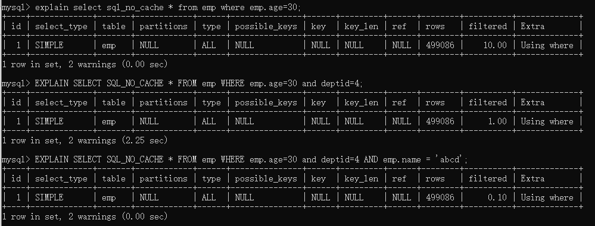

## MySql

## 1. mysql简介 

### 1.1 mysql 架构

+ 连接层

​      最上层是一些客户端和连接服务，包含本地socket通信和大多数基于客户端/服务端工具实现的类似于tcp/ip 的
通信。主要完成一些类似于连接处理、授权认证、及相关的安全方案。在该层上引入了线程池的概念，为通过认证
安全接入的客户端提供线程。同样在该层上可以实现基于SSL 的安全链接。

+ 服务层

  + Management Serveices & Utilities：系统管理和控制工具
  + SQL Interface：SQL 接口。接受用户的SQL 命令，并且返回用户需要查询的结果。比如select from
    就是调用SQL Interface。
  + Parser：解析器。SQL 命令传递到解析器的时候会被解析器验证和解析。
  + Optimizer：查询优化器。SQL 语句在查询之前会使用查询优化器对查询进行优化，比如有
    where 条件时，优化器来决定先投影还是先过滤。
  + Cache 和Buffer：查询缓存。如果查询缓存有命中的查询结果，查询语句就可以直接去查询缓存中取
    数据。这个缓存机制是由一系列小缓存组成的。比如表缓存，记录缓存，key 缓存，
    权限缓存等。
+ 引擎层

​      存储引擎层，存储引擎真正的负责了MySQL 中数据的存储和提取，服务器通过API 与存储引擎进行通信。不同
的存储引擎具有的功能不同，这样我们可以根据自己的实际需要进行选取。

+ 存储层

​      数据存储层，主要是将数据存储在运行于裸设备的文件系统之上，并完成与存储引擎的交互。

>  Linux开启和关闭mysql服务：service mysql start, service mysql stop

### 1.2 mysql查询大致流程

mysql 的查询流程大致是：
      mysql 客户端通过协议与mysql 服务器建连接，发送查询语句，先检查查询缓存，如果命中，直接返回结果，
否则进行语句解析,也就是说，在解析查询之前，服务器会先访问查询缓存(query cache)——它存储SELECT 语句以及相应的查询结果集。如果某个查询结果已经位于缓存中，服务器就不会再对查询进行解析、优化、以及执行。它仅仅将缓存中的结果返回给用户即可，这将大大提高系统的性能。
      语法解析器和预处理：首先mysql 通过关键字将SQL 语句进行解析，并生成一颗对应的“解析树”。mysql 解析
器将使用mysql 语法规则验证和解析查询；预处理器则根据一些mysql 规则进一步检查解析数是否合法。查询优化器当解析树被认为是合法的了，并且由优化器将其转化成执行计划。一条查询可以有很多种执行方式，
      最后都返回相同的结果。优化器的作用就是找到这其中最好的执行计划。然后，mysql 默认使用的BTREE 索引，并且一个大致方向是:无论怎么折腾sql，至少在目前来说，mysql 最多只用到表中的一个索引。

### 1.3 mysql基本设置

> 字符集

①查看当前字符集

show variables like '%char%';

②修改当前数据库配置文件

```mysql
[mysqld]
# 设置mysql的安装⽬目录
basedir=D:\developerSetting\mysql-5.7.29\
# 设置mysql数据库的数据的存放⽬目录
datadir=D:\developerSetting\mysql-5.7.29\data\
# 设置mysql的端⼝口号
port = 3306
#skip-grant-tables
# 设置字符集编码(支持中文)
character_set_server=utf8
[mysql]
default-character-set=utf8
[client]
default-character-set=utf8
```

> show profile 查看sql执行周期

查看profile是否开启 show variables like '%profiling%';

如果没有开启，可以执行set profiling=1 开启,然后可以使用**show profiles**查看最近执行SQL语句。


### 1.4 SQL执行顺序

手写SQL的执行顺序：

```sql
select distinct
		< select_list >
from 
		< left_table > < join_type >
join < right_table >  on < join_condition >
where
		< where_condition >
group by
		< group_by_list >
having
		< having_condition >
order by 
		< order_by_condition >
limit
		< limit_number >
```

真正执行的顺序：
	随着Mysql 版本的更新换代，其优化器也在不断的升级，优化器会分析不同执行顺序产生的性能消耗不同而动
态调整执行顺序。下面是经常出现的查询顺序：


### 1.5 MyIASM和InnoDB

| 对比项         | MyIASM                                                 | InnoDB                                                       |
| -------------- | ------------------------------------------------------ | ------------------------------------------------------------ |
| 外键           | 不支持                                                 | 支持                                                         |
| 事务           | 不支持                                                 | 支持                                                         |
| 行表锁         | 表锁，即使操作一条记录也会锁住整个表，不适合高并发操作 | 行锁，操作时只锁住一行，不对其他行有影响，**适合高并发操作** |
| 缓存           | 只缓存索引，不缓存真实数据                             | 不仅缓存索引还要缓存真实数据，对内存要求较高，而且内存大小对性能有决定性的影响 |
| 关注点         | 读性能                                                 | 并发写、事务、资源                                           |
| 默认安装       | Y                                                      | Y                                                            |
| 默认使用       | N                                                      | Y                                                            |
| 自带系统表使用 | Y                                                      | N                                                            |

> 常用命令

①show engines:查看所有的数据库引擎

②show variables like '%storage_engine%' 查看默认的数据库引擎

## 2. SQL基本语句

### 2.1 7种Join理论


### 2.2 建表语句

```sql
CREATE TABLE `t_dept` (
`id` INT(11) NOT NULL AUTO_INCREMENT,
`deptName` VARCHAR(30) DEFAULT NULL,
`address` VARCHAR(40) DEFAULT NULL,
PRIMARY KEY (`id`)
) ENGINE=INNODB AUTO_INCREMENT=1 DEFAULT CHARSET=utf8;

CREATE TABLE `t_emp` (
`id` INT(11) NOT NULL AUTO_INCREMENT,
`name` VARCHAR(20) DEFAULT NULL,
`age` INT(3) DEFAULT NULL,
`deptId` INT(11) DEFAULT NULL,
empno int not null,
PRIMARY KEY (`id`),
KEY `idx_dept_id` (`deptId`)
) ENGINE=INNODB AUTO_INCREMENT=1 DEFAULT CHARSET=utf8;

INSERT INTO t_dept(deptName,address) VALUES('华山','华山');
INSERT INTO t_dept(deptName,address) VALUES('丐帮','洛阳');
INSERT INTO t_dept(deptName,address) VALUES('峨眉','峨眉山');
INSERT INTO t_dept(deptName,address) VALUES('武当','武当山');
INSERT INTO t_dept(deptName,address) VALUES('明教','光明顶');
INSERT INTO t_dept(deptName,address) VALUES('少林','少林寺');

INSERT INTO t_emp(NAME,age,deptId,empno) VALUES('风清扬',90,1,100001);
INSERT INTO t_emp(NAME,age,deptId,empno) VALUES('岳不群',50,1,100002);
INSERT INTO t_emp(NAME,age,deptId,empno) VALUES('令狐冲',24,1,100003);
INSERT INTO t_emp(NAME,age,deptId,empno) VALUES('洪七公',70,2,100004);
INSERT INTO t_emp(NAME,age,deptId,empno) VALUES('乔峰',35,2,100005);
INSERT INTO t_emp(NAME,age,deptId,empno) VALUES('灭绝师太',70,3,100006);
INSERT INTO t_emp(NAME,age,deptId,empno) VALUES('周芷若',20,3,100007);
INSERT INTO t_emp(NAME,age,deptId,empno) VALUES('张三丰',100,4,100008);
INSERT INTO t_emp(NAME,age,deptId,empno) VALUES('张无忌',25,5,100009);
INSERT INTO t_emp(NAME,age,deptId,empno) VALUES('韦小宝',18,null,100010);
```

### 2.3 案例

```sql
# 1.所有有门派人员的信息（要求显示门派名称）内连接
select e.name, d.deptName from t_emp e inner join t_dept d on e.deptId=d.id;
# 2.列出所有人员及其门派信息
select e.id, e.name, d.deptName from t_emp e left join t_dept d on e.deptId=d.id;
# 3.所有无门派人士
select * from t_emp where deptId is null;
# 4.所有无人的门派
select d.* from t_dept d left join t_emp e on d.id=e.deptId where e.deptId is null;
# 5.所有人员和门派的对应关系
select * from t_emp e left join t_dept d on e.deptId=d.id 
union 
select * from t_emp e right join t_dept d on e.deptId=d.id;
# 6.所有没有入门派的人员和没人入的门派
select * from t_emp e left join t_dept d on e.deptId=d.id where e.deptId is null
union
select * from t_dept d left join t_emp e on e.deptId=d.id where e.deptId is null;
# 7.添加CEO字段
alter table t_dept add CEO INT(11);
update t_dept set CEO=2 where id=1;
update t_dept set CEO=4 where id=2;
update t_dept set CEO=6 where id=3;
update t_dept set CEO=8 where id=4;
update t_dept set CEO=9 where id=5;
# 8.求各个门派对应的掌门人名称
select d.deptName, e.name from t_dept d left join t_emp e on e.id=d.CEO where e.name is not null;
# 9.求所有当上掌门人的平均年龄
select AVG(e.age) from t_dept d left join t_emp e on e.id=d.CEO;
# 10.求所有人物对应的掌门名称
select ed.name as employee,c.name as boss 
from (select e.name,d.ceo from t_emp e left join t_dept d on e.deptId=d.id) ed 
left join t_emp c on ed.ceo=c.id;
```

## 3. 索引优化分析

### 3.1 索引的概念

>  什么是索引？

​		MySQL官方对索引的定义为：索引（index)是帮助MySQL高效获取数据的数据结构。可以得到索引的本质：索引是数据结构，可以理解为**排好序的快速查找数据结构。**

> 优缺点

优点：

+ 提高数据检索的效率，降低数据库的IO成本。
+ 通过索引列对数据进行排序，降低数据排序的成本，降低了CPU的消耗。

缺点：

+ 虽然索引大大提高了查询速度，同时却会降低更新表的速度，如对表进行INSERT、UPDATE和DELETE。因为
  更新表时，MySQL不仅要保存数据，还要保存一下索引文件每次更新添加了索引列的字段，都会调整因为
  更新所带来的键值变化后的索引信息。
+ 实际上索引也是一张表，该表保存了主键与索引字段，并指向实体表的记录，所以索引列也是要占用空间
  的。

### 3.2 MySQL索引

> BTree索引

+ 叶子节点具有相同的深度，叶节点的指针为空
+ 所有索引元素不重复
+ 节点中的数据索引从左到右递增排列


> B+Tree索引

+ 非叶子节点不存储data,只存储索引(冗余)，可以放更多的索引
+ 叶子节点包含所有的索引字段
+ 叶子节点用指针相连，提高区间的访问性能


## 4. Explain性能分析

### 4.1 概念

​		使用EXPLAIN 关键字可以模拟优化器执行SQL 查询语句，从而知道MySQL 是如何处理你的SQL 语句的。分
析你的查询语句或是表结构的性能瓶颈。

​		用法： Explain+SQL 语句，返回结果如图所示


> SQL语句准备

```sql
CREATE TABLE t1(id INT(10) AUTO_INCREMENT,content VARCHAR(100) NULL , PRIMARY KEY (id));
CREATE TABLE t2(id INT(10) AUTO_INCREMENT,content VARCHAR(100) NULL , PRIMARY KEY (id));
CREATE TABLE t3(id INT(10) AUTO_INCREMENT,content VARCHAR(100) NULL , PRIMARY KEY (id));
CREATE TABLE t4(id INT(10) AUTO_INCREMENT,content VARCHAR(100) NULL , PRIMARY KEY (id));

INSERT INTO t1(content) VALUES(CONCAT('t1_',FLOOR(1+RAND()*1000)));
INSERT INTO t2(content) VALUES(CONCAT('t2_',FLOOR(1+RAND()*1000)));
INSERT INTO t3(content) VALUES(CONCAT('t3_',FLOOR(1+RAND()*1000)));
INSERT INTO t4(content) VALUES(CONCAT('t4_',FLOOR(1+RAND()*1000)));
```

### 4.2 Explain返回结果分析

> 1 id

select 查询的序列号,包含一组数字，表示查询中执行select 子句或操作表的顺序。

①id 相同，执行顺序由上至下

```sql
explain select * from t1,t2,t3 where t1.id=t2.id and t2.id=t3.id;
```


②id 不同，id 不同，如果是子查询，id 的序号会递增，id 值越大优先级越高，越先被执行

```sql
explain select t2.* from t2 where id=(select id from t1 where id=(select t3.id from t3 where t3.content=''));
```


③有相同也有不同

```sql
# TODO 存在问题
explain select t2.* from t2,(select * from t3 where t3.content='') s3 where s3.id=t2.id;
```


​	id如果相同，可以认为是一组，从上往下顺序执行；在所有组中，id值越大，优先级越高，越先执行衍生= DERIVED


**关注点：id 号每个号码，表示一趟独立的查询。一个sql 的查询趟数越少越好。**

> 2 select_type

select_type 代表查询的类型，主要是用于区别普通查询、联合查询、子查询等的复杂查询。

| select_type 属性     | 含义                                                         |
| -------------------- | ------------------------------------------------------------ |
| SIMPLE               | 简单的select 查询,查询中不包含子查询或者UNION                |
| PRIMARY              | 查询中若包含任何复杂的子部分，最外层查询则被标记为Primary    |
| DERIVED              | 在FROM 列表中包含的子查询被标记为DERIVED(衍生)<br>MySQL 会递归执行这些子查询, 把结果放在临时表里。 |
| SUBQUERY             | 在SELECT或WHERE列表中包含了子查询                            |
| DEPEDENT SUBQUERY    | 在SELECT或WHERE列表中包含了子查询,子查询基于外层             |
| UNCACHEABLE SUBQUERY | 无法使用缓存的子查询                                         |
| UNION                | 若第二个SELECT出现在UNION之后，则被标记为UNION；<br/>若UNION包含在FROM子句的子查询中,外层SELECT将被标记为：DERIVED |
| UNION RESULT         | 从UNION表获取结果的SELECT                                    |

①SIMPLE

SIMPLE 代表单表查询；


②PRIMARY

查询中若包含任何复杂的子部分，最外层查询则被标记为Primary。

③DERIVED

在FROM 列表中包含的子查询被标记为DERIVED(衍生),MySQL 会递归执行这些子查询, 把结果放在临时表里。

④SUBQUERY

在SELECT 或WHERE 列表中包含了子查询。


⑤DEPENDENT SUBQUERY

在SELECT 或WHERE 列表中包含了子查询,子查询基于外层。

都是where 后面的条件，subquery 是单个值，dependent subquery 是一组值。

⑥UNCACHEABLE SUBQUREY

⑦UNION

若第二个SELECT 出现在UNION 之后，则被标记为UNION；若UNION 包含在FROM 子句的子查询中,外层SELECT
将被标记为：DERIVED。


⑧UNION RESULT

从UNION 表获取结果的SELECT

> 3 table

这个数据是基于哪张表的

> 4 type

type 是查询的访问类型。是较为重要的一个指标，结果值从最好到最坏依次是:

system > const > eq_ref > ref > fulltext > ref_or_null > index_merge > unique_subquery > index_subquery > range > index > ALL 

一般来说，得保证查询至少达到range 级别，最好能达到ref。

①system

表只有一行记录（等于系统表），这是const 类型的特列，平时不会出现，这个也可以忽略不计

②const

表示通过索引一次就找到了,const 用于比较primary key 或者unique 索引。因为只匹配一行数据，所以很快
如将主键置于where 列表中，MySQL 就能将该查询转换为一个常量。

```sql
explain select * from (select * from t1 where t1.id=1) s;
```


③eq_ref

唯一性索引扫描，对于每个索引键，表中只有一条记录与之匹配。常见于主键或唯一索引扫描。

```sql
explain select * from t1,t2 where t1.id=t2.id;
```


④ref

​	非唯一性索引扫描，返回匹配某个单独值的所有行.本质上也是一种索引访问，它返回所有匹配某个单独值的行，然而，它可能会找到多个符合条件的行，所以他应该属于查找和扫描的混合体。

在content上没有建立索引之前


在content上没有建立索引之后

```sql
create index idx_content on t2(content);
```


⑤range

只检索给定范围的行,使用一个索引来选择行。key 列显示使用了哪个索引一般就是在你的where 语句中出现了between、<、>、in 等的查询这种范围扫描索引扫描比全表扫描要好，因为它只需要开始于索引的某一点，而结束语另一点，不用扫描全部索引。


⑥index

出现index是sql使用了索引但是没用通过索引进行过滤，一般是使用了覆盖索引或者是利用索引进行了排序分组。


⑦all

Full Table Scan，将遍历全表以找到匹配的行.

⑧index_merge

在查询过程中需要多个索引组合使用，通常出现在有or 的关键字的sql 中。

⑨ref_or_null

对于某个字段既需要关联条件，也需要null 值得情况下。查询优化器会选择用ref_or_null 连接查询。


⑩index_subquery

利用索引来关联子查询，不再全表扫描

11unique_subquery

该联接类型类似于index_subquery。子查询中的唯一索引


> 6 possible_key

显示可能应用在这张表中的索引，一个或多个。查询涉及到的字段上若存在索引，则该索引将被列出，但不一定被查询实际使用。

> 7 key

实际使用的索引。如果为NULL，则没有使用索引。

> 8 key_len

表示索引中使用的字节数，可通过该列计算查询中使用的索引的长度。key_len 字段能够帮你检查是否充分的利用上了索引。ken_len 越长，说明索引使用的越充分。

如何计算：
①先看索引上字段的类型+长度比如int=4 ; varchar(20) =20 ; char(20) =20
②如果是varchar 或者char 这种字符串字段，视字符集要乘不同的值，比如utf-8 要乘3,GBK 要乘2，
③varchar 这种动态字符串要加2 个字节
④允许为空的字段要加1 个字节
第一组：key_len=age 的字节长度+name 的字节长度=4+1 + ( 20*3+2)=5+62=67
第二组：key_len=age 的字节长度=4+1=5

> 9 ref

显示索引的哪一列被使用了，如果可能的话，是一个常数。哪些列或常量被用于查找索引列上的值。

> 10 rows

rows 列显示MySQL 认为它执行查询时必须检查的行数。越少越好！

> 11 Extra

其他的额外重要的信息

+ Using filesort:说明mysql 会对数据使用一个外部的索引排序，而不是按照表内的索引顺序进行读取。MySQL 中无法利用索引完成的排序操作称为“文件排序”。优化前后对比：


+ Using temporary:使了用临时表保存中间结果,MySQL 在对查询结果排序时使用临时表。常见于排序order by 和分组查询group
  by。优化前后对比：


+ Using index:Using index 代表表示相应的select 操作中使用了覆盖索引(Covering Index)，避免访问了表的数据行，效率不错！
  如果同时出现using where，表明索引被用来执行索引键值的查找;如果没有同时出现using where，表明索引只是
  用来读取数据而非利用索引执行查找。
  利用索引进行了排序或分组。
+ Using where:表明使用了where 过滤。
+ Using join buffer:使用了连接缓存。
+ impossible where:where 子句的值总是false，不能用来获取任何元组。
+ select tables optimized away:在没有GROUPBY 子句的情况下，基于索引优化MIN/MAX 操作或者对于MyISAM 存储引擎优化COUNT(*)操
  作，不必等到执行阶段再进行计算，查询执行计划生成的阶段即完成优化。

## 5 单表使用索引常见的失效案例

```sql
# 建表语句，通过存储过程在dept插入1_0000条数据，在emp中插入50_0000条数据
CREATE TABLE `dept` (
`id` INT(11) NOT NULL AUTO_INCREMENT,
`deptName` VARCHAR(30) DEFAULT NULL,
`address` VARCHAR(40) DEFAULT NULL,
ceo INT NULL ,
PRIMARY KEY (`id`)
) ENGINE=INNODB AUTO_INCREMENT=1 DEFAULT CHARSET=utf8;
CREATE TABLE `emp` (
`id` INT(11) NOT NULL AUTO_INCREMENT,
`empno` INT NOT NULL ,
`name` VARCHAR(20) DEFAULT NULL,
`age` INT(3) DEFAULT NULL,
`deptId` INT(11) DEFAULT NULL,
PRIMARY KEY (`id`)
#CONSTRAINT `fk_dept_id` FOREIGN KEY (`deptId`) REFERENCES `t_dept` (`id`)
) ENGINE=INNODB AUTO_INCREMENT=1 DEFAULT CHARSET=utf8;

# 查询：show variables like 'log_bin_trust_function_creators';
# 设置：set global log_bin_trust_function_creators=1;
# 当然，如上设置只存在于当前操作，想要永久生效，需要写入到配置文件中：
# 在[mysqld]中加上log_bin_trust_function_creators=1
```

### 5.1 全值匹配我最爱

```sql
EXPLAIN SELECT SQL_NO_CACHE * FROM emp WHERE emp.age=30
EXPLAIN SELECT SQL_NO_CACHE * FROM emp WHERE emp.age=30 and deptid=4
EXPLAIN SELECT SQL_NO_CACHE * FROM emp WHERE emp.age=30 and deptid=4 AND emp.name = 'abcd'
```



```sql
# 建立索引
CREATE INDEX idx_age_deptid_name ON emp(age,deptid,NAME);
```


**结论：全值匹配我最爱指的是，查询的字段按照顺序在索引中都可以匹配到！**

注：SQL 中查询字段的顺序，跟使用索引中字段的顺序，没有关系。优化器会在不影响SQL 执行结果的前提下，给你自动地优化。

### 5.2 最佳左前缀法则


 查询字段与索引字段顺序的不同会导致，索引无法充分使用，甚至索引失效！
原因：使用复合索引，需要遵循最佳左前缀法则，即如果索引了多列，要遵守最左前缀法则。指的是查询从索
引的最左前列开始并且不跳过索引中的列。
**结论：过滤条件要使用索引必须按照索引建立时的顺序，依次满足，一旦跳过某个字段，索引后面的字段都无
法被使用。**

### 5.3 不要在索引列上做任何计算

不在索引列上做任何操作（计算、函数、(自动or 手动)类型转换），会导致索引失效而转向全表扫描。

> 在查询列上做了转换

**字符串不加单引号，则会在name 列上做一次转换！**

```sql
create index idx_name on emp(name);
# name 为varchar类型
explain select sql_no_cache * from emp where name='15';
explain select sql_no_cache * from emp where name=15;
```


### 5.4 索引列上不能有范围查询

```sql
# 使用范围查询后索引的使用效率大大降低，从key_len长度可以看出
explain select sql_no_cache * from emp where emp.age=30 and deptid=5 and emp.name='wjHIvc';
explain select sql_no_cache * from emp where emp.age=30 and deptid<5 and emp.name='wjHIvc';
```


**建议：将可能做范围查询的字段的索引顺序放在最后**

### 5.5 尽量使用覆盖索引

即查询列和索引列一直，不要写select *!


### 5.6 使用不等于(!= 或者<>)的时候

mysql 在使用不等于(!= 或者<>)时，有时会无法使用索引会导致全表扫描。


### 5.7 字段的is not null 和is null


当字段允许为Null 的条件下：


**is not null 用不到索引，is null 可以用到索引。**

### 5.8 like 的前后模糊匹配

```sql
# 在name字段上建立索引
create index idx_name on emp(name);e
```


**前缀不能出现模糊匹配！**

### 5.9 减少使用or


使用union all 或者union 来替代：


### 5.X 小结

全值匹配我最爱，最左前缀要遵守；
带头大哥不能死，中间兄弟不能断；
索引列上少计算，范围之后全失效；
LIKE 百分写最右，覆盖索引不写*；
不等空值还有OR，索引影响要注意；
VAR 引号不可丢，SQL 优化有诀窍。

## 6. 关联查询优化

```sql
# 建表语句
CREATE TABLE IF NOT EXISTS `class` (
`id` INT(10) UNSIGNED NOT NULL AUTO_INCREMENT,
`card` INT(10) UNSIGNED NOT NULL,
PRIMARY KEY (`id`)
);
CREATE TABLE IF NOT EXISTS `book` (
`bookid` INT(10) UNSIGNED NOT NULL AUTO_INCREMENT,
`card` INT(10) UNSIGNED NOT NULL,
PRIMARY KEY (`bookid`)
);
INSERT INTO class(card) VALUES(FLOOR(1 + (RAND() * 20)));
INSERT INTO class(card) VALUES(FLOOR(1 + (RAND() * 20)));
INSERT INTO class(card) VALUES(FLOOR(1 + (RAND() * 20)));
INSERT INTO class(card) VALUES(FLOOR(1 + (RAND() * 20)));
INSERT INTO class(card) VALUES(FLOOR(1 + (RAND() * 20)));
INSERT INTO class(card) VALUES(FLOOR(1 + (RAND() * 20)));
INSERT INTO class(card) VALUES(FLOOR(1 + (RAND() * 20)));
INSERT INTO class(card) VALUES(FLOOR(1 + (RAND() * 20)));
INSERT INTO class(card) VALUES(FLOOR(1 + (RAND() * 20)));
INSERT INTO class(card) VALUES(FLOOR(1 + (RAND() * 20)));
INSERT INTO class(card) VALUES(FLOOR(1 + (RAND() * 20)));
INSERT INTO class(card) VALUES(FLOOR(1 + (RAND() * 20)));
INSERT INTO class(card) VALUES(FLOOR(1 + (RAND() * 20)));
INSERT INTO class(card) VALUES(FLOOR(1 + (RAND() * 20)));
INSERT INTO class(card) VALUES(FLOOR(1 + (RAND() * 20)));
INSERT INTO class(card) VALUES(FLOOR(1 + (RAND() * 20)));
INSERT INTO class(card) VALUES(FLOOR(1 + (RAND() * 20)));
INSERT INTO class(card) VALUES(FLOOR(1 + (RAND() * 20)));
INSERT INTO class(card) VALUES(FLOOR(1 + (RAND() * 20)));
INSERT INTO class(card) VALUES(FLOOR(1 + (RAND() * 20)));
INSERT INTO book(card) VALUES(FLOOR(1 + (RAND() * 20)));
INSERT INTO book(card) VALUES(FLOOR(1 + (RAND() * 20)));
INSERT INTO book(card) VALUES(FLOOR(1 + (RAND() * 20)));
INSERT INTO book(card) VALUES(FLOOR(1 + (RAND() * 20)));
INSERT INTO book(card) VALUES(FLOOR(1 + (RAND() * 20)));
INSERT INTO book(card) VALUES(FLOOR(1 + (RAND() * 20)));
INSERT INTO book(card) VALUES(FLOOR(1 + (RAND() * 20)));
INSERT INTO book(card) VALUES(FLOOR(1 + (RAND() * 20)));
INSERT INTO book(card) VALUES(FLOOR(1 + (RAND() * 20)));
INSERT INTO book(card) VALUES(FLOOR(1 + (RAND() * 20)));
INSERT INTO book(card) VALUES(FLOOR(1 + (RAND() * 20)));
INSERT INTO book(card) VALUES(FLOOR(1 + (RAND() * 20)));
INSERT INTO book(card) VALUES(FLOOR(1 + (RAND() * 20)));
INSERT INTO book(card) VALUES(FLOOR(1 + (RAND() * 20)));
INSERT INTO book(card) VALUES(FLOOR(1 + (RAND() * 20)));
INSERT INTO book(card) VALUES(FLOOR(1 + (RAND() * 20)));
INSERT INTO book(card) VALUES(FLOOR(1 + (RAND() * 20)));
INSERT INTO book(card) VALUES(FLOOR(1 + (RAND() * 20)));
INSERT INTO book(card) VALUES(FLOOR(1 + (RAND() * 20)));
INSERT INTO book(card) VALUES(FLOOR(1 + (RAND() * 20)));
```

### 6.1 left join

①没有索引

```sql
explain select sql_no_cache * from class left join book on class.card=book.card;
```


②如何优化？在哪个表上建立索引？

```sql
create index idx_card on book(card);
explain select sql_no_cache * from class left join book on class.card=book.card;
```


③删除book 表的索引：drop index idx_card on book;

在class 表上建立索引：alter table class add index idx_card(card);


结论：
①在优化关联查询时，只有在被驱动表上建立索引才有效！
②left join 时，左侧的为驱动表，右侧为被驱动表！

### 6.2 inner join

```sql
explain select * from book inner join class on class.card=book.card;
```


②两个查询字段调换顺序，发现结果也是一样的


③在book 表中，删除9 条记录，再进行inner join


④**结论：inner join 时，mysql 会自己帮你把小结果集的表选为驱动表。**

### 6.3 四个关联查询案例分析


## 7. 子查询优化

①取所有不为掌门人的员工，按年龄分组！

```sql
select age ,count(*) from t_emp where id not in (select ceo from t_dept where ceo is not null) group by age;
```


②如何优化？

+ 解决dept 表的全表扫描，建立ceo 字段的索引：


+ 此时，再次查询：


+ 进一步优化，替换not in。

```sql
select age ,count(*) from emp e left join dept d on e.id=d.ceo where d.id is null group by age;
```


**结论： 在范围判断时，尽量不要使用not in 和not exists，使用left join on xxx is null 代替。**


索引的基本理论


为什么存在建了索引但是查询反而效果差？


mysql锁的分类

+ 对数据类型的操作(读/写)分(主要针对MyISAM)
  + 读锁(共享锁)
  + 写锁(排他锁)

+ 对数据操作的粒度分(主要针对InnoDB,支持事务，采用行锁)
  + 表锁(偏读)
  + 行锁(偏写)

索引失效会导致行锁变成表锁


间隙锁：当我们用范围条件而不是相等条件检索数据，并请求共享或排他锁时，InnoDB会给符合条件的已有数据记录的索引项加锁，对于值在条件范围内但并不存在的记录，叫做“间隙锁”


mysql的架构介绍

索引优化分析

查询截取分析

mysql锁机制

主从复制

