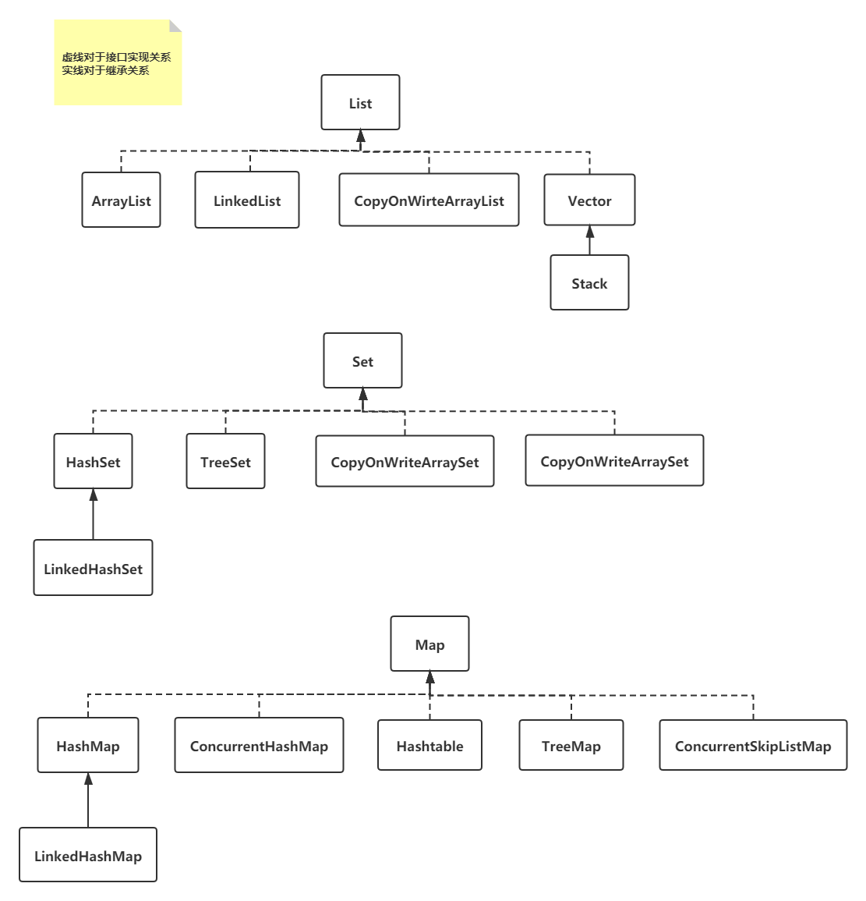
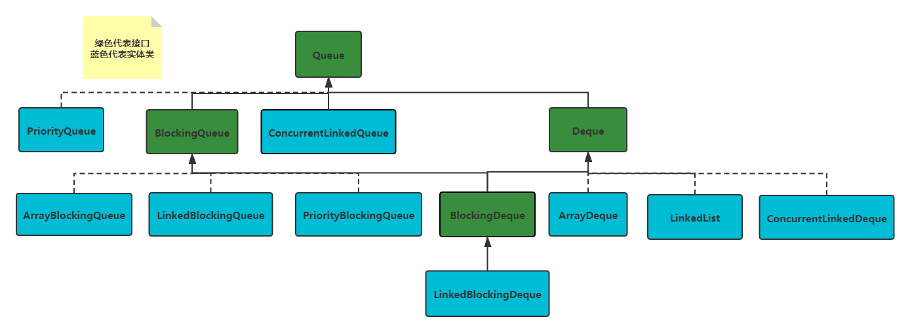
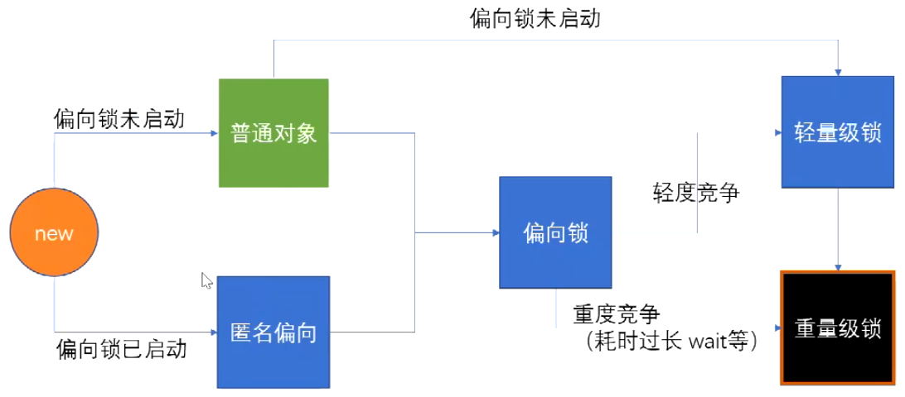
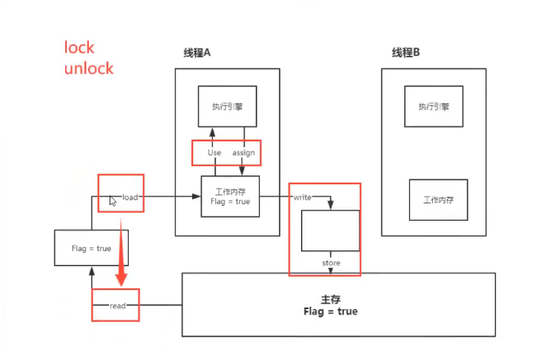
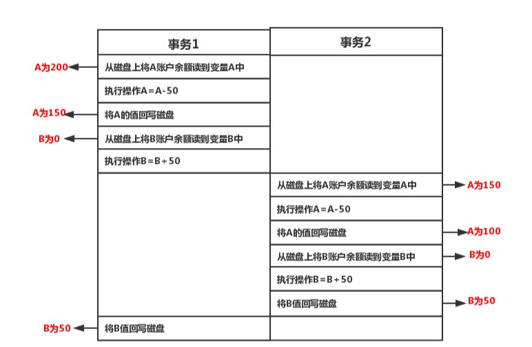

### ByteDance


1. 集合框架：大致分几类（List/Queue/Deque/Map/Set），每一类的继承/实现关系（如ArrayList实现List，继承AbstractList，List又继承Collection），几个常用的集合框架的底层实现原理（一个HashMap就能问出N多问题），哪些是线程安全的，哪些不是。
2. JVM内存模型：线程独享内存/堆内存/Perm区、年轻代/老年代、GC机制、常用的GC算法、强引用/弱引用/软引用……
3. 并发编程：synchronized、volatile、ReentrantLock都有什么用，区别，场景……阻塞队列/非阻塞队列……线程的状态，线程调度常用的方法（wait/yield/join/notify）……
4. 几种最常见的设计模式：单例/代理/工厂……
5. IO，NIO……

## 1 集合框架

### 1.1 集合之间的继承关系

> List Set Map集合下常见的类



> Queue接口关系



### 1.2 HashMap

> HashMap源码解析(1.7)

```java
public class HashMap<K,V> extends AbstractMap<K,V>
    implements Map<K,V>, Cloneable, Serializable {
 	
    /* 
    初始化数组的容量，为什么是2^4不是其他的非2的整次幂数，如19,21等
    因为在计算当前元素的位置i时,需要利用&运算
    i = hash % m 但是求余的效率低，不如与运算效率高
    我们可以将求余操作转换为与运算，如数组长度16，当前元素的hash值为11，7
    11:0000 1011
       0000 1111 &
       0000 1011 = 11
     9:0000 1001
       0000 1111 &
       0000 0111 = 9
    通过与操作可以很快求出元素的位置，并且保证不同的hash值得到不同的位置i
    如果选择的值不是2的整次幂，如13
    11:0000 1011
       0000 1101 &
       0000 1001 = 9
     9:0000 1001
       0000 1101 &
       0000 1001 = 9
    很容易就产生了哈希冲突
    */
    static final int DEFAULT_INITIAL_CAPACITY = 1 << 4; // aka 16
    
    // 数组的最大容量
    static final int MAXIMUM_CAPACITY = 1 << 30;
    
    /*
    默认的加载因子，为什么不是0.5或者1或者其他小于1的数字
    假设为1,那么数组需要等到全部填满时才进行扩容，这样数组的空间利用率提高了，但是哈希碰撞的次数增加，使得链表的长度加长
    假设为0.5，那么数组的利用率比较低，只填一半就开始扩容了，空间利用率低，但是减少了哈希碰撞
    所以，进过学者的大量统计分析得出0.75是平衡空间利用率和哈希碰撞的最好参数
    */
    static final float DEFAULT_LOAD_FACTOR = 0.75f;
    
    // 链表进行树化时的最小长度
    static final int TREEIFY_THRESHOLD = 8;
    
    // 树转化为链表的临界值
    static final int UNTREEIFY_THRESHOLD = 6;
    
    // 主数组上的链表转化为树时，数组的最小长度
    static final int MIN_TREEIFY_CAPACITY = 64;
    
    // 静态内部类：Node节点的数据结构
    static class Node<K,V> implements Map.Entry<K,V> {
        final int hash;
        final K key;
        V value;
        Node<K,V> next;
    }
    
    // 定义主数组
    transient Node<K,V>[] table;
    
    // 已经修改的元素个数
    transient int modCount;
    
    // table中已经放入元素的个数
    transient int size;
    
    // table数组的大小
    int threshold;
    
    // 加载因子
    final float loadFactor;
    
}
```


> HashMap常见问题

为什么底层使用数组+链表+红黑树，不使用AVL树或者普通二叉树？

普通的二叉树在插入过程中个，可能造成节点都在树的左子树或者右子树，使得二叉树退化成链表，查询效率依旧很低

平衡二叉树，通过减少树的高度，每次插入时保证左右子树的高度差不大于1，解决了树的单一侧节点过多导致的查询效率低。但是平衡二叉树，牺牲了插入性能(如果左右子树不平衡，会进行左旋或者右旋，使得插入效率低)，使得查询性能变高。

红黑树，是在插入性能和查询性能之间做了一个平衡，使得插入效率不是很低，同时保证了查询效率较高


> ConcurrentHashMap(1.8)

sizeCtl的含义

sizeCtl = 0 表示数组未初始化，且数组的初始容量是16

sizeCtl > 0 如果数组未初始化，那么记录的是数组的初始容量，如果数组已经初始化，那么记录的是数组扩容的阈值(数组的初始容量*0.75)

sizeCtl = -1 表示数组正在初始化

sizeCtl < 0 && sizeCtl != -1 表示数组正在扩容，-(n + 1) 表示此时有n个线程正在完成对数组的扩容任务


### 1.3 锁

> synchronized

**锁升级过程**



用户空间锁 vs 重量级锁

偏向锁 自旋锁都是用户空间完成的

重量级锁需要向内核申请的


在使用synchronized时，首先给对象加偏向锁，偏向锁是在对象信息中markword中记录当前线程(A)的id，当有多个线程(B,C)开始竞争同一个资源时，那么开始升级此时的偏向锁，也就是多个线程竞争 谁可以把线程id记录到markword中，此时的锁为自旋锁，B,C在竞争的过程中，主要使用CAS,每次将锁信息拿来比较，如果改变了就把自己的信息放入当前的markword，否则继续自旋比较。

偏向锁升级到轻量级锁：只要存在多个线程(大于等于2)开始竞争当前资源就会升级

偏向锁升级到重量级锁：当前的资源存在重度竞争，或者当前竞争到资源的线程执行时间非常长


轻量级锁升级到重量级锁：

1.6之前：自旋超过10次/多个线程等待(超过CPU核数的一半)

1.6之后：自适应自旋


自旋锁在自旋的过程需要占用CPU资源的，当竞争的线程或者当前的多个线程执行的时间较短时，自旋锁是非常合适的


重量级锁：不让那些竞争当前资源的线程在哪里自旋消耗CPU资源了，操作系统将这些参与竞争的线程放入等待队列，轮到谁后谁在使用当前资源


**偏向锁默认是打开的，只是它会延迟4秒打开**

1)偏向锁打开一定比不打开的效率高吗

不一定，在明确知道当前资源存在会存在多个线程竞争该资源，偏向锁会涉及到锁撤销的过程，这时直接使用轻量级锁更好

2)为什么会延迟4秒

因为JVM启动时，会加载其他类的信息，在加载其他类的信息时也包括对它上锁的过程，等待其他类的上锁完成后，在考虑当前用户的上锁情况，如果我们明确知道当前线程会有多个线程竞争当前资源，可以不用考虑加偏向锁直接升级到轻量级锁


synchronized底层是用 lock comexchg 指令(即CAS)，只有当前线程把某个属性值修改成1后才表示释放了锁


> volatile

volatile是Java提供的**轻量级同步机制**

1. 保证可见性
2. 不保证原子性
3. 禁止指令重排

Java内存模型, 不存在的东西, 是一种概念, 约定.

**关于JMM的约定**

1. 线程加锁前: 必须把共享变量*立刻*刷回主存
2. 线程解锁前: 必须读取内存中的最新值到工作内存中
3. 加锁和解锁是同一把锁

线程 工作内存、主内存(八种操作)




> 内存交互操作有8种，虚拟机实现必须保证每一个操作都是原子的，不可在分的（对于double和long类型的变量来说，load、store、read和write操作在某些平台上允许例外）

+ lock（锁定）：作用于主内存的变量，把一个变量标识为线程独占状态
+ unlock（解锁）：作用于主内存的变量，它把一个处于锁定状态的变量释放出来，释放后的变量才可以被其他线程锁定
+ read（读取）：作用于主内存变量，它把一个变量的值从主内存传输到线程的工作内存中，以便随后的load动作使用
+ load（载入）：作用于工作内存的变量，它把read操作从主存中变量放入工作内存中
+ use（使用）：作用于工作内存中的变量，它把工作内存中的变量传输给执行引擎，每当虚拟机遇到一个需要使用到变量的值，就会使用到这个指令
+ assign（赋值）：作用于工作内存中的变量，它把一个从执行引擎中接受到的值放入工作内存的变量副本中
+ store（存储）：作用于主内存中的变量，它把一个从工作内存中一个变量的值传送到主内存中，以便后续的write使用
+ write（写入）：作用于主内存中的变量，它把store操作从工作内存中得到的变量的值放入主内存的变量中

> JMM对这八种指令的使用，制定了如下规则：

+ 不允许read和load、store和write操作之一单独出现。即使用了read必须load，使用了store必须write
+ 不允许线程丢弃他最近的assign操作，即工作变量的数据改变了之后，必须告知主存
+ 不允许一个线程将没有assign的数据从工作内存同步回主内存
+ 一个新的变量必须在主内存中诞生，不允许工作内存直接使用一个未被初始化的变量。就是对变量实施use、store操作之前，必须经过assign和load操作
+ 一个变量同一时间只有一个线程能对其进行lock。多次lock后，必须执行相同次数的unlock才能解锁
+ 如果对一个变量进行lock操作，会清空所有工作内存中此变量的值，在执行引擎使用这个变量前，必须重新load或assign操作初始化变量的值
+ 如果一个变量没有被lock，就不能对其进行unlock操作。也不能unlock一个被其他线程锁住的变量
+ 对一个变量进行unlock操作之前，必须把此变量同步回主内存


volatile 怎么样禁止指令重排？

JVM层面的内存屏障：

JSR内存屏障

+ LoadLoad屏障
+ StoreStore屏障
+ LoadStore屏障
+ StoreLoad屏障

在对某个内存进行读或者写的时候，在该指令的前后加内存屏障

同时JVM规定，happens-before 八中情况必须加内存屏障 as-if-serial


volatile底层使用

**lock addl $S0** 意思是往寄存器中加一个0

禁止指令重排，该指令的作用就是将当前处理器对于缓存的内存刷到主存中，并使其他处理器对应的缓存失效(其他线程的缓存失效后就需要从主存中重新读取)，另外还提供了有序的指令无法越过这个内存屏障的作用

MESI缓存一致性协议


### 1.4 mysql事务

常见名词

索引下推

```sql
select * from emp where name="john" and age=12;
# 如果没有索引下推，先根据name从存储引擎中读取数据到server层，然后根据在server层对age属性值进行过滤
# 如果有索引下推，根据name和age属性做筛选，将筛选之后的结果返回给server
```


为什么mysql使用B+Tree，而不是其他的普通二叉树或者BST或者AVL

普通的二叉树：当数据是有序的时候，插入二叉树中会形成一个单侧二叉树，即单侧链表，增大了查询次数和时间

BST(二叉搜索树)：与普通二叉树一样，存在形成单侧链表的可能

AVL：平衡二叉树通过自调整左右子树的高度，解决了形成单侧链表的问题，增大了查询效率，但是为了保证平衡(即左右子树高度差不超过1)需要在插入的时候不断进行自旋，调整左右子树高度，使得插入的效率非常低。而且平衡二叉树属于二叉树，每个节点上只能存储一个值，这样数据量很大的时候，同样使得树的高度很大，增大了查询次数，查询效率变低，如果可以增加每个节点存储值得个数(二叉树编程三叉数)，那么树的高度会大大降低，所以形成了BTree


> 第一个


1 内核态是什么，为什么需要，如何进入 

内核的功能一般包括支撑功能（包括中断处理、时钟管理、原语操作）和资源管理功能（进程管理、存储器管理、设备管理）两大方面。

从用户态切换到内核态有三种方式：

1. **系统调用**这是用户态进程主动要求切换到内核态的一种方式。用户态进程通过系统调用申请使用操作系统提供的服务程序来完成工作；系统调用是通过终端机制来实现的。
2. **异常**当 cpu 在执行运行在用户态的程序时，发生了一些没有预知的异常，这时会触发由当前运行进程切换到处理此异常的内核相关进程中，也就是切换到了内核态；
3. **外围设备的中断**当外围设备完成用户请求的操作后，会向 CPU 发出相应的中断信号，这时 CPU 会暂停执行下一条即将要执行的指令而转到与中断信号对应的处理程序中去执行。如果前面执行的指令是用户态下的程序，那转换自然就是由用户态到内核态的转换；

2 Java 源代码到跑的过程 （这个完全忘了） 

3 ArrayList 删除底层发生了什么，如何优化，后续查找时间复杂度 

4 LRU如何实现插入查找删除O(1) 

5 合并两个二叉搜索树 

6 写二叉树最大路径和


> 第二个


1. 自我介绍
2. 介绍[项目]()
3. 项目压测过没有，通过压测发现了系统瓶颈在哪里（这个确实没思考过）
4. 进程与线程的区别（面试官让我尽可能多说）

进程的切换：

直接开销就是在切换时，cpu必须做的事情，包括：

- 1、切换页表全局目录

- 2、切换内核态堆栈

- 3、切换硬件上下文（进程恢复前，必须装入寄存器的数据统称为硬件上下文）

- - ip(instruction pointer)：指向当前执行指令的下一条指令
  - bp(base pointer): 用于存放执行中的函数对应的栈帧的栈底地址
  - sp(stack poinger): 用于存放执行中的函数对应的栈帧的栈顶地址
  - cr3:页目录基址寄存器，保存页目录表的物理地址
  - ......


- 4、刷新TLB
- 5、系统调度器的代码执行

线程的切换：

在Linux下其实本并没有线程，只是为了迎合开发者口味，搞了个轻量级进程出来就叫做了线程。轻量级进程和进程一样，都有自己独立的task_struct进程描述符，也都有自己独立的pid。从操作系统视角看，调度上和进程没有什么区别，都是在等待队列的双向链表里选择一个task_struct切到运行态而已。只不过轻量级进程和普通进程的区别是可以共享同一内存地址空间、代码段、全局变量、同一打开文件集合而已。


1. 多线程哪些内存是共享的，哪些不是共享的？（没答出来，现在想来应该就是问java内存模型，堆和方法区就是共享的，虚拟机栈，本地方法栈，程序计数器就是非共享的，当时不知道再想啥）
2. 线程的地址空间什么的？（我太菜了，都没听过）
3. 一个线程能访问到另一个线程的局部变量吗？
4. 进程切换与线程切换哪个代价比较大？为什么（不会，后面学一下）
5. 操作系统的内存管理（我说我操作系统不太懂）

内存管理包括

+ 内存空间的分配与回收
  + 非连续分配管理
    + 基于分页存储管理
    + 基于分段存储管理
    + 段页式存储管理
+ 内存空间的扩充
+ 地址转换
+ 存储保护

1. 一个对象在内存中的存放位置？字符串呢？

对象放在堆中，引用放在虚拟机栈中，字符串放在方法区(包括类的加载信息，静态域，常量池)

1. LRU[算法]()的实现，口述
2. 常用[排序]()[算法]()及时间复杂度
3. 如果一个超大文件有10亿行数据，每行一个整数，内存放不下，怎么[排序]()？不能只答归并[排序]()，要落实到代码应该怎么写（思考了一会，没想出来，后面学一下）
4. 计算机网络常规知识...
5. 说一下数据库事务的事务
6. 分别讲一下ACID是什么意思（发现我对一致性了解不深，没有搞懂一致性的概念）

> 原子性(Atomicity)

根据定义，原子性是指一个事务是一个不可分割的工作单位，其中的操作要么都做，要么都不做。即要么转账成功，要么转账失败，是不存在中间的状态！

**如果无法保证原子性会怎么样？**

OK，就会出现**数据不一致**的情形，A账户减去50元，而B账户增加50元操作失败。系统将无故丢失50元~

> 隔离性(Isolation)

​		MySQL中事务的隔离级别分为四大等级，**读未提交（READ UNCOMMITTED）、读已提交 （READ COMMITTED）、可重复读 （REPEATABLE READ）、串行化 （SERIALIZABLE）**。

根据定义，隔离性是指多个事务并发执行的时候，事务内部的操作与其他事务是隔离的，并发执行的各个事务之间不能互相干扰。

**如果无法保证隔离性会怎么样？**

OK，假设A账户有200元，B账户0元。A账户往B账户转账两次，金额为50元，分别在两个事务中执行。如果无法保证隔离性，会出现下面的情形



如图所示，如果不保证隔离性，A扣款两次，而B只加款一次，凭空消失了50元，依然出现了**数据不一致**的情形！

`ps`:可能有细心的读者已经发现了，mysql中是依靠锁来解决隔离性问题。嗯，我们后面来说明。

> 持久性(Durability)

根据定义，持久性是指事务一旦提交，它对数据库的改变就应该是永久性的。接下来的其他操作或故障不应该对其有任何影响。

**如果无法保证持久性会怎么样？**

 在Mysql中，为了解决CPU和磁盘速度不一致问题，Mysql是将磁盘上的数据加载到内存，对内存进行操作，然后再回写磁盘。好，假设此时宕机了，在内存中修改的数据全部丢失了，持久性就无法保证。

设想一下，系统提示你转账成功。但是你发现金额没有发生任何改变，此时数据出现了不合法的数据状态，我们将这种状态认为是**数据不一致**的情形。

> 一致性(Consistency)

根据定义，一致性是指事务执行前后，数据处于一种合法的状态，这种状态是语义上的而不是语法上的。 那什么是合法的数据状态呢？ oK，这个状态是满足预定的约束就叫做合法的状态，再通俗一点，这状态是由你自己来定义的。满足这个状态，数据就是一致的，不满足这个状态，数据就是不一致的！

**如果无法保证一致性会怎么样？**

+ 例一:A账户有200元，转账300元出去，此时A账户余额为-100元。你自然就发现了此时数据是不一致的，为什么呢？因为你定义了一个状态，余额这列必须大于0。

+ 例二:A账户200元，转账50元给B账户，A账户的钱扣了，但是B账户因为各种意外，余额并没有增加。你也知道此时数据是不一致的，为什么呢？因为你定义了一个状态，要求A+B的余额必须不变。


*问题一：Mysql怎么保证一致性的？* 

OK，这个问题分为两个层面来说。 从数据库层面，数据库通过原子性、隔离性、持久性来保证一致性。也就是说ACID四大特性之中，C(一致性)是目的，A(原子性)、I(隔离性)、D(持久性)是手段，是为了保证一致性，数据库提供的手段。数据库必须要实现AID三大特性，才有可能实现一致性。例如，原子性无法保证，显然一致性也无法保证。

但是，如果你在事务里故意写出违反约束的代码，一致性还是无法保证的。例如，你在转账的例子中，你的代码里故意不给B账户加钱，那一致性还是无法保证。因此，还必须从应用层角度考虑。

从应用层面，通过代码判断数据库数据是否有效，然后决定回滚还是提交数据！


*问题二: Mysql怎么保证原子性的？* 

OK，是利用Innodb的`undo log`。 `undo log`名为回滚日志，是实现原子性的关键，当事务回滚时能够撤销所有已经成功执行的sql语句，他需要记录你要回滚的相应日志信息。 例如 

- (1)当你delete一条数据的时候，就需要记录这条数据的信息，回滚的时候，insert这条旧数据 
-  (2)当你update一条数据的时候，就需要记录之前的旧值，回滚的时候，根据旧值执行update操作 
- (3)当年insert一条数据的时候，就需要这条记录的主键，回滚的时候，根据主键执行delete操作

`undo log`记录了这些回滚需要的信息，当事务执行失败或调用了rollback，导致事务需要回滚，便可以利用undo log中的信息将数据回滚到修改之前的样子。

`ps`:具体的undo log日志长啥样，这个可以写一篇文章了。而且写出来，看的人也不多，姑且先这么简单的理解吧。


*问题三: Mysql怎么保证持久性的？* 

OK，是利用Innodb的`redo log`。 正如之前说的，Mysql是先把磁盘上的数据加载到内存中，在内存中对数据进行修改，再刷回磁盘上。如果此时突然宕机，内存中的数据就会丢失。 *怎么解决这个问题？* 简单啊，事务提交前直接把数据写入磁盘就行啊。 *这么做有什么问题？*

-  只修改一个页面里的一个字节，就要将整个页面刷入磁盘，太浪费资源了。毕竟一个页面16kb大小，你只改其中一点点东西，就要将16kb的内容刷入磁盘，听着也不合理。 
- 毕竟一个事务里的SQL可能牵涉到多个数据页的修改，而这些数据页可能不是相邻的，也就是属于随机IO。显然操作随机IO，速度会比较慢。

于是，决定采用`redo log`解决上面的问题。当做数据修改的时候，不仅在内存中操作，还会在`redo log`中记录这次操作。当事务提交的时候，会将`redo log`日志进行刷盘(`redo log`一部分在内存中，一部分在磁盘上)。当数据库宕机重启的时候，会将`redo log`中的内容恢复到数据库中，再根据`undo log`和`binlog`内容决定回滚数据还是提交数据。


*采用redo log的好处？*

 其实好处就是将`redo log`进行刷盘比对数据页刷盘效率高，具体表现如下 

- `redo log`体积小，毕竟只记录了哪一页修改了啥，因此体积小，刷盘快。 
- `redo log`是一直往末尾进行追加，属于顺序IO。效率显然比随机IO来的快。

`ps`:不想具体去谈`redo log`具体长什么样，因为内容太多了。


*问题四: Mysql怎么保证隔离性的？*

OK,利用的是锁和MVCC机制。还是拿转账例子来说明，有一个账户表如下 表名`t_balance`

| id   | user_id | balance |
| ---- | ------- | ------- |
| 1    | A       | 200     |
| 2    | B       | 0       |


至于MVCC,即多版本并发控制(Multi Version Concurrency Control),一个行记录数据有多个版本对快照数据，这些快照数据在`undo log`中。 如果一个事务读取的行正在做DELELE或者UPDATE操作，读取操作不会等行上的锁释放，而是读取该行的快照版本。 由于MVCC机制在可重复读(Repeateable Read)和读已提交(Read Commited)的MVCC表现形式不同，就不赘述了。 

但是有一点说明一下，在事务隔离级别为读已提交(Read Commited)时，一个事务能够读到另一个事务已经提交的数据，是不满足隔离性的。但是当事务隔离级别为可重复读(Repeateable Read)中，是满足隔离性的。


1. 怎么保证持久性的？（感觉没回答好）
2. 写了redo log，但事务还没提交，突然系统崩溃了会怎么样？（也没回答好）
3. 给一个数组，用最快的[排序]()[算法]()，进行[排序]()
   我答那就是快排了，他说有更快的吗？针对这个场景，有更快的吗？
   我又提了一基数[排序]()，但好像不适用，面试官就说那就用你觉得最快的写吧
   然后，啪啦啪啦...
4. 反问，因为我晓得我答得太烂了，就跟面试官说我这是第一次面试，发挥的不是很好，面试官说不要因为某个问题打得好或者不好，就觉得怎么怎么样，我们都是整体来看的。

关于java的一点没问，在问LRU[算法]()的时候，我说Map里面放双向[链表]()的节点，他问放的是节点，还是节点的引用，给我整蒙了，java里面除了基本类型其他应该都是引用，但当时头脑空白，在想怎么才能放节点而不是节点的引用，没想出来，就回答的应该放的是引用，感觉很多问题回答的都不是很确定，以为已经凉了，过了几分钟，HR打来电话预约二面时间。


> 第三个


1、自我介绍 

  2、基础知识考察 

  进程和线程的区别 

  进程和线程的内存空间 

  进程的内存结构是？分别存放什么内容？ 


  fork一个子进程发生了什么 

  进程通信：管道和消息传递 

  匿名管道和命名管道的区别 

  进程的调度策略 

+ 先来先服务（FCFS,First Come First Serve）
+ 短作业优先算法（SPF，Shortest Process First）
+ 时间片轮转(RR,Round-Robin)
+ 优先级调度算法
+ 多级反馈队列调度算法

  分页和分段 分页的大小是？为什么是这么大？ 

  虚拟内存的实现流程 

  页面置换[算法]() 

  3、[项目]()问题 

  4、手撕代码 

  单[链表]()，奇数位升序，偶数位降序，现在要求整体排成全局升序


> 第四个


1 自我介绍 

2 直接手撕代码 

  找到一组数中的任意一个峰值 要求小于O（n）复杂度 


  序列化与反序列化 

  都是LeetCode原题好像 


 3 问我[redis]()会吗 不会 就问了mysql的东西 索引 

 4 https 越详细越好 

 5 问我什么语言 [c++]() 然后问了[c++]()智能指针（底层实现）宏 模板编程 

 6 多线程注意什么 锁


> 第五个


根据简历问，做的[项目]()： 

 [项目]()里面注册功能设置激活码的意义？ 

 [项目]()里面实现的查看用户权限？我是通过配置拦截器。
 mysql B树和B+数的区别？ 
 什么情况下可以用B树？ 
 [redis]() 的过期策略？
 elasticSearch的索引实现？ 
 elasticSearch的怎么实现分词的？ 
 分布式锁用zoo[keep]()er怎么实现，那用[redis]()怎么实现？用[redis]()实现有什么问题？

  msql的事务隔离级别有哪些，默认是什么，读已提交会发生什么问题？ 

  mybatis连接mysql与传统的jdbc有什么区别？ 


 [redis]()从机发现key过期了，怎么办，自己删除还是主机去删？
 点赞的用户集合用[redis]()什么数据类型去存？set，如果数据太大set装不下怎么解决？我回答的是集群，第一个存1-1W,第二个存1w1到2万，接着又问，那取的时候怎么去取的？
 Kafka的消息是有序的吗？工作原理了解吗？为什么依赖ZK？具体依赖ZK什么？ 
 [项目]()里面怎么实现登录？为什么用[redis]()存验证码？登录凭证什么时候过期？
 ThreadLocal原理是什么？ 
 bitmap的原理？ 
 Quartz实现任务调度是怎么做的？还有没有别的组件可以实现这个功能？ 

 手撕代码：[二叉树]()的锯齿状遍历？ 我写的dfs实现


> 第六个


1. 自我介绍 

  被打断； 


  面试官： 念简历就停吧 别念了 

  我寻思不说简历我说什么？ 我说我处了几个对象还是说你发型挺娘炮的？ 


2. Spring IOC AOP 

3. Spring中用到的设计模式 

  4. 单例模式在实际工程中的使用？ 

  没用过 


5. MySQL主从原理 

  不知道，但是我知道Redis的  于是说了Redis的 


  6. SpringMVC的启动流程 

  7. zoo[keep]()er的原理 

  不会， 说了一下选举机制 


  8. Kafka的事物 

  [算法]()： 无序数组中未出现过的最小正整数 


> 第七个


小厂实习经历toB 但面试的部门是电商物流 是toC业务 聊了十分钟 

 三次握手四次挥手 

 浏览器访问网站流程 

 java IO模型 

 java GC机制 

 MySQL事务介绍 

 InnoDB 索引 

 [算法题]() 反转m到n位置[链表]()


> 第八个


1.自我介绍 

  2.[项目]()介绍 

  3.[算法题]():数组区间求和 

  4.[算法题]():二维数组矩阵求和 

  5.写个sql,查score最高的学生id(score有重复) 

  6.怎么优化 

  7.索引数据结构,为什么用这个数据结构 

  8.[redis]()数据结构 

  9.压缩[链表]()介绍一下,跳表介绍下 

  10.为什么MySQL不用跳表做索引而是用B+树 

  11.你有什么想问我的吗?


> 第九个


面试的是一个小哥

 1、上来先给小哥做了一个自我介绍

 2、自我介绍完小哥直接让手撕：两个字符串求[最长公共子串]()，用DP做，撕了很久最后撕出来了。

 3、然后小哥出了一个数据库联合索引的题，我很诚实的说我数据库这里不熟，只会简单的增删改查。

 4、小哥然后问了我会不会Redis，问了锁，答不会，问了zset底层，答跳表。

 5、然后小哥问会不会MQ，答没用过。

 6、小哥可能很无奈，问我会不会HTTP，答，会

 7、问了四次挥手，HTTP都有哪些请求，说一说get和post的区别，post一定是安全的嘛，如何实现post安全

 8、最后一个问题，我说要实现post安全应该用HTTPS，小哥反问如果不用HTTPS怎么实现

 9、强行想了两个方案，第一个是用JS把解密[算法]()一块发过去，但是这种也不安全，JS文件也可以抓包获得；第二个我说用md5加密，然后解密，小哥说md5不能解密，我人就傻掉了。

 md5确实不熟，下来查了确实不能解密。提问大佬们，md5不能解密的话，它加密的意义在哪里？还有如果不用HTTPS怎么实现post安全传输？

 10、然后小哥给了面评，说我技术栈和他们那里不太符，说我态度很好，他也知道我懂一些点，但是我技术栈不符合，进去后培训成本很大，然我再学几个月再投。

 11、听了小哥的面评，感觉自己基本凉了，问的全是我简历上没写的，直击盲点。我可太难受了


> 第十个


1. 本科什么专业？ 
2. 非科班是吧，平时怎么学编程的？

3. 说一下OSI七层模型； 
4. 说一下应用层有哪些协议； 
5. TCP/UDP在哪一层； 
6. HTTP协议的消息是什么样的？ 
7. HTTP和HTTPS的区别？ 
8. HTTPS怎么保证可靠的？ 
9. 说一下对称加密和非对称加密？ 
10. 对称加密有哪些[算法]()？（好像答错了，说成RSA了）
11. MD5[算法]()了解吗？
12. Redis有哪些数据结构？（不了解） 
13. 消息中间件了解吗？（真不知道） 
14. 说一下协程，和线程的区别？ 
15. 说一下LRU[算法]()的设计原理，口述；
16. 手撕代码：[32. 最长有效括号]( https://leetcode-cn.com/problems/longest-valid-parentheses/) 

  反问：面试表现怎么样？ 

  面试官：有些东西还是不是很牢固，对称加密[算法]()问了你两遍，你还是答错了。。。